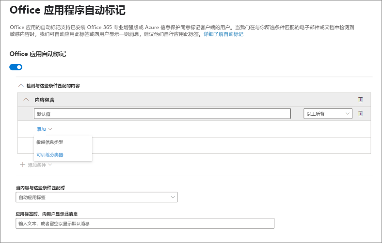
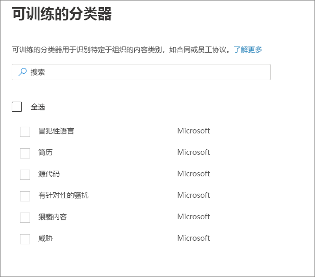
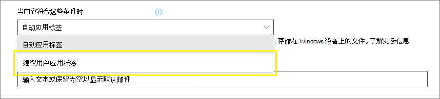
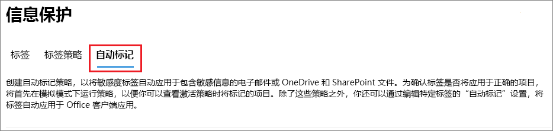
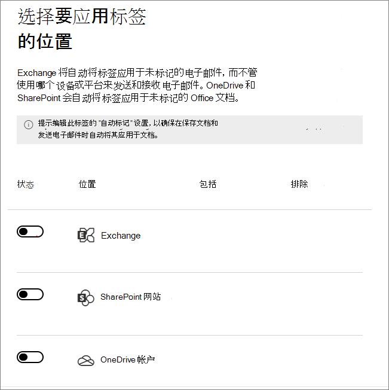
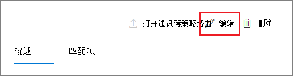

# <a name="apply-a-sensitivity-label-to-content-automatically"></a>将敏感度标签自动应用于内容

>*[Microsoft 365 安全性与合规性许可指南](/office365/servicedescriptions/microsoft-365-service-descriptions/microsoft-365-tenantlevel-services-licensing-guidance/microsoft-365-security-compliance-licensing-guidance)。*

> [!NOTE]
> 有关在 Azure Purview 中自动应用敏感度标签的信息，请参阅 [在 Azure Purview 中贴标签](/azure/purview/create-sensitivity-label)。

创建敏感度标签时，你可以自动将该标签分配给内容（如果它符合你指定的条件）。

能否将敏感度标签自动应用于内容非常重要，这是因为：

- 无需为用户提供有关何时使用每种分类的培训。

- 无需依赖用户，即可对全部内容进行正确分类。

- 用户不再需要了解你的策略，可以专注于自己的工作。

手动标记内容后，该标签将永远不会被自动标记替换。 但是，自动标签可能会替代之前被自动应用的[低优先级标签](sensitivity-labels.md#label-priority-order-matters)。

有两种不同的方法可以自动将敏感度标签应用于 Microsoft 365 中的内容：

- **用户编辑文档或撰写（以及答复或转发）电子邮件时的客户端标记**：使用为 Office 应用（Word、Excel、PowerPoint 和 Outlook）的自动标记配置的标签。

    此方法支持向用户推荐标签，并自动应用标签。 但在这两种情况下，用户都可以决定接受还是拒绝标签，以帮助确保正确标记内容。 此客户端标记的文档延迟最少，因为即使在保存文档之前也可以应用标签。 但是，并非所有客户端应用都支持自动标记。 Azure 信息保护统一标记客户端和包含 [某些 Office 版本](sensitivity-labels-office-apps.md#support-for-sensitivity-label-capabilities-in-apps) 的内置标签支持此功能。

    有关配置说明，请参阅此页面上的[如何配置 Office 应用的自动标签](#how-to-configure-auto-labeling-for-office-apps)。

- **当内容已保存（在 SharePoint 或 OneDrive 中）或通过电子邮件发送（由 Exchange Online 处理）时的服务端标记**：使用自动标记策略。
    
    你可能还听过该方法的另外一种称呼方式，即自动标记静态数据（SharePoint 和 OneDrive 中的文档）和传输中的数据（由 Exchange 发送或接收的电子邮件）。对于 Exchange，它不包含静态电子邮件（邮箱）。
    
    由于此标记是由服务而不是应用程序应用的，因此无需担心用户拥有的应用和版本。 因此，可立即在整个组织中使用此功能，并且适合大规模标记。 自动标记策略不支持推荐的标记，因为用户不与标记过程交互。 相反，管理员将在模拟模式下运行策略，以便在实际应用标签前，帮助确保正确标记内容。

    有关配置说明，请参阅此页面上的[如何为 SharePoint、OneDrive 和 Exchange 配置自动标记策略](#how-to-configure-auto-labeling-policies-for-sharepoint-onedrive-and-exchange)。
    
    特定于 SharePoint 和 OneDrive 的自动标记：
    
    - 支持 Word (.docx)、PowerPoint (.pptx) 和 Excel (.xlsx) 的 Office 文件。
        - 创建自动标签策略之前或之后，这些文件可自动标记。 如果文件是打开的会话的一部分（文件已打开），则不能自动标记它们。
        - 目前不支持列表项的附件，且不会自动标记。
    - 租户中每天最多自动标记 25,000 个文件。
    - 每个租户最多 100 个自动标记策略，每个策略在单独指定时最多面向 100 个网站（SharePoint 或 OneDrive）。 也可以指定所有站点，这种配置不受 100 个站点上限的限制。
    - 无论是在模拟模式下还是在应用标签时，可修改的现有值、修改者和修改日期都不会因自动标记策略而发生变化。
    - 标签应用加密时，[权限管理颁发者和权限管理所有者](/azure/information-protection/configure-usage-rights#rights-management-issuer-and-rights-management-owner)是最后修改文件的帐户。 如果此帐户不再在 Azure Active Directory 中，将不会应用标签，因为无法设置这些值。

    特定于 Exchange 的自动标记：
    
    - 与 Office 应用的手动标记或自动标记不同，系统还会根据你在自动标记策略中指定的条件来扫描 PDF 附件和 Office 附件。如果存在匹配项，则标记电子邮件，但不标记附件。
        - 对于 PDF 文件，如果标签应用了加密，则当租户[启用 PDF 附件](ome-faq.yml#are-pdf-file-attachments-supported-) 时，将通过使用 [Office 365 邮件加密 (OME)](ome.md) 对这些文件进行加密。
        - 对于这些 Office 文件，支持 Word、PowerPoint 和 Excel。 如果标签应用了加密，则通过使用 [Office 365 邮件加密 (OME)](ome.md) 进行加密。
    - 如果你拥有已应用 IRM 加密的 Exchange 邮件流规则或数据丢失防护 (DLP) 策略：当内容由这些规则或策略和自动标记策略标识时，将应用该标签。 如果该标签已应用加密，则将忽略 Exchange 邮件流规则或 DLP 策略中的 IRM 设置。 但是，如果该标签未应用加密，则除了标签之外，还会应用邮件流规则或 DLP 策略中的 IRM 设置。
    - 如果存在匹配项，则具有 IRM 加密但没有标签的电子邮件将通过自动标记替换为具有加密设置的标签。
    - 与自动标记条件匹配时，将标记传入电子邮件。 如果标签配置为 [加密](encryption-sensitivity-labels.md)，则在发件人来自你的组织时应用该加密，但在发件人位于组织外部时不应用该加密。
    - 如果标签配置为应用 [动态标记](sensitivity-labels-office-apps.md#dynamic-markings-with-variables)，请注意，该配置可能会影响组织外部人员的姓名。
    - 如果标签应用了加密，则[权限管理颁发者和权限管理所有者](/azure/information-protection/configure-usage-rights#rights-management-issuer-and-rights-management-owner)是发送电子邮件的人。

## <a name="compare-auto-labeling-for-office-apps-with-auto-labeling-policies"></a>将 Office 应用的自动标记与自动标记策略进行比较

使用下表可帮助识别两种互补自动标记方法在行为上的差异：

|功能或行为|标签设置：文件和电子邮件的自动标记  |策略：自动标记|
|:-----|:-----|:-----|
|应用相关性|是（[最低版本](sensitivity-labels-office-apps.md#support-for-sensitivity-label-capabilities-in-apps)） |否 \* |
|按位置限制|否 |是 |
|条件：自定义敏感信息类型的精确数据匹配|是 |否 |
|条件：可训练分类器|是 |否 |
|条件：电子邮件的共享选项和其他选项|否 |是 |
|条件：异常|否 |是（仅限电子邮件） |
|建议、策略工具提示和用户重写|是 |否 |
|模拟模式|否 |是 |
|根据条件检查 Exchange 附件|否 | 是|
|应用视觉标记 |是 |是（仅限电子邮件） |
|覆盖在未带标签的情况下应用的 IRM 加密|如果用户具有“导出”的最低使用权限，则为“是” |是（仅限电子邮件） |
|标记传入电子邮件|否 |是|

\* 由于一个后端 Azure 依赖项，自动标记当前并非在所有区域都可用。 如果你的租户无法支持此功能，则合规中心中将不显示“**自动标记**”选项卡。 有关详细信息，请参阅 [Azure 依赖项可用性（按国家/地区）](/troubleshoot/azure/general/dependency-availability-by-country)。

## <a name="how-multiple-conditions-are-evaluated-when-they-apply-to-more-than-one-label"></a>在多个条件适用于多个标签时如何评估这些条件

根据你在策略中为标签指定的位置按顺序对标签进行评估：位置最靠前的标签具有最低位置（最不敏感），位置最靠后的标签具有最高位置（最敏感）。有关优先级的详细信息，请参阅[标签优先级（顺序很重要）](sensitivity-labels.md#label-priority-order-matters)。

## <a name="dont-configure-a-parent-label-to-be-applied-automatically-or-recommended"></a>不要将父标签配置为自动应用或推荐使用

请记住，不可向内容应用父标签（即带子标签的标签）。 确保未在 Office 应用中将父标签配置为自动应用或推荐，并且不为自动标记策略选择父标签。 如果执行此操作，则不会将父标签应用于内容。

若要将自动标记用于子标签，请确保同时发布父标签和子标签。

有关父标签和子标签的更多信息，请参阅[子标签（对标签进行分组）](sensitivity-labels.md#sublabels-grouping-labels)。

## <a name="how-to-configure-auto-labeling-for-office-apps"></a>如何配置 Office 应用的自动标签

对于 Office 应用中的内置标记，请检查在 Office 应用中自动标记[所需的最低版本](sensitivity-labels-office-apps.md#support-for-sensitivity-label-capabilities-in-apps)。

Azure 信息保护统一标记客户端支持自动标记内置和自定义敏感信息类型，但不支持使用精确数据匹配 (EDM) 的可训练分类器或敏感信息类型。

[创建或编辑敏感度标签](create-sensitivity-labels.md)时，可使用 Office 应用的自动标签设置。 请确保为标签的范围选择了 **“文件和电子邮件”**：


在配置中移动时，你将看到 **"文件和电子邮件的自动标记"** 页面，可在其中选择敏感信息类型或可训练的分类器列表：



当自动应用此敏感度标签时，用户会在其 Office 应用中看到通知。例如：


### <a name="configuring-sensitive-info-types-for-a-label"></a>配置标签的敏感信息类型

选择“**敏感信息类型**”选项时，会看到与创建数据丢失防护 (DLP) 策略时相同的敏感信息类型列表。例如，可以自动将高度机密标签应用于任何包含客户个人信息的内容，例如信用卡号、社保编号或护照号：


与配置 DLP 策略时类似，你可以通过更改实例计数和匹配准确度来优化条件。例如：


可通过以下 DLP 文档了解有关这些配置选项的详细信息：[调整规则，使它们更易或更难匹配](data-loss-prevention-policies.md#tuning-rules-to-make-them-easier-or-harder-to-match)。

> [!IMPORTANT]
> 敏感信息类型具有两种不同的方法来定义最大唯一实例计数参数。 若要了解详细信息，请参阅[ SIT 的实例计数支持的值](create-a-custom-sensitive-information-type.md#instance-count-supported-values-for-sit)。

此外，与 DLP 策略配置类似，可以选择条件是必须检测所有敏感信息类型，还是仅检测其中一种。为了使条件更加灵活或复杂，可以添加[组并在组之间使用逻辑运算符](data-loss-prevention-policies.md)。

> [!NOTE]
> 基于自定义敏感信息类型的自动标签仅适用于 OneDrive 和 SharePoint 中新创建或修改的内容，而不适用于现有内容。此限制也适用于自动标签策略。

#### <a name="custom-sensitive-information-types-with-exact-data-match"></a>使用精确数据匹配的自定义敏感信息类型

可以配置一个敏感度标签，对自定义敏感信息类型使用[基于精确数据匹配的敏感信息类型](sit-learn-about-exact-data-match-based-sits.md#learn-about-exact-data-match-based-sensitive-information-types)。 然而，目前还必须指定至少一种不使用 EDM 的敏感信息类型。 例如，内置的敏感信息类型之一，如 **信用卡号码**。

如果为敏感信息类型条件配置了一个仅有 EDM 的敏感标签，那么该标签的自动贴标设置则会自动关闭。

### <a name="configuring-trainable-classifiers-for-a-label"></a>为标签配置可训练分类器

如果使用此选项，请确保你已在租户中发布至少一个其他针对自动标记和 [敏感信息类型选项](#configuring-sensitive-info-types-for-a-label)配置的敏感度标签。

选择“**可训练分类器**”选项时，请选择一个或多个预训练或自定义的可训练分类器：



> [!CAUTION]
> 我们正在弃用 **冒犯性语言** 预训练分类器，因为它会生成大量误报。 不要使用此分类器，如果你当前正在使用它，我们建议你从业务流程移出，使用 **定向骚扰**、**猥亵** 和 **威胁** 预训练的分类器。

有关这些分类器的详细信息，请参阅 [了解可训练分类器（预览版）](classifier-learn-about.md)。

### <a name="recommend-that-the-user-applies-a-sensitivity-label"></a>建议用户应用敏感度标签

如果愿意，可建议你的用户应用此标签。通过此选项，你的用户可接受分类及任何相关保护，也可在标签不适合其内容时关闭建议。



下面的示例展示了 Azure 信息保护统一标记客户端在你配置条件以将标签作为建议操作应用时提供的提示，以及自定义策略提示。可以选择在策略提示中显示什么文本。


### <a name="when-automatic-or-recommended-labels-are-applied"></a>何时应用自动标签或建议标签

在 Office 应用中，自动标签和建议标签的实现取决于你使用的是内置于 Office 的标签，还是 Azure 信息保护统一标记客户端。然而，在这两种情况下：

- 不可对之前已手动标记或者之前已自动标记有更高敏感度的文档和电子邮件使用自动标签。请记住，除了一个保留标签，另外仅可向文档或电子邮件应用一个敏感度标签。

- 不能对之前有更高敏感度标签的文档或电子邮件使用建议标签。如果内容已标记有更高敏感度，则用户不会看到带有建议和策略提醒的提示。

特定于内置标签的注意事项：

- 并非所有 Office 应用都支持自动（和建议）标签。 有关详细信息，请参阅[应用中的敏感度标签功能支持](sensitivity-labels-office-apps.md#support-for-sensitivity-label-capabilities-in-apps)。

- 对于桌面版 Word 中的建议标签，触发建议的敏感内容会被标记，这样用户就能审阅和删除敏感内容，而不用应用建议的敏感度标签。

- 若要详细了解如何在 Office 应用中应用这些标签、示例屏幕截图，以及如何检测敏感信息，请参阅[对 Office 中的文件和电子邮件自动应用或建议敏感度标签](https://support.microsoft.com/office/automatically-apply-or-recommend-sensitivity-labels-to-your-files-and-emails-in-office-622e0d9c-f38c-470a-bcdb-9e90b24d71a1)。

特定于 Azure 信息保护统一标记客户端的注意事项：

- 自动标签和建议标签在你保存文档时应用于 Word、Excel 和 PowerPoint，并在你发送电子邮件时应用于 Outlook。

- 为了让 Outlook 支持建议标签，必须先配置[高级策略设置](/azure/information-protection/rms-client/clientv2-admin-guide-customizations#enable-recommended-classification-in-outlook)。

- 敏感信息可以在文档和电子邮件的正文文本和页眉、页脚中检测到，但无法在电子邮件的主题行或附件中检测到。

## <a name="how-to-configure-auto-labeling-policies-for-sharepoint-onedrive-and-exchange"></a>如何为 SharePoint、OneDrive 和 Exchange 配置自动标记策略

在配置自动标记策略前，请确保你了解这些先决条件。

### <a name="prerequisites-for-auto-labeling-policies"></a>自动标记策略的先决条件

- 模拟模式：
  - 必须启用 Microsoft 365。如果你需要启用审核，或者不确定是否已启用审核，请参阅[启用或禁用审核日志搜索](turn-audit-log-search-on-or-off.md)。
  - 若要在源视图中查看文件或电子邮件内容，必须具有 **数据分类内容查看器** 角色，该角色包含在 **内容资源管理器内容查看器** 角色组或者 **信息保护** 和 **信息保护调查员** 角色组（当前为预览版）中。 如果没有所需的角色，从 **匹配的项** 选项卡中选择项目时，将不会看到预览窗格。默认情况下，全局管理员没有此角色。

- 如何自动标记 SharePoint 和 OneDrive 中的文件：
  - 你已[启用 SharePoint 和 OneDrive 中 Office 文件的敏感度标签](sensitivity-labels-sharepoint-onedrive-files.md)。
  - 当自动标记策略运行时，该文件不得由其他进程或用户打开。 签出以供进行编辑的文件属于此类别。

- 如果计划使用[自定义敏感信息类型](sensitive-information-type-learn-about.md)，而不是内置敏感度类型：
  - 自定义敏感性信息类型仅适用于创建自定义敏感性信息类型后在 SharePoint 或 OneDrive 中添加或修改的内容。
  - 若要测试新的自定义敏感信息类型，请在创建自动标记策略前创建它们，然后创建新文档（其中包含用于测试的示例数据）。

- 你可以为自动标记策略选择一个或多个[已创建和发布](create-sensitivity-labels.md)（至少向一个用户发布）的敏感度标签。对于这些标签而言：
  - 启用或禁用 Office 应用标签设置中的自动标记无关紧要，因为该标签设置会补充自动标记策略，如简介中所述。
  - 如果要用于自动标记的标签被配置为使用视觉标记（页眉、页脚、水印），请注意它们不会应用于文档。
  - 如果标签应用“[加密](encryption-sensitivity-labels.md)”：
    - 当自动标签策略包括 SharePoint 或 OneDrive 的位置时，标签必须为“**立即分配权限**”设置进行配置。
    - 当自动标签策略仅应用于 Exchange 时，标签可以为“**立即分配权限**”或“**让用户分配权限**”进行配置（对于“不转发”或“只加密”选项）。

### <a name="learn-about-simulation-mode"></a>了解模拟模式

模拟模式是自动标记策略所独有的，并且已整合到工作流中。 在策略至少运行一次模拟前，无法自动标记文档和电子邮件。

模拟模式最多支持 1,000,000 个匹配文件。 如果自动标记策略匹配的文件数超过此数目，则无法启用策略来应用标签。 在这种情况下，必须重新配置自动标记策略，以便匹配的文件更少，然后重新运行模拟。 最多 1,000,000 个匹配文件的限制仅适用于模拟模式，而不适用于已启用以应用敏感度标签的自动标记策略。

用于自动标记策略的工作流：

1. 创建和配置自动标记策略。

2. 以模拟模式运行该策略，可能需要 12 小时才能完成。 完成的模拟会触发发送给用户的电子邮件通知，该通知配置为接收[活动警报](alert-policies.md)。

3. 查看结果，并在必要时优化策略。 例如，可能需要编辑策略规则以减少误报，或删除某些站点，以便匹配的文件数不超过 1,000,000。 重新运行模拟模式，并等待其再次完成。

4. 根据需要重复步骤 3。

5. 在生产环境中部署。

模拟部署的运行方式与 PowerShell 的 WhatIf 参数相同。 你将看到报告的结果，如同自动标记策略已使用你定义的规则应用了所选标签一样。 然后，你可以根据需要优化规则的准确性，并重新运行模拟。 但是，由于 Exchange 的自动标记适用于已发送和接收的电子邮件，而不是存储在邮箱中的电子邮件，因此不要期望模拟中的电子邮件结果保持一致，除非你能够发送和接收完全相同的电子邮件。

模拟模式还允许你在部署前逐步增加自动标记策略的范围。 例如，你可以从一个位置（如 SharePoint 网站）和一个文档库开始。 然后，使用迭代更改，将范围增大到多个网站，然后将其增加到其他位置，如 OneDrive。

最后，可以使用模拟模式来提供运行自动标记策略所需时间的近似值，以帮助计划和安排在没有模拟模式的情况下运行自动标记策略的时间。


### <a name="creating-an-auto-labeling-policy"></a>创建自动标记策略

1. 在 <a href="https://go.microsoft.com/fwlink/p/?linkid=2077149" target="_blank">Microsoft 365 合规中心</a>，导航到敏感度标签：

    - **解决方案** > **信息保护**

    如果看不到此选项，请先选择“**全部显示**”。

2. 选择“**自动标记**”选项卡：

    

    > [!NOTE]
    > 如果看不到“**自动标记**”选项卡，则此功能当前由于一个后端 Azure 依赖项而在你所在的区域中不可用。如需了解更多信息，请参阅 [各国家和地区的 Azure 依赖项可用性](/troubleshoot/azure/general/dependency-availability-by-country)。

3. 选择“**+ 创建自动标记策略**”。 这将启动“新建策略配置”：

    

4. 对于“**选择要将此标签应用于的信息**”页面：选择其中一个模板，如“**财务**”或“**隐私**”。 可使用“**显示选项**”下拉列表来优化搜索。 或者，如果模板无法满足你的要求，请选择“**自定义策略**”。 选择“**下一步**”。

5. 对于“**为自动标记策略命名**”页面：提供唯一的名称，并选择性地提供描述，以帮助识别自动应用的标签、位置和条件（用于标识要标记的内容）。

6. 对于“**选择要应用标签的位置**”页面：选择并指定 Exchange、SharePoint 和 OneDrive 的位置。 如果不想保留所选位置的默认“**全部**”，请选择特定实例的链接。 然后选择“**下一步**”。

    
    
    要指定单个 OneDrive 帐户，请参阅 [获取组织中所有用户 OneDrive URL 的列表](/onedrive/list-onedrive-urls)。

7. 对于“**设置常用或高级规则**”页面：保留“**常用规则**”的默认设置，以定义用于在所有选定位置标识要标记的内容的规则。如果每个位置需要不同的规则，请选择“**高级规则**”，然后选择“**下一步**”。

    这些规则使用包含敏感信息类型和共享选项的条件：
    - 对于敏感信息类型，你可以选择内置和自定义敏感信息类型。
    - 对于共享选项，你可以选择“**仅与组织内部人员共享**”或“**与组织外部人员共享**”。

    如果你的唯一位置是 **Exchange**，或者如果你选择“**高级规则**”，则还可以选择其他条件：
    - 发件人 IP 地址为
    - 收件人域为
    - 收件人为
    - 附件的文件扩展名为
    - 附件受密码保护
    - 无法扫描任何电子邮件附件的内容
    - 任何电子邮件附件的内容均未完成扫描
    - 标题与模式匹配
    - 主题与模式匹配
    - 收件人地址包含字词
    - 收件人地址与模式匹配
    - 发件人地址与模式匹配
    - 发件人域为
    - 收件人所在组为
    - 发件人为

    可以为上述每个条件指定例外。

8. 根据先前的选择，你现在有机会使用条件和例外来创建新规则。

    敏感信息类型的配置选项与为 Office 应用自动标记所选的选项相同。 如果需要详细信息，请参阅[配置标签的敏感信息类型](#configuring-sensitive-info-types-for-a-label)。

    定义所需的所有规则并确认其状态为“开启”后，请选择“**下一步**”，以继续选择要自动应用的标签。

9. 对于“**选择要自动应用的标签**”页面：选择“**+ 选择标签**”，从“**选择敏感度标签**”窗格中选择一个标签，然后选择“**下一步**”。

10. 对于“**决定是立即还是以后测试策略**”页面：如果现在已准备好运行自动标记策略，请在模拟模式中选择“**在模拟模式下运行策略**”。否则，请选择“**让策略保持关闭状态**”。选择“**下一步**”：

    

11. 对于 **“摘要”** 页：审阅自动标记策略的配置，并进行所需的任何更改，然后完成向导。

现在，在“**信息保护**” > “**自动标记**”页面上，可在“**模拟**”或“**关闭**”部分看到自动标记策略，具体哪个部分取决于是否选择在模拟模式下运行它。 选择你的策略以查看配置和状态的详细信息（例如，**策略模拟仍在运行**）， 对于模拟模式中的策略，选择“**匹配的项**”选项卡，以查看与你指定的规则匹配的电子邮件或文档。

可直接从此界面修改策略：

- 对于“**禁用**”部分中的策略，选择“**编辑策略**”按钮。

- 对于“**模拟**”部分中的策略，从以下任一选项卡中，选择页面顶部的“**编辑** 策略”选项：

    

    如果你已准备好运行策略而不进行模拟，请选择“**启用策略**”选项。

自动策略将持续运行，直至删除。 例如，新建和已修改的文件将包含在当前的策略设置中。

### <a name="monitoring-your-auto-labeling-policy"></a>监视自动标记策略

启用自动标记策略后，可以查看所选位置中文件的 SharePoint OneDrive 进度。 电子邮件不包含在标记进度中，因为它们会在发送时自动标记。

标记进度包括要由策略标记的文件、过去 7 天内标记的文件和标记的总文件数。 由于每天最多标记 25，000 个文件，此信息可让你查看策略的当前标记进度以及仍要标记的文件数。

首次打开策略时，最初会看到要标记的文件值 0，直到检索到最新数据。 此进度信息每 48 小时更新一次，因此你可以每隔一天查看一次最新数据。 选择自动标记策略时，可以在一个飞出窗格中查看有关该策略的更多详细信息，其中包括前 10 个网站的标签进度。 此浮出控件窗格上的信息可能比 **自动标记** 主页上显示的聚合策略信息更新。

如果你具有相应的[权限](data-classification-content-explorer.md#permissions)，则还可通过使用[内容资源管理器](data-classification-content-explorer.md)来查看自动标记策略的结果：

- **内容浏览器列表查看器** 角色组让你可以查看文件的标签，而不是文件的内容。
- 你可以使用 **内容资源管理器内容查看器** 角色组、**信息保护** 和 **信息保护调查员** 角色组（当前为预览版）查看文件内容。

> [!TIP]
> 你还可以使用内容资源管理器来标识具有包含敏感信息的未标记文档的位置。 使用此信息，请考虑将这些位置添加到自动标记策略中，并将标识的敏感信息类型作为规则包括在内。

### <a name="use-powershell-for-auto-labeling-policies"></a>使用 PowerShell 自动标记策略

可使用[安全&合规中心 PowerShell](/powershell/exchange/scc-powershell)创建和配置自动标记策略。 这意味着可以完全编写创建和维护的自动标签策略，这也为OneDrive和SharePoint位置指定多个URL提供了更有效的方法。

在 PowerShell 中运行命令之前，必须先[连接到安全与合规中心 PowerShell](/powershell/exchange/connect-to-scc-powershell)。

若要创建新的自动标记策略：

```powershell
New-AutoSensitivityLabelPolicy -Name <AutoLabelingPolicyName> -SharePointLocation "<SharePointSiteLocation>" -ApplySensitivityLabel <Label> -Mode TestWithoutNotifications
```

此命令将为你指定的 SharePoint 网站创建一个自动标记策略。 对于 OneDrive 位置，请改为使用 *OneDriveLocation* 参数。

若要将其他网站添加到现有的自动标记策略中：

```powershell
$spoLocations = @("<SharePointSiteLocation1>","<SharePointSiteLocation2>")
Set-AutoSensitivityLabelPolicy -Identity <AutoLabelingPolicyName> -AddSharePointLocation $spoLocations -ApplySensitivityLabel <Label> -Mode TestWithoutNotifications
```

此命令在变量中指定其他 SharePoint URL，然后将其添加到现有的自动标记策略中。 若要改为添加 OneDrive 位置，请使用 *AddOneDriveLocation* 参数和其他变量，例如 *$OneDriveLocations*。

若要创建新的自动标记策略规则：

```powershell
New-AutoSensitivityLabelRule -Policy <AutoLabelingPolicyName> -Name <AutoLabelingRuleName> -ContentContainsSensitiveInformation @{"name"= "a44669fe-0d48-453d-a9b1-2cc83f2cba77"; "mincount" = "2"} -Workload SharePoint
```

对于现有的自动标记策略，此命令将创建新的策略规则以检测 **美国社会保险号 (SSN)**，其实体 ID 为 a44669fe-0d48-453d-a9b1-2cc83f2cba77。 要查找其他敏感信息类型的实体 ID，请参阅[敏感信息类型实体定义](sensitive-information-type-entity-definitions.md)。

有关支持自动标记策略的 PowerShell cmdlet、其可用参数和一些示例的更多信息，请参阅以下 cmdlet 帮助：

- [Get-AutoSensitivityLabelPolicy](/powershell/module/exchange/get-autosensitivitylabelpolicy)
- [New-AutoSensitivityLabelPolicy](/powershell/module/exchange/new-autosensitivitylabelpolicy)
- [New-AutoSensitivityLabelRule](/powershell/module/exchange/new-autosensitivitylabelrule)
- [Remove-AutoSensitivityLabelPolicy](/powershell/module/exchange/remove-autosensitivitylabelpolicy)
- [Remove-AutoSensitivityLabelRule](/powershell/module/exchange/remove-autosensitivitylabelrule)
- [Set-AutoSensitivityLabelPolicy](/powershell/module/exchange/set-autosensitivitylabelpolicy)
- [Set-AutoSensitivityLabelRule](/powershell/module/exchange/set-autosensitivitylabelrule)

## <a name="tips-to-increase-labeling-reach"></a>提高标记覆盖范围的提示

尽管自动标记是对组织拥有的 Office 文件进行分类、标记和保护的最有效方法之一，但请检查是否可以使用任何其他方法对其进行补充，以提高标记覆盖范围：

- 使用 SharePoint Syntex，可以 [将敏感度标签应用于文档理解模型](/microsoft-365/contentunderstanding/apply-a-sensitivity-label-to-a-model)，以便自动标记 SharePoint 库中标识的文档。

- 使用 [Azure 信息保护统一标记客户端](/azure/information-protection/rms-client/aip-clientv2)时：

  - 对于本地数据存储（如网络共享和 SharePoint Server 库）中的文件：使用[扫描程序](/azure/information-protection/deploy-aip-scanner)发现这些文件中的敏感信息并相应地对其进行标记。 如果计划将这些文件迁移或上传到 Microsoft 365 中的 SharePoint，请使用扫描程序标记文件，然后再将它们移到云中。

  - 如果在使用敏感度标签之前使用了另一种标签解决方案：使用 PowerShell 和[高级设置重复使用这些解决方案中的标签](/azure/information-protection/rms-client/clientv2-admin-guide-customizations#migrate-labels-from-secure-islands-and-other-labeling-solutions)。

- 在为用户提供要应用哪些敏感度标签的培训后，鼓励[手动标记](https://support.microsoft.com/office/apply-sensitivity-labels-to-your-files-and-email-in-office-2f96e7cd-d5a4-403b-8bd7-4cc636bae0f9)。 当你确信用户知道要应用哪个标签时，请考虑将默认标签和强制标签配置为[策略设置](sensitivity-labels.md#what-label-policies-can-do)。

此外，请考虑在 SharePoint 中[默认将新文件标记为敏感](/sharepoint/sensitive-by-default)，以防止来宾访问新添加的文件，直到至少有一项 DLP 策略扫描文件内容。
