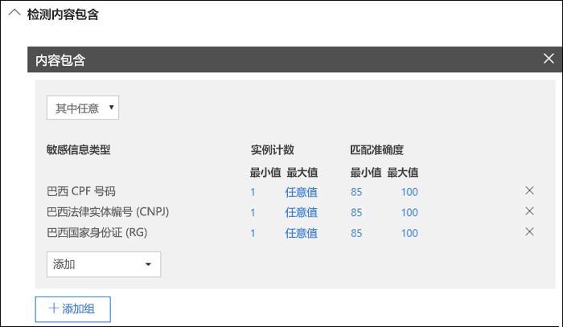

# 将敏感度标签自动应用于内容

创建敏感度标签时，你可以自动将该标签分配给包含敏感信息的内容，也可以提示用户应用你建议的标签。

能否将敏感度标签自动应用于内容非常重要，这是因为：

- 你无需为用户提供有关所有分类的培训。

- 你无需依赖用户即可对全部内容进行正确分类。

- 用户不再需要了解你的策略，反而可以专注于自己的工作。

有关许可证要求的信息，请参阅 [Office 应用中的敏感度标签](sensitivity-labels-office-apps.md)。

在 Microsoft 365 合规中心、Microsoft 365 安全中心或 Office 365 安全与合规中心的“分类”**** > “敏感度标签”**** 下创建敏感度标签时，可使用自动标签设置。

## 根据条件自动应用敏感度标签

敏感度标签最强大的功能之一是能够将其自动应用于符合特定条件的内容。 此情况下，组织中的人员无需应用敏感度标签 - Office 365 会代为操作。

当内容包含特定类型的敏感信息时，可以选择自动将敏感度标签应用于该内容。配置要自动应用的敏感度标签时，你会看到与创建数据丢失防护 (DLP) 策略时相同的敏感信息类型列表。因此，可以自动将“高度机密”标签应用于包含客户个人身份信息 (PII)（例如信用卡号或社会安全号码）的任何内容。

选择敏感信息类型后，可通过更改实例计数或匹配准确度来优化条件。 有关详细信息，请参阅[调整规则以使其更容易或更难匹配](data-loss-prevention-policies.md#tuning-rules-to-make-them-easier-or-harder-to-match)。

此外，也可选择某项条件是必须删除所有敏感信息类型还是只删除其中一种。 要使条件更灵活或更复杂，可添加组并在组之间使用逻辑运算符。 有关详细信息，请参阅[分组和逻辑运算符](data-loss-prevention-policies.md#grouping-and-logical-operators)。

当自动应用敏感度标签时，用户会在其 Office 应用中看到通知。他们可以选择“**确定**”以关闭通知。

## 建议用户应用敏感度标签

如果愿意，可建议你的用户应用此标签。 通过此选项，你的用户可接受分类及任何相关保护，也可在标签不适合其文档或电子邮件时关闭建议。

建议的标签在 Word、PowerPoint 和 Excel 中受支持（需要安装 Azure 信息保护统一标记客户端）。

以下示例是配置条件来将标签应用为建议操作时的提示以及自定义策略提示。你可以选择策略提示中显示的文本。

## 如何应用自动标签或建议标签

- 自动标记在你保存文档时应用于 Word、Excel 和 PowerPoint，在你发送电子邮件时应用于 Outlook。 这些条件会检测文档和电子邮件的正文文本和页眉页脚中是否有敏感信息，但不检测电子邮件的主题行或附件。

- 不可对之前已手动标记或者之前已自动标记有更高级分类的文档和电子邮件使用自动分类。 请记住，除了一个保留标签，另外仅可向文档或电子邮件应用一个敏感度标签。

- 在保存文档时，建议分类会应用于 Word、Excel 和 PowerPoint。

- 不可对之前标记有更高级分类的文档使用建议的分类。 如果内容已标记有更高级分类，则用户不会看到带有建议和策略提醒的提示。

## 在多个条件适用于多个标签时如何评估这些条件

根据你在策略中为标签指定的位置按顺序对标签进行评估：位置最靠前的标签具有最低位置（最不敏感），位置最靠后的标签具有最高位置（最敏感）。有关优先级的详细信息，请参阅[标签优先级（顺序很重要）](sensitivity-labels.md#label-priority-order-matters)。

## 不要将父标签配置为自动应用或推荐使用

请记住，不可向内容应用父标签（即带子标签的标签）。 确保未将父标签配置为自动应用或推荐使用，因为父标签不会应用于使用 Azure 信息保护统一标签客户端的 Office 应用程序中的内容。 有关父标签和子标签的更多信息，请参阅[子标签（对标签进行分组）](sensitivity-labels.md#sublabels-grouping-labels)。
