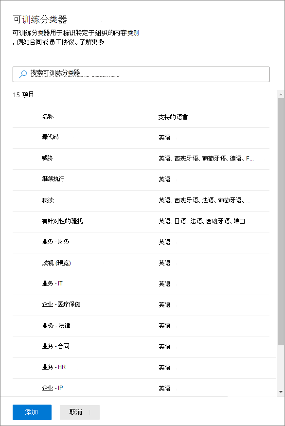
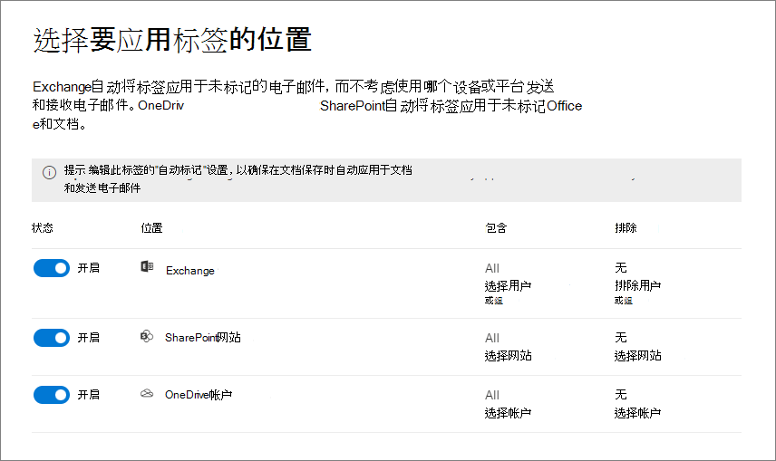

# 将敏感度标签自动应用于内容Apply a sensitivity label to content automatically

>*[Microsoft 365 安全性与合规性许可指南](https://aka.ms/ComplianceSD)。**[Microsoft 365 licensing guidance for security & compliance](https://aka.ms/ComplianceSD).*

创建敏感度标签时，你可以自动将该标签分配给内容（如果它符合你指定的条件）。When you create a sensitivity label, you can automatically assign that label to content when it matches conditions that you specify.

能否将敏感度标签自动应用于内容非常重要，这是因为：The ability to apply sensitivity labels to content automatically is important because:

- 无需为用户提供有关何时使用每种分类的培训。You don't need to train your users when to use each of your classifications.

- 无需依赖用户，即可对全部内容进行正确分类。You don't need to rely on users to classify all content correctly.

- 用户不再需要了解你的策略，反而可以专注于自己的工作。Users no longer need to know about your policies—they can instead focus on their work.

可通过两种不同的方法来自动应用敏感度标签：There are two different methods for automatically applying a sensitivity label:

- **用户编辑文档或撰写（以及答复或转发）电子邮件时的客户端标记**：使用为 Office 应用（Word、Excel、PowerPoint 和 Outlook）的自动标记配置的标签。**Client-side labeling when users edit documents or compose (also reply or forward) emails**: Use a label that's configured for auto-labeling for Office apps (Word, Excel, PowerPoint, and Outlook). 
    
    此方法支持向用户推荐标签，并自动应用标签。This method supports recommending a label to users, as well as automatically applying a label. 但在这两种情况下，用户都可以决定接受还是拒绝标签，以帮助确保正确标记内容。But in both cases, the user decides whether to accept or reject the label, to help ensure the correct labeling of content. 此客户端标记的文档延迟最少，因为即使在保存文档之前也可以应用标签。This client-side labeling has minimal delay for documents because the label can be applied even before the document is saved. 但是，并非所有客户端应用都支持自动标记。However, not all client apps support auto-labeling. Azure 信息保护统一标记客户端和[某些 Office 版本](sensitivity-labels-office-apps.md#support-for-sensitivity-label-capabilities-in-apps)支持此功能。This capability is supported by the Azure Information Protection unified labeling client, and [some versions of Office](sensitivity-labels-office-apps.md#support-for-sensitivity-label-capabilities-in-apps). 
    
    有关配置说明，请参阅此页面上的[如何配置 Office 应用的自动标签](#how-to-configure-auto-labeling-for-office-apps)。For configuration instructions, see [How to configure auto-labeling for Office apps](#how-to-configure-auto-labeling-for-office-apps) on this page.

- **当内容已保存（在 SharePoint 或 OneDrive 中）或通过电子邮件发送（由 Exchange Online 处理）时的服务端标记**：使用自动标记策略。**Service-side labeling when content is already saved (in SharePoint or OneDrive) or emailed (processed by Exchange Online)**: Use an auto-labeling policy. 
    
    此方法称为使用敏感度标签自动分类。This method is referred to as auto classification with sensitivity labels. 你可能还会听到它称为自动标记静态数据（SharePoint 和 OneDrive 中的文档）和传输中的数据（由 Exchange 发送或接收的电子邮件）。You might also hear it referred to as auto-labeling for data at rest (documents in SharePoint and OneDrive) and data in transit (email that is sent or received by Exchange). 对于 Exchange，它不包含静态电子邮件（邮箱）。For Exchange, it doesn't include emails at rest (mailboxes). 
    
    由于此标记是由服务而不是应用程序应用的，因此无需担心用户拥有的应用和版本。Because this labeling is applied by services rather than by applications, you don't need to worry about what apps users have and what version. 因此，可立即在整个组织中使用此功能，并且适合大规模标记。As a result, this capability is immediately available throughout your organization and suitable for labeling at scale. 自动标记策略不支持推荐的标记，因为用户不与标记过程交互。Auto-labeling policies don't support recommended labeling because the user doesn't interact with the labeling process. 相反，管理员将在模拟模式下运行策略，以便在实际应用标签前，帮助确保正确标记内容。Instead, the administrator runs the policies in simulation mode to help ensure the correct labeling of content before actually applying the label.
    
    有关配置说明，请参阅此页面上的[如何为 SharePoint、OneDrive 和 Exchange 配置自动标记策略](#how-to-configure-auto-labeling-policies-for-sharepoint-onedrive-and-exchange)。For configuration instructions, see [How to configure auto-labeling policies for SharePoint, OneDrive, and Exchange](#how-to-configure-auto-labeling-policies-for-sharepoint-onedrive-and-exchange) on this page.
    
    特定于 SharePoint 和 OneDrive 的自动标记：Specific to auto-labeling for SharePoint and OneDrive:
    - 支持以下 Office 文件：Word、PowerPoint 和 Excel。Office files for Word, PowerPoint, and Excel are supported.
    - 租户中每天最多自动标记 25,000 个文件。Maximum of 25,000 automatically labeled files in your tenant per day.
    - 所有策略中最多 10 个网站集。Maximum of 10 sites collections across all policies.
    - 整个租户中最多 10 个策略。Maximum of 10 policies across your tenant.
    - 无论是在模拟模式下还是在应用标签时，可修改的现有值、修改者和修改日期都不会因自动标记策略而发生变化。Existing values for modified, modified by, and the date are not changed as a result of auto-labeling policies—for both simulation mode and when labels are applied.
    - 如果标签应用了加密，则[权限管理颁发者和权限管理所有者](https://docs.microsoft.com/azure/information-protection/configure-usage-rights#rights-management-issuer-and-rights-management-owner)是创建灵敏度标签的人。When the label applies encryption, the [Rights Management issuer and Rights Management owner](https://docs.microsoft.com/azure/information-protection/configure-usage-rights#rights-management-issuer-and-rights-management-owner) is the person who created the sensitivity label.

    特定于 Exchange 的自动标记：Specific to auto-labeling for Exchange:
    - 与 Office 应用的手动标记或自动标记不同，系统还会根据你在自动标记策略中指定的条件来扫描 Office 附件（Word、Excel 和 PowerPoint 文件）和 PDF 附件。Unlike manual labeling or auto-labeling with Office apps, Office attachments (Word, Excel, and PowerPoint files) and PDF attachments are also scanned for the conditions you specify in your auto-labeling policy. 如果存在匹配项，则会标记电子邮件，但不标记附件。When there is a match, the email is labeled but not the attachment.
    - 如果你拥有已应用 IRM 加密的 Exchange 邮件流规则或数据丢失防护 (DLP) 策略：当内容由这些规则或策略和自动标记策略标识时，将应用该标签。If you have Exchange mail flow rules or data loss prevention (DLP) policies that apply IRM encryption: When content is identified by these rules or policies and an auto-labeling policy, the label is applied. 如果该标签已应用加密，则将忽略 Exchange 邮件流规则或 DLP 策略中的 IRM 设置。If that label applies encryption, the IRM settings from the Exchange mail flow rules or DLP policies are ignored. 但是，如果该标签未应用加密，则除了标签之外，还会应用邮件流规则或 DLP 策略中的 IRM 设置。However, if that label doesn't apply encryption, the IRM settings from the mail flow rules or DLP policies are applied in addition to the label.
    - 如果存在匹配项，则具有 IRM 加密但没有标签的电子邮件将通过自动标记替换为具有加密设置的标签。Email that has IRM encryption with no label will be replaced by a label with any encryption settings when there is a match by using auto-labeling.
    - 与自动标记条件匹配时，将标记传入电子邮件。Incoming email is labeled when there is a match with your auto-labeling conditions. 但是，如果已将标签配置为加密，则不会应用该加密。However, if the label is configured for encryption, that encryption isn't applied.
    - 如果标签应用了加密，则[权限管理颁发者和权限管理所有者](https://docs.microsoft.com/azure/information-protection/configure-usage-rights#rights-management-issuer-and-rights-management-owner)是发送电子邮件的人。When the label applies encryption, the [Rights Management issuer and Rights Management owner](https://docs.microsoft.com/azure/information-protection/configure-usage-rights#rights-management-issuer-and-rights-management-owner) is the person who sends the email.
    

## 将 Office 应用的自动标记与自动标记策略进行比较Compare auto-labeling for Office apps with auto-labeling policies

使用下表可帮助识别两种互补自动标记方法在行为上的差异：Use the following table to help you identify the differences in behavior for the two complementary automatic labeling methods:

|功能或行为Feature or behavior|标签设置：Office 应用的自动标记Label setting: Auto-labeling for Office apps |策略：自动标记Policy: Auto-labeling|
|:-----|:-----|:-----|:-----|
|应用相关性App dependency|[是Yes](sensitivity-labels-office-apps.md#support-for-sensitivity-label-capabilities-in-apps) |否No |
|按位置限制Restrict by location|否No |是Yes |
|条件：可训练分类器Conditions: Trainable classifiers|是Yes |否No |
|条件：电子邮件的共享选项和其他选项Conditions: Sharing options and additional options for email|否No |是Yes |
|建议、策略工具提示和用户重写Recommendations, policy tooltip, and user overrides|是Yes |否No |
|模拟模式Simulation mode|否No |是Yes |
|根据条件检查 Exchange 附件Exchange attachments checked for conditions|否No | 是Yes|
|应用视觉标记Apply visual markings |是Yes |是（仅限电子邮件）Yes (email only) |
|覆盖在未带标签的情况下应用的 IRM 加密Override IRM encryption applied without a label|如果用户具有“导出”的最低使用权限，则为“是”Yes if the user has the minimum usage right of Export |是（仅限电子邮件）Yes (email only) |
|标记传入电子邮件Label incoming email|否No |是（未应用加密）Yes (encryption not applied) |

> [!NOTE]
> 手动标记内容后，该标签将永远不会被自动标记替换。When content has been manually labeled, that label will never be replaced by automatic labeling. 但是，自动标记策略可以替换通过使用 Office 应用的自动标记而应用的[低优先级标签](sensitivity-labels.md#label-priority-order-matters)。However, auto-labeling policies can replace a [lower priority label](sensitivity-labels.md#label-priority-order-matters) that was applied by using auto-labeling for Office apps.

## 在多个条件适用于多个标签时如何评估这些条件How multiple conditions are evaluated when they apply to more than one label

根据你在策略中为标签指定的位置按顺序对标签进行评估：位置最靠前的标签具有最低位置（最不敏感），位置最靠后的标签具有最高位置（最敏感）。有关优先级的详细信息，请参阅[标签优先级（顺序很重要）](sensitivity-labels.md#label-priority-order-matters)。The labels are ordered for evaluation according to their position that you specify in the policy: The label positioned first has the lowest position (least sensitive) and the label positioned last has the highest position (most sensitive). For more information on priority, see [Label priority (order matters)](sensitivity-labels.md#label-priority-order-matters).

## 不要将父标签配置为自动应用或推荐使用Don't configure a parent label to be applied automatically or recommended

请记住，不可向内容应用父标签（即带子标签的标签）。Remember, you can't apply a parent label (a label with sublabels) to content. 确保未在 Office 应用中将父标签配置为自动应用或推荐，并且不为自动标记策略选择父标签。Make sure that you don't configure a parent label to be auto-applied or recommended in Office apps, and don't select a parent label for an auto-labeling policy. 如果执行此操作，则不会将父标签应用于内容。If you do, the parent label won't be applied to content.

若要将自动标记用于子标签，请确保同时发布父标签和子标签。To use automatic labeling with sublabels, make sure you publish both the parent label and the sublabel.

有关父标签和子标签的更多信息，请参阅[子标签（对标签进行分组）](sensitivity-labels.md#sublabels-grouping-labels)。For more information on parent labels and sublabels, see [Sublabels (grouping labels)](sensitivity-labels.md#sublabels-grouping-labels).

## 如何配置 Office 应用的自动标签How to configure auto-labeling for Office apps

Azure 信息保护统一标记客户端支持适用于 Windows 的 Office 应用中的自动标签。Automatic labeling in Office apps for Windows is supported by the Azure Information Protection unified labeling client. 对于 Office 应用中的内置标记，此功能[在不同应用程序中有不同的可用性阶段](sensitivity-labels-office-apps.md#support-for-sensitivity-label-capabilities-in-apps)。For built-in labeling in Office apps, this capability is in [different stages of availability for different apps](sensitivity-labels-office-apps.md#support-for-sensitivity-label-capabilities-in-apps).

[创建或编辑敏感度标签](create-sensitivity-labels.md)时，可使用 Office 应用的自动标签设置。The auto-labeling settings for Office apps are available when you [create or edit a sensitivity label](create-sensitivity-labels.md). 可选择在检测到敏感信息时自动将敏感度标签应用于内容。You can choose to apply sensitivity labels to content automatically when sensitive information is detected. 从敏感信息类型或可训练分类器列表中选择：Choose from a list of sensitive info types or trainable classifiers:

当自动应用此敏感度标签时，用户会在其 Office 应用中看到通知。When this sensitivity label is automatically applied, the user sees a notification in their Office app. 例如：For example:

### 配置标签的敏感信息类型Configuring sensitive info types for a label

当你选择“**敏感信息类型**”选项时，可看到与创建数据丢失防护 (DLP) 策略时相同的敏感信息类型列表。When you select the **Sensitive info types** option, you see the same list of sensitive information types as when you create a data loss prevention (DLP) policy. 例如，你可以将“高度机密”标签自动应用到任何包含客户个人信息的内容（如信用卡号、社会保险号码或护照号码）：So you can, for example, automatically apply a Highly Confidential label to any content that contains customers' personal information, such as credit card numbers, social security numbers, or passport numbers:

选择敏感信息类型后，可通过更改实例计数或匹配准确度来优化条件。After you select your sensitive information types, you can refine your condition by changing the instance count or match accuracy. 有关详细信息，请参阅[调整规则以使其更容易或更难匹配](data-loss-prevention-policies.md#tuning-rules-to-make-them-easier-or-harder-to-match)。For more information, see [Tuning rules to make them easier or harder to match](data-loss-prevention-policies.md#tuning-rules-to-make-them-easier-or-harder-to-match).

此外，也可选择某项条件是必须删除所有敏感信息类型还是只删除其中一种。Further, you can choose whether a condition must detect all sensitive information types, or just one of them. 要使条件更灵活或更复杂，可添加组并在组之间使用逻辑运算符。And to make your conditions more flexible or complex, you can add groups and use logical operators between the groups. 有关详细信息，请参阅[分组和逻辑运算符](data-loss-prevention-policies.md#grouping-and-logical-operators)。For more information, see [Grouping and logical operators](data-loss-prevention-policies.md#grouping-and-logical-operators).

### 为标签配置可训练分类器Configuring trainable classifiers for a label

当你选择“**可训练分类器**”选项时，请从 Microsoft 中选择一个或多个内置的可训练分类器。When you select the **Trainable classifiers** option, select one or more of the built-in trainable classifiers from Microsoft. 如果你创建了自己的自定义可训练分类器，也可以选择：If you've created your own custom trainable classifiers, these are also available to select:

> [!CAUTION]
> 我们正在弃用**冒犯性语言**内置分类器，因为它会生成大量误报。We are deprecating the **Offensive Language** built-in classifier because it has been producing a high number of false positives. 请不要使用此内置分类器，如果你正在使用它，则应将其业务流程中移出。Don't use this built-in classifier and if you are currently using it, you should move your business processes off it. 我们建议改用**针对性的骚扰**、**侮辱**和**猥亵**内置分类器。We recommend using the **Targeted Harassment**, **Profanity**, and **Threat** built-in classifiers instead.

有关这些分类器的详细信息，请参阅[可训练分类器（预览版）入门](classifier-getting-started-with.md)。For more information about these classifiers, see [Getting started with trainable classifiers (preview)](classifier-getting-started-with.md).

在预览期间，以下应用支持敏感度标签的可训练分类器：During the preview period, the following apps support trainable classifiers for sensitivity labels:

- 适用于 Windows 的 Microsoft 365 企业应用版（[以前称为 Office 365 专业增强版](https://docs.microsoft.com/deployoffice/name-change)），从 [Beta  频道](https://office.com/insider)（[以前称为 Office 预览体验计划](https://docs.microsoft.com/deployoffice/update-channels-changes)）：Microsoft 365 Apps for enterprise ([formerly Office 365 ProPlus](https://docs.microsoft.com/deployoffice/name-change)) for Windows, from the [Beta Channel](https://office.com/insider) ([formerly Office Insider](https://docs.microsoft.com/deployoffice/update-channels-changes)):
    - WordWord
    - ExcelExcel
    - PowerPointPowerPoint

- Office 网页版应用（如果你已[在 SharePoint 和 OneDrive 中启用 Office 文件的敏感度标签](sensitivity-labels-sharepoint-onedrive-files.md)）：Office for the web apps, when you have [enabled sensitivity labels for Office files in SharePoint and OneDrive](sensitivity-labels-sharepoint-onedrive-files.md):
    - WordWord
    - ExcelExcel
    - PowerPointPowerPoint
    - OutlookOutlook

### 建议用户应用敏感度标签Recommend that the user applies a sensitivity label

如果愿意，可建议你的用户应用此标签。If you prefer, you can recommend to your users that they apply the label. 通过此选项，你的用户可接受分类及任何相关保护，也可在标签不适合其内容时关闭建议。With this option, your users can accept the classification and any associated protection, or dismiss the recommendation if the label isn't suitable for their content.

下面的示例展示了 Azure 信息保护统一标记客户端在你配置条件以将标签作为建议操作应用时提供的提示，以及自定义策略提示。Here's an example of a prompt from the Azure Information Protection unified labeling client when you configure a condition to apply a label as a recommended action, with a custom policy tip. 可以选择在策略提示中显示什么文本。You can choose what text is displayed in the policy tip.

### 何时应用自动标签或建议标签When automatic or recommended labels are applied

在 Office 应用中，自动标签和建议标签的实现取决于你使用的是内置于 Office 的标签，还是 Azure 信息保护统一标记客户端。The implementation of automatic and recommended labeling in Office apps depend on whether you're using labeling that's built into Office, or the Azure Information Protection unified labeling client. 不过，在这两种情况下：In both cases, however:

- 不可对之前已手动标记或者之前已自动标记有更高敏感度的文档和电子邮件使用自动标签。You can't use automatic labeling for documents and emails that were previously manually labeled, or previously automatically labeled with a higher sensitivity. 请记住，除了一个保留标签，另外仅可向文档或电子邮件应用一个敏感度标签。Remember, you can only apply a single sensitivity label to a document or email (in addition to a single retention label).

- 都不能对之前有更高敏感度标签的文档或电子邮件使用建议标签。You can't use recommended labeling for documents or emails that were previously labeled with a higher sensitivity. 如果内容已有更高敏感度标签，用户就看不到建议操作提示和策略提示。When the content's already labeled with a higher sensitivity, the user won't see the prompt with the recommendation and policy tip.

特定于内置标签的注意事项：Specific to built-in labeling:

- 并非所有 Office 应用都支持自动（和建议）标签。Not all Office apps support automatic (and recommended) labeling. 有关详细信息，请参阅[应用中的敏感度标签功能支持](sensitivity-labels-office-apps.md#support-for-sensitivity-label-capabilities-in-apps)。For more information, see [Support for sensitivity label capabilities in apps](sensitivity-labels-office-apps.md#support-for-sensitivity-label-capabilities-in-apps).

- 对于桌面版 Word 中的建议标签，触发建议的敏感内容会被标记，这样用户就能审阅和删除敏感内容，而不用应用建议的敏感度标签。For recommended labels in the desktop versions of Word, the sensitive content that triggered the recommendation is flagged so that users can review and remove the sensitive content instead of applying the recommended sensitivity label.

- 若要详细了解如何在 Office 应用中应用这些标签、示例屏幕截图，以及如何检测敏感信息，请参阅[对 Office 中的文件和电子邮件自动应用或建议敏感度标签](https://support.office.com/zh-CN/article/automatically-apply-or-recommend-sensitivity-labels-to-your-files-and-emails-in-office-622e0d9c-f38c-470a-bcdb-9e90b24d71a1)。For details about how these labels are applied in Office apps, example screenshots, and how sensitive information is detected, see [Automatically apply or recommend sensitivity labels to your files and emails in Office](https://support.office.com/zh-CN/article/automatically-apply-or-recommend-sensitivity-labels-to-your-files-and-emails-in-office-622e0d9c-f38c-470a-bcdb-9e90b24d71a1).

特定于 Azure 信息保护统一标记客户端的注意事项：Specific to the Azure Information Protection unified labeling client:

-  自动标签和建议标签在你保存文档时应用于 Word、Excel 和 PowerPoint，并在你发送电子邮件时应用于 Outlook。Automatic and recommended labeling applies to Word, Excel, and PowerPoint when you save a document, and to Outlook when you send an email.

- 为了让 Outlook 支持建议标签，必须先配置[高级策略设置](https://docs.microsoft.com/azure/information-protection/rms-client/clientv2-admin-guide-customizations#enable-recommended-classification-in-outlook)。For Outlook to support recommended labeling, you must first configure an [advanced policy setting](https://docs.microsoft.com/azure/information-protection/rms-client/clientv2-admin-guide-customizations#enable-recommended-classification-in-outlook).

- 敏感信息可以在文档和电子邮件的正文文本和页眉、页脚中检测到，但无法在电子邮件的主题行或附件中检测到。Sensitive information can be detected in the body text in documents and emails, and to headers and footers—but not in the subject line or attachments of email.

## 如何为 SharePoint、OneDrive 和 Exchange 配置自动标记策略How to configure auto-labeling policies for SharePoint, OneDrive, and Exchange

在配置自动标记策略前，请确保你了解这些先决条件。Make sure you're aware of the prerequisites before you configure auto-labeling policies. 

### 自动标记策略的先决条件Prerequisites for auto-labeling policies

- 模拟模式：Simulation mode:
    - 必须启用 Microsoft 365 审核。Auditing for Microsoft 365 must be turned on. 如果你需要启用审核，或者不确定是否已启用审核，请参阅[启用或禁用审核日志搜索](turn-audit-log-search-on-or-off.md)。If you need to turn on auditing or you're not sure whether auditing is already on, see [Turn audit log search on or off](turn-audit-log-search-on-or-off.md).
    - 若要在源视图中查看文件内容，必须具有**内容浏览器内容查看器**角色。To view file contents in the source view, you must have the **Content Explorer Content Viewer** role. 默认情况下，全局管理员不具有此角色。Global admins don't have this role by default. 如果你没有此权限，从“**匹配项**”选项卡中选择一个项目时，将不会看到预览器窗格。If you don't have this permission, you don't see the previewer pane when you select an item from the **Matched Items** tab.

- 若要自动标记 SharePoint 和 OneDrive 中的文件：To auto-label files in SharePoint and OneDrive:
    - 你已[启用 SharePoint 和 OneDrive 中 Office 文件的敏感度标签](sensitivity-labels-sharepoint-onedrive-files.md)。You have [enabled sensitivity labels for Office files in SharePoint and OneDrive](sensitivity-labels-sharepoint-onedrive-files.md).
    - 当自动标记策略运行时，该文件不得由其他进程或用户打开。At the time the auto-labeling policy runs, the file mustn't be open by another process or user. 签出以供进行编辑的文件属于此类别。A file that's checked out for editing falls into this category.

- 如果计划使用[自定义敏感信息类型](custom-sensitive-info-types.md)，而不是内置敏感度类型：If you plan to use [custom sensitive information types](custom-sensitive-info-types.md) rather than the built-in sensitivity types: 
    - 针对在保存自定义敏感度信息类型后创建的内容，评估自定义敏感度信息类型。Custom sensitivity information types are evaluated for content that is created after the custom sensitivity information types are saved. 
    - 若要测试新的自定义敏感信息类型，请在创建自动标记策略前创建它们，然后创建新文档（其中包含用于测试的示例数据）。To test new custom sensitive information types, create them before you create your auto-labeling policy, and then create new documents with sample data for testing.

- 你可以为自动标记策略选择一个或多个[已创建和发布](create-sensitivity-labels.md)（至少向一个用户发布）的敏感度标签。One or more sensitivity labels [created and published](create-sensitivity-labels.md) (to at least one user) that you can select for your auto-labeling policies. 对于这些标签：For these labels:
    - 启用或禁用 Office 应用标签设置中的自动标记无关紧要，因为该标签设置会补充自动标记策略，如简介中所述。It doesn't matter if the auto-labeling in Office apps label setting is turned on or off, because that label setting supplements auto-labeling policies, as explained in the introduction.
    - 如果要用于自动标记的标签被配置为使用视觉标记（页眉、页脚、水印），请注意它们不会应用于文档。If the labels you want to use for auto-labeling are configured to use visual markings (headers, footers, watermarks), note that these are not applied to documents.
    - 如果相应标签应用了[加密](encryption-sensitivity-labels.md)，则必须为“**立即分配权限**”设置配置这些标签。If the labels apply [encryption](encryption-sensitivity-labels.md), they must be configured for the **Assign permissions now** setting.

### 了解模拟模式Learn about simulation mode

模拟模式是自动标记策略所独有的，并且已整合到工作流中。Simulation mode is unique to auto-labeling policies and woven into the workflow. 在策略至少运行一次模拟前，无法自动标记文档和电子邮件。You can't automatically label documents and emails until your policy has run at least one simulation.

用于自动标记策略的工作流：Workflow for an auto-labeling policy:

1. 创建和配置自动标记策略Create and configure an auto-labeling policy

2. 在模拟模式下运行策略并等待至少 24 小时Run the policy in simulation mode and wait at least 24 hours

3. 查看结果，如有必要，优化策略、重新运行模拟模式并等待至少 24 小时Review the results, and if necessary, refine your policy, rerun simulation mode and wait at least 24 hours

4. 根据需要重复步骤 3Repeat step 3 as needed

5. 在生产中部署Deploy in production

模拟部署的运行方式与 PowerShell 的 WhatIf 参数相同。The simulated deployment runs like the WhatIf parameter for PowerShell. 你将看到报告的结果，如同自动标记策略已使用你定义的规则应用了所选标签一样。You see results reported as if the auto-labeling policy had applied your selected label, using the rules that you defined. 然后，你可以根据需要优化规则的准确性，并重新运行模拟。You can then refine your rules for accuracy if needed, and rerun the simulation. 但是，由于 Exchange 的自动标记适用于已发送和接收的电子邮件，而不是存储在邮箱中的电子邮件，因此不要期望模拟中的电子邮件结果保持一致，除非你能够发送和接收完全相同的电子邮件。However, because auto-labeling for Exchange applies to emails that are sent and received, rather than emails stored in mailboxes, don't expect results for email in a simulation to be consistent unless you're able to send and receive the exact same email messages.

模拟模式还允许你在部署前逐步增加自动标记策略的范围。Simulation mode also lets you gradually increase the scope of your auto-labeling policy before deployment. 例如，你可以从一个位置（如 SharePoint 网站）和一个文档库开始。For example, you might start with a single location, such as a SharePoint site, with a single document library. 然后，使用迭代更改，将范围增大到多个网站，然后将其增加到其他位置，如 OneDrive。Then, with iterative changes, increase the scope to multiple sites, and then to another location, such as OneDrive.

最后，可以使用模拟模式来提供运行自动标记策略所需时间的近似值，以帮助计划和安排在没有模拟模式的情况下运行自动标记策略的时间。Finally, you can use simulation mode to provide an approximation of the time needed to run your auto-labeling policy, to help you plan and schedule when to run it without simulation mode.

### 创建自动标记策略Creating an auto-labeling policy

1. 在 [Microsoft 365 合规中心](https://compliance.microsoft.com/)，导航到敏感度标签：In the [Microsoft 365 compliance center](https://compliance.microsoft.com/), navigate to sensitivity labels:
    
    - **解决方案** > **信息保护****Solutions** > **Information protection**
    
    如果看不到此选项，请先选择“**全部显示**”。If you don't immediately see this option, first select **Show all**.

2. 选择“**自动标记**”选项卡：Select the **Auto-labeling** tab:
    
    
    

3. 选择“**+ 创建自动标记策略**”。Select **+ Create auto-labeling policy**. 这将启动“新建策略向导”：This starts the New policy wizard:
    
    

4. 对于“**选择要将此标签应用于的信息**”页面：选择其中一个模板，如“**财务**”或“**隐私**”。For the page **Choose info you want this label applied to**: Select one of the templates, such as **Financial** or **Privacy**. 可使用“**显示选项**”下拉列表来优化搜索。You can refine your search by using the **Show options for** dropdown. 或者，如果模板无法满足你的要求，请选择“**自定义策略**”。Or, select **Custom policy** if the templates don't meet your requirements. 选择“**下一步**”。Select **Next**.

5. 对于“**为自动标记策略命名**”页面：提供唯一的名称，并选择性地提供描述，以帮助识别自动应用的标签、位置和条件（用于标识要标记的内容）。For the page **Name your auto-labeling policy**: Provide a unique name, and optionally a description to help identify the automatically applied label, locations, and conditions that identify the content to label.

6. 对于“**选择要应用标签的位置**”页面：选择并指定 Exchange、SharePoint 网站和 OneDrive 的位置。For the page **Choose locations where you want to apply the label**: Select and specify locations for Exchange, SharePoint sites, and OneDrive. 然后选择“**下一步**”。Then select **Next**.
    
    
    
    对于 OneDrive，必须指定单独的帐户。For OneDrive, you must specify individual accounts. 用户的 OneDrive URL 采用以下格式：`https://<tenant name>-my.sharepoint.com/personal/<user_name>_<tenant name>_com`The URL for a user's OneDrive is in the following format: `https://<tenant name>-my.sharepoint.com/personal/<user_name>_<tenant name>_com`
    
    例如，对于 contoso 租户中用户名为“rsimone”的用户：`https://contoso-my.sharepoint.com/personal/rsimone_contoso_onmicrosoft_com`For example, for a user in the contoso tenant that has a user name of "rsimone": `https://contoso-my.sharepoint.com/personal/rsimone_contoso_onmicrosoft_com`
    
    要验证租户的语法并标识用户的 URL，请参阅[获取组织中所有用户 OneDrive URL 的列表](https://docs.microsoft.com/onedrive/list-onedrive-urls)。To verify the syntax for your tenant and identify URLs for users, see [Get a list of all user OneDrive URLs in your organization](https://docs.microsoft.com/onedrive/list-onedrive-urls).

7. 对于“**设置常用或高级规则**”页面：保留“**常用规则**”的默认设置，以定义用于在所有选定位置标识要标记的内容的规则。For the **Set up common or advanced rules** page: Keep the default of **Common rules** to define rules that identify content to label across all your selected locations. 如果需要针对每个位置使用不同的规则，请选择“**高级规则**”。If you need different rules per location, select **Advanced rules**. 然后选择“**下一步**”。Then select **Next**.
    
    这些规则使用包含敏感信息类型和共享选项的条件：The rules use conditions that include sensitive information types and sharing options:
    - 对于敏感信息类型，你可以选择内置和自定义敏感信息类型。For sensitive information types, you can select both built-in and custom sensitive information types.
    - 对于共享选项，你可以选择“**仅与组织内部人员共享**”或“**与组织外部人员共享**”。For the shared options, you can choose **only with people inside my organization** or **with people outside my organization**.
    
    如果你的唯一位置是 **Exchange**，或者如果你选择“**高级规则**”，则还可以选择其他条件：If your only location is **Exchange**, or if you select **Advanced rules**, there are additional conditions that you can select:
    - 发件人 IP 地址为Sender IP address is
    - 收件人域为Recipient domain is
    - 收件人为Recipient is
    - 附件的文件扩展名为Attachment's file extension is
    - 附件受密码保护Attachment is password protected
    - 无法扫描任何电子邮件附件的内容Any email attachment's content could not be scanned
    - 任何电子邮件附件的内容均未完成扫描Any email attachment's content didn't complete scanning

8. 根据先前的选择，你现在有机会使用条件和例外来创建新规则。Depending on your previous choices, you'll now have an opportunity to create new rules by using conditions and exceptions.
    
    敏感信息类型的配置选项与为 Office 应用自动标记所选的选项相同。The configuration options for sensitive information types are the same as those you select for auto-labeling for Office apps. 如果需要详细信息，请参阅[配置标签的敏感信息类型](#configuring-sensitive-info-types-for-a-label)。If you need more information, see [Configuring sensitive info types for a label](#configuring-sensitive-info-types-for-a-label).
    
    定义所需的所有规则并确认其状态为“开启”后，请选择“**下一步**”，以继续选择要自动应用的标签。When you have defined all the rules you need, and confirmed their status is on, select **Next** to move on to choosing a label to auto-apply.

11. 对于“**选择要自动应用的标签**”页面：选择“**+ 选择标签**”，从“**选择敏感度标签**”窗格中选择一个标签，然后选择“**下一步**”。For the **Choose a label to auto-apply** page: Select **+ Choose a label**, select a label from the **Choose a sensitivity label** pane, and then select **Next**.

12. 对于“**决定是立即还是以后测试策略**”页面：如果现在已准备好运行自动标记策略，请在模拟模式中选择“**在模拟模式下运行策略**”。For the **Decide if you want to test out the policy now or later** page: Select **Run policy in simulation mode** if you're ready to run the auto-labeling policy now, in simulation mode. 否则，请选择“**保持策略关闭**”。Otherwise, select **Leave policy turned off**. 选择“**下一步**”：Select **Next**: 
    
    

13. 对于“摘要”\*\*\*\* 页：审阅自动标记策略的配置，并进行所需的任何更改，然后完成向导。For the **Summary** page: Review the configuration of your auto-labeling policy and make any changes that needed, and complete the wizard.
    
    与 Office 应用的自动标记不同，无单独的发布选项。Unlike auto-labeling for Office apps, there's no separate publish option. 但是，与发布标签一样，自动标记策略最多需要 24 小时才能在整个组织中复制。However, as with publishing labels, allow up to 24 hours for the auto-labeling policy to replicate throughout your organization.

现在，在“**信息保护**” > “**自动标记**”页面上，可在“**模拟**”或“**关闭**”部分看到自动标记策略，具体哪个部分取决于是否选择在模拟模式下运行它。Now on the **Information protection** > **Auto-labeling** page, you see your auto-labeling policy in the **Simulation** or **Off** section, depending on whether you chose to run it in simulation mode or not. 选择你的策略以查看配置和状态的详细信息（例如，**策略模拟仍在运行**），Select your policy to see the details of the configuration and status (for example, **Policy simulation is still running**). 对于模拟模式中的策略，选择“**匹配的项**”选项卡，以查看与你指定的规则匹配的电子邮件或文档。For policies in simulation mode, select the **Matched items** tab to see which emails or documents matched the rules that you specified.

可直接从此界面修改策略：You can modify your policy directly from this interface:

- 对于“**禁用**”部分中的策略，选择“**编辑策略**”按钮。For a policy in the **Off** section, select the **Edit policy** button.

- 对于“**模拟**”部分中的策略，从以下任一选项卡中，选择页面顶部的“**编辑**策略”选项：For policy in the **Simulation** section, select the **Edit policy** option at the top of the page, from either tab:
    
    
    
    如果你已准备好运行策略而不进行模拟，请选择“**启用策略**”选项。When you're ready to run the policy without simulation, select the **Turn on policy** option.

自动策略将持续运行，直至删除。Your auto-policies run continuously until they are deleted. 例如，新建和已修改的文档将包含在当前的策略设置中。For example, new and modified documents will be included with the current policy settings.

如果你具有相应的[权限](data-classification-content-explorer.md#permissions)，则还可通过使用[内容资源管理器](data-classification-content-explorer.md)来查看自动标记策略的结果：You can also see the results of your auto-labeling policy by using [content explorer](data-classification-content-explorer.md) when you have the appropriate [permissions](data-classification-content-explorer.md#permissions):
- **内容浏览器列表查看器**允许你查看文件的标签，而不是文件的内容。**Content Explorer List Viewer** lets you see a file's label but not the file's contents.
- **内容浏览器内容查看器**允许你查看文件的内容。**Content Explorer Content Viewer** lets you see the file's contents.

> [!TIP]
> 你还可以使用内容资源管理器来标识具有包含敏感信息的未标记文档的位置。You can also use content explorer to identify locations that have documents with sensitive information, but are unlabeled. 使用此信息，请考虑将这些位置添加到自动标记策略中，并将标识的敏感信息类型作为规则包括在内。Using this information, consider adding these locations to your auto-labeling policy, and include the identified sensitive information types as rules.

