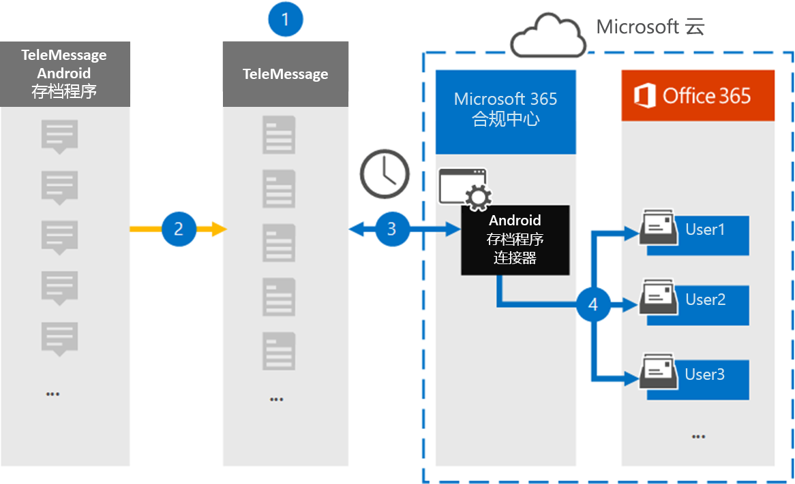

# 设置连接器以存档 Android 移动数据Set up a connector to archive Android mobile data

使用安全与合规中心中的 TeleMessage Microsoft 365从 Android 移动电话导入和存档短信、彩信、语音呼叫和呼叫日志。Use a TeleMessage connector in the Microsoft 365 compliance center to import and archive SMS, MMS, voice calls, and call logs from Android mobile phones. 设置和配置连接器后，它每天连接到组织的 TeleMessage 帐户一次，并且使用 TeleMessage Android 存档器将员工的移动通信导入 Microsoft 365 中的邮箱。After you set up and configure a connector, it connects to your organization's TeleMessage account once every day, and imports the mobile communication of employees using the TeleMessage Android Archiver to mailboxes in Microsoft 365.

将 Android 移动电话的数据存储在用户邮箱中后，可以将 Microsoft 365 合规性功能（如诉讼保留、内容搜索和 Microsoft 365 保留策略）应用于 Android 存档程序数据。After data from Android mobile phones is stored in user mailboxes, you can apply Microsoft 365 compliance features such as Litigation Hold, Content Search, and Microsoft 365 retention policies to Android Archiver data. 例如，您可以使用内容搜索搜索 Android Archiver 移动应用，或将包含 Android 存档连接器数据的邮箱与案例的保管人Advanced eDiscovery关联。For example, you can search Android Archiver mobile communication using Content Search or associate the mailbox that contains the Android Archiver connector data with a custodian in an Advanced eDiscovery case. 使用 Android 存档器连接器在 Microsoft 365 导入和存档数据可帮助组织遵守政府及法规策略。Using an Android Archiver connector to import and archive data in Microsoft 365 can help your organization stay compliant with government and regulatory policies.

## 存档 Android 移动数据概述Overview of archiving Android mobile data

以下概述介绍使用连接器在 Microsoft 365 中存档 Android 移动数据的过程。The following overview explains the process of using a connector to archive Android mobile data in Microsoft 365.

1. 你的组织与 TeleMessage 合作，以设置 Android 存档器连接器。Your organization works with TeleMessage to set up an Android Archiver connector. 有关详细信息，请参阅 [Android Archiver](https://www.telemessage.com/office365-activation-for-android-archiver/)。For more information, see [Android Archiver](https://www.telemessage.com/office365-activation-for-android-archiver/).

2. 实时地，短信 Android 移动电话中的呼叫日志、彩信、语音呼叫和呼叫日志复制到 TeleMessage 站点。In real time, SMS, MMS, voice calls, and call logs from your organization's Android mobile phones are copied to the TeleMessage site.

3. 在 Microsoft 365 合规中心创建的 Android 存档器连接器每天连接到 TeleMessage 网站，将过去 24 小时内的 Android 数据转移到 Microsoft 云中的安全 Azure 存储 位置。The Android Archiver connector that you create in the Microsoft 365 compliance center connects to the TeleMessage site every day and transfers the Android data from the previous 24 hours to a secure Azure Storage location in the Microsoft cloud. 连接器还会将 Android 数据转换为电子邮件格式。The connector also converts the Android data to an email message format.

4. 连接器将移动通信项目导入到特定用户的邮箱。The connector imports the mobile communication items to the mailbox of a specific user. 名为 Android Archiver 的新文件夹将创建于特定用户的邮箱中，并且项目将导入到该文件夹中。A new folder named Android Archiver is created in the specific user's mailbox and the items are imported to it. 连接器使用"用户的电子邮件地址" *属性的值进行映射* 。The connector does mapping by using the value of the *User's Email address* property. 每个电子邮件都包含此属性，该属性填充了电子邮件每个参与者的电子邮件地址。Every email message contains this property, which is populated with the email address of every participant of the email message. 除了使用"用户的电子邮件地址"属性的值进行自动用户映射之外，您还可以通过上载 CSV 映射文件来定义自定义映射。In addition to automatic user mapping using the value of the *User's Email address* property, you can also define a custom mapping by uploading a CSV mapping file. 此映射文件应包含每个用户Microsoft 365移动电话号码和相应的邮箱地址。This mapping file should contain the mobile number and corresponding Microsoft 365 mailbox address for each user. 如果启用自动用户映射并提供自定义映射，连接器将首先查看自定义映射文件，针对每个电子邮件项目。If you enable automatic user mapping and provide a custom mapping, for every email item the connector will first look at custom mapping file. 如果找不到与用户Microsoft 365用户对应的有效邮件，连接器将使用电子邮件项目的用户电子邮件地址属性。If it doesn't find a valid Microsoft 365 user that corresponds to a user's mobile number, the connector will use the user's email address property of the email item. 如果连接器在电子邮件项目的Microsoft 365映射文件或 *用户* 的电子邮件地址属性中找不到有效的邮件用户，该项目将不会导入。If the connector doesn't find a valid Microsoft 365 user in either the custom mapping file or the *User's email address* property of the email item, the item won't be imported.

## 开始之前Before you begin

存档 Android 通信数据所需的一些实现步骤位于 Microsoft 365外部，必须先完成这些步骤，然后才能在合规中心创建连接器。Some of the implementation steps required to archive Android communication data are external to Microsoft 365 and must be completed before you can create the connector in the compliance center.

- 从 [TeleMessage](https://www.telemessage.com/mobile-archiver/order-mobile-archiver-for-o365) 订购 Android 存档器服务，并获取组织的有效管理帐户。Order the [Android Archiver service from TeleMessage](https://www.telemessage.com/mobile-archiver/order-mobile-archiver-for-o365) and get a valid administration account for your organization. 创建连接器时，需要登录此帐户。You'll need to sign into this account when you create the connector.

- 在 TeleMessage 帐户中注册需要 Android 存档器服务的所有用户。Register all users that require the Android Archiver service in the TeleMessage account. 注册用户时，请确保使用用于其帐户Microsoft 365电子邮件地址。When registering users, be sure to use the same email address that's used for their Microsoft 365 account.

- 在员工的移动电话上安装和激活 TeleMessage Android Archiver 应用。Install and activate the TeleMessage Android Archiver app on the mobile phones of your employees.

- 必须为创建 Android 存档连接器的用户分配邮箱导入导出Exchange Online。The user who creates a Android Archiver connector must be assigned the Mailbox Import Export role in Exchange Online. 在安全与合规中心的"数据连接器"页中添加Microsoft 365是必需的。This is required to add connectors in the **Data connectors** page in the Microsoft 365 compliance center. 默认情况下，不会向 Exchange Online 中任何角色组分配此角色。By default, this role isn't assigned to any role group in Exchange Online. 可以将"邮箱导入导出"角色添加到组织中"组织管理"角色Exchange Online。You can add the Mailbox Import Export role to the Organization Management role group in Exchange Online. 也可以创建角色组，分配邮箱导入导出角色，然后将相应的用户添加为成员。Or you can create a role group, assign the Mailbox Import Export role, and then add the appropriate users as members. 有关详细信息，请参阅"在角色组中管理角色组"一文的"创建角色组"或"修改角色Exchange Online"。For more information, see the [Create role groups](/Exchange/permissions-exo/role-groups#create-role-groups) or [Modify role groups](/Exchange/permissions-exo/role-groups#modify-role-groups) sections in the article "Manage role groups in Exchange Online".

## 创建 Android 存档器连接器Create an Android Archiver connector

最后一步是在安全与合规中心内Microsoft 365存档连接器。The last step is to create an Android Archiver connector in the Microsoft 365 compliance center. 连接器使用你提供的信息连接到 TeleMessage 站点，将 Android 通信转移到 Microsoft 365 中相应的用户邮箱框。The connector uses the information you provide to connect to the TeleMessage site and transfer Android communication to the corresponding user mailbox boxes in Microsoft 365.

1. 转到 ， [https://compliance.microsoft.com](https://compliance.microsoft.com) 然后单击数据 **连接器 Android**  >  **存档器**。Go to [https://compliance.microsoft.com](https://compliance.microsoft.com) and click **Data connectors** > **Android Archiver**.

2. 在 **"Android 存档器** 产品说明"页上，单击"**添加连接器"。**On the **Android Archiver** product description page, click **Add connector**.

3. 在"**服务条款"页上**，单击"接受 **"。**On the **Terms of service** page, click **Accept**.

4. 在"**登录到 TeleMessage"** 页上的"步骤 3"下，在下列框中输入所需信息，然后单击"下一步 **"。**On the **Login to TeleMessage** page, under Step 3, enter the required information in the following boxes and then click **Next**.

   - **用户名：** 你的 TeleMessage 用户名。**Username:** Your TeleMessage username.

   - **密码：** 你的 TeleMessage 密码。**Password:** Your TeleMessage password.

5. 创建连接器后，关闭弹出窗口，然后单击下一 **步**。After the connector is created, close the pop-up window and click **Next**.

6. 在"**用户映射"页上**，启用自动用户映射，然后单击"下一步 **"。**On the **User mapping** page, enable automatic user mapping and click **Next**. 如果你需要自定义映射上传 CSV 文件，然后单击下一 **步**。In case you need custom mapping upload a CSV file, and click **Next**.

7. 查看设置，然后单击" **完成** "创建连接器。Review your settings, and then click **Finish** to create the connector.

8. 转到"数据连接器" **页中的"** 连接器"选项卡以查看新连接器的导入过程的进度。Go to the Connectors tab in **Data connectors** page to see the progress of the import process for the new connector.

## 已知问题Known issues

- 目前，我们不支持导入大于 10 MB 的附件或项目。At this time, we don't support importing attachments or items that are larger than 10 MB. 稍后将提供对较大项目的支持。Support for larger items will be available at a later date.
