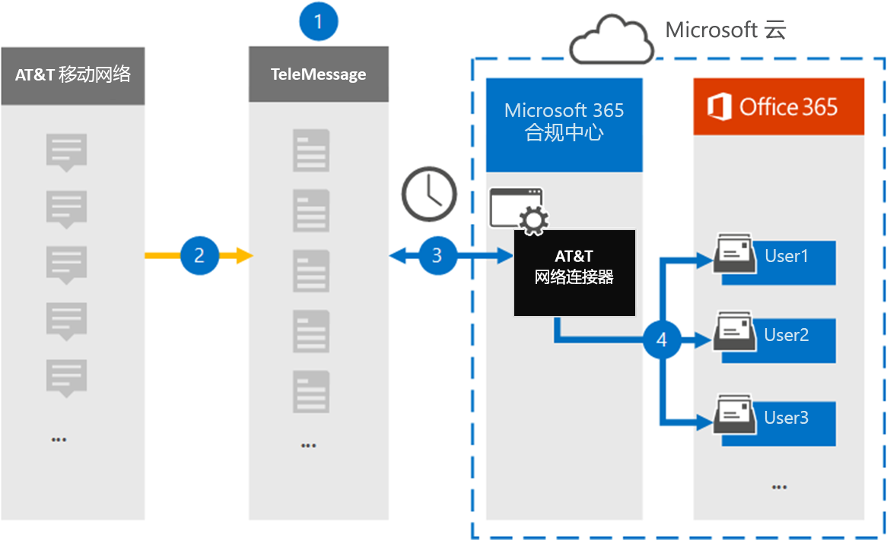

# 在&T SMS/MMS 数据 (preview 中设置要存档的连接器) Set up a connector to archive AT&T SMS/MMS data (preview)

使用 Microsoft 365 合规性中心中的 TeleMessage 连接器在&T 移动网络中导入和存档 SMS 和 MMS 数据。Use a TeleMessage connector in the Microsoft 365 compliance center to import and archive SMS and MMS data from AT&T Mobile Network. 设置和配置连接器后，它会每天连接到您的组织的&T 网络上，并将短信和 MMS 数据导入 Microsoft 365 中的邮箱。After you set up and configure a connector, it connects to your organization's AT&T Network once every day, and imports SMS and MMS data to mailboxes in Microsoft 365.

将 SMS 和 MMS 邮件存储在用户邮箱中之后，可以在&T 网络数据上应用 Microsoft 365 合规性功能，如诉讼保留、内容搜索和 Microsoft 365 保留策略。After SMS and MMS messages are stored in user mailboxes, you can apply Microsoft 365 compliance features such as Litigation Hold, Content Search, and Microsoft 365 retention policies to AT&T Network data. 例如，您可以使用内容搜索在&T 网络数据中搜索，或将包含&T 网络连接器数据的邮箱与高级电子数据展示事例中的保管人程序关联。For example, you can search AT&T Network data using Content Search or associate the mailbox that contains the AT&T Network connector data with a custodian in an Advanced eDiscovery case. 使用 AT&T 网络连接器在 Microsoft 365 中导入和存档数据可帮助您的组织遵守政府和法规策略。Using a AT&T Network connector to import and archive data in Microsoft 365 can help your organization stay compliant with government and regulatory policies.

## &T 网络数据存档概述Overview of archiving AT&T Network data

以下概述说明在 Microsoft 365 中的&T 网络数据上使用连接器存档的过程。The following overview explains the process of using a connector to archive AT&T Network data in Microsoft 365.

1. 您的组织与 TeleMessage 协同工作，设置一个 AT&T 网络连接器。Your organization works with TeleMessage to set up an AT&T Network connector. 有关信息，请参阅 [&T 网络存档](https://www.telemessage.com/office365-activation-for-atnt-network-archiver/)器。For information, see [AT&T Network Archiver](https://www.telemessage.com/office365-activation-for-atnt-network-archiver/).

2. 每24小时一次，来自组织的&T 网络的 SMS 和 MMS 邮件将复制到 TeleMessage 站点。Once every 24 hours, SMS and MMS messages from your organization’s AT&T Network are copied to the TeleMessage site.

3. 您在 Microsoft 365 合规性中心中创建的 AT&T 网络连接器每天连接到 TeleMessage 网站，并将短信和 MMS 邮件从以前的24小时传输到 Microsoft 云中的安全 Azure 存储位置。The AT&T Network connector that you create in the Microsoft 365 compliance center connects to the TeleMessage site every day and transfers the SMS and MMS messages from the previous 24 hours to a secure Azure Storage location in the Microsoft Cloud. 连接器还将短信和 MMS 邮件的内容转换为电子邮件格式。The connector also converts the content of SMS and MMS messages to an email message format.

4. 连接器将移动通信项目导入到特定用户的邮箱。The connector imports the mobile communication items to the mailbox of specific users. 在用户的邮箱中创建一个名为 **&T SMS/MMS 网络存档** 器的新文件夹，然后将这些项目导入其中。A new folder named **AT&T SMS/MMS Network Archiver** is created in the user's mailbox and the items will be imported to it. 连接器通过使用 *用户的电子邮件地址* 属性的值执行此映射。The connector does this mapping by using the value of the *User’s Email address* property. 每个短信和 MMS 邮件都包含此属性，该属性由邮件的每个参与者的电子邮件地址填充。Every SMS and MMS message contains this property, which is populated with the email address of every participant of the message.
 
   除了使用 *用户电子邮件地址* 属性的值进行自动用户映射之外，还可以通过上载 CSV 映射文件来定义自定义映射。In addition to automatic user mapping using the value of the *User’s Email address* property, you can also define a custom mapping by uploading a CSV mapping file. 此映射文件包含组织中用户的移动电话号码和相应的 Microsoft 365 电子邮件地址。This mapping file contains the mobile phone number and corresponding Microsoft 365 email address for users in your organization. 如果为每个电子邮件项目启用自动用户映射和自定义映射，则连接器将首先查看自定义映射文件。If you enable both automatic user mapping and custom mapping, for every email item the connector first looks at the custom mapping file. 如果找不到与移动电话号码对应的有效 Microsoft 365 用户，连接器将使用其尝试导入的项目的电子邮件地址属性中的值。If it doesn't find a valid Microsoft 365 user that corresponds to a mobile phone number, the connector uses the values in the email address property of the item it's trying to import. 如果连接器在自定义映射文件或电子邮件地址属性的电子邮件地址属性中找不到有效的 Microsoft 365 用户，则不会导入该项目。If the connector doesn't find a valid Microsoft 365 user in either the custom mapping file or in the email address property of the email item, the item won't be imported.

## 准备工作Before you begin

存档时&T 网络数据需要执行的许多步骤都是 Microsoft 365 外部的，必须先完成，然后才能在合规性中心中创建连接器。Many of the implementation steps required to archive AT&T Network data are external to Microsoft 365 and must be completed before you can create the connector in the compliance center.

- [从 TeleMessage 对移动存档服务](https://www.telemessage.com/mobile-archiver/order-mobile-archiver-for-o365/)进行排序，并为您的组织获取有效的管理帐户。Order the [mobile archiver service from TeleMessage](https://www.telemessage.com/mobile-archiver/order-mobile-archiver-for-o365/) and get a valid administration account for your organization. 在合规中心创建连接器时，需要登录此帐户。You'll need to sign into this account when you create the connector in the compliance center.

- 在&T 帐户和帐单联系人详细信息中获取，以便您可以填写 TeleMessage 载入表单并从&T 对邮件存档服务进行排序。Obtain your AT&T account and billing contact details so you can fill-out the TeleMessage onboarding forms and order the message archiving service from AT&T.

- 在 TeleMessage 帐户中注册所有需要&T SMS/MMS 网络存档的用户。Register all users that require AT&T SMS/MMS Network archiving in the TeleMessage account. 注册用户时，请确保使用的电子邮件地址与用于其 Microsoft 365 帐户的电子邮件地址相同。When registering users, be sure to use the same email address that's used for their Microsoft 365 account.

- 您的员工必须在&T 移动网络上有企业拥有和公司责任的移动电话。Your employees must have corporate-owned and corporate-liable mobile phones on the AT&T mobile network. 在 Microsoft 365 中存档邮件不适用于员工拥有或 "将自己的设备 (BYOD) 设备。Archiving messages in Microsoft 365 isn't available for employee-owned or "Bring Your Own Devices (BYOD) devices.

- 您的组织必须同意允许 Office 365 导入服务访问组织中的邮箱数据。Your organization must consent to allow the Office 365 Import service to access mailbox data in your organization. 您需要在创建连接器时提供此同意。You will need to provide this consent when you create the connector. 若要同意此请求，请转到 [此页](https://login.microsoftonline.com/common/oauth2/authorize?client_id=570d0bec-d001-4c4e-985e-3ab17fdc3073&response_type=code&redirect_uri=https://portal.azure.com/&nonce=1234&prompt=admin_consent)，使用 Office 365 全局管理员的凭据登录，然后接受该请求。To consent to this request, go to [this page](https://login.microsoftonline.com/common/oauth2/authorize?client_id=570d0bec-d001-4c4e-985e-3ab17fdc3073&response_type=code&redirect_uri=https://portal.azure.com/&nonce=1234&prompt=admin_consent), sign in with the credentials of an Office 365 global admin, and then accept the request. 您必须完成此步骤，然后才能成功创建&T 网络连接器。You have to complete this step before you can successfully create an AT&T Network connector.

- 在 Exchange Online 中，必须为创建位于&T 网络连接器的用户分配邮箱导入导出角色。The user who creates a AT&T Network connector must be assigned the Mailbox Import Export role in Exchange Online. 这是在 Microsoft 365 合规性中心的 " **数据连接器** " 页中添加连接器所必需的。This is required to add connectors in the **Data connectors** page in the Microsoft 365 compliance center. 默认情况下，不会向 Exchange Online 中任何角色组分配此角色。By default, this role isn't assigned to any role group in Exchange Online. 您可以将邮箱导入导出角色添加到 Exchange Online 中的 "组织管理" 角色组。You can add the Mailbox Import Export role to the Organization Management role group in Exchange Online. 或者，您可以创建角色组，分配邮箱导入导出角色，然后将相应的用户添加为成员。Or you can create a role group, assign the Mailbox Import Export role, and then add the appropriate users as members. 有关详细信息，请参阅文章 "管理 Exchange Online 中的角色组" 中的 " [创建角色组](https://docs.microsoft.com/Exchange/permissions-exo/role-groups#create-role-groups) " 或 " [修改角色组](https://docs.microsoft.com/Exchange/permissions-exo/role-groups#modify-role-groups) " 部分。For more information, see the [Create role groups](https://docs.microsoft.com/Exchange/permissions-exo/role-groups#create-role-groups) or [Modify role groups](https://docs.microsoft.com/Exchange/permissions-exo/role-groups#modify-role-groups) sections in the article "Manage role groups in Exchange Online".

## 在&T 网络连接器处创建Create a AT&T Network connector

完成上一节中所述的先决条件后，可以在 Microsoft 365 合规性中心中创建一个 "&T" 网络连接器。After you've completed the prerequisites described in the previous section, you can create an AT&T Network connector in the Microsoft 365 compliance center. 连接器使用您提供的信息来连接到 TeleMessage 网站，并将短信和 MMS 邮件传输到 Microsoft 365 中对应的用户邮箱框中。The connector uses the information you provide to connect to the TeleMessage site and transfer SMS and MMS messages to the corresponding user mailbox boxes in Microsoft 365.

1. 转到 [https://compliance.microsoft.com](https://compliance.microsoft.com/) ，然后单击**Data connectors**  \  **&T 网络上的**数据连接器。Go to [https://compliance.microsoft.com](https://compliance.microsoft.com/) and then click **Data connectors** \ **AT&T Network**.

2. 在 "**位置&T 网络产品**说明" 页上，单击 "**添加连接器**"On the **AT&T Network product** description page, click **Add connector**

3. 在 " **服务条款** " 页上，单击 " **接受**"。On the **Terms of service** page, click **Accept**.

4. 在 " **登录到 TeleMessage** " 页上的 "步骤 3" 下的以下框中，输入所需信息，然后单击 " **下一步**"。On the **Login to TeleMessage** page, under Step 3, enter the required information in the following boxes and then click **Next**.

   - **Username：** 您的 TeleMessage 用户名。**Username:** Your TeleMessage username.

   - **密码：** 您的 TeleMessage 密码。**Password:** Your TeleMessage password.

5. 创建连接器后，可以关闭弹出窗口并转到下一页。After the connector is created, you can close the pop-up window and go to the next page.

6. 在 " **用户映射** " 页上，启用自动用户映射。On the **User mapping** page, enable automatic user mapping. 若要启用自定义映射，请上载包含用户映射信息的 CSV 文件，然后单击 " **下一步**"。To enable custom mapping, upload a CSV file that contains the user mapping information, and then click **Next**.

7. 提供管理员同意，然后单击 " **下一步**"。Provide admin consent and then click **Next**.

   若要提供管理员同意，必须使用 Office 365 全局管理员的凭据登录，然后接受同意请求。To provide admin consent, you must be signed in with the credentials of an Office 365 global admin, and then accept the consent request. 如果你未以全局管理员身份登录，则可以转到 [此页面](https://login.microsoftonline.com/common/oauth2/authorize?client_id=570d0bec-d001-4c4e-985e-3ab17fdc3073&response_type=code&redirect_uri=https://portal.azure.com/&nonce=1234&prompt=admin_consent) 并使用全局管理员凭据登录以接受请求。If you aren't signed in as a global admin, you can go to [this page](https://login.microsoftonline.com/common/oauth2/authorize?client_id=570d0bec-d001-4c4e-985e-3ab17fdc3073&response_type=code&redirect_uri=https://portal.azure.com/&nonce=1234&prompt=admin_consent) and sign-in using global admin credentials to accept the request. 

8. 查看您的设置，然后单击 " **完成** " 以创建连接器。Review your settings, and then click **Finish** to create the connector.

9. 转到合规中心 "**数据连接器**" 页上的 "**连接器**" 选项卡，以查看新连接器的导入过程的进度。Go to the **Connectors** tab on the **Data connectors** page in the compliance center to see the progress of the import process for the new connector.

## 已知问题Known issues

- 连接器未导入任何大于 10 MB 的项目。The connector doesn’t import any item larger than 10 MB.
