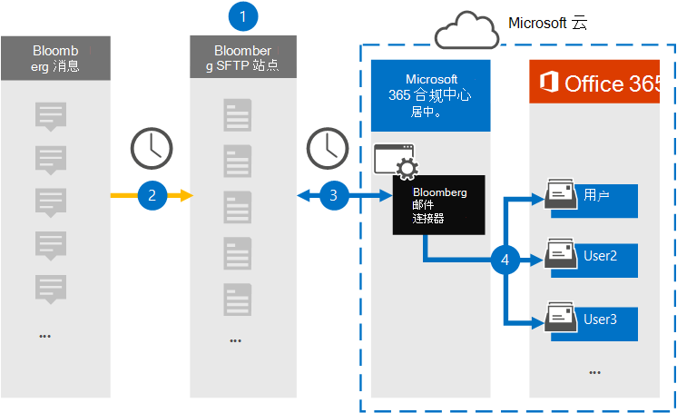
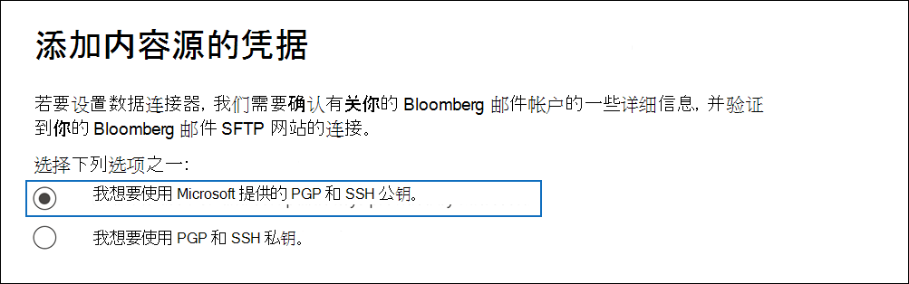

# 设置连接器以存档 Bloomberg 邮件数据

使用数据连接器从"Microsoft 365 合规中心消息协作工具导入和存档[金融服务](https://www.bloomberg.com/professional/product/collaboration/)电子邮件数据。 设置和配置连接器后，它每天连接到组织的一次安全 FTP (SFTP) 网站，并导入电子邮件项目到 Microsoft 365 中的邮箱。

在将 Bloomberg 邮件数据存储在用户邮箱中后，您可以将 Microsoft 365 合规性功能（如诉讼保留、内容搜索、就地存档、审核、通信合规性和 Microsoft 365 保留策略）应用于 Bloomberg Message 数据。 例如，您可以使用内容搜索工具搜索 Bloomberg Message 电子邮件，或将包含 Bloomberg Message 数据的邮箱与案例的保管人Advanced eDiscovery关联。 使用一个 Bloomberg 邮件连接器将数据导入并存档Microsoft 365可帮助你的组织遵守政府及法规策略。

## 存档 Bloomberg 邮件数据概述

以下概述介绍使用连接器在邮件邮箱中存档"Bloomberg 邮件"Microsoft 365。

1. 你的组织与 Bloomberg 合作，以设置一个 Bloomberg SFTP 网站。 You'll also work with Bloomberg to configure Bloomberg Message to copy email messages to the Bloomberg SFTP site.

2. 每 24 小时发送一次，来自 Bloomberg Message 的电子邮件将复制到 Bloomberg SFTP 网站。

3. 在 Microsoft 365 合规中心 创建的 Bloomberg 邮件连接器每天连接到 Bloomberg SFTP 网站，将过去 24 小时内的电子邮件转移到 Microsoft 云中的安全 Azure 存储 区域。

4. 连接器将电子邮件项目导入到特定用户的邮箱。 将在特定用户的邮箱中创建一个名为 BloombergMessage 的新文件夹，项目将导入到该文件夹中。

   连接器使用 CorporateEmailAddress 属性的值实现此操作。 每个电子邮件都包含此属性，该属性填充了电子邮件每个参与者的电子邮件地址。 除了使用 *CorporateEmailAddress* 属性的值进行自动用户映射之外，您还可以通过上载 CSV 映射文件来定义自定义映射。 此映射文件包含一个 Bloomberg UUID 和Microsoft 365组织中每个用户的相应邮箱地址。 如果启用自动用户映射并提供自定义映射，连接器将首先查看自定义映射文件，针对每个电子邮件项目。 如果找不到与用户的 Bloomberg UUID Microsoft 365有效的邮件用户，连接器将使用电子邮件项目的 *CorporateEmailAddress* 属性。 如果连接器在自定义映射文件或Microsoft 365 *CorporateEmailAddress* 属性中找不到有效的邮件用户，则不导入该项目。

## 设置连接器之前

存档 Bloomberg 邮件数据所需的一些实现步骤Microsoft 365且必须先完成，然后才能在合规中心创建连接器。

- 若要设置一个 Bloomberg 邮件连接器，您必须使用密钥和密钥通行短语实现"良好隐私" (PGP) 以及安全外壳 (SSH) 。 这些密钥用于配置 Bloomberg SFTP 网站，连接器用于连接到 Bloomberg SFTP 网站以将数据导入 Microsoft 365。 PGP 密钥用于配置从 Bloomberg SFTP 网站传输到数据组的数据Microsoft 365。 SSH 密钥用于配置安全命令行管理程序，以在连接器连接到 Bloomberg SFTP 网站时启用安全远程登录。

  设置连接器时，可以选择使用 Microsoft 提供的公钥和密钥密码，或者可以使用自己的私钥和密码。 建议使用 Microsoft 提供的公钥。 但是，如果你的组织已使用私钥配置了一个 Bloomberg SFTP 网站，那么你可以使用相同的私钥创建连接器。

- 订阅 [Bloomberg Anywhere](https://www.bloomberg.com/professional/product/remote-access/?bbgsum-page=DG-WS-PROF-PROD-BBA)。 这是必需的，以便你可以登录到 Bloomberg Anywhere 以访问必须设置和配置的 Bloomberg SFTP 网站。

- 设置一个 Bloomberg SFTP (安全文件传输协议) 网站。 与 Bloomberg 合作设置 SFTP 网站后，一天中将一条来自 Bloomberg Message 的数据上载到 SFTP 网站。 在步骤 2 创建的连接器连接到此 SFTP 站点，将电子邮件数据Microsoft 365邮箱。 SFTP 还加密在传输过程中发送到邮箱的 Bloomberg 邮件数据。

  有关 Bloomberg SFTP (*也称为 BB-SFTP*) ：

  - 请参阅位于 Bloomberg Support 的"SFTP 连接标准 ["文档](https://www.bloomberg.com/professional/support/documentation/)。

  - 联系 [Bloomberg 客户支持](https://service.bloomberg.com/portal/sessions/new?utm_source=bloomberg-menu&utm_medium=csc)。

- 与 Bloomberg 合作设置 SFTP 网站后，在回复了 Bloomberg 实施电子邮件后，Bloomberg 会向您提供一些信息。 保存以下信息的副本。 可以使用它在步骤 3 中设置连接器。

  - 公司代码，它是组织的 ID，用于登录到 Bloomberg SFTP 网站。

  - 你的 Bloomberg SFTP 网站的密码

  - 一个用于 Bloomberg SFTP (URL，例如，sftp.bloomberg.com) 。 此外，Bloomberg 还可以为 Bloomberg SFTP 网站提供相应的 IP 地址，该地址还可用于设置连接器。

  - Bloomberg SFTP 网站的端口号

- Bloomberg 邮件连接器一天中总共可以导入 200，000 个项目。 如果 SFTP 网站上有 200，000 多个项目，则这些项目均不会导入Microsoft 365。

- 必须为在步骤 3 (步骤 1 中创建一个 Bloomberg 邮件连接器的用户分配数据连接器管理员角色) 下载公钥和 IP 地址的用户。 若要在"数据连接器"页上添加连接器，需要此Microsoft 365 合规中心。 默认情况下，此角色添加到多个角色组。 有关这些角色组的列表，请参阅安全与合规中心内的权限中的"安全与合规& ["部分](../security/office-365-security/permissions-in-the-security-and-compliance-center.md#roles-in-the-security--compliance-center)。 或者，您组织的管理员可以创建自定义角色组，分配数据连接器管理员角色，然后将相应的用户添加为成员。 有关说明，请参阅"权限"部分中的"创建自定义[角色Microsoft 365 合规中心](microsoft-365-compliance-center-permissions.md#create-a-custom-role-group)。

## 使用公钥设置连接器

本节中的步骤将展示如何使用 SSH 中"良好隐私" (PGP) 和安全命令行管理程序 (公钥来设置一个 Bloomberg 邮件) 。

### 步骤 1：获取 PGP 和 SSH 公钥

第一步是获取 PGP 和 SSH 公钥的副本。 使用步骤 2 中的这些密钥配置 Bloomberg SFTP 网站，以允许步骤 3) 创建的连接器 (连接到 SFTP 网站，将一封"一条"邮件电子邮件数据传输给 Microsoft 365 邮箱。 您还可以在此步骤中获取 IP 地址，该地址在配置 Bloomberg SFTP 网站时使用。

1. 转到左侧 <https://compliance.microsoft.com> 导航 **导航中的"数据** 连接器"，然后单击" 数据连接器"。

2. 在" **数据连接器"页面** 的 **"Bloomberg Message**"下，单击" **查看"**。

3. 在 **"Bloomberg 邮件** "产品说明页面上，单击" **添加连接器"**

4. 在" **服务条款"页上** ，单击"接受 **"**。

5. 在" **添加内容源的** 凭据"页上，单击 **"我想要使用 Microsoft 提供的 PGP 和 SSH 公钥"**。

   

6. 在步骤 1 下，单击"下载 **SSH** 密钥、 **下载 PGP** 密钥"和" **下载 IP** 地址"链接，将每个文件的副本保存到本地计算机。

   

   这些文件包含以下项，用于配置步骤 2 中的 Bloomberg SFTP 网站：

   - PGP 公钥：此密钥用于配置从 Bloomberg SFTP 网站传输到 Microsoft 365。

   - SSH 公钥：此密钥用于配置安全 Shell，以在连接器连接到 Bloomberg SFTP 网站时启用安全远程登录。

   - IP 地址：将 Bloomberg SFTP 网站配置为接受来自此 IP 地址的连接请求。 同一 IP 地址由 Bloomberg 邮件连接器用于连接到 SFTP 网站，将 Bloomberg 邮件数据传输Microsoft 365。

7. 单击 **"** 取消"关闭向导。 在步骤 3 中返回到此向导以创建连接器。

### 步骤 2：配置 Bloomberg SFTP 网站

> [!NOTE]
> 如果你的组织之前设置了一个 Bloomberg SFTP 网站，以使用公共 PGP 和 SSH 密钥存档 Instant Bloomberg 数据，则不必设置另一个。 可以在步骤 3 中创建连接器时指定相同的 SFTP 站点。

下一步是使用 PGP 和 SSH 公钥以及你在步骤 1 中获得的 IP 地址来为 Bloomberg SFTP 网站配置 PGP 加密和 SSH 身份验证。 这样，你在步骤 3 创建的 Bloomberg 邮件连接器可以连接到 Bloomberg SFTP 网站，将 Bloomberg 邮件数据传输Microsoft 365。 你需要与 Bloomberg 客户支持合作，以设置你的 Bloomberg SFTP 网站。 请联系 [Bloomberg 客户支持](https://service.bloomberg.com/portal/sessions/new?utm_source=bloomberg-menu&utm_medium=csc) 寻求帮助。

> [!IMPORTANT]
> Bloomberg 建议你在步骤 1 中下载的三个文件附加到电子邮件，并发送给客户支持团队，当他们合作设置你的 Bloomberg SFTP 网站时。

### 步骤 3：创建一个 Bloomberg 邮件连接器

最后一步是在邮件服务中创建一个Microsoft 365 合规中心。 连接器使用你提供的信息连接到 Bloomberg SFTP 网站，将电子邮件传输至邮件中相应的用户邮箱Microsoft 365。

1. 转到左侧 <https://compliance.microsoft.com> 导航 **导航中的"数据** 连接器"，然后单击" 数据连接器"。

2. 在" **数据连接器"页面** 的 **"Bloomberg Message**"下，单击" **查看"**。

3. 在 **"Bloomberg 邮件** "产品说明页面上，单击" **添加连接器"**

4. 在" **服务条款"页上** ，单击"接受 **"**。

5. 在" **添加内容源的** 凭据"页上，单击 **"我想要使用 Microsoft 提供的 PGP 和 SSH 公钥"**。

6. 在"步骤 3"下，在下列框中输入所需信息，然后单击"验证 **连接"**。

      - **名称：** 连接器的名称。 它必须在组织中是唯一的。

      - **公司代码：** 用作 Bloomberg SFTP 网站的用户名的组织 ID。

      - **密码：** 您组织的 Bloomberg SFTP 网站的密码。

      - **SFTP URL：** Bloomberg SFTP 网站的 URL (例如， `sftp.bloomberg.com`) 。 您还可以将 IP 地址用于此值。

      - **SFTP 端口：** Bloomberg SFTP 网站的端口号。 连接器使用此端口连接到 SFTP 站点。

7. 成功验证连接后，单击"下一 **步"**。

8. 在 **"定义用户** "页上，指定要导入其数据的用户。

     - **组织中所有用户**。 选择此选项可导入所有用户的数据。

     - **仅诉讼保留的用户**。 选择此选项以仅导入其邮箱置于诉讼保留状态的用户的数据。 此选项将数据导入到 LitigationHoldEnabled 属性设置为 True 的用户邮箱。 有关详细信息，请参阅 [创建诉讼保留](create-a-litigation-hold.md)。

9. 在"**Map Bloomberg Message users to Microsoft 365 users**"页上，启用自动用户映射并按需要提供自定义用户映射。

   > [!NOTE]
   > 连接器将邮件项目导入到特定用户的邮箱。 将在特定用户的邮箱中创建一个名为 **BloombergMessage** 的新文件夹，项目将导入到该文件夹中。 连接器使用 *CorporateEmailAddress* 属性的值进行连接。 每个聊天消息都包含此属性，并且使用聊天消息每个参与者的电子邮件地址填充该属性。 除了使用 *CorporateEmailAddress* 属性的值进行自动用户映射之外，您还可以通过上载 CSV 映射文件来定义自定义映射。 映射文件应包含 Bloomberg UUID 和每个用户Microsoft 365相应的邮箱地址。 如果启用自动用户映射并提供自定义映射，连接器将首先查看自定义映射文件，针对每个邮件项。 如果找不到与用户的 Bloomberg UUID Microsoft 365有效的连接器，连接器将使用聊天项目的 *CorporateEmailAddress* 属性。 如果连接器在邮件项目的Microsoft 365映射文件或 *CorporateEmailAddress* 属性中找不到有效的邮件用户，则不导入该项目。

10. 单击 **"下** 一步"，查看设置，然后单击" **完成** "以创建连接器。

11. 转到" **数据连接器"** 页以查看新连接器的导入过程的进度。 单击连接器可显示包含连接器相关信息的飞出页。

## 使用私钥设置连接器

本部分中的步骤将展示如何使用 PGP 和 SSH 私钥设置一个 Bloomberg 邮件连接器。 此连接器设置选项适用于已使用私钥配置一个 Bloomberg SFTP 网站的组织。

### 步骤 1：获取 IP 地址以配置 Bloomberg SFTP 网站

> [!NOTE]
> 如果你的组织之前已配置一个 Bloomberg SFTP 网站，以使用 PGP 和 SSH 私钥存档 Instant Bloomberg 数据，则不必配置另一个。 可以在步骤 2 中创建连接器时指定相同的 SFTP 站点。

如果你的组织已使用 PGP 和 SSH 私钥来设置一个 Bloomberg SFTP 网站，则你必须获取 IP 地址，然后向 Bloomberg 客户支持部门提供该地址。 必须配置 Bloomberg SFTP 网站以接受来自此 IP 地址的连接请求。 同一 IP 地址由 Bloomberg 邮件连接器用于连接到 SFTP 网站，将 Bloomberg 邮件数据传输Microsoft 365。

若要获取 IP 地址：：

1. 转到左侧 <https://compliance.microsoft.com> 导航 **导航中的"数据** 连接器"，然后单击" 数据连接器"。

2. 在" **数据连接器"页面** 的 **"Bloomberg Message**"下，单击" **查看"**。

3. 在 **"Bloomberg 邮件** "产品说明页面上，单击" **添加连接器"**

4. 在" **服务条款"页上** ，单击"接受 **"**。

5. 在" **添加内容源的凭据"页上** ，单击 **"我想要使用 PGP 和 SSH 私钥"**。

6. 在步骤 1 下， **单击"下载 IP** 地址"以将 IP 地址文件的副本保存到本地计算机。

   

7. 单击 **"** 取消"关闭向导。 您将在步骤 2 中返回到此向导以创建连接器。

你需要与 Bloomberg 客户支持合作，将你的 Bloomberg SFTP 网站配置为接受来自此 IP 地址的连接请求。 请联系 [Bloomberg 客户支持](https://service.bloomberg.com/portal/sessions/new?utm_source=bloomberg-menu&utm_medium=csc) 寻求帮助。

### 步骤 2：创建一个 Bloomberg 邮件连接器

配置一个 Bloomberg SFTP 网站后，下一步是在站点内创建一个Microsoft 365 合规中心。 连接器使用你提供的信息连接到 Bloomberg SFTP 网站，将电子邮件传输至邮件中相应的用户邮箱Microsoft 365。 若要完成此步骤，请确保具有用于设置一个 Bloomberg SFTP 网站的相同私钥和密钥密码的副本。

1. 转到左侧 <https://compliance.microsoft.com> 导航 **导航中的"数据** 连接器"，然后单击" 数据连接器"。

2. 在" **数据连接器"页面** 的 **"Bloomberg Message**"下，单击" **查看"**。

3. 在 **"Bloomberg 邮件** "产品说明页面上，单击" **添加连接器"**

4. 在" **服务条款"页上** ，单击"接受 **"**。

5. 在" **添加内容源的凭据"页上** ，单击 **"我想要使用 PGP 和 SSH 私钥"**。

   

6. 在"步骤 3"下，在下列框中输入所需信息，然后单击"验证 **连接"**。

      - **名称：** 连接器的名称。 它必须在组织中是唯一的。

      - **公司代码：** 用作 Bloomberg SFTP 网站的用户名的组织 ID。

      - **密码：** 您组织的 Bloomberg SFTP 网站的密码。

      - **SFTP URL：** Bloomberg SFTP 网站的 URL (例如， `sftp.bloomberg.com`) 。 您还可以将 IP 地址用于此值。

      - **SFTP 端口：** Bloomberg SFTP 网站的端口号。 连接器使用此端口连接到 SFTP 站点。

      - **PGP 私钥：** 用于 Bloomberg SFTP 网站的 PGP 私钥。 请务必包括整个私钥值，包括键块的开头和结尾行。

      - **PGP 键密码：** PGP 私钥的通行短语。

      - **SSH 私钥：** 用于 Bloomberg SFTP 网站的 SSH 私钥。 请务必包括整个私钥值，包括键块的开头和结尾行。

      - **SSH 密钥密码：** SSH 私钥的通行短语。

7. 成功验证连接后，单击"下一 **步"**。

8. 在 **"定义用户** "页上，指定要导入其数据的用户

     - **组织中所有用户**。 选择此选项可导入所有用户的数据。

     - **仅诉讼保留的用户**。 选择此选项以仅导入其邮箱置于诉讼保留状态的用户的数据。 此选项将数据导入到 LitigationHoldEnabled 属性设置为 True 的用户邮箱。 有关详细信息，请参阅 [创建诉讼保留](create-a-litigation-hold.md)。

9. 在"**Map Bloomberg Message users to Microsoft 365 users**"页上，启用自动用户映射并按需要提供自定义用户映射。

   > [!NOTE]
   > 连接器将邮件项目导入到特定用户的邮箱。 将在特定用户的邮箱中创建一个名为 **BloombergMessage** 的新文件夹，项目将导入到该文件夹中。 连接器使用 *CorporateEmailAddress* 属性的值进行连接。 每个聊天消息都包含此属性，并且使用聊天消息每个参与者的电子邮件地址填充该属性。 除了使用 *CorporateEmailAddress* 属性的值进行自动用户映射之外，您还可以通过上载 CSV 映射文件来定义自定义映射。 映射文件应包含 Bloomberg UUID 和每个用户Microsoft 365相应的邮箱地址。 如果启用自动用户映射并提供自定义映射，连接器将首先查看自定义映射文件，针对每个邮件项。 如果找不到与用户的 Bloomberg UUID Microsoft 365有效的连接器，连接器将使用聊天项目的 *CorporateEmailAddress* 属性。 如果连接器在邮件项目的Microsoft 365映射文件或 *CorporateEmailAddress* 属性中找不到有效的邮件用户，则不导入该项目。

10. 单击 **"下** 一步"，查看设置，然后单击" **完成** "以创建连接器。

11. 转到" **数据连接器"** 页以查看新连接器的导入过程的进度。 单击连接器可显示包含连接器相关信息的飞出页。

## 已知问题

- 不支持线程处理导入到 Microsoft 365 的一封电子邮件。 发送给某人的单个消息将被导入，但它们不会呈现在线程对话中。 Microsoft 正在致力于在更高版本的 Bloomberg 邮件数据连接器中支持线程处理。
