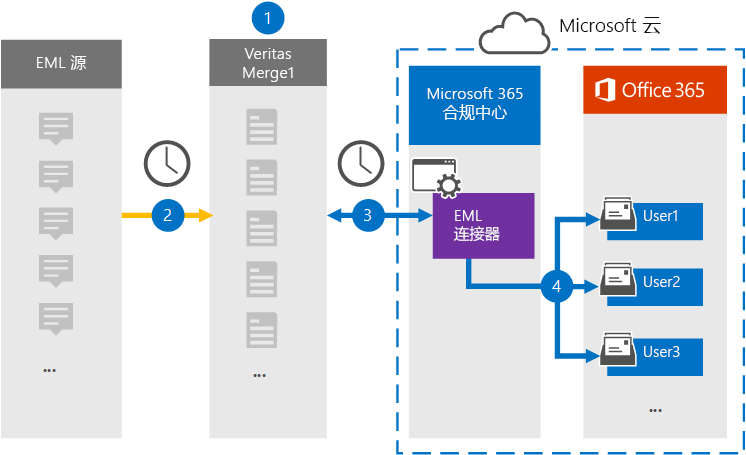

# 设置连接器以存档 EML 数据

使用 Microsoft 365 合规中心 中的"Microsoft 365 合规中心"连接器将 EML 数据导入并存档到组织中用户Microsoft 365邮箱。 EML 是保存到文件的电子邮件的文件扩展名。 连接器将项目的内容从源格式转换为电子邮件格式，然后将该项目导入到用户邮箱。

将 EML 邮件存储在用户邮箱中后，Microsoft 365诉讼保留、电子数据展示、保留策略和保留标签等合规性功能。 使用 EML 连接器导入数据并存档数据Microsoft 365有助于组织遵守政府法规策略。

## 存档 EML 数据概述

以下概述介绍使用连接器在电子邮件中存档 EML 数据Microsoft 365。

1. 您的组织与 EML 源一起设置和配置 EML 站点。

2. 每 24 小时复制一次 EML 源中的内容项，然后复制到"完成"合并 1 网站。 在此过程中，EML 文件的内容将转换为电子邮件格式。

3. 在 Microsoft 云中创建的 EML 连接器Microsoft 365 合规中心每天连接到 Microsoft Clouds Merge1 网站，将邮件传输至 Microsoft 云中的安全 Azure 存储 位置。

4. 连接器使用步骤 3 中介绍的自动用户映射过程的 *Email* 属性值将转换后的邮件项目导入特定用户的 [邮箱](#step-3-map-users-and-complete-the-connector-setup)。 在此过程中，在用户邮箱中创建名为 **EML** 的收件箱文件夹中的子文件夹，EML 项目将导入该文件夹。 连接器使用 Email 属性的值确定将项目导入到哪个 *邮箱* 。 每封邮件都包含此属性，其中填充了内容项每个参与者的电子邮件地址。

## 准备工作

- 为 Microsoft 连接器创建一个 Microsoft Merge1 帐户。 若要创建帐户，请联系 ["用户支持人员"](https://globanet.com/ms-connectors-contact)。 在步骤 1 中创建连接器时，将登录到此帐户。

- 必须在步骤 1 中创建 EML 连接器 (在步骤 3 中完成) 必须分配有数据连接器管理员角色。 若要在"数据连接器"页上添加连接器，需要此Microsoft 365 合规中心。 默认情况下，此角色添加到多个角色组。 有关这些角色组的列表，请参阅安全与合规中心内的权限中的"安全与合规& ["部分](../security/office-365-security/permissions-in-the-security-and-compliance-center.md#roles-in-the-security--compliance-center)。 或者，您组织的管理员可以创建自定义角色组，分配数据连接器管理员角色，然后将相应的用户添加为成员。 有关说明，请参阅"权限"部分中的"创建自定义[角色Microsoft 365 合规中心](microsoft-365-compliance-center-permissions.md#create-a-custom-role-group)。

- 此位于美国政府云中的 GCC 环境Microsoft 365预览版。 第三方应用程序和服务可能涉及在 Microsoft 365 基础结构外部的第三方系统上存储、传输和处理组织的客户数据，因此未涵盖在 Microsoft 365 合规性和数据保护承诺中。 Microsoft 不表示使用此产品连接到第三方应用程序意味着这些第三方应用程序符合 FEDRAMP。

## 步骤 1：设置 EML 连接器

第一步是访问电子邮件中的"数据连接器"Microsoft 365 合规中心为 EML 数据创建连接器。

1. 转到 ， [https://compliance.microsoft.com](https://compliance.microsoft.com/) 然后单击"数据 **连接器** > **EML"**。

2. 在 **"EML 产品** 说明"页上，单击" **添加连接器"**。

3. 在" **服务条款"页上** ，单击"接受 **"**。

4. 输入标识连接器的唯一名称，然后单击"下一步 **"**。

5. 登录到 Merge1 帐户以配置连接器。

## 步骤 2：在"完成"合并 1 网站中配置 EML 连接器

第二步是在"开发区 Merge1"网站上配置 EML 连接器。 有关配置 EML 连接器的信息，请参阅 [Merge1 Third-Party Connectors User Guide](https://docs.ms.merge1.globanetportal.com/Merge1%20Third-Party%20Connectors%20EML%20User%20Guide%20.pdf)。

单击"保存 **&完成**"后，将显示连接器向导中的"用户Microsoft 365 合规中心页。

## 步骤 3：映射用户并完成连接器设置

若要映射用户并完成连接器Microsoft 365 合规中心，请按照以下步骤操作：

1. 在"**将外部用户映射到 Microsoft 365"页上**，启用自动用户映射。 EML 源项目包括名为 *Email* 的属性，该属性包含组织中用户的电子邮件地址。 如果连接器可以将此地址与Microsoft 365关联，EML 项目将导入该用户的邮箱。

2. 单击 **"** 下一步"，查看设置，然后转到"数据连接器"页以查看新连接器的导入过程的进度。

## 步骤 4：监视 EML 连接器

创建 EML 连接器后，可以在"管理"中查看Microsoft 365 合规中心。

1. 转到左侧 [https://compliance.microsoft.com](https://compliance.microsoft.com) 导航 **导航中的"数据** 连接器"，然后单击" 数据连接器"。

2. 单击" **连接器"** 选项卡，然后选择 **EML** 连接器以显示飞出页。 此页面包含有关连接器的属性和信息。

3. 在 **"源的** 连接器状态"下， **单击"下载** 日志"链接 (或) 连接器的状态日志。 此日志包含有关已导入到 Microsoft 云的数据的信息。

## 已知问题

- 目前，我们不支持导入大于 10 MB 的附件或项目。 稍后将提供对较大项目的支持。