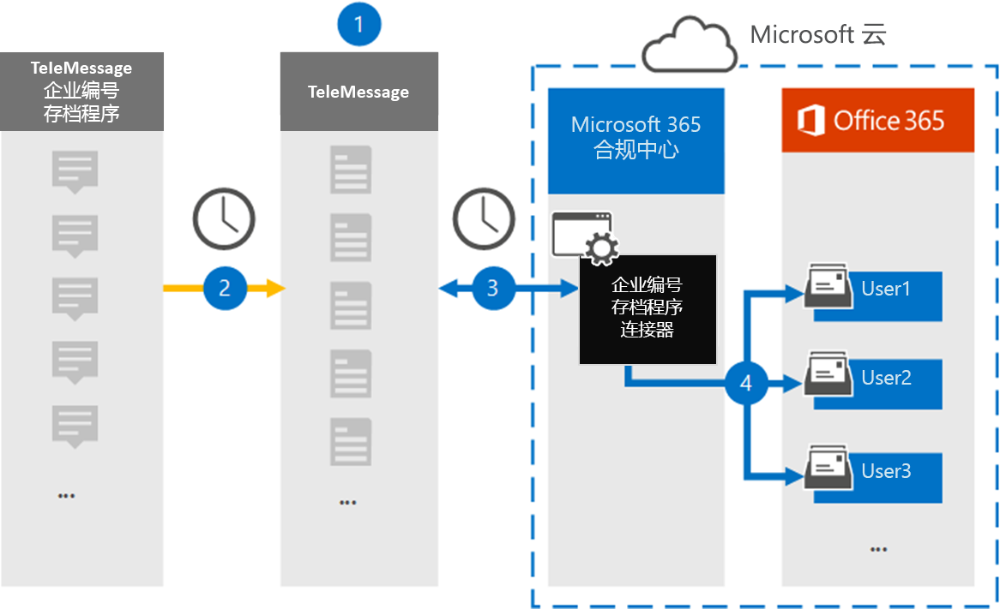

# 设置连接器以存档Enterprise号码数据

使用 Microsoft 365 合规中心 中的 TeleMessage 连接器从 Enterprise 号码存档器导入和存档短信服务 (SMS) 和彩信服务 (MMS) 消息、聊天消息、语音呼叫录像和语音呼叫日志。 设置和配置连接器后，它每天连接到组织的 TeleMessage 帐户一次，并且使用 TeleMessage Enterprise 号码存档器将员工的移动通信数据导入 Microsoft 365 中的邮箱。

在 TeleMessage Enterprise 号码存档连接器数据存储在用户邮箱中之后，您可以将 Microsoft 365 合规性功能（如诉讼保留、内容搜索、In-Place 存档、审核、通信合规性和 Microsoft 365 保留策略）应用于 Enterprise 号码存档器数据。 例如，可以使用内容搜索来搜索 TeleMessage Enterprise 号码存档器短信、彩信和语音呼叫，或者将包含 Enterprise 号码存档器连接器数据的邮箱与 Advanced eDiscovery 案例的保管人关联。 使用Enterprise存档器连接器在邮箱中导入和存档Microsoft 365可帮助组织遵守政府及法规策略。

## 数字数据的Enterprise概述

以下概述介绍使用连接器在 Enterprise 中存档网络数据Microsoft 365。

1. 您的组织与 TeleMessage 合作，以设置Enterprise存档器连接器。 有关更多详细信息，请参阅 [此处](https://www.telemessage.com/office365-activation-for-enterprise-number-archiver/)。

2. 在 Microsoft 365 合规中心 创建的 Enterprise 号码存档连接器每天连接到 TeleMessage 站点，将过去 24 小时内的电子邮件转移到 Microsoft 云中的安全 Azure 存储 区域。

3. 连接器将移动通信项目导入到特定用户的邮箱。 名为"Enterprise存档器"的新文件夹将创建于特定用户的邮箱中，并且项目将导入到该文件夹中。 连接器使用"用户的电子邮件地址" *属性的值进行映射* 。 每个电子邮件都包含此属性，该属性填充了电子邮件每个参与者的电子邮件地址。 除了使用"用户的电子邮件地址"属性的值进行自动用户映射之外，您还可以通过上载 CSV 映射文件来定义自定义映射。 此映射文件应包含用户的移动电话号码和每个用户Microsoft 365相应的邮箱地址。 如果启用自动用户映射并提供自定义映射，连接器将首先查看自定义映射文件，针对每个电子邮件项目。 如果找不到与用户Microsoft 365用户对应的有效用户，连接器将使用电子邮件项目的"用户的电子邮件地址"属性。 如果连接器在自定义映射文件或Microsoft 365项的电子邮件地址属性中找不到有效的邮件用户，该项目将不会导入。 

## 设置连接器之前

存档数字存档Enterprise所需的一些实现步骤位于 Microsoft 365 外部，必须先完成这些步骤，然后才能在合规中心创建连接器。

- 从[TeleMessage](https://www.telemessage.com/mobile-archiver/order-mobile-archiver-for-o365) Enterprise号码存档器服务，并获取组织的有效管理帐户。 在合规中心创建连接器时，需要登录此帐户。

- 在 TeleMessage 帐户中注册Enterprise号码短信/彩信网络存档的所有用户。 注册用户时，请确保使用用于其帐户Microsoft 365电子邮件地址。

- 在员工的移动电话上Enterprise TeleMessage 和 Number Archiver 应用。

- 必须为创建号码存档Enterprise的用户分配邮箱导入导出Exchange Online。 在"数据连接器"页的"数据连接器"**页中添加连接器** Microsoft 365 合规中心。 默认情况下，不会向 Exchange Online 中任何角色组分配此角色。 可以将"邮箱导入导出"角色添加到组织中"组织管理"角色Exchange Online。 也可以创建角色组，分配邮箱导入导出角色，然后将相应的用户添加为成员。 有关详细信息，请参阅"在角色组中管理角色组"一文的"创建角色组"或"修改角色Exchange Online"。

- 此数据连接器可用于美国政府GCC云Microsoft 365环境中。 第三方应用程序和服务可能涉及在 Microsoft 365 基础结构外部的第三方系统上存储、传输和处理组织的客户数据，因此 Microsoft 365 合规性和数据保护承诺未涵盖这些数据。 Microsoft 不表示使用此产品连接到第三方应用程序意味着这些第三方应用程序符合 FEDRAMP。

## 创建Enterprise存档器连接器

完成上一节中所述的先决条件后，可以在Enterprise创建一个号码存档Microsoft 365 合规中心。 连接器使用您提供的信息连接到 TeleMessage 站点，将短信、彩信和语音呼叫消息转移到 Microsoft 365 中的相应用户邮箱框。

1. 转到 ， [https://compliance.microsoft.com](https://compliance.microsoft.com/) 然后单击"数据 **连接器Enterprise** \> **存档器"。**

2. 在 **"Enterprise存档程序** 产品说明"页上，单击"**添加连接器"**

3. 在"**服务条款"页上**，单击"接受 **"。**

4. 在"**登录到 TeleMessage"** 页上的"步骤 3"下，在下列框中输入所需信息，然后单击"下一步 **"。**

   - **用户名：** 你的 TeleMessage 用户名。

   - **密码：** 你的 TeleMessage 密码。

5. 创建连接器后，可以关闭弹出窗口并转到下一页。

6. 在" **用户映射"** 页上，启用自动用户映射。 若要启用自定义映射，请上载包含用户映射信息的 CSV 文件，然后单击"下一步 **"。**

7. 查看设置，然后单击" **完成** "创建连接器。

8. 转到"数据连接器" **页中的"** 连接器"选项卡以查看新连接器的导入过程的进度。

## 已知问题

- 目前，我们不支持导入大于 10 MB 的附件或项目。 稍后将提供对较大项目的支持。