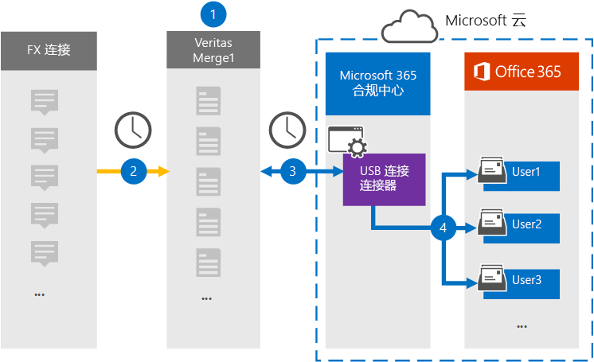

# 设置连接器以将 FX 连接数据存档 (预览) Set up a connector to archive FX Connect data (preview)

使用 Microsoft 365 合规性中心中的 Globanet 连接器将数据从 FX Connect 协作平台导入并存档到 Microsoft 365 组织中的用户邮箱。Use a Globanet connector in the Microsoft 365 compliance center to import and archive data from the FX Connect collaboration platform to user mailboxes in your Microsoft 365 organization. Globanet 提供了一个 [FX 连接](https://globanet.com/fx-connect/) 连接器，该连接器配置为捕获 FX connect 项目并将这些项目导入到 Microsoft 365。Globanet provides an [FX Connect](https://globanet.com/fx-connect/) connector that is configured to capture FX Connect items and import those items to Microsoft 365. 连接器将内容从 FX 连接（如贸易、邮件和其他详细信息）从组织的 FX 连接帐户转换为电子邮件格式，然后将这些项目导入到 Microsoft 365 中的用户邮箱中。The connector converts the content from FX Connect, such as  trades, messages, and other details from your organization's FX Connect account, to an email message format and then imports those items to the user's mailbox in Microsoft 365.

将 FX 连接数据存储在用户邮箱中之后，可以应用 Microsoft 365 合规性功能，如诉讼保留、电子数据展示、保留策略和保留标签，以及通信合规性。After FX Connect data is stored in user mailboxes, you can apply Microsoft 365 compliance features such as Litigation Hold, eDiscovery, retention policies and retention labels, and communication compliance. 使用 FX 连接连接器在 Microsoft 365 中导入和存档数据可帮助您的组织遵守政府和法规策略。Using a FX Connect connector to import and archive data in Microsoft 365 can help your organization stay compliant with government and regulatory policies.

## 存档 FX 连接数据概述Overview of archiving FX Connect data

以下概述说明使用连接器在 Microsoft 365 中存档 FX 连接信息的过程。The following overview explains the process of using a connector to archive the FX Connect information in Microsoft 365.

1. 您的组织使用 FX Connect 来设置和配置 FX Connect 网站。Your organization works with FX Connect to set up and configure an FX Connect site.

2. 每24小时一次，将 FX Connect 帐户中的项目复制到 Globanet Merge1 网站。Once every 24 hours, items from FX Connect accounts are copied to the Globanet Merge1 site. 连接器还将 FX Connect 项目转换为电子邮件格式。The connector also converts the FX Connect items to an email message format.

3. 您在 Microsoft 365 合规中心创建的 FX 连接连接器每天都连接到 Globanet Merge1 网站，并将 FX Connect 项传输到 Microsoft 云中的安全 Azure 存储位置。The FX Connect connector that you create in the Microsoft 365 compliance center, connects to the Globanet Merge1 site every day and transfers the FX Connect items to a secure Azure Storage location in the Microsoft cloud.

4. 连接器使用自动用户映射的 *电子邮件* 属性的值将项目导入到特定用户的邮箱中，如 [步骤 3](#step-3-map-users-and-complete-the-connector-setup)中所述。The connector imports items to the mailboxes of specific users by using the value of the *Email* property of the automatic user mapping as described in [Step 3](#step-3-map-users-and-complete-the-connector-setup). 在用户邮箱中创建名为 **FX Connect** 的 "收件箱" 文件夹中的子文件夹，然后将这些项目导入该文件夹中。A subfolder in the Inbox folder named **FX Connect** is created in the user mailboxes, and the items are imported to that folder. 连接器通过使用 *电子邮件* 属性的值来实现此功能。The connector does this by using the value of the *Email* property. 每个 FX Connect 项都包含此属性，该属性用项目的每个参与者的电子邮件地址填充。Every FX Connect item contains this property, which is populated with the email address of every participant of the item.

## 准备工作Before you begin

- 为 Microsoft 连接器创建 Globanet Merge1 帐户。Create a Globanet Merge1 account for Microsoft connectors.  若要执行此操作，请联系 [Globanet 客户支持](https://globanet.com/ms-connectors-contact)。To do this, contact [Globanet Customer Support](https://globanet.com/ms-connectors-contact). 当您在步骤1中创建连接器时，需要登录到此帐户。You need to sign into this account when you create the connector in Step 1.

- 在步骤1中创建 FX 连接连接器的用户 (并在步骤3中完成) 必须将其分配给 Exchange Online 中的邮箱导入导出角色。The user who creates the FX Connect connector in Step 1 (and completes it in Step 3) must be assigned to the Mailbox Import Export role in Exchange Online. 此角色是在 Microsoft 365 合规性中心中的 " **数据连接器** " 页上添加连接器所必需的。This role is required to add connectors on the **Data connectors** page in the Microsoft 365 compliance center. 默认情况下，此角色不会分配给 Exchange Online 中的任何角色组。By default, this role is not assigned to any role group in Exchange Online. 您可以将邮箱导入导出角色添加到 Exchange Online 中的 "组织管理" 角色组。You can add the Mailbox Import Export role to the Organization Management role group in Exchange Online. 或者，您可以创建角色组，分配邮箱导入导出角色，然后将相应的用户添加为成员。Or you can create a role group, assign the Mailbox Import Export role, and then add the appropriate users as members. 有关详细信息，请参阅文章 "管理 Exchange Online 中的角色组" 中的 " [创建角色组](https://docs.microsoft.com/Exchange/permissions-exo/role-groups#create-role-groups) " 或 " [修改角色组](https://docs.microsoft.com/Exchange/permissions-exo/role-groups#modify-role-groups) " 部分。For more information, see the [Create role groups](https://docs.microsoft.com/Exchange/permissions-exo/role-groups#create-role-groups) or [Modify role groups](https://docs.microsoft.com/Exchange/permissions-exo/role-groups#modify-role-groups) sections in the article "Manage role groups in Exchange Online".

## 步骤1：设置 FX Connect 连接器Step 1: Set up the FX Connect connector

第一步是访问 Microsoft 365 合规性中心中的 " **数据连接器** " 页，并为 FX 连接数据创建连接器。The first step is to access to the **Data Connectors** page in the Microsoft 365 compliance center and create a connector for FX Connect data.

1. 转到 [https://compliance.microsoft.com](https://compliance.microsoft.com/) ，然后单击 "**数据连接器**  >  **FX Connect**"。Go to [https://compliance.microsoft.com](https://compliance.microsoft.com/) and then click **Data connectors** > **FX Connect**.

2. 在 " **FX Connect** 产品说明" 页上，单击 " **添加连接器**"。On the **FX Connect** product description page, click **Add connector**.

3. 在 " **服务条款** " 页上，单击 " **接受**"。On the **Terms of service** page, click **Accept**.

4. 输入标识连接器的唯一名称，然后单击 " **下一步**"。Enter a unique name that identifies the connector, and then click **Next**.

5. 登录到您的 Merge1 帐户以配置连接器。Sign in to your Merge1 account to configure the connector.

## 步骤2：在 Globanet Merge1 网站上配置 FX 连接连接器Step 2: Configure the FX Connect connector on the Globanet Merge1 site

第二步是在 Merge1 网站上配置 FX 连接连接器。The second step is to configure the FX Connect connector on the Merge1 site. 有关如何配置 FX 连接连接器的信息，请参阅 [Merge1 第三方连接器用户指南](https://docs.ms.merge1.globanetportal.com/Merge1%20Third-Party%20Connectors%20FX%20Connect%20User%20Guide%20.pdf)。For information about how to configure the FX Connect connector, see [Merge1 Third-Party Connectors User Guide](https://docs.ms.merge1.globanetportal.com/Merge1%20Third-Party%20Connectors%20FX%20Connect%20User%20Guide%20.pdf).

单击 " **保存" & "完成**" 后，将转回到 Microsoft 365 合规性中心，转到 "连接器向导" 中的 " **用户映射** " 页。After you click **Save & Finish**, you are directed back to the Microsoft 365 compliance center, to the **User mapping** page in the connector wizard.

## 步骤3：映射用户并完成连接器设置Step 3: Map users and complete the connector setup

若要映射用户并完成 Microsoft 365 合规性中心中的连接器设置，请按照以下步骤操作：To map users and complete the connector setup in the Microsoft 365 compliance center, follow these steps:

1. 在 **MAP FX 将用户连接到 Microsoft 365 用户** 页面上，启用自动用户映射。On the **Map FX Connect users to Microsoft 365 users** page, enable automatic user mapping. FX Connect 项包含一个名为 *Email*的属性，其中包含组织中的用户的电子邮件地址。The FX Connect items include a property called *Email*, which contains email addresses for users in your organization. 如果连接器可以将此地址与 Microsoft 365 用户相关联，则会将这些项目导入该用户的邮箱中。If the connector can associate this address with a Microsoft 365 user, the items are imported to that user’s mailbox.

2. 在 " **管理员同意** " 页面上，单击 " **提供同意** " 按钮。On the **Admin Consent** page, click the **Provide Consent** button. 你将被重定向到 Microsoft 网站。You will be redirected to the Microsoft site. 单击 " **接受** " 以提供许可。Click **Accept** to provide the consent.

   您的组织必须同意允许 Office 365 导入服务访问组织中的邮箱数据。Your organization must consent to allow the Office 365 Import service to access mailbox data in your organization. 若要提供管理员同意，必须使用 Microsoft 365 全局管理员的凭据登录，然后接受同意请求。To provide admin consent, you must be signed in with the credentials of a Microsoft 365 global admin, and then accept the consent request. 如果你未以全局管理员身份登录，则可以转到 [此页](https://login.microsoftonline.com/common/oauth2/authorize?client_id=570d0bec-d001-4c4e-985e-3ab17fdc3073&response_type=code&redirect_uri=https://portal.azure.com/&nonce=1234&prompt=admin_consent) ，并使用全局管理员凭据登录以接受请求。If you aren't signed in as a global admin, you can go to [this page](https://login.microsoftonline.com/common/oauth2/authorize?client_id=570d0bec-d001-4c4e-985e-3ab17fdc3073&response_type=code&redirect_uri=https://portal.azure.com/&nonce=1234&prompt=admin_consent) and sign in using global admin credentials to accept the request.

3. 单击 " **下一步**"，查看设置，然后转到 " **数据连接器** " 页，查看新连接器的导入过程的进度。Click **Next**, review your settings, and then go to the **Data connectors** page to see the progress of the import process for the new connector.

## 步骤4：监视 FX Connect 连接器Step 4: Monitor the FX Connect connector

创建 FX 连接连接器后，可以在 Microsoft 365 合规性中心中查看连接器状态。After you create the FX Connect connector, you can view the connector status in the Microsoft 365 compliance center.

1. 转到 <https://compliance.microsoft.com/> 并单击左侧导航中的 " **数据连接器** "。Go to <https://compliance.microsoft.com/> and click **Data connectors** in the left nav.

2. 单击 " **连接器** " 选项卡，然后选择 " **FX 连接** " 连接器以显示弹出页面，其中包含有关连接器的属性和信息。Click the **Connectors** tab and then select the **FX Connect** connector to display the flyout page, which contains the properties and information about the connector.

3. 在 " **连接器状态与源**" 下，单击 " **下载日志** " 链接以打开 " (" 或 "保存") 连接器的状态日志。Under **Connector status with source**, click the **Download log** link to open (or save) the status log for the connector. 此日志包含已导入到 Microsoft 云的数据。This log contains data that has been imported to the Microsoft cloud.

## 已知问题Known issues

- 目前，我们不支持导入大于 10 MB 的附件，但稍后将提供对较大项目的支持。At this time, we don't support importing attachments larger than 10 MB but support for larger items will be available at a later date.
