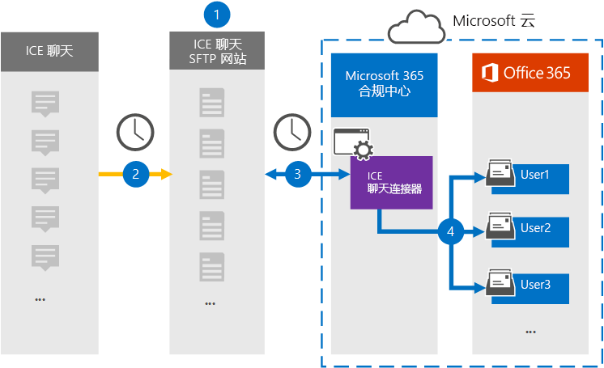

# 设置连接器以存档 ICE Chat 数据

使用会议工具中的本机连接器Microsoft 365 合规中心 ICE 聊天协作工具导入和存档金融服务聊天数据。 设置和配置连接器后，它将每天连接到组织的 ICE Chat 安全 FTP (SFTP) 站点一次，将聊天消息的内容转换为电子邮件格式，然后将这些项目导入 Microsoft 365 中的邮箱。

ICE 聊天数据存储在用户邮箱中后，可以将 Microsoft 365 合规性功能（如诉讼保留、电子数据展示、存档、审核、通信合规性和 Microsoft 365 保留策略）应用到 ICE 聊天数据。 例如，您可以使用内容搜索来搜索 ICE Chat 消息，或将包含 ICE Chat 数据的邮箱与事件案例的保管人Advanced eDiscovery关联。 使用 ICE 聊天连接器导入数据并存档数据Microsoft 365可帮助组织遵守政府及法规策略。

## 存档 ICE 聊天数据概述

以下概述介绍使用连接器在聊天室中存档 ICE 聊天数据Microsoft 365。

1. 你的组织与 ICE 聊天一起设置 ICE 聊天 SFTP 站点。 你还将使用 ICE Chat 配置 ICE Chat 以将聊天消息复制到 ICE Chat SFTP 站点。

2. 每 24 小时一次，ICE 聊天中的聊天消息将复制到 ICE 聊天 SFTP 站点。

3. 在 Microsoft 365 合规中心 创建的 ICE 聊天连接器每天连接到 ICE Chat SFTP 网站，将聊天消息从过去 24 小时转移到 Microsoft 云中的安全 Azure 存储 位置。 连接器还会将聊天聊天者的内容转换为电子邮件格式。

4. 连接器将聊天消息项目导入特定用户的邮箱。 在用户邮箱中创建 **一个名为 ICE Chat** 的新文件夹，聊天消息项目将导入该文件夹。 连接器使用 *SenderEmail* 和 *RecipientEmail 属性的值* 实现。 每个聊天消息都包含这些属性，这些属性填充了聊天消息的发件人和每个收件人/参与者的电子邮件地址。

   除了使用 *SenderEmail* 和 *RecipientEmail* 属性的值的自动用户映射 (这意味着连接器将聊天消息导入到发件人的邮箱和每个收件人) 的邮箱之外，您还可以通过上载 CSV 映射文件来定义自定义用户映射。 此映射文件包含 ICE Chat *ImId* 和Microsoft 365组织中每个用户的相应邮箱地址。 如果启用自动用户映射并提供自定义映射文件，连接器将首先查看自定义映射文件，以查找每个聊天项。 如果找不到与用户的 ICE Chat ImId 对应的有效 Microsoft 365 用户帐户，连接器将使用聊天项目的 *SenderEmail* 和 *RecipientEmail* 属性将项目导入聊天参与者的邮箱。 如果连接器在自定义映射文件或 *SenderEmail* Microsoft 365 *RecipientEmail* 属性中找不到有效的邮件用户，则不导入该项目。

## 设置连接器之前

存档 ICE Chat 数据所需的一些实现步骤位于 Microsoft 365且必须先完成，然后才能在合规性中心创建连接器。

- ICE 聊天会向客户收取外部合规性的费用。 贵组织应联系 ICE Chat 销售组，以讨论和签署 ICE Chat 数据服务协议（可在 上获取 [https://www.theice.com/publicdocs/agreements/ICE\_Data\_Services\_Agreement.pdf](https://www.theice.com/publicdocs/agreements/ICE\_Data\_Services\_Agreement.pdf)）。 本协议在 ICE Chat 和您的组织之间签署，不涉及 Microsoft。 在步骤 2 中设置 ICE 聊天 SFTP 站点后，ICE Chat 直接向您的组织提供 FTP 凭据。 然后你在步骤 3 中设置连接器时会向 Microsoft 提供这些凭据。

- 在步骤 3 中创建连接器之前，必须设置 ICE 聊天 SFTP 站点。 使用 ICE 聊天设置 SFTP 站点后，ICE 聊天中每天的数据将上载到 SFTP 网站。 在步骤 3 创建的连接器连接到此 SFTP 站点，将聊天数据Microsoft 365邮箱。 SFTP 还加密传输过程中发送到邮箱的 ICE 聊天数据。

- 若要设置 ICE 聊天连接器，您必须使用密钥和密钥密码实现良好隐私 (PGP) 以及安全 (SSH) 。 这些密钥用于配置 ICE 聊天 SFTP 站点，连接器使用这些密钥连接到 ICE 聊天 SFTP 站点以将数据导入Microsoft 365。 PGP 密钥用于配置从 ICE 聊天 SFTP 站点传输到数据组的数据Microsoft 365。 SSH 密钥用于配置安全命令行管理程序，以在连接器连接到 ICE Chat SFTP 站点时启用安全远程登录。

  设置连接器时，可以选择使用 Microsoft 提供的公钥和密钥密码，或者可以使用自己的私钥和密码。 建议使用 Microsoft 提供的公钥。 但是，如果你的组织已使用私钥配置 ICE 聊天 SFTP 站点，那么你可以使用相同的私钥创建连接器。

- ICE 聊天连接器在一天中总共可以导入 200，000 个项目。 如果 SFTP 网站上有 200，000 多个项目，则这些项目均不会导入Microsoft 365。

- 必须为在步骤 3 (步骤 1 中创建 ICE 聊天连接器以及下载公钥和 IP 地址的管理员) 分配数据连接器管理员角色。 若要在"数据连接器"页上添加连接器，需要此Microsoft 365 合规中心。 默认情况下，此角色添加到多个角色组。 有关这些角色组的列表，请参阅安全与合规中心内的权限中的"安全与合规& ["部分](../security/office-365-security/permissions-in-the-security-and-compliance-center.md#roles-in-the-security--compliance-center)。 或者，您组织的管理员可以创建自定义角色组，分配数据连接器管理员角色，然后将相应的用户添加为成员。 有关说明，请参阅"权限"部分中的"创建自定义[角色Microsoft 365 合规中心](microsoft-365-compliance-center-permissions.md#create-a-custom-role-group)。

## 使用公钥设置连接器

本节中的步骤将向您展示如何使用 SSH 中"良好隐私" (PGP) 和安全外壳 (公钥设置 ICE 聊天) 。

### 步骤 1：获取 PGP 和 SSH 公钥

第一步是获取 SSH 中"良好隐私" (安全) 安全 (密钥) 。 使用步骤 2 中的这些键配置 ICE Chat SFTP 站点，以允许步骤 3) 创建的连接器 (连接到 SFTP 站点，将 ICE 聊天数据传输给 Microsoft 365 邮箱。 在此步骤中，您还将获得一个 IP 地址，该地址在配置 ICE Chat SFTP 站点时使用。

1. 转到左侧 [https://compliance.microsoft.com](https://compliance.microsoft.com) 导航 **导航中的"数据** 连接器"，然后单击" 数据连接器"。

2. 在" **数据连接器"页上** 的 **"ICE 聊天"下**，单击" **查看"**。

3. 在 **"ICE 聊天"** 页上，单击" **添加连接器"**。

4. 在" **服务条款"页上** ，单击"接受 **"**。

5. 在" **添加内容源的** 凭据"页上，单击 **"我想要使用 Microsoft 提供的 PGP 和 SSH 公钥"**。

   

6. 在步骤 1 下，单击"下载 **SSH** 密钥、 **下载 PGP** 密钥"和" **下载 IP** 地址"链接，将每个文件的副本保存到本地计算机。

   

   这些文件包含用于配置步骤 2 中的 ICE 聊天 SFTP 站点的以下项目：

   - PGP 公钥：此密钥用于配置从 ICE 聊天 SFTP 站点传输到数据Microsoft 365。

   - SSH 公钥：此密钥用于配置安全 SSH，以在连接器连接到 ICE 聊天 SFTP 站点时启用安全远程登录。

   - IP 地址：ICE 聊天 SFTP 站点配置为仅接受来自此 IP 地址的连接请求，该地址由你在步骤 3 创建的 ICE 聊天连接器使用。

7. 单击 **"** 取消"关闭向导。 在步骤 3 中返回到此向导以创建连接器。

### 步骤 2：配置 ICE 聊天 SFTP 站点

下一步是使用在步骤 1 中获得的 PGP 和 SSH 公钥和 IP 地址为 ICE Chat SFTP 网站配置 PGP 加密和 SSH 身份验证。 这样，你在步骤 3 中创建的 ICE 聊天连接器可以连接到 ICE Chat SFTP 站点，将 ICE 聊天数据Microsoft 365。 你需要与 ICE Chat 客户支持一起设置 ICE 聊天 SFTP 站点。

### 步骤 3：创建 ICE 聊天连接器

最后一步是在会议场中创建 ICE 聊天Microsoft 365 合规中心。 连接器使用您提供的信息连接到 ICE Chat SFTP 网站，将聊天消息传输至 MICROSOFT 365 中的相应用户邮箱框。

1. 转到左侧 [https://compliance.microsoft.com](https://compliance.microsoft.com) 导航 **导航中的"数据** 连接器"，然后单击" 数据连接器"。

2. 在" **数据连接器"页上** 的 **"ICE 聊天"下**，单击" **查看"**。

3. 在 **"ICE 聊天"** 页上，单击" **添加连接器"**。

4. 在" **服务条款"页上** ，单击"接受 **"**。

5. 在" **添加内容源的** 凭据"页上，单击 **"我想要使用 PGP 和 SSH 公钥"**。

6. 在"步骤 3"下，在下列框中输入所需信息，然后单击"验证 **连接"**。

   - **公司代码：** 组织的 ID，用作 ICE 聊天 SFTP 网站的用户名。

   - **密码：** ICE 聊天 SFTP 站点的密码。

   - **SFTP URL：** ICE Chat SFTP 网站的 URL (例如， `sftp.theice.com`) 。 您还可以将 IP 地址用于此值。

   - **SFTP 端口：** ICE 聊天 SFTP 站点的端口号。 连接器使用此端口连接到 SFTP 站点。

7. 成功验证连接后，单击"下一 **步"**。

8. 在 **"定义用户** "页上，指定要导入其数据的用户。

     - **组织中所有用户**。 选择此选项可导入所有用户的数据。

     - **仅诉讼保留的用户**。 选择此选项以仅导入其邮箱置于诉讼保留状态的用户的数据。 此选项将数据导入到 LitigationHoldEnabled 属性设置为 True 的用户邮箱。 有关详细信息，请参阅 [创建诉讼保留](create-a-litigation-hold.md)。

9. 在"**将外部用户映射到Microsoft 365"页上**，启用自动用户映射并按需要提供自定义用户映射。 可以在此页面上下载用户映射 CSV 文件的副本。 您可以将用户映射添加到文件，然后上载它。

   > [!NOTE]
   > 如前所述，自定义映射文件 CSV 文件包含 ICE Chat imid 和Microsoft 365每个用户的邮箱地址。 如果启用自动用户映射并提供自定义映射，连接器将首先查看每个聊天项的自定义映射文件。 如果找不到与用户的 ICE Chat imid 对应的有效 Microsoft 365 用户，连接器将为聊天项目的 *SenderEmail* 和 *RecipientEmail* 属性中指定的用户将项目导入邮箱。 如果连接器通过自动或自定义用户映射Microsoft 365有效的用户映射，则不导入该项目。

10. 单击 **"下** 一步"，查看设置，然后单击" **完成** "以创建连接器。

11. 转到" **数据连接器"** 页以查看新连接器的导入过程的进度。

## 使用私钥设置连接器

本部分中的步骤将展示如何使用 PGP 和 SSH 私钥设置 ICE 聊天连接器。 此连接器设置选项适用于已使用私钥配置 ICE 聊天 SFTP 站点的组织。

### 步骤 1：获取 IP 地址以配置 ICE Chat SFTP 站点

如果组织已使用 PGP 和 SSH 私钥设置 ICE Chat SFTP 站点，则您必须获取 IP 地址，并为 ICE Chat 客户支持提供该地址。 ICE 聊天 SFTP 站点必须配置为接受来自此 IP 地址的连接请求。 ICE 聊天连接器使用同一 IP 地址连接到 SFTP 站点，将 ICE 聊天数据传输Microsoft 365。

若要获取 IP 地址：：

1. 转到左侧 <https://compliance.microsoft.com> 导航 **导航中的"数据** 连接器"，然后单击" 数据连接器"。

2. 在" **数据连接器"页上** 的 **"ICE 聊天"下**，单击" **查看"**。

3. 在 **ICE 聊天产品** 说明页上，单击" **添加连接器"**

4. 在" **服务条款"页上** ，单击"接受 **"**。

5. 在" **添加内容源的凭据"页上** ，单击 **"我想要使用 PGP 和 SSH 私钥"**。

   

6. 在步骤 1 下， **单击"下载 IP** 地址"以将 IP 地址文件的副本保存到本地计算机。

   

7. 单击 **"** 取消"关闭向导。 您将在步骤 2 中返回到此向导以创建连接器。

你需要与 ICE Chat 客户支持合作，将 ICE 聊天 SFTP 站点配置为接受来自此 IP 地址的连接请求。

### 步骤 2：创建 ICE 聊天连接器

配置 ICE 聊天 SFTP 站点后，下一步是在 ICE 聊天Microsoft 365 合规中心。 连接器使用您提供的信息连接到 ICE Chat SFTP 站点，将电子邮件传输至 MICROSOFT 365 中的相应用户邮箱框。 若要完成此步骤，请确保具有用于设置 ICE 聊天 SFTP 网站的相同私钥和密钥密码的副本。

1. 转到左侧 <https://compliance.microsoft.com> 导航 **导航中的"数据** 连接器"，然后单击" 数据连接器"。

2. 在" **数据连接器"页上** 的 **"ICE 聊天"下**，单击" **查看"**。

3. 在 **ICE 聊天产品** 说明页上，单击" **添加连接器"**

4. 在" **服务条款"页上** ，单击"接受 **"**。

5. 在" **添加内容源的凭据"页上** ，单击 **"我想要使用 PGP 和 SSH 私钥"**。

6. 在"步骤 3"下，在下列框中输入所需信息，然后单击"验证 **连接"**。

      - **名称：** 连接器的名称。 它必须在组织中是唯一的。

      - **公司代码：** 用作 ICE 聊天 SFTP 网站的用户名的组织 ID。

      - **密码：** 组织的 ICE 聊天 SFTP 站点的密码。

      - **SFTP URL：** ICE Chat SFTP 网站的 URL (例如， `sftp.theice.com`) 。 您还可以将 IP 地址用于此值。

      - **SFTP 端口：** ICE 聊天 SFTP 站点的端口号。 连接器使用此端口连接到 SFTP 站点。

      - **PGP 私钥：** ICE 聊天 SFTP 站点的 PGP 私钥。 请务必包括整个私钥值，包括键块的开头和结尾行。

      - **PGP 键密码：** PGP 私钥的通行短语。

      - **SSH 私钥：** ICE 聊天 SFTP 站点的 SSH 私钥。 请务必包括整个私钥值，包括键块的开头和结尾行。

      - **SSH 密钥密码：** SSH 私钥的通行短语。

7. 成功验证连接后，单击"下一 **步"**。

8. 在 **"定义用户** "页上，指定要导入其数据的用户。

     - **组织中所有用户**。 选择此选项可导入所有用户的数据。

     - **仅诉讼保留的用户**。 选择此选项以仅导入其邮箱置于诉讼保留状态的用户的数据。 此选项将数据导入到 LitigationHoldEnabled 属性设置为 True 的用户邮箱。 有关详细信息，请参阅 [创建诉讼保留](create-a-litigation-hold.md)。

9. 在"**将 ICE 聊天用户映射到Microsoft 365"页上**，启用自动用户映射并按需要提供自定义用户映射。

   > [!NOTE]
   > 如前所述，自定义映射文件 CSV 文件包含 ICE Chat imid 和Microsoft 365每个用户的邮箱地址。 如果启用自动用户映射并提供自定义映射，连接器将首先查看每个聊天项的自定义映射文件。 如果找不到与用户的 ICE Chat imid 对应的有效 Microsoft 365 用户，连接器将为聊天项目的 *SenderEmail* 和 *RecipientEmail* 属性中指定的用户将项目导入邮箱。 如果连接器通过自动或自定义用户映射Microsoft 365有效的用户映射，则不导入该项目。

10. 单击 **"下** 一步"，查看设置，然后单击" **完成** "以创建连接器。

11. 转到" **数据连接器"** 页以查看新连接器的导入过程的进度。 单击连接器可显示包含连接器相关信息的飞出页。
