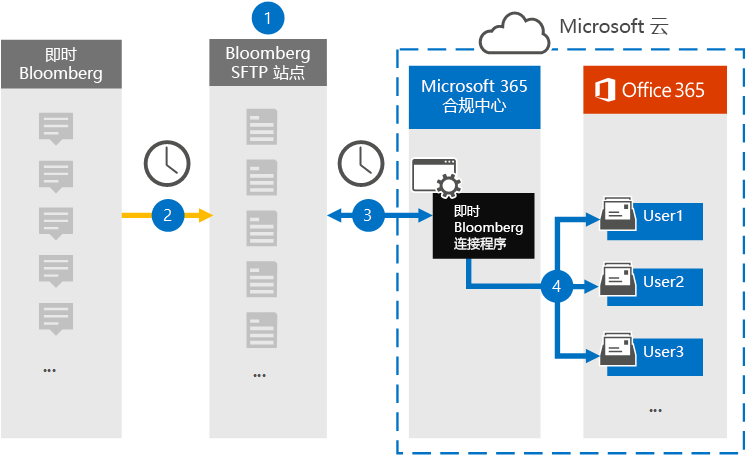

# 设置连接器以存档 Instant Bloomberg 数据Set up a connector to archive Instant Bloomberg data

使用 Microsoft 365 合规性中心的本机连接器从 "[即时 Bloomberg](https://www.bloomberg.com/professional/product/collaboration/)协作" 工具导入和存档金融 services 聊天数据。Use a native connector in the Microsoft 365 compliance center to import and archive financial services chat data from the [Instant Bloomberg](https://www.bloomberg.com/professional/product/collaboration/) collaboration tool. 在设置和配置连接器后，它每天连接到组织的 Bloomberg 安全 FTP 站点（SFTP），将聊天消息的内容转换为电子邮件格式，然后将这些项目导入到 Microsoft 365 中的邮箱中。After you set up and configure a connector, it connects to your organization's Bloomberg secure FTP site (SFTP) once every day, converts the content of chat messages to an email message format, and then imports those items to mailboxes in Microsoft 365.

在将即时 Bloomberg 数据存储在用户邮箱中之后，您可以将 Microsoft 365 合规性功能（如诉讼保留、内容搜索、就地存档、审核、通信合规性和 Microsoft 365 保留策略）应用于即时 Bloomberg 数据。After Instant Bloomberg data is stored in user mailboxes, you can apply Microsoft 365 compliance features such as Litigation Hold, Content Search, In-Place Archiving, Auditing, Communication compliance, and Microsoft 365 retention policies to Instant Bloomberg data. 例如，您可以使用内容搜索来搜索即时 Bloomberg 聊天邮件，或将包含即时 Bloomberg 数据的邮箱与高级电子数据展示事例中的管理员关联起来。For example, you can search Instant Bloomberg chat messages using Content Search or associate the mailbox that contains the Instant Bloomberg data with a custodian in an Advanced eDiscovery case. 使用即时 Bloomberg 连接器在 Microsoft 365 中导入和存档数据可帮助您的组织遵守政府和法规策略。Using an Instant Bloomberg connector to import and archive data in Microsoft 365 can help your organization stay compliant with government and regulatory policies.

## 存档即时 Bloomberg 数据概述Overview of archiving Instant Bloomberg data

以下概述说明了使用连接器在 Microsoft 365 中存档即时 Bloomberg 聊天数据的过程。The following overview explains the process of using a connector to archive Instant Bloomberg chat data in Microsoft 365. 

1. 您的组织与 Bloomberg 配合使用来设置 Bloomberg SFTP 站点。Your organization works with Bloomberg to set up a Bloomberg SFTP site. 您还将使用 Bloomberg 将 "即时 Bloomberg" 配置为将聊天邮件复制到 Bloomberg SFTP 站点。You'll also work with Bloomberg to configure Instant Bloomberg to copy chat messages to your Bloomberg SFTP site.

2. 每24小时一次，来自即时 Bloomberg 的聊天邮件将复制到 Bloomberg SFTP 站点。Once every 24 hours, chat messages from Instant Bloomberg are copied to the Bloomberg SFTP site.

3. 您在 Microsoft 365 合规性中心中创建的即时 Bloomberg 连接器每天连接到 Bloomberg SFTP 站点，并将聊天消息从以前的24小时传输到 Microsoft 云中的安全 Azure 存储区域。The Instant Bloomberg connector that you create in the Microsoft 365 compliance center connects to the Bloomberg SFTP site every day and transfers the chat messages from the previous 24 hours to a secure Azure Storage area in the Microsoft Cloud. 连接器还将聊天 massage 的内容转换为电子邮件格式。The connector also converts the content of a chat massage to an email message format.

4. 连接器将聊天邮件项目导入到特定用户的邮箱中。The connector imports the chat message items to the mailbox of a specific user. 将在特定用户的邮箱中创建一个名为 InstantBloomberg 的新文件夹，然后将这些项目导入该文件夹中。A new folder named InstantBloomberg will be created in the specific user's mailbox and the items will be imported to it. 连接器通过使用*CorporateEmailAddress*属性的值实现此功能。The connector does this by using the value of the *CorporateEmailAddress* property. 每个聊天邮件都包含此属性，该属性由聊天消息的每个参与者的电子邮件地址填充。Every chat message contains this property, which is populated with the email address of every participant of the chat message. 除了使用*CorporateEmailAddress*属性的值进行自动用户映射之外，还可以通过上载 CSV 映射文件来定义自定义映射。In addition to automatic user mapping using the value of the *CorporateEmailAddress* property, you can also define a custom mapping by uploading a CSV mapping file. 此映射文件应包含每个用户的 Bloomberg UUID 和相应的 Microsoft 365 邮箱地址。This mapping file should contain a Bloomberg UUID and the corresponding Microsoft 365 mailbox address for each user. 如果为每个聊天项目启用自动用户映射并提供自定义映射，连接器将首先查看自定义映射文件。If you enable automatic user mapping and provide a custom mapping, for every chat item the connector will first look at custom-mapping file. 如果找不到与用户的 Bloomberg UUID 对应的有效 Microsoft 365 用户，连接器将使用聊天项目的*CorporateEmailAddress*属性。If it doesn't find a valid Microsoft 365 user that corresponds to a user's Bloomberg UUID, the connector will use the *CorporateEmailAddress* property of the chat item. 如果连接器在自定义映射文件或聊天项目的*CorporateEmailAddress*属性中找不到有效的 Microsoft 365 用户，则不会导入该项目。If the connector doesn't find a valid Microsoft 365 user in either the custom-mapping file or the *CorporateEmailAddress* property of the chat item, the item won't be imported.

## 准备工作Before you begin

存档即时 Bloomberg 数据所需的许多实施步骤都是 Microsoft 365 外部的，必须先完成，然后才能在合规性中心中创建连接器。Many of the implementation steps required to archive Instant Bloomberg data are external to Microsoft 365 and must be completed before you can create the connector in the compliance center.

- 您的组织必须同意允许 Office 365 导入服务访问组织中的邮箱数据。Your organization must consent to allow the Office 365 Import service to access mailbox data in your organization. 若要同意此请求，请转到[此页](https://login.microsoftonline.com/common/oauth2/authorize?client_id=570d0bec-d001-4c4e-985e-3ab17fdc3073&response_type=code&redirect_uri=https://portal.azure.com/&nonce=1234&prompt=admin_consent)，使用全局管理员的凭据登录，然后接受该请求。To consent to this request, go to [this page](https://login.microsoftonline.com/common/oauth2/authorize?client_id=570d0bec-d001-4c4e-985e-3ab17fdc3073&response_type=code&redirect_uri=https://portal.azure.com/&nonce=1234&prompt=admin_consent), sign in with the credentials of a global admin, and then accept the request. 您必须完成此步骤，然后才能在步骤3中成功创建即时 Bloomberg 连接器。You have to complete this step before you can successfully create the Instant Bloomberg connector in Step 3.

- 订阅[Bloomberg Anywhere](https://www.bloomberg.com/professional/product/remote-access/?bbgsum-page=DG-WS-PROF-PROD-BBA)。Subscribe to [Bloomberg Anywhere](https://www.bloomberg.com/professional/product/remote-access/?bbgsum-page=DG-WS-PROF-PROD-BBA). 这是必需的，以便您可以登录到 Bloomberg Anywhere 以访问您必须设置和配置的 Bloomberg SFTP 站点。This is required so that you can log in to Bloomberg Anywhere to access the Bloomberg SFTP site that you have to set up and configure.

- 设置 Bloomberg SFTP （安全文件传输协议）站点。Set up a Bloomberg SFTP (Secure file transfer protocol) site. 使用 Bloomberg 设置 SFTP 站点后，即时 Bloomberg 中的数据每天都将上传到 SFTP 站点。After working with Bloomberg to set up the SFTP site, data from Instant Bloomberg is uploaded to the SFTP site every day. 您在步骤2中创建的连接器将连接到此 SFTP 站点，并将聊天数据传输到 Microsoft 365 邮箱。The connector you create in Step 2 connects to this SFTP site and transfers the chat data to Microsoft 365 mailboxes. SFTP 还对在传输过程中发送给邮箱的即时 Bloomberg 聊天数据进行加密。SFTP also encrypts the Instant Bloomberg chat data that is sent to mailboxes during the transfer process.

  有关 Bloomberg SFTP （也称为*BB-SFTP*）的信息，请执行以下操作：For information about Bloomberg SFTP (also called *BB-SFTP*):

  - 请参阅[Bloomberg 支持](https://www.bloomberg.com/professional/support/documentation/)中的 "SFTP 连接标准" 文档。See the "SFTP Connectivity Standards" document at [Bloomberg Support](https://www.bloomberg.com/professional/support/documentation/).

  - 请联系[Bloomberg 客户支持](https://service.bloomberg.com/portal/sessions/new?utm_source=bloomberg-menu&utm_medium=csc)部门。Contact [Bloomberg customer support](https://service.bloomberg.com/portal/sessions/new?utm_source=bloomberg-menu&utm_medium=csc).

  在使用 Bloomberg 设置 SFTP 站点之后，在您响应 Bloomberg 实施电子邮件之后，Bloomberg 将为您提供一些信息。After you work with Bloomberg to set up an SFTP site, Bloomberg will provide some information to you after you respond to the Bloomberg implementation email message. 保存以下信息的副本。Save a copy of the following information. 您可以使用它来设置步骤3中的连接器。You use it to set up a connector in Step 3.

  - 固定代码，它是组织的 ID，用于登录到 Bloomberg SFTP 站点。Firm code, which is an ID for your organization and is used to log in to the Bloomberg SFTP site.

  - Bloomberg SFTP 站点的密码Password for your Bloomberg SFTP site

  - Bloomberg SFTP 网站的 URL （例如，sftp.bloomberg.com）URL for Bloomberg SFTP site (for example, sftp.bloomberg.com)

  - Bloomberg SFTP 站点的端口号Port number for Bloomberg SFTP site

- 在第3步（以及在第1步中下载公钥和 IP 地址的用户）中创建即时 Bloomberg 连接器的用户必须在 Exchange Online 中分配邮箱导入导出角色。The user who creates an Instant Bloomberg connector in Step 3 (and who downloads the public keys and IP address in Step 1) must be assigned the Mailbox Import Export role in Exchange Online. 这是在 Microsoft 365 合规性中心的 "**数据连接器**" 页中添加连接器所必需的。This is required to add connectors in the **Data connectors** page in the Microsoft 365 compliance center. 默认情况下，不会向 Exchange Online 中任何角色组分配此角色。By default, this role isn't assigned to any role group in Exchange Online. 您可以将邮箱导入导出角色添加到 Exchange Online 中的 "组织管理" 角色组。You can add the Mailbox Import Export role to the Organization Management role group in Exchange Online. 或者，您可以创建角色组，分配邮箱导入导出角色，然后将相应的用户添加为成员。Or you can create a role group, assign the Mailbox Import Export role, and then add the appropriate users as members. 有关详细信息，请参阅文章 "管理 Exchange Online 中的角色组" 中的 "[创建角色组](https://docs.microsoft.com/Exchange/permissions-exo/role-groups#create-role-groups)" 或 "[修改角色组](https://docs.microsoft.com/Exchange/permissions-exo/role-groups#modify-role-groups)" 部分。For more information, see the [Create role groups](https://docs.microsoft.com/Exchange/permissions-exo/role-groups#create-role-groups) or [Modify role groups](https://docs.microsoft.com/Exchange/permissions-exo/role-groups#modify-role-groups) sections in the article "Manage role groups in Exchange Online".

## 步骤1：获取 SSH 和 PGP 公钥Step 1: Obtain SSH and PGP public keys

第一步是获取用于安全命令行管理程序（SSH）和相当出色的隐私（PGP）的公钥副本。The first step is to obtain a copy of the public keys for Secure Shell (SSH) and Pretty Good Privacy (PGP). 您可以在步骤2中使用这些键来配置 Bloomberg SFTP 站点，以允许连接器（在步骤3中创建）连接到 SFTP 站点，并将 "即时 Bloomberg" 聊天数据传输到 Microsoft 365 邮箱。You use these keys in Step 2 to configure the Bloomberg SFTP site to allow the connector (that you create in Step 3) to connect to the SFTP site and transfer the Instant Bloomberg chat data to Microsoft 365 mailboxes. 您还可以在此步骤中获取 IP 地址，在配置 Bloomberg SFTP 站点时使用此地址。You also obtain an IP address in this step, which you use when configuring the Bloomberg SFTP site.

1. 转到 <https://compliance.microsoft.com> ，然后单击 "**数据连接器**  >  **即时 Bloomberg**"。Go to <https://compliance.microsoft.com> and then click **Data connectors** > **Instant Bloomberg**.

2. 在 "**即时 Bloomberg**产品说明" 页上，单击 "**添加连接器**"On the **Instant Bloomberg** product description page, click **Add connector**

3. 在 "**服务条款**" 页上，单击 "**接受**"。On the **Terms of service** page, click **Accept**.

4. 在步骤1下的**BLOOMBERG SFTP 网站的 "添加凭据**" 中，单击 "**下载 SSH 密钥**"、"**下载 PGP 密钥**" 和 "**下载 IP 地址**" 链接以将每个文件的副本保存到本地计算机。On the **Add credentials for Bloomberg SFTP site** under step 1, click the **Download SSH key**, **Download PGP key**, and **Download IP address** links to save a copy of each file to your local computer. 这些文件包含以下用于在步骤2中配置 Bloomberg SFTP 网站的项：These files contain the following items that are used to configure the Bloomberg SFTP site in Step 2:

   - SSH 公钥：此密钥用于配置安全命令行管理程序（SSH），以便在连接器连接到 Bloomberg SFTP 站点时启用安全的远程登录。SSH public key: This key is used to configure Secure Shell (SSH) to enable a secure remote login when the connector connects to the Bloomberg SFTP site.

   - PGP 公钥：此密钥用于配置从 Bloomberg SFTP 站点传输到 Microsoft 365 的数据的加密。PGP public key: This key is used to configure the encryption of data that's transferred from the Bloomberg SFTP site to Microsoft 365.

   - IP 地址： Bloomberg SFTP 站点配置为仅接受来自此 IP 地址的连接请求，该请求由您在步骤3中创建的 "即时 Bloomberg" 连接器使用。IP address: The Bloomberg SFTP site is configured to accept a connection request only from this IP address, which is used by the Instant Bloomberg connector that you create in Step 3. 

5. 单击 "**取消**" 关闭该向导。Click **Cancel** to close the wizard. 您将在步骤3中返回到此向导来创建连接器。You come back to this wizard in Step 3 to create the connector.

## 步骤2：配置 Bloomberg SFTP 站点Step 2: Configure the Bloomberg SFTP site

下一步是使用 SSH 和 PGP 公钥以及您在步骤1中获取的 IP 地址，以配置 Bloomberg SFTP 站点的 SSH 身份验证和 PGP 加密。The next step is to use the SSH and PGP public keys and the IP address that you obtained in Step 1 to configure SSH authentication and PGP encryption for the Bloomberg SFTP site. 这将允许您在步骤3中创建的即时 Bloomberg 连接器连接到 Bloomberg SFTP 站点并将即时 Bloomberg 数据传输到 Microsoft 365。This lets the Instant Bloomberg connector that you create in Step 3 connect to the Bloomberg SFTP site and transfer Instant Bloomberg data to Microsoft 365. 您需要与 Bloomberg 客户支持部门合作，以设置 Bloomberg SFTP 站点。You need to work with Bloomberg customer support to set up your Bloomberg SFTP site. 请联系[Bloomberg 客户支持](https://service.bloomberg.com/portal/sessions/new?utm_source=bloomberg-menu&utm_medium=csc)以获取帮助。Contact [Bloomberg customer support](https://service.bloomberg.com/portal/sessions/new?utm_source=bloomberg-menu&utm_medium=csc) for assistance. 

> [!IMPORTANT]
> Bloomberg 建议您将您在步骤1中下载的三个文件附加到电子邮件中，并将其发送给其客户支持团队，同时使用它们设置 Bloomberg SFTP 站点。Bloomberg recommends that you attach the three files that you downloaded in Step 1 to an email message and send it to their customer support team when working with them to set up your Bloomberg SFTP site.

## 步骤3：创建即时 Bloomberg 连接器Step 3: Create an Instant Bloomberg connector

最后一步是在 Microsoft 365 合规性中心中创建一个即时 Bloomberg 连接器。The last step is to create an Instant Bloomberg connector in the Microsoft 365 compliance center. 连接器使用您提供的信息连接到 Bloomberg SFTP 站点，并将聊天邮件传输到 Microsoft 365 中对应的用户邮箱框中。The connector uses the information you provide to connect to the Bloomberg SFTP site and transfer chat messages to the corresponding user mailbox boxes in Microsoft 365.

1. 转到 <https://compliance.microsoft.com> ，然后单击 "**数据连接器**  >  **即时 Bloomberg**"。Go to <https://compliance.microsoft.com> and then click **Data connectors** > **Instant Bloomberg**.

2. 在 "**即时 Bloomberg**产品说明" 页上，单击 "**添加连接器**"On the **Instant Bloomberg** product description page, click **Add connector**

3. 在 "**服务条款**" 页上，单击 "**接受**"。On the **Terms of service** page, click **Accept**.

4. 在 "**添加 BLOOMBERG SFTP 网站的凭据**" 页上的 "步骤 3" 中的以下框中，输入所需信息，然后单击 "**下一步**"。On the **Add credentials for Bloomberg SFTP site** page, under Step 3, enter the required information in the following boxes and then click **Next**.

    - **确认代码：** 您的组织的 ID，用作 Bloomberg SFTP 站点的用户名。**Firm code:** The ID for your organization that is used as the username for the Bloomberg SFTP site.

    - **密码：** Bloomberg SFTP 网站的密码。**Password:** Password for Bloomberg SFTP site.

    - **SFTP URL：** Bloomberg SFTP 网站的 URL （例如，sftp.bloomberg.com）。**SFTP URL:** The URL for Bloomberg SFTP site (for example, sftp.bloomberg.com).

    - **SFTP 端口：** Bloomberg SFTP 站点的端口号。**SFTP port:** The port number for Bloomberg SFTP site. 连接器使用此端口连接到 SFTP 站点。The connector uses this port to connect to the SFTP site.

5. 在 "**用户映射**" 页上，启用自动用户映射并根据需要提供自定义用户映射On the **User-mapping** page, enable automatic user mapping and provide custom user mapping as required

   > [!NOTE]
   > 连接器将聊天邮件项目导入到特定用户的邮箱中。The connector imports the chat message items to the mailbox of a specific user. 将在特定用户的邮箱中创建一个名为**InstantBloomberg**的新文件夹，然后将这些项目导入该文件夹中。A new folder named **InstantBloomberg** will be created in the specific user's mailbox and the items will be imported to it. 连接器通过使用*CorporateEmailAddress*属性的值来执行。The connector does by using the value of the *CorporateEmailAddress* property. 每个聊天邮件都包含此属性，并使用聊天消息的每个参与者的电子邮件地址填充该属性。Every chat message contains this property, and the property is populated with the email address of every participant of the chat message. 除了使用*CorporateEmailAddress*属性的值进行自动用户映射之外，还可以通过上载 CSV 映射文件来定义自定义映射。In addition to automatic user mapping using the value of the *CorporateEmailAddress* property, you can also define custom mapping by uploading a CSV mapping file. 映射文件应包含每个用户的 Bloomberg UUID 和相应的 Microsoft 365 邮箱地址。The mapping file should contain the Bloomberg UUID and corresponding Microsoft 365 mailbox address for each user. 如果为每个聊天项目启用自动用户映射并提供自定义映射映射，则连接器将首先查看自定义映射文件。If you enable automatic user mapping and provide a custom mapping mapping, for every chat item the connector will first look at custom mapping file. 如果找不到与用户的 Bloomberg UUID 对应的有效 Microsoft 365 用户，连接器将使用聊天项目的*CorporateEmailAddress*属性。If it doesn't find a valid Microsoft 365 user that corresponds to a user's Bloomberg UUID, the connector will use the *CorporateEmailAddress* property of the chat item. 如果连接器在自定义映射文件或聊天项目的*CorporateEmailAddress*属性中找不到有效的 Microsoft 365 用户，则不会导入该项目。If the connector doesn't find a valid Microsoft 365 user in either the custom mapping file or the *CorporateEmailAddress* property of the chat item, the item won't be imported.

6. 单击 "**下一步**"，查看设置，然后单击 "**准备**" 以创建连接器。Click **Next**, review your settings, and then click **prepare** to create the connector.

7. 转到 "**数据连接器**" 页，查看新连接器的导入过程的进度。Go to the **Data connectors** page to see the progress of the import process for the new connector.
