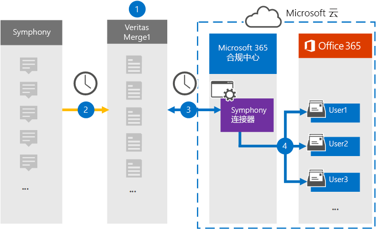

# 设置连接器以存档云数据

使用 Microsoft 365 合规中心 中的"Microsoft 365 合规中心"连接器，将"百年"数据导入并存档到组织Microsoft 365邮箱。 百年是金融服务行业使用的消息和协作平台。 在 Microsoft 365 合规中心 中，[为](https://globanet.com/symphony)第三方数据源 (中定期捕获项目) 然后将这些项目导入到用户邮箱进行配置。 连接器将项目的内容从"百年计划"帐户转换为电子邮件格式，然后将该项目导入 Microsoft 365。

在将百年通信存储在用户邮箱中后，你可以应用 Microsoft 365 合规性功能，如诉讼保留、电子数据展示、保留策略和保留标签以及通信合规性。 使用一个百年连接器在企业邮箱中导入和Microsoft 365可帮助你的组织遵守政府法规策略。

## 存档百年数据概述

以下概述介绍使用数据连接器在云中存档 Microsoft 365。

1. 你的组织与用户一起设置和配置一个"百年"网站。

2. 每 24 小时发送一次，来自 Everyy 的聊天消息将复制到"改进"合并 1 网站。 连接器还会将聊天消息的内容转换为电子邮件格式。

3. 在 Microsoft 云中创建的 Microsoft 365 合规中心 连接器每天连接到一个 Microsoft 365 合规中心 Merge1 网站，将邮件传输至 Microsoft 云中的安全 Azure 存储 位置。

4. 连接器使用自动用户映射的 *Email* 属性值将转换后的邮件项目导入特定用户的邮箱，如步骤 3 中所述。 在用户邮箱中创建名为 **"Inboxy** "的"收件箱"文件夹中的新子文件夹，邮件项目将导入该文件夹。 连接器使用 Email 属性的值确定将项目导入到哪个 *邮箱* 。 每个聊天消息都包含此属性，其中填充了每个参与者的电子邮件地址。

## 准备工作

- 为 Microsoft 连接器创建一个 Microsoft Merge1 帐户。 若要创建帐户，请联系 ["用户支持人员"](https://globanet.com/ms-connectors-contact)。 在步骤 1 中创建连接器时，将登录到此帐户。

- 必须为在步骤 1 中创建" (连接器"并将其在步骤 3) 中完成的用户分配"数据连接器管理员"角色。 若要在"数据连接器"页上添加连接器，需要此Microsoft 365 合规中心。 默认情况下，此角色添加到多个角色组。 有关这些角色组的列表，请参阅安全与合规中心内的权限中的"安全与合规& ["部分](../security/office-365-security/permissions-in-the-security-and-compliance-center.md#roles-in-the-security--compliance-center)。 或者，您组织的管理员可以创建自定义角色组，分配数据连接器管理员角色，然后将相应的用户添加为成员。 有关说明，请参阅"权限"部分中的"创建自定义[角色Microsoft 365 合规中心](microsoft-365-compliance-center-permissions.md#create-a-custom-role-group)。

- 此位于美国政府云中的 GCC 环境Microsoft 365预览版。 第三方应用程序和服务可能涉及在 Microsoft 365 基础结构外部的第三方系统上存储、传输和处理组织的客户数据，因此未涵盖在 Microsoft 365 合规性和数据保护承诺中。 Microsoft 不表示使用此产品连接到第三方应用程序意味着这些第三方应用程序符合 FEDRAMP。

## 步骤 1：设置安装连接器

第一步是访问数据连接器页面中的数据Microsoft 365 合规中心创建一个连接器用于"安装"数据。

1. 转到 ， [https://compliance.microsoft.com](https://compliance.microsoft.com/) 然后单击数据 **连接器** > **Symphony**。

2. 在 **"百年** 产品说明"页上，单击" **添加连接器"**。

3. 在" **服务条款"页上** ，单击"接受 **"**。

4. 输入标识连接器的唯一名称，然后单击"下一步 **"**。

5. 登录到 Merge1 帐户以配置连接器。

## 在"部署合并 1"网站上配置"百年"连接器

第二步是在 Merge1 网站上配置部署连接器。 有关在"显示合并 1"网站上配置"安装连接器"的信息，请参阅 [Merge1 第三方连接器用户指南](https://docs.ms.merge1.globanetportal.com/Merge1%20Third-Party%20Connectors%20Symphony%20User%20Guide%20.pdf)。

单击"保存 **&完成**"后，将显示连接器向导中的"用户Microsoft 365 合规中心页。

## 步骤 3：映射用户并完成连接器设置

若要映射用户并完成连接器Microsoft 365 合规中心，请按照以下步骤操作：

1. 在"**将外部用户映射到 Microsoft 365"页上**，启用自动用户映射。 "百年"项目包括一个称为 *"电子邮件*"的属性，其中包含组织中用户的电子邮件地址。 如果连接器可以将此地址与Microsoft 365关联，则项目将导入该用户的邮箱。

2. 单击 **"** 下一步"，查看设置，然后转到"数据连接器"页以查看新连接器的导入过程的进度。

## 步骤 4：监视安装连接器

创建"百年"连接器后，可以在"目录"中查看Microsoft 365 合规中心。

1. 转到左侧 [https://compliance.microsoft.com](https://compliance.microsoft.com) 导航 **导航中的"数据** 连接器"，然后单击" 数据连接器"。

2. 单击" **连接器"** 选项卡，然后选择 **"百** 年"连接器以显示飞出页面。 此页面包含有关连接器的属性和信息。

3. 在 **"源的** 连接器状态"下， **单击"下载** 日志"链接 (或) 连接器的状态日志。 此日志包含有关已导入到 Microsoft 云的数据的信息。

## 已知问题

- 目前，我们不支持导入大于 10 MB 的附件或项目。 稍后将提供对较大项目的支持。