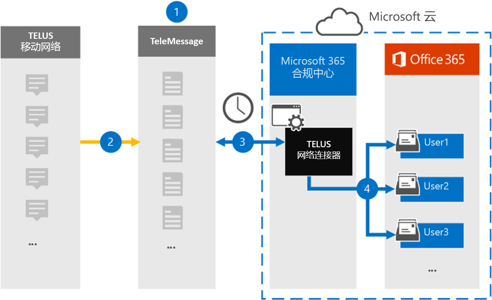

# 设置连接器以存档 TELUS 网络数据

使用 Microsoft 365 合规中心中的 TeleMessage 连接器从组织的 TELUS 网络导入和存档短信服务 (SMS) 数据。 设置和配置连接器后，它将每天连接到您组织的 TELUS 网络一次，将 SMS 数据导入到 Microsoft 365 中的邮箱。

在用户邮箱中存储短信后，可以将 Microsoft 365 合规性功能（如诉讼保留、内容搜索和 Microsoft 365 保留策略）应用于 TELUS 数据。 例如，您可以使用内容搜索搜索 TELUS 短信，或将包含 TELUS 数据的邮箱与高级电子数据展示案例中的保管人关联。 使用 TELUS 网络连接器在 Microsoft 365 中导入和存档数据可帮助组织遵守政府法规策略。

## 存档 TELUS 网络数据概述

以下概述介绍了使用连接器在 Microsoft 365 中存档 TELUS 网络数据的过程。

1. 您的组织与 TeleMessage 和 TELUS 合作，以设置 TELUS 网络连接器。 有关详细信息，请参阅 [TELUS 网络存档程序](https://www.telemessage.com/office365-activation-for-telus-network-archiver/)。

2. 每 24 小时一次，您组织的 TELUS 网络发送的短信会复制到 TeleMessage 站点。

3. 在 Microsoft 365 合规中心创建的 TELUS 网络连接器每天连接到 TeleMessage 站点，将过去 24 小时内的短信转移到 Microsoft 云中安全的 Azure 存储位置。 连接器还会将短信内容转换为电子邮件格式。

4. 连接器将移动通信项目导入到特定用户的邮箱。 将创建一个名为 **TELUS SMS Network Archiver** 的新文件夹，该文件夹将导入到特定用户的邮箱中。 连接器使用用户的电子邮件地址属性的值 *进行映射* 。 每个短信都包含此属性，此属性用短信每个参与者的电子邮件地址填充。

   除了使用用户的电子邮件地址属性的值进行自动用户映射之外，您还可以通过上载 CSV 映射文件来实现自定义映射。 此映射文件包含组织中用户的移动电话号码和相应的 Microsoft 365 电子邮件地址。 如果同时启用自动用户映射和自定义映射，连接器将首先针对每个 TELUS 项查看自定义映射文件。 如果找不到与用户移动电话号码对应的有效 Microsoft 365 用户，连接器将使用其尝试导入的项目的电子邮件地址属性中的值。 如果连接器在自定义映射文件或 TELUS 项目的电子邮件地址属性中找不到有效的 Microsoft 365 用户，将不会导入该项目。

## 开始之前

存档 TELUS 网络数据所需的一些实施步骤在 Microsoft 365 外部，必须先完成，然后才能在合规中心创建连接器。

- 从 [TeleMessage](https://www.telemessage.com/mobile-archiver/order-mobile-archiver-for-o365) 订购 TELUS 网络存档程序服务，并获取组织的有效管理帐户。 在合规中心创建连接器时，需要登录此帐户。

- 获取 TELUS 网络帐户和帐单联系人详细信息，以便填写 TeleMessage 载入表单，然后从 TELUS 订购邮件存档服务。

- 在 TeleMessage 帐户中注册需要 TELUS SMS 网络存档的所有用户。 注册用户时，请务必使用用于其 Microsoft 365 帐户的相同电子邮件地址。

- 你的员工必须在TELUS 移动网络上拥有公司拥有和负责企业的移动电话。 Microsoft 365 中的存档邮件不适用于员工拥有或自带设备 (BYOD) 设备。

- 必须在 Exchange Online 中为创建 TELUS 网络连接器的用户分配邮箱导入导出角色。 这是在 Microsoft 365合规中心的"数据连接器"页中添加连接器所必需。 默认情况下，不会向 Exchange Online 中任何角色组分配此角色。 可以将邮箱导入导出角色添加到 Exchange Online 中的组织管理角色组。 也可以创建一个角色组，分配邮箱导入导出角色，然后将相应的用户添加为成员。 有关详细信息，请参阅"在Exchange Online中管理角色组"一文的"创建角色组或修改角色组"部分。

## 创建 TELUS 网络连接器

完成上一部分中所述的先决条件后，可以在 Microsoft 365 合规中心创建 TELUS 网络连接器。 连接器使用你提供的信息连接到 TeleMessage 网站，将短信转移到 Microsoft 365 中的相应用户邮箱。

1. 转到 [https://compliance.microsoft.com](https://compliance.microsoft.com/) ，然后单击 **"数据连接器**  >  **TELUS 网络"。**

2. 在 **TELUS 网络** 产品说明页上，单击 **"添加连接器"**

3. 在"**服务条款"页上**，单击"**接受"。**

4. 在"**登录到 TeleMessage"** 页上的"步骤 3"下，在下列框中输入所需信息，然后单击"下一 **步"。**

   - **用户名：** TeleMessage 用户名。

   - **密码：** TeleMessage 密码。

5. 创建连接器后，可以关闭弹出窗口并转到下一页。

6. 在"**用户映射"** 页上，启用自动用户映射并单击"下一 **步"。** 如果你需要自定义映射上传 CSV 文件，然后单击"下一 **步"。**

7. 查看设置，然后单击" **完成** "创建连接器。

8. 转到"数据连接器 **"页中的** "连接器"选项卡以查看新连接器的导入过程的进度。

## 已知问题

- 目前，我们不支持导入大于 10 MB 的附件或项目。 稍后将提供对较大项目的支持。
