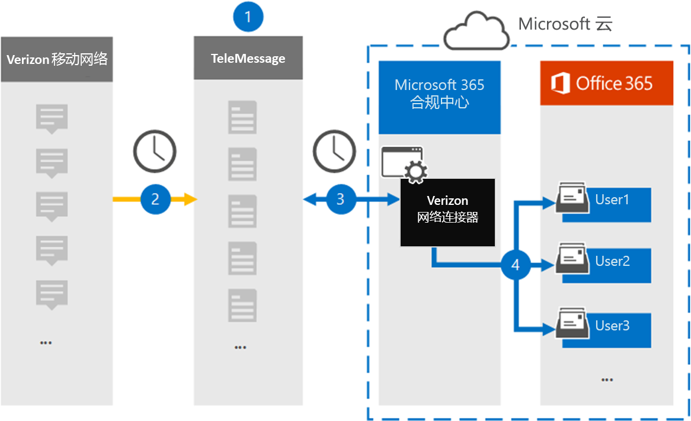

# 设置连接器以存档 Verizon 网络数据Set up a connector to archive Verizon Network data

使用 Microsoft 365 合规中心中的 TeleMessage 连接器从 Verizon 网络导入和存档短信服务 (SMS) 和彩信服务 (MMS) 数据。Use the TeleMessage connector in the Microsoft 365 compliance center to import and archive Short Messaging Service (SMS) and Multimedia Messaging Service (MMS) data from Verizon Network. 设置和配置连接器后，它每天连接到组织的 Verizon 网络一次，将短信和彩信数据导入到 Microsoft 365 中的邮箱。After you set up and configure a connector, it connects to your organization's Verizon Network once every day and imports SMS and MMS data to mailboxes in Microsoft 365.

将 Verizon 网络连接器数据存储在用户邮箱中后，可以将 Microsoft 365 合规性功能（如诉讼保留、内容搜索和 Microsoft 365 保留策略）应用于 Verizon 数据。After Verizon Network connector data is stored in user mailboxes, you can apply Microsoft 365 compliance features such as Litigation Hold, Content Search, and Microsoft 365 retention policies to Verizon data. 例如，您可以使用内容搜索搜索 Verizon SMS 和 MMS 消息，或将包含 Verizon 网络数据的邮箱与高级电子数据展示案例中的保管人关联。For example, you can search Verizon SMS and MMS messages using Content Search or associate the mailbox that contains Verizon Network data with a custodian in an Advanced eDiscovery case. 使用 Verizon 网络连接器在 Microsoft 365 中导入和存档数据可帮助组织遵守政府法规策略。Using a Verizon Network connector to import and archive data in Microsoft 365 can help your organization stay compliant with government and regulatory policies.

## 存档 Verizon 网络数据概述Overview of archiving Verizon Network data

以下概述介绍了使用连接器在 Microsoft 365 中存档 Verizon 网络数据的过程。The following overview explains the process of using a connector to archive Verizon Network data in Microsoft 365.

1. 您的组织与 TeleMessage 和 Verizon 合作，以设置 Verizon 网络连接器。Your organization works with TeleMessage and Verizon to set up a Verizon Network connector. 有关详细信息，请参阅[Verizon Network Archiver。](https://www.telemessage.com/office365-activation-for-verizon-network-archiver/)For more information, see [Verizon Network Archiver](https://www.telemessage.com/office365-activation-for-verizon-network-archiver/).

2. 每 24 小时一次，来自组织的 Verizon 网络的短信和彩信将复制到 TeleMessage 站点。Once every 24 hours, SMS and MMS messages from your organization’s Verizon Network are copied to the TeleMessage site.

3. 在 Microsoft 365 合规中心创建的 Verizon 网络连接器每天连接到 TeleMessage 站点，将过去 24 小时内的短信和彩信转移到 Microsoft 云中安全的 Azure 存储位置。The Verizon Network connector that you create in the Microsoft 365 compliance center connects to the TeleMessage site every day and transfers the SMS and MMS messages from the previous 24 hours to a secure Azure Storage location in the Microsoft Cloud. 连接器还会将短信和彩信的内容转换为电子邮件格式。The connector also converts the content of SMS and MMS messages to an email message format.

4. 连接器将移动通信项目导入到特定用户的邮箱。The connector imports the mobile communication items to the mailbox of a specific user. 在特定用户的邮箱中创建名为 **Verizon SMS/MMS 网络** 存档程序的新文件夹，项目将导入到该文件夹中。A new folder named **Verizon SMS/MMS Network Archiver** is created in the specific user's mailbox and the items are imported to it. 连接器使用用户的电子邮件地址属性的值执行 *此映射* 。The connector does this mapping by using the value of the *User’s Email address* property. 每个短信和彩信都包含此属性，此属性填充了邮件每个参与者的电子邮件地址。Every SMS and MMS message contains this property, which is populated with the email address of every participant of the message.

   除了使用用户的电子邮件地址属性的值进行自动用户映射之外，您还可以通过上载 CSV 映射文件来实现自定义映射。In addition to automatic user mapping using the value of the *User’s Email address* property, you can also implement custom mapping by uploading a CSV mapping file. 此映射文件包含组织中用户的移动电话号码和相应的 Microsoft 365 电子邮件地址。This mapping file contains the mobile phone number and corresponding Microsoft 365 email address for users in your organization. 如果同时启用自动用户映射和自定义映射，连接器将首先查看自定义映射文件，针对每个 Verizon 项。If you enable both automatic user mapping and custom mapping, for every Verizon item the connector first looks at custom mapping file. 如果找不到与用户移动电话号码对应的有效 Microsoft 365 用户，连接器将使用其尝试导入的项目的电子邮件地址属性中的值。If it doesn't find a valid Microsoft 365 user that corresponds to a user's mobile phone number, the connector will use the values in the email address property of the item it's trying to import. 如果连接器在自定义映射文件或 Verizon 项目的电子邮件地址属性中找不到有效的 Microsoft 365 用户，将不会导入该项目。If the connector doesn't find a valid Microsoft 365 user in either the custom mapping file or in the email address property of the Verizon item, the item won't be imported.

## 开始之前Before you begin

存档 Verizon 网络数据所需的一些实施步骤在 Microsoft 365 外部，必须先完成，然后才能在合规中心创建连接器。Some of the implementation steps required to archive Verizon Network data are external to Microsoft 365 and must be completed before you can create a connector in the compliance center.

- 从 [TeleMessage 订购 Verizon 网络](https://www.telemessage.com/mobile-archiver/order-mobile-archiver-for-o365) 存档器服务，并获取组织的有效管理帐户。Order the [Verizon Network Archiver service from TeleMessage](https://www.telemessage.com/mobile-archiver/order-mobile-archiver-for-o365) and get a valid administration account for your organization. 在合规中心创建连接器时，需要登录此帐户。You'll need to sign into this account when you create the connector in the compliance center.

- 获取 Verizon 网络帐户和帐单联系人详细信息，以便可以填写 TeleMessage 载入表单，然后从 Verizon 订购邮件存档服务。Obtain your Verizon Network account and billing contact details so you can fill-out the TeleMessage onboarding forms and order the message archiving service from Verizon.

- 在 TeleMessage 帐户中注册需要 Verizon SMS 和 MMS 存档的所有用户。Register all users that require Verizon SMS and MMS archiving in the TeleMessage account. 注册用户时，请务必使用用于其 Microsoft 365 帐户的相同电子邮件地址。When registering users, be sure to use the same email address that's used for their Microsoft 365 account.

- 员工必须在 Verizon 移动网络上拥有公司拥有和负责企业的移动电话。Your employees must have corporate-owned and corporate-liable mobile phones on the Verizon mobile network. Microsoft 365 中的存档邮件不适用于员工拥有或自带设备 (BYOD) 设备。Archiving messages in Microsoft 365 isn't available for employee-owned or Bring Your Own Devices (BYOD) devices.

- 必须在 Exchange Online 中为创建 Verizon 网络连接器的用户分配邮箱导入导出角色。The user who creates a Verizon Network connector must be assigned the Mailbox Import Export role in Exchange Online. 这是在 Microsoft 365合规中心的"数据连接器"页中添加连接器所必需。This is required to add connectors in the **Data connectors** page in the Microsoft 365 compliance center. 默认情况下，不会向 Exchange Online 中任何角色组分配此角色。By default, this role isn't assigned to any role group in Exchange Online. 可以将邮箱导入导出角色添加到 Exchange Online 中的组织管理角色组。You can add the Mailbox Import Export role to the Organization Management role group in Exchange Online. 也可以创建一个角色组，分配邮箱导入导出角色，然后将相应的用户添加为成员。Or you can create a role group, assign the Mailbox Import Export role, and then add the appropriate users as members. 有关详细信息，请参阅"在Exchange Online中管理角色组"一文的"创建角色组或修改角色组"部分。For more information, see the [Create role groups](https://docs.microsoft.com/Exchange/permissions-exo/role-groups#create-role-groups) or [Modify role groups](https://docs.microsoft.com/Exchange/permissions-exo/role-groups#modify-role-groups) sections in the article "Manage role groups in Exchange Online".

## 创建 Verizon 网络连接器Create a Verizon Network connector

完成上一部分中所述的先决条件后，可以在 Microsoft 365 合规中心创建 Verizon 网络连接器。After you've completed the prerequisites described in the previous section, you can create Verizon Network connector in the Microsoft 365 compliance center. 连接器使用你提供的信息连接到 TeleMessage 网站，将短信和彩信转移到 Microsoft 365 中的相应用户邮箱。The connector uses the information you provide to connect to the TeleMessage site and transfer SMS and MMS messages to the corresponding user mailbox boxes in Microsoft 365.

1. 转到 [https://compliance.microsoft.com](https://compliance.microsoft.com) ，然后单击 **"数据连接器**  >  **Verizon 网络"。**Go to [https://compliance.microsoft.com](https://compliance.microsoft.com) and then click **Data connectors** > **Verizon Network**.

2. 在 **"Verizon 网络** 产品说明"页上，单击 **"添加连接器"**On the **Verizon Network** product description page, click **Add connector**

3. 在"**服务条款"页上**，单击"**接受"。**On the **Terms of service** page, click **Accept**.

4. 在"**登录到 TeleMessage"** 页上的"步骤 3"下，在下列框中输入所需信息，然后单击"下一 **步"。**On the **Login to TeleMessage** page, under Step 3, enter the required information in the following boxes and then click **Next**.
  
   - **用户名：** TeleMessage 用户名。**Username:** Your TeleMessage username.

   - **密码：** TeleMessage 密码。**Password:** Your TeleMessage password.

5. 创建连接器后，可以关闭弹出窗口并转到下一页。After the connector is created, you can close the pop-up window and go to the next page.

6. 在"**用户映射"** 页上，启用自动用户映射并单击"下一 **步"。**On the **User mapping** page, enable automatic user mapping and click **Next**. 如果你需要自定义映射上传 CSV 文件，然后单击"下一 **步"。**In case you need custom mapping upload a CSV file, and click **Next**.

7. 查看设置，然后单击" **完成** "创建连接器。Review your settings, and then click **Finish** to create the connector.

8. 转到"数据连接器 **"页中的** "连接器"选项卡以查看新连接器的导入过程的进度。Go to the Connectors tab in **Data connectors** page to see the progress of the import process for the new connector.

## 已知问题Known issues

- 目前，我们不支持导入大于 10 MB 的附件或项目。At this time, we don't support importing attachments or items that are larger than 10 MB. 稍后将提供对较大项目的支持。Support for larger items will be available at a later date.
