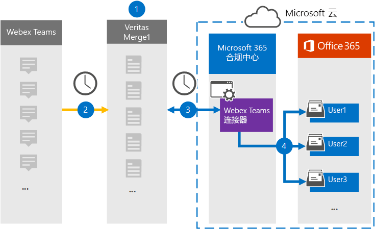

# 设置连接器以存档 Webex Teams数据

使用 Microsoft 365 合规中心 中的一个 Teams 连接器，将数据从 Webex Teams导入并存档到组织Microsoft 365邮箱。 该连接器提供了[一Teams](https://globanet.com/webex-teams/) Webex 连接器，该连接器配置为捕获 Webex Teams通信项目，并导入到Microsoft 365。 连接器将 Webex Teams 中的内容（如一对一聊天、群组对话、频道对话和来自组织的 Webex Teams 帐户的附件）转换为电子邮件格式，然后将这些项目导入 Microsoft 365 中的用户邮箱。

在 Webex Teams数据存储在用户邮箱中之后，可以应用 Microsoft 365 合规性功能，如诉讼保留、电子数据展示、保留策略和保留标签以及通信合规性。 使用 Webex Teams连接器导入数据并存档数据Microsoft 365可帮助组织遵守政府及法规策略。

## 存档 Webex Teams概述

以下概述介绍使用连接器将 Webex Teams数据存档在 Microsoft 365。

1. 您的组织与 Webex Teams一起设置和配置 Webex Teams网站。

2. 每 24 小时一次，Webex Teams项目将复制到"是否合并 1"网站。 连接器还会将 Webex Teams转换为电子邮件格式。

3. 在 Microsoft 365 合规中心 创建的 Webex Teams 连接器，每天连接到 Microsoft Clouds Merge1，将 Webex Teams 项转移到 Microsoft 云中的安全 Azure 存储 位置。

4. 连接器使用自动用户映射的 *Email* 属性值将项目导入特定用户的邮箱，如步骤 [3 中所述](#step-3-map-users-and-complete-the-connector-setup)。 "收件箱"文件夹中名为 **"Webex** Teams文件夹的子文件夹是在用户邮箱中创建的，并且项目会导入到该文件夹中。 连接器使用 *Email* 属性的值实现此操作。 每个 Webex Teams项都包含此属性，该属性用项目每个参与者的电子邮件地址填充。

## 准备工作

- 为 Microsoft 连接器创建一个 Microsoft Merge1 帐户。 若要创建此帐户，请联系["用户支持人员"。](https://globanet.com/ms-connectors-contact) 在步骤 1 中创建连接器时，将登录到此帐户。

- 在 上创建 [https://developer.webex.com/](https://developer.webex.com) 一个应用程序，以从 Webex Teams数据。 有关创建应用程序的分步说明，请参阅 [Merge1 Third-Party Connectors User Guide](https://docs.ms.merge1.globanetportal.com/Merge1%20Third-Party%20Connectors%20Webex%20Teams%20User%20Guide%20.pdf)

   创建此应用程序时，Webex 平台将生成一组唯一凭据。 在全局 Merge1 网站上配置 Webex Teams连接器时，步骤 2 中会使用这些凭据。

- 必须在步骤 1 (步骤 3) 中创建 Webex Teams 连接器并将其完成的用户分配给 Exchange Online 中的邮箱导入导出角色。 若要在"数据连接器"页上添加连接器，需要此 **角色Microsoft 365 合规中心。** 默认情况下，此角色不会分配给 Exchange Online 中的角色组。 可以将"邮箱导入导出"角色添加到"邮箱管理"角色组Exchange Online。 也可以创建角色组，分配邮箱导入导出角色，然后将相应的用户添加为成员。 有关详细信息，请参阅"在角色组中管理角色组"一文的"创建角色组"或"修改角色Exchange Online"。

## 步骤 1：设置 Webex Teams连接器

第一步是获取对数据连接器的访问权限，并设置[Webex Teams](https://globanet.com/webex-teams/)连接器。

1. 转到 ， [https://compliance.microsoft.com](https://compliance.microsoft.com/) 然后单击"数据 **连接器**  >  **Webex Teams"。**

2. 在 **"Webex Teams** 产品说明"页上，单击"**添加连接器"。**

3. 在"**服务条款"页上**，单击"接受 **"。**

4. 输入标识连接器的唯一名称，然后单击下一 **步**。

5. 登录到 Merge1 帐户以配置连接器。

## 步骤 2：在 Teams Merge1 网站上配置 Webex 连接器

第二步是配置 Merge1 Teams Webex 连接器。 若要了解如何配置 Webex 连接器Teams，请参阅[Merge1 第三方连接器用户指南](https://docs.ms.merge1.globanetportal.com/Merge1%20Third-Party%20Connectors%20Webex%20Teams%20User%20Guide%20.pdf)。

单击"保存&**完成****"后**，将显示连接器向导中的"用户Microsoft 365 合规中心页。

## 步骤 3：映射用户并完成连接器设置

若要映射用户并完成连接器Microsoft 365 合规中心，请按照以下步骤操作：

1. 在"**映射 Webex Teams用户Microsoft 365，** 启用自动用户映射。 Webex Teams包括名为 *Email* 的属性，该属性包含组织中用户的电子邮件地址。 如果连接器可以将此地址与Microsoft 365关联，则项目会导入该用户的邮箱。

2. 单击 **"下** 一步"，查看设置，然后转到"数据连接器"页以查看新连接器的导入过程的进度。

## 步骤 4：监视 Webex Teams连接器

创建 Webex Teams连接器后，可以查看该连接器在Microsoft 365 合规中心。

1. 转到左侧 [https://compliance.microsoft.com](https://compliance.microsoft.com) 导航 **导航中的"数据** 连接器"，然后单击" 数据连接器"。

2. 单击 **"连接器"** 选项卡，然后选择 **Webex Teams** 连接器以显示该飞出页。 此页面包含有关连接器的属性和信息。

3. 在 **"源的连接器状态"** 下， **单击"下载** 日志"链接 (或) 连接器的状态日志。 此日志包含有关已导入到 Microsoft 云的数据的信息。

## 已知问题

- 目前，我们不支持导入大于 10 MB 的附件或项目。 稍后将提供对较大项目的支持。