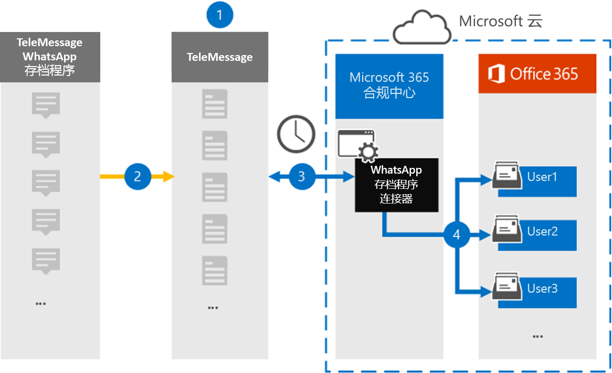

# 设置连接器以存档 WhatsApp 数据

使用远程邮箱中的 TeleMessage Microsoft 365 合规中心导入和存档 WhatsApp 呼叫、聊天、附件、文件和已删除的消息。 设置和配置连接器后，它将每天连接到组织的 TeleMessage 帐户一次，并且使用 TeleMessage WhatsApp 电话 存档器或 TeleMessage WhatsApp 云存档器将员工的移动通信导入 Microsoft 365 中的邮箱。

将 WhatsApp 数据存储在用户邮箱中后，可以将 Microsoft 365 合规性功能（如诉讼保留、内容搜索和保留Microsoft 365策略）应用于 WhatsApp 数据。 例如，您可以使用内容搜索搜索 WhatsApp 邮件，或将包含 WhatsApp 邮件的邮箱与案例的保管人Advanced eDiscovery关联。 使用 WhatsApp 连接器在 Microsoft 365导入和存档数据可帮助组织遵守政府法规策略。

## 存档 WhatsApp 数据概述

以下概述介绍使用连接器在应用程序存档 WhatsApp 数据Microsoft 365。

1. 您的组织与 TeleMessage 合作，以设置 WhatsApp 存档器连接器。 有关详细信息，请参阅 [WhatsApp Archiver](https://www.telemessage.com/office365-activation-for-whatsapp-archiver)。

2. 实时将组织的 WhatsApp 数据复制到 TeleMessage 网站。

3. 在 Microsoft 365 合规中心 中创建的 WhatsApp 连接器每天连接到 TeleMessage 站点，将过去 24 小时内的 WhatsApp 数据转移到 Microsoft 云中的安全 Azure 存储 位置。 连接器还会将内容 WhatsApp 数据转换为电子邮件格式。

4. 连接器将 WhatsApp 数据导入到特定用户的邮箱。 将创建一个名为 **WhatsApp Archiver** 的新文件夹，该文件夹将导入到特定用户的邮箱中。 连接器使用"用户的电子邮件地址"属性的值 *执行此映射* 。 每个 WhatsApp 邮件都包含此属性，该属性填充了邮件每个参与者的电子邮件地址。

   除了使用"用户的电子邮件地址"属性的值进行自动用户映射之外，您还可以通过上载 CSV 映射文件来实现自定义映射。 此映射文件包含您Microsoft 365的移动电话号码和相应的电子邮件地址。 如果同时启用自动用户映射和自定义映射，连接器将首先针对每个 WhatsApp 项查看自定义映射文件。 如果找不到与Microsoft 365移动电话号码对应的有效邮件用户，连接器将使用其尝试导入的项目的电子邮件地址属性中的值。 如果连接器在自定义映射文件或 whatsApp Microsoft 365电子邮件地址属性中找不到有效的邮件用户，该项目将不会导入。

## 设置连接器之前

存档 WhatsApp 通信数据所需的一些实现步骤位于 Microsoft 365且必须先完成，然后才能在合规中心创建连接器。

- 从 [TeleMessage 订购 WhatsApp Archiver](https://www.telemessage.com/mobile-archiver/order-mobile-archiver-for-o365) 服务，并获取组织的有效管理帐户。 在合规中心创建连接器时，需要登录此帐户。

- 在 TeleMessage 帐户中注册需要 WhatsApp 存档的所有用户。 注册用户时，请确保使用用于其帐户Microsoft 365电子邮件地址。

- 在员工的移动电话[上电话 TeleMessage WhatsApp 和 Archiver](https://www.telemessage.com/mobile-archiver/whatsapp-phone-archiver-2/) 应用并激活它。 或者，可以在员工的移动电话上安装常规 WhatsApp 或 WhatsApp Business 应用，并扫描 TeleMessage 网站上 QR 代码，以激活 WhatsApp 云存档器服务。 有关详细信息，请参阅 [WhatsApp 云存档器](https://www.telemessage.com/mobile-archiver/whatsapp-archiver/whatsapp-cloud-archiver/)。

- 必须为创建 Verizon 网络连接器的用户分配数据连接器管理员角色。 若要在"数据连接器"页上添加连接器，需要此Microsoft 365 合规中心。 默认情况下，此角色添加到多个角色组。 有关这些角色组的列表，请参阅安全与合规中心内的权限中的"安全与合规& ["部分](../security/office-365-security/permissions-in-the-security-and-compliance-center.md#roles-in-the-security--compliance-center)。 或者，您组织的管理员可以创建自定义角色组，分配数据连接器管理员角色，然后将相应的用户添加为成员。 有关说明，请参阅"权限"部分中的"创建自定义[角色Microsoft 365 合规中心](microsoft-365-compliance-center-permissions.md#create-a-custom-role-group)。

- 此 TeleMessage 数据连接器可用于美国政府GCC环境中Microsoft 365环境。 第三方应用程序和服务可能涉及在 Microsoft 365 基础结构外部的第三方系统上存储、传输和处理组织的客户数据，因此未涵盖在 Microsoft 365 合规性和数据保护承诺中。 Microsoft 不表示使用此产品连接到第三方应用程序意味着这些第三方应用程序符合 FEDRAMP。

## 创建 WhatsApp 存档器连接器

完成上一部分中介绍的先决条件后，可以在"设置"部分中创建 whatsApp Microsoft 365 合规中心。 连接器使用您提供的信息连接到 TeleMessage 站点，将 WhatsApp 数据传输至 Microsoft 365 中的相应用户邮箱框。

1. 转到 ， [https://compliance.microsoft.com](https://compliance.microsoft.com/) 然后单击"数据 **连接器"** > **"WhatsApp Archiver"**。

2. 在 **"WhatsApp 存档程序产品** 说明"页上，单击" **添加连接器"**

3. 在" **服务条款"页上** ，单击"接受 **"**。

4. 在" **登录到 TeleMessage** "页上的"步骤 3"下，在下列框中输入所需信息，然后单击"下一步 **"**。

   - **用户名：** 你的 TeleMessage 用户名。

   - **密码：** 你的 TeleMessage 密码。

5. 创建连接器后，可以关闭弹出窗口并转到下一页。

6. 在" **用户映射"页上** ，启用自动用户映射并单击"下一步 **"**。 如果需要自定义映射上传 CSV 文件，请单击"下一步 **"**。

7. 查看设置，然后单击" **完成** "创建连接器。

8. 转到"数据连接器" **页中的"** 连接器"选项卡以查看新连接器的导入过程的进度。

## 已知问题

- 目前，我们不支持导入大于 10 MB 的附件或项目。 稍后将提供对较大项目的支持。
