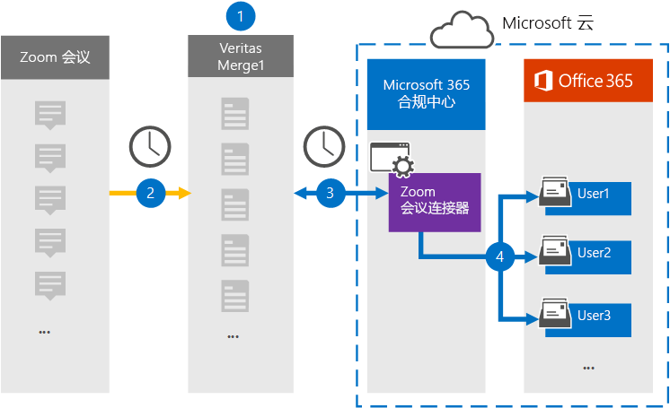

# 设置连接器以存档"缩放会议"数据

使用 Microsoft 365 合规中心 中的"Microsoft 365 合规中心"连接器将"缩放会议"数据导入并存档到组织中用户Microsoft 365邮箱。 该[连接器配置为定期](https://globanet.com/zoom/)捕获第三方数据源 (中的项目，) 将这些项目导入Microsoft 365。 连接器将会议内容 (包括聊天、录制的文件和元数据) 从 Zoom Meetings 帐户转换为电子邮件格式，然后将这些项目导入 Microsoft 365 中的用户邮箱。

缩放会议数据存储在用户邮箱中后，可以应用 Microsoft 365 合规性功能，如诉讼保留、电子数据展示、保留策略和保留标签以及通信合规性。 使用 Zoom 会议连接器导入数据并存档Microsoft 365可帮助组织遵守政府及法规策略。

## 存档缩放会议数据概述

以下概述介绍使用连接器在会议记录中存档"缩放会议"Microsoft 365。

1. 你的组织使用"缩放会议"来设置和配置"缩放会议"网站。

2. 每 24 小时一次，"缩放会议"中的会议项目将复制到"是否合并 1"网站。 连接器还会将会议内容转换为电子邮件格式。

3. 在 Microsoft 云中创建的缩放会议连接器Microsoft 365 合规中心连接到每天的 Microsoft 合并 1，将会议消息转移到 Microsoft 云中的安全 Azure 存储 位置。

4. 连接器使用 *Email* 属性的值和自动用户映射将转换的会议项目导入特定用户的邮箱，如步骤 3 中所述。 "收件箱"文件夹中名为"缩放会议"的新子文件夹是在用户邮箱中创建的，并且会议项目将导入到该文件夹中。 连接器使用 *Email* 属性的值实现此操作。 每个会议项目都包含此属性，其中填充了会议每个参与者的电子邮件地址。

## 准备工作

- 为 Microsoft 连接器创建一个 Microsoft Merge1 帐户。 若要创建此帐户，请联系["用户支持人员"。](https://globanet.com/ms-connectors-contact) 在步骤 1 中创建连接器时，将登录到此帐户。

- 获取组织的 Zoom Business 或 Zoom Enterprise用户名和密码。 配置"缩放会议"连接器时，需要在步骤 2 中登录此帐户。

- 在缩放市场中创建 [以下应用程序](https://marketplace.zoom.us)：

  - OAuth 应用程序

  - JWT 应用程序

  创建这些应用程序后，Zoom 平台将生成一组用于生成令牌的唯一凭据。 这些令牌用于在连接器连接到 Zoom 帐户，将项目复制到 Merge1 网站时对连接器进行身份验证。 在步骤 2 中配置缩放连接器时，你将使用这些令牌。

  有关如何创建 OAuth 和 JWT 应用程序的分步说明，请参阅 [Merge1 Third-Party Connectors User Guide](https://docs.ms.merge1.globanetportal.com/Merge1%20Third-Party%20Connectors%20Zoom%20Meetings%20User%20Guide%20.pdf)。

- 必须在步骤 1 中创建"缩放会议"连接器 (在步骤 3) 中完成该连接器的用户必须分配至 Exchange Online 中的"邮箱导入导出"角色。 若要在"数据连接器"页上添加连接器，需要此 **角色Microsoft 365 合规中心。** 默认情况下，不会向角色组分配此角色Exchange Online。 可以将"邮箱导入导出"角色添加到组织中"组织管理"角色Exchange Online。 也可以创建角色组，分配邮箱导入导出角色，然后将相应的用户添加为成员。 有关详细信息，请参阅"在角色组中管理角色组"一文的"创建角色组"或"修改角色Exchange Online"。

## 步骤 1：设置缩放会议连接器

第一步是访问"缩放会议"Microsoft 365 合规中心"缩放会议"连接器。

1. 转到 ， [https://compliance.microsoft.com](https://compliance.microsoft.com/) 然后单击"数据 **连接器""**  >  **缩放会议"。**

2. 在"**缩放会议"** 产品说明页上，单击"**添加连接器"。**

3. 在"**服务条款"页上**，单击"接受 **"。**

4. 输入标识连接器的唯一名称，然后单击下一 **步**。

5. 登录到 Merge1 帐户以配置连接器。

## 步骤 2：配置缩放会议连接器

第二步是在 Merge1 网站上配置"缩放会议"连接器。 若要详细了解如何在"一线合并"网站上配置"缩放会议"连接器，请参阅 [Merge1 第三方连接器用户指南](https://docs.ms.merge1.globanetportal.com/Merge1%20Third-Party%20Connectors%20Zoom%20Meetings%20User%20Guide%20.pdf)。

单击"保存&**完成****"后**，将显示连接器向导中的"用户Microsoft 365 合规中心页。

## 步骤 3：映射用户并完成连接器设置

1. 在"**将外部用户映射到Microsoft 365"页上**，启用自动用户映射。

   "缩放会议"项目包括一个称为 *"电子邮件* "的属性，该属性包含组织中用户的电子邮件地址。 如果连接器可以将此地址与Microsoft 365关联，则项目将导入该用户的邮箱

2. 单击 **"下** 一步"，查看设置，然后转到"数据连接器"页以查看新连接器的导入过程的进度。

## 步骤 4：监视 Zoom 会议连接器

创建"缩放会议"连接器后，可以在"会议"视图中查看Microsoft 365 合规中心。

1. 转到左侧 [https://compliance.microsoft.com](https://compliance.microsoft.com) 导航 **导航中的"数据** 连接器"，然后单击" 数据连接器"。

2. 单击" **连接器"** 选项卡，然后选择" **缩放会议** "连接器以显示飞出页面。 此页面包含有关连接器的属性和信息。

3. 在 **"源的连接器状态"** 下， **单击"下载** 日志"链接 (或) 连接器的状态日志。 此日志包含有关已导入到 Microsoft 云的数据的信息。

## 已知问题

- 目前，我们不支持导入大于 10 MB 的附件或项目。 稍后将提供对较大项目的支持。

- 若要使"缩放会议"连接器正常工作，必须在设置"缩放会议"时启用录制。