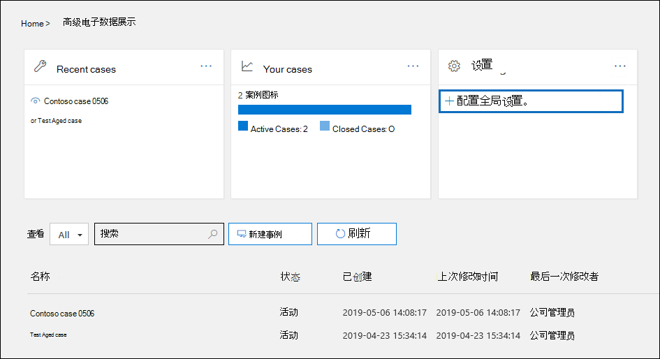
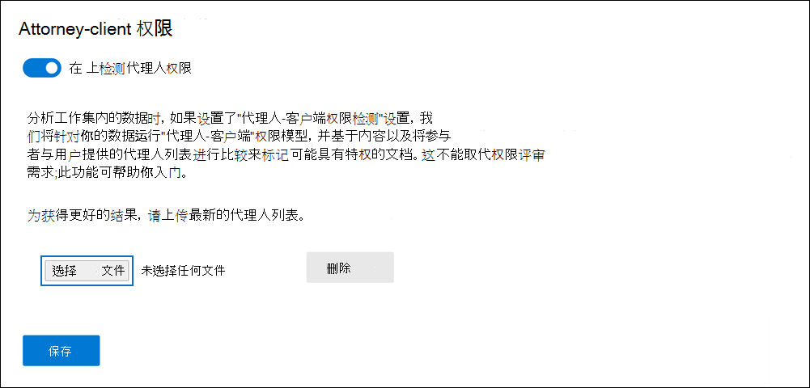

# 在高级电子数据展示中设置律师-客户端特权检测Set up attorney-client privilege detection in Advanced eDiscovery

任何电子数据展示过程的审核阶段的主要和昂贵的方面是查看文档中的特权内容。A major and costly aspect of the review phase of any eDiscovery process is reviewing documents for privileged content. 高级电子数据展示提供基于机器学习的权限内容检测，以提高此过程的效率。Advanced eDiscovery provides machine learning-based detection of privileged content to make this process more efficient. 此功能称为 "*律师-客户端特权检测*"。This feature is called *attorney-client privilege detection*.

## 它的工作原理How does it work?

如果启用律师-客户端特权检测，则在分析评审集中[的数据](analyzing-data-in-review-set.md)时，将由律师-客户端权限检测模型处理审阅集中的所有文档。When attorney-client privilege detection is enabled, all documents in a review set will be processed by the attorney-client privilege detection model when you [analyze the data](analyzing-data-in-review-set.md) in the review set. 模型将查找两个事项：The model looks for two things:

- 特权内容–模型使用机器学习来确定文档中包含法律性质的内容的可能性。Privileged content – The model uses machine learning to determine the likelihood that the document contains content that is legal in nature.

- 参与者–在设置律师-客户端权限检测的过程中，您必须提交您的组织的律师列表。Participants – As part of setting up attorney-client privilege detection, you have to submit a list of attorneys for your organization. 然后，模型将文档的参与者与律师列表进行比较，以确定文档是否至少有一个律师参与者。The model then compares the participants of the document with the attorney list to determine if a document has at least one attorney participant.

模型将为每个文档生成以下三个属性：The model produces the following three properties for every document:

- **AttorneyClientPrivilegeScore：** 文档在本质上是合法的可能性;分数的值介于**0**和**1**之间。**AttorneyClientPrivilegeScore:** The likelihood the document is legal in nature; the values for the score are between **0** and **1**.

- **HasAttorney：** 如果某个文档参与者在律师列表中列出，则此属性设置为**true** ; 否则为 false。否则，该值为**false**。**HasAttorney:** This property is set to **true** if one of the document participants is listed in the attorney list; otherwise the value is **false**. 如果你的组织未上传律师列表，则此值也设置为**false** 。The value is also set to **false** if your organization didn't upload an attorney list.

- **IsPrivilege：** 如果**AttorneyClientPrivilegeScore**的值高于阈值，*或者*如果文档有律师参与者，则此属性设置为 true; 否则，此属性设置为**true** 。否则，该值设置为**false**。**IsPrivilege:** This property is set to **true** if the value for **AttorneyClientPrivilegeScore** is above the threshold *or* if the document has an attorney participant; otherwise the value is set to **false**.

这些属性（及其对应的值）将添加到审阅集中文档的文件元数据中，如以下屏幕截图所示：These properties (and their corresponding values) are added to the file metadata of the documents in a review set, as shown in the following screenshot:

这三个属性也可在审阅集中进行搜索。These three properties are also searchable within a review set. 有关详细信息，请参阅[在审阅集中查询数据](review-set-search.md)。For more information, see [Query the data in a review set](review-set-search.md).

## 设置律师-客户端权限检测模型Set up the attorney-client privilege detection model

若要启用律师-客户端权限检测模型，您的组织必须将其打开，然后上传律师列表。To enable the attorney-client privilege detection model, your organization has to turn it on and then upload an attorney list.

### 步骤1：启用律师-客户端特权检测Step 1: Turn on attorney-client privilege detection

组织中的电子数据展示管理员（电子数据展示管理器角色组中的电子数据展示管理员子组的成员）必须使模型在高级电子数据展示事例中可用。A person who is an eDiscovery Administrator in your organization (a member of the eDiscovery Administrator subgroup in the eDiscovery Manager role group) must make the model available in your Advanced eDiscovery cases.

1. 在安全 & 合规性中心中，转到**电子数据展示 > 高级电子数据展示**。In the Security & Compliance Center, go to **eDiscovery > Advanced eDiscovery**.

2. 在**高级电子数据展示**主页上的 "**设置**" 磁贴中，单击 "**配置全局分析设置**"。On the **Advanced eDiscovery** home page, in the **Settings** tile, click **Configure global analytics settings**.

   

3. 在 "**分析设置**" 选项卡上，选择 "**管理律师-客户端权限设置**"。On the **Analytics settings** tab, select **Manage attorney-client privilege setting**.

4. 在 "**律师-客户端权限**" 飞出页面上，使用切换功能打开功能，然后选择 "**保存**"。On the **Attorney-client privilege** flyout page, use the toggle to turn on the feature and then select **Save**.

### 步骤2：上传律师列表（可选）Step 2: Upload a list of attorneys (optional)

若要充分利用律师-客户端特权检测模型，并使用之前所述的 "**拥有律师**" 或 "**潜在的特权**检测" 的结果，我们建议您上载适用于您的组织的律师和法律人员的电子邮件地址列表。To take full advantage of the attorney-client privilege detection model and use the results of the **Has Attorney** or **Potentially Privileged** detection that was previously described, we recommend that you upload a list of email addresses for the lawyers and legal personnel who work for your organization. 

若要上传律师列表以供律师-客户端权限检测模型使用，请执行以下操作：To upload an attorney list for use by the attorney-client privilege detection model:

1. 创建一个 .csv 文件（不带标题行），并在单独的行中添加每个相应人员的电子邮件地址。Create a .csv file (without a header row) and add the email address for each appropriate person on a separate line. 将此文件保存到本地计算机。Save this file to your local computer.

2. 在**高级电子数据展示**主页上的 "**设置**" 磁贴中，选择 "**配置实验性功能**"，然后选择 "**管理律师-客户端权限设置**"。On the **Advanced eDiscovery** home page, in the **Settings** tile, select **Configure experimental features**, and then select **Manage attorney-client privilege setting**.

   将显示 "**律师-客户端权限**" 页，并且启用了 "**律师-客户端权限检测**" 切换功能。The **Attorney-client privilege** page is displayed, and the **Attorney-client privilege detection** toggle is turned on.

   

3. 选择 "**浏览**"，然后查找并选择您在步骤1中创建的 .csv 文件。Select **Browse** and then find and select the .csv file that you created in step 1.

4. 选择 "**保存**" 以上传律师列表。Select **Save** to upload the attorney list.

## 使用律师-客户端权限检测模型Use the attorney-client privilege detection model

按照此部分中的步骤操作，对审阅集中的文档使用律师-客户端权限检测。Follow the steps in this section to use attorney-client privilege detection for documents in a review set.

### 步骤1：创建具有律师-客户端权限检测模型的智能标记组Step 1: Create a smart tag group with attorney-client privilege detection model

查看审查过程中的律师-客户端特权检测的结果之一是使用智能标记组的一种主要方式。One of the primary ways to see the results of attorney-client privilege detection in your review process is by using a smart tag group. 智能标记组指示律师-客户端权限检测的结果，并在智能标记组中标记的旁边显示结果。A smart tag group indicates the results of the attorney-client privilege detection and shows the results in-line next to the tags in a smart tag group. 这使您可以在文档审阅过程中快速识别可能的特权文档。This lets you quickly identify potentially privileged documents during document review. 此外，还可以使用智能标记组中的标记将文档标记为特权或非特权。Additionally, you can also use the tags in the smart tag group to tag documents as privileged or non-privileged. 有关智能标记的详细信息，请参阅[在高级电子数据展示中设置智能标记](smart-tags.md)。For more information about smart tags, see [Set up smart tags in Advanced eDiscovery](smart-tags.md).

1. 在包含您在步骤1中分析的文档的审阅集中，选择 "**管理审阅集**"，然后选择 "**管理标记**"。In the review set that contains the documents that you analyzed in Step 1, select **Manage review set** and then select **Manage tags**.
 
2. 在 "**标记**" 下，选择 "**添加组**" 旁边的下拉箭头，然后选择 "**添加智能标记组**"。Under **Tags**, select the pull-down next to **Add group** and then select **Add smart tag group**.

   

3. 在 "**选择智能标记的模型**" 页上，选择 "在**律师-客户端权限**下**选择**"。On the **Choose a model for your smart tag** page, choose **Select** next to **Attorney-client privilege**.

   将显示名为 "**律师-客户端" 权限**的标记组。A tag group named **Attorney-client privilege** is displayed. 它包含两个名为**正数**和**负数**的子标记，它们对应于由模型生成的可能结果。It contains two child tags named **Positive** and **Negative**, which correspond to the possible results produced by the model.

   

3. 根据需要，重命名标记组和标记以进行查看。Rename the tag group and tags as appropriate for your review. 例如，可以将**肯定**重命名为**特权**，将**否定**重命名为 "**无权限**"。For example, you can rename **Positive** to **Privileged** and **Negative** to **Not privileged**.

### 步骤2：分析审阅集Step 2: Analyze a review set

在对审阅集中的文档进行分析时，也将运行律师-客户端权限检测模型，并且相应的属性（在["工作原理"](#how-does-it-work)中进行了说明）将添加到审阅集内的每个文档中。When you analyze the documents in a review set, the attorney-client privilege detection model will also run and the corresponding properties (described in [How does it work?](#how-does-it-work) will be added to every document in the review set. 有关分析审阅集中的数据的详细信息，请参阅[在高级电子数据展示中分析审阅集中的数据](analyzing-data-in-review-set.md)。For more information about analyzing data in review set, see [Analyze data in a review set in Advanced eDiscovery](analyzing-data-in-review-set.md).

### 步骤3：使用智能标记组查看特权内容Step 3: Use the smart tag group for review of privileged content

分析评审集并设置智能标记后，下一步是查看文档。After analyzing the review set and setting up smart tags, the next step is to review the documents. 如果模型已确定文档具有潜在权限，则在 "**标记" 面板**中对应的智能标记将指示由律师-客户端权限检测产生的以下结果：If the model has determined the document is potentially privileged, the corresponding smart tag in the **Tagging panel** will indicate the following results produced by the attorney-client privilege detection:

- 如果文档的内容本身可能是合法的，则会在相应的智能标记（在此示例中为默认的**正**则标记）旁边显示标签**法律内容**。If the document has content that may be legal in nature, the label **Legal content** is displayed next to the corresponding smart tag (which in this case is the default **Positive** tag).

- 如果文档具有在组织的律师列表中找到的参与者，则标签**律师**将显示在相应的智能标记（在此示例中也是默认的**正数**标记）旁边。If the document has a participant who is found in your organization's attorney list, the label **Attorney** is displayed next to the corresponding smart tag (which in this case is also the default **Positive** tag).

- 如果文档的内容可能是合法的 *，并且*在律师列表中找到了参与者，则会同时显示**法律内容**和**律师**标签。If the document has content that may be legal in nature *and* has a participant found in the attorney list, both the **Legal content**  and **Attorney** labels are displayed. 

如果模型确定文档不包含性质为合法的内容或不包含律师列表中的参与者，则在 "标记" 面板中不会显示任何标签。If the model determines that a document doesn't contain content that is legal in nature or doesn't contain a participant from the attorney list, then neither label is displayed in the tagging panel.

例如，下面的屏幕截图显示了两个文档。For example, the following screenshots show two documents. 第一个包含的内容在性质上是合法的，并且在律师列表中找到了参与者。The first one contains content that is legal in nature and has a participant found in the list of attorneys. 第二个不包含，因此不显示任何标签。The second contains neither and therefore doesn't display any labels.

查看文档以查看其是否包含特权内容之后，可以使用相应的标记对文档进行标记。After you review a document to see if it contains privileged content, you can tag the document with the appropriate tag.
