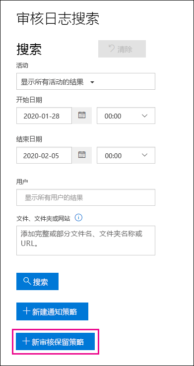
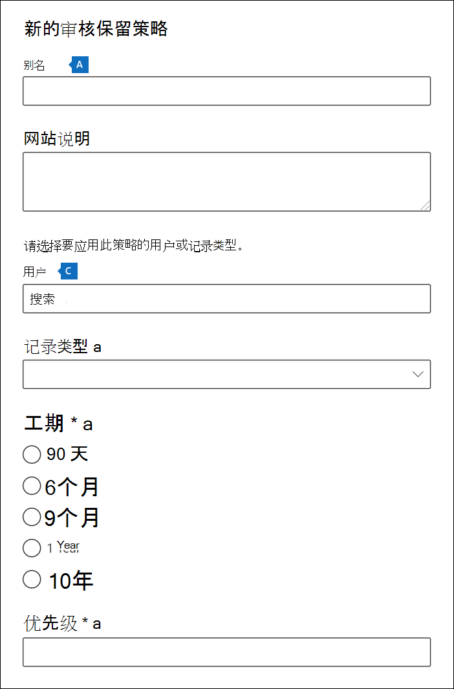

# <a name="manage-audit-log-retention-policies"></a><span data-ttu-id="bcbe6-104">管理审核日志保留策略</span><span class="sxs-lookup"><span data-stu-id="bcbe6-104">Manage audit log retention policies</span></span>

<span data-ttu-id="bcbe6-105">可在安全与合规中心创建和管理审核日志保留策略。</span><span class="sxs-lookup"><span data-stu-id="bcbe6-105">You can create and manage audit log retention policies in the Security & Compliance Center.</span></span> <span data-ttu-id="bcbe6-106">审核日志保留策略是 Microsoft 365 中新增的高级审核功能的一部分。</span><span class="sxs-lookup"><span data-stu-id="bcbe6-106">Audit log retention policies are part of the new Advanced Audit capabilities in Microsoft 365.</span></span> <span data-ttu-id="bcbe6-107">通过审核日志保留策略，可指定组织中审核日志的保留时间。</span><span class="sxs-lookup"><span data-stu-id="bcbe6-107">An audit log retention policy lets you specify how long to retain audit logs in your organization.</span></span> <span data-ttu-id="bcbe6-108">可将审核日志保留长达 10 年时间。</span><span class="sxs-lookup"><span data-stu-id="bcbe6-108">You can retain audit logs for up to 10 years.</span></span> <span data-ttu-id="bcbe6-109">可以根据以下标准创建策略：</span><span class="sxs-lookup"><span data-stu-id="bcbe6-109">You can create policies based on the following criteria:</span></span>

- <span data-ttu-id="bcbe6-110">一个或多个 Microsoft 365 服务中的所有活动</span><span class="sxs-lookup"><span data-stu-id="bcbe6-110">All activities in one or more Microsoft 365 services</span></span>

- <span data-ttu-id="bcbe6-111">所有用户或特定用户执行的特定活动（在 Microsoft 365 服务中）</span><span class="sxs-lookup"><span data-stu-id="bcbe6-111">Specific activities (in a Microsoft 365 service) performed by all users or by specific users</span></span>

- <span data-ttu-id="bcbe6-112">优先级，用于指定当组织中有多个策略时优先使用哪个策略</span><span class="sxs-lookup"><span data-stu-id="bcbe6-112">A priority level that specifies which policy takes precedence in you have multiple policies in your organization</span></span>

## <a name="default-audit-log-retention-policy"></a><span data-ttu-id="bcbe6-113">默认审核日志保留策略</span><span class="sxs-lookup"><span data-stu-id="bcbe6-113">Default audit log retention policy</span></span>

<span data-ttu-id="bcbe6-114">Microsoft 365 中的高级审核功能为所有组织提供默认审核日志保留策略。</span><span class="sxs-lookup"><span data-stu-id="bcbe6-114">Advanced Audit in Microsoft 365 provides a default audit log retention policy for all organizations.</span></span> <span data-ttu-id="bcbe6-115">此策略将所有 Exchange、SharePoint 和 Azure Active Directory 审核记录保留一年。</span><span class="sxs-lookup"><span data-stu-id="bcbe6-115">This policy retains all Exchange, SharePoint, and Azure Active Directory audit records for one year.</span></span> <span data-ttu-id="bcbe6-116">此默认策略将保留审核记录，其中包含 **工作负载** 属性（活动发生的服务）的 **AzureActiveDirectory**、**Exchange** 或 **SharePoint** 的值。</span><span class="sxs-lookup"><span data-stu-id="bcbe6-116">This default policy retains audit records that contain the value of **AzureActiveDirectory**, **Exchange**, or **SharePoint** for the **Workload** property (which is the service in which the activity occurred).</span></span> <span data-ttu-id="bcbe6-117">无法修改默认策略。</span><span class="sxs-lookup"><span data-stu-id="bcbe6-117">The default policy can't be modified.</span></span> <span data-ttu-id="bcbe6-118">请参阅本文的[详细信息](#more-information)部分，以获取默认策略中包含的每个工作负载的记录类型列表。</span><span class="sxs-lookup"><span data-stu-id="bcbe6-118">See the [More information](#more-information) section in this article for a list of record types for each workload that are included in the default policy.</span></span>

> [!NOTE]
> <span data-ttu-id="bcbe6-119">默认审核日志保留策略仅适用于分配了 Office 365 或 Microsoft 365 E5 许可证或具有 Microsoft 365 E5 合规版或 E5 电子数据展示和审核加载项许可证的用户执行的活动审核记录。</span><span class="sxs-lookup"><span data-stu-id="bcbe6-119">The default audit log retention policy only applies to audit records for activity performed by users who are assigned an Office 365 or Microsoft 365 E5 license or have a Microsoft 365 E5 Compliance or E5 eDiscovery and Audit add-on license.</span></span> <span data-ttu-id="bcbe6-120">如果你的组织中有非 E5 用户或来宾用户，则其相应的审核记录将保留 90 天。</span><span class="sxs-lookup"><span data-stu-id="bcbe6-120">If you have non-E5 users or guest users in your organization, their corresponding audit records are retained for 90 days.</span></span>

## <a name="before-you-create-an-audit-log-retention-policy"></a><span data-ttu-id="bcbe6-121">在创建审核日志保留策略之前</span><span class="sxs-lookup"><span data-stu-id="bcbe6-121">Before you create an audit log retention policy</span></span>

- <span data-ttu-id="bcbe6-122">必须在安全与合规中心为你分配了“组织配置”角色，这样才能创建或修改审核保留策略。</span><span class="sxs-lookup"><span data-stu-id="bcbe6-122">You have to be assigned the Organization Configuration role in the Security & Compliance Center to create or modify an audit retention policy.</span></span>

- <span data-ttu-id="bcbe6-123">在组织中，你最多可以拥有 50 个审核日志保留策略。</span><span class="sxs-lookup"><span data-stu-id="bcbe6-123">You can have a maximum of 50 audit log retention policies in your organization.</span></span>

- <span data-ttu-id="bcbe6-124">若要将审核日志保留超过 90 天，必须为生成审核日志的用户分配 Office 365 E5 或 Microsoft 365 E5 许可证，或者该用户必须具有 Microsoft 365 E5 合规版或 E5 电子数据展示和审核加载项许可证。</span><span class="sxs-lookup"><span data-stu-id="bcbe6-124">To retain an audit log for longer than 90 days, the user who generated the audit log must be assigned an Office 365 E5 or Microsoft 365 E5 license or have a Microsoft 365 E5 Compliance or E5 eDiscovery and Audit add-on license.</span></span>

- <span data-ttu-id="bcbe6-125">所有自定义审核日志保留策略（由组织创建）都优先于默认保留策略。</span><span class="sxs-lookup"><span data-stu-id="bcbe6-125">All custom audit log retention policies (created by your organization) take priority over the default retention policy.</span></span> <span data-ttu-id="bcbe6-126">例如，如果为保留期短于一年的 Exchange 邮箱活动创建审核日志保留策略，则 Exchange 邮箱活动的审核记录将在自定义策略指定的较短期限内保留。</span><span class="sxs-lookup"><span data-stu-id="bcbe6-126">For example, if you create an audit log retention policy for Exchange mailbox activity that has a retention period that's shorter than one year, audit records for Exchange mailbox activities will be retained for the shorter duration specified by the custom policy.</span></span>

## <a name="create-an-audit-log-retention-policy-in-the-compliance-center"></a><span data-ttu-id="bcbe6-127">在合规中心创建审核日志保留策略</span><span class="sxs-lookup"><span data-stu-id="bcbe6-127">Create an audit log retention policy in the compliance center</span></span>

1. <span data-ttu-id="bcbe6-128">转到 [https://compliance.microsoft.com](https://compliance.microsoft.com)，然后使用在安全与合规中心分配了“组织配置”角色的用户帐户登录。</span><span class="sxs-lookup"><span data-stu-id="bcbe6-128">Go to [https://compliance.microsoft.com](https://compliance.microsoft.com) and sign in with user account that's assigned the Organization Configuration role in the Security & Compliance Center.</span></span>

2. <span data-ttu-id="bcbe6-129">在 Microsoft 365 合规中心的左窗格中，单击“**显示所有**”，然后单击“**审核**”。</span><span class="sxs-lookup"><span data-stu-id="bcbe6-129">In the left pane of the Microsoft 365 compliance center, click **Show all**, and then click **Audit**.</span></span>

    <span data-ttu-id="bcbe6-130">将显示“**审核**”页。</span><span class="sxs-lookup"><span data-stu-id="bcbe6-130">The **Audit** page is displayed.</span></span>

    

3. <span data-ttu-id="bcbe6-132">单击“**创建审核保留策略**”，然后在弹出页面上填写以下字段：</span><span class="sxs-lookup"><span data-stu-id="bcbe6-132">Click **Create audit retention policy**, and then complete the following fields on the flyout page:</span></span>

    

   1. <span data-ttu-id="bcbe6-134">**名称**：审核日志保留策略的名称。</span><span class="sxs-lookup"><span data-stu-id="bcbe6-134">**Name:** The name of the audit log retention policy.</span></span> <span data-ttu-id="bcbe6-135">此名称必须在你的组织中保持唯一。</span><span class="sxs-lookup"><span data-stu-id="bcbe6-135">This name must be unique in your organization.</span></span>

   2. <span data-ttu-id="bcbe6-136">**说明**：可选，但有助于提供有关策略的信息，例如记录类型或工作负载、策略中指定的用户以及期限。</span><span class="sxs-lookup"><span data-stu-id="bcbe6-136">**Description:** Optional, but helpful to provide information about the policy, such as the record type or workload, users specified in the policy, and the duration.</span></span>

   3. <span data-ttu-id="bcbe6-137">**用户**：选择一个或多个要为其应用策略的用户。</span><span class="sxs-lookup"><span data-stu-id="bcbe6-137">**Users:** Select one or more users to apply the policy to.</span></span> <span data-ttu-id="bcbe6-138">如果将此框留空，则该策略将应用于所有用户。</span><span class="sxs-lookup"><span data-stu-id="bcbe6-138">If you leave this box blank, then the policy will apply to all users.</span></span> <span data-ttu-id="bcbe6-139">如果将“**记录类型**”留空，则必须选择用户。</span><span class="sxs-lookup"><span data-stu-id="bcbe6-139">If you leave the **Record type** blank, then you must select a user.</span></span>

   4. <span data-ttu-id="bcbe6-140">**记录类型**：将为其应用策略的审核记录类型。</span><span class="sxs-lookup"><span data-stu-id="bcbe6-140">**Record type:** The audit record type the policy applies to.</span></span> <span data-ttu-id="bcbe6-141">如果将此属性留空，则必须在“**用户**”框中选择用户。</span><span class="sxs-lookup"><span data-stu-id="bcbe6-141">If you leave this property blank, you must select a user in the **Users** box.</span></span> <span data-ttu-id="bcbe6-142">可选择一种记录类型或多个记录类型：</span><span class="sxs-lookup"><span data-stu-id="bcbe6-142">You can select a single record type or multiple record types:</span></span>

   - <span data-ttu-id="bcbe6-143">如果选择一条记录类型，将动态显示“**活动**”字段。</span><span class="sxs-lookup"><span data-stu-id="bcbe6-143">If you select a single record type, the **Activities** field is dynamically displayed.</span></span> <span data-ttu-id="bcbe6-144">可使用下拉列表从所选记录类型中选择活动，以便对其应用策略。</span><span class="sxs-lookup"><span data-stu-id="bcbe6-144">You can use the drop-down list to select activities from the selected record type to apply the policy to.</span></span> <span data-ttu-id="bcbe6-145">如果未选择特定活动，则该策略将应用于所选记录类型的所有活动。</span><span class="sxs-lookup"><span data-stu-id="bcbe6-145">If you don't choose specific activities, the policy will apply to all activities of the selected record type.</span></span>

   - <span data-ttu-id="bcbe6-146">如果选择多个记录类型，则不能选择活动。</span><span class="sxs-lookup"><span data-stu-id="bcbe6-146">If you select multiple record types, you don't have the ability to select activities.</span></span> <span data-ttu-id="bcbe6-147">该策略将应用于所选记录类型的所有活动。</span><span class="sxs-lookup"><span data-stu-id="bcbe6-147">The policy will apply to all activities of the selected record types.</span></span>

   5. <span data-ttu-id="bcbe6-148">**期限**：保留符合策略条件的审核日志的时间。</span><span class="sxs-lookup"><span data-stu-id="bcbe6-148">**Duration:** The amount of time to retain the audit logs that meet the criteria of the policy.</span></span>

   6. <span data-ttu-id="bcbe6-149">**优先级**：此值确定处理组织中的审核日志保留策略的顺序。</span><span class="sxs-lookup"><span data-stu-id="bcbe6-149">**Priority:** This value determines the order in which audit log retention policies in your organization are processed.</span></span> <span data-ttu-id="bcbe6-150">该值越大，表示优先级越高。</span><span class="sxs-lookup"><span data-stu-id="bcbe6-150">A higher value indicates a higher priority.</span></span> <span data-ttu-id="bcbe6-151">例如，优先级值为 **5** 的策略将优先于优先级值为 **0** 的策略。</span><span class="sxs-lookup"><span data-stu-id="bcbe6-151">For example, a policy with a priority value of **5** would take priority over a policy with a priority value of **0**.</span></span> <span data-ttu-id="bcbe6-152">如前文所述，任何自定义审核日志保留策略都优先于组织的默认策略。</span><span class="sxs-lookup"><span data-stu-id="bcbe6-152">As previously explained, any custom audit log retention policy takes priority over the default policy for your organization.</span></span>

4. <span data-ttu-id="bcbe6-153">单击“**保存**”以创建新的审核日志保留策略。</span><span class="sxs-lookup"><span data-stu-id="bcbe6-153">Click **Save** to create the new audit log retention policy.</span></span>

## <a name="create-an-audit-log-retention-policy-in-powershell"></a><span data-ttu-id="bcbe6-154">在 PowerShell 中创建审核日志保留策略</span><span class="sxs-lookup"><span data-stu-id="bcbe6-154">Create an audit log retention policy in PowerShell</span></span>

<span data-ttu-id="bcbe6-155">还可以使用安全与合规中心 PowerShell 来创建审核日志保留策略。</span><span class="sxs-lookup"><span data-stu-id="bcbe6-155">You can also use Security & Compliance Center PowerShell to create audit log retention policies.</span></span>

1. <span data-ttu-id="bcbe6-156">[连接到安全与合规中心 PowerShell](https://docs.microsoft.com/powershell/exchange/connect-to-scc-powershell)。</span><span class="sxs-lookup"><span data-stu-id="bcbe6-156">[Connect to Security & Compliance Center PowerShell](https://docs.microsoft.com/powershell/exchange/connect-to-scc-powershell).</span></span>

2. <span data-ttu-id="bcbe6-157">运行以下命令以创建审核日志保留策略。</span><span class="sxs-lookup"><span data-stu-id="bcbe6-157">Run the following command to create an audit log retention policy.</span></span>

   ```powershell
   New-UnifiedAuditLogRetentionPolicy -Name "Microsoft Teams Audit Policy" -Description "One year retention policy for all Microsoft Teams activities" -RecordTypes MicrosoftTeams -RetentionDuration TenYears -Priority 100
   ```

    <span data-ttu-id="bcbe6-158">本示例使用以下设置创建名为“Microsoft Teams 审核策略”的审核日志保留策略：</span><span class="sxs-lookup"><span data-stu-id="bcbe6-158">This example creates an audit log retention policy named "Microsoft Teams Audit Policy" with these settings:</span></span>

   - <span data-ttu-id="bcbe6-159">策略说明。</span><span class="sxs-lookup"><span data-stu-id="bcbe6-159">A description of the policy.</span></span>

   - <span data-ttu-id="bcbe6-160">保留所有 Microsoft Teams 活动（由 *RecordType* 参数定义）。</span><span class="sxs-lookup"><span data-stu-id="bcbe6-160">Retains all Microsoft Teams activities (as defined by the *RecordType* parameter).</span></span>

   - <span data-ttu-id="bcbe6-161">将 Microsoft Teams 审核日志保留 10 年。</span><span class="sxs-lookup"><span data-stu-id="bcbe6-161">Retains Microsoft Teams audit logs for 10 years.</span></span>

   - <span data-ttu-id="bcbe6-162">优先级为 100。</span><span class="sxs-lookup"><span data-stu-id="bcbe6-162">A priority of 100.</span></span>

<span data-ttu-id="bcbe6-163">下面是创建审核日志保留策略的另一个示例。</span><span class="sxs-lookup"><span data-stu-id="bcbe6-163">Here's another example of creating an audit log retention policy.</span></span> <span data-ttu-id="bcbe6-164">此策略将用户 admin@contoso.onmicrosoft.com 的“用户登录”活动的审核日志保留六个月。</span><span class="sxs-lookup"><span data-stu-id="bcbe6-164">This policy retains audit logs for the "User logged in" activity for six months for the user admin@contoso.onmicrosoft.com.</span></span>

```powershell
New-UnifiedAuditLogRetentionPolicy -Name "SixMonth retention for admin logons" -RecordTypes AzureActiveDirectoryStsLogon -Operations UserLoggedIn -UserIds admin@contoso.onmicrosoft.com -RetentionDuration SixMonths -Priority 25
```

<span data-ttu-id="bcbe6-165">有关详细信息，请参阅 [New-UnifiedAuditLogRetentionPolicy](https://docs.microsoft.com/powershell/module/exchange/new-unifiedauditlogretentionpolicy)。</span><span class="sxs-lookup"><span data-stu-id="bcbe6-165">For more information, see [New-UnifiedAuditLogRetentionPolicy](https://docs.microsoft.com/powershell/module/exchange/new-unifiedauditlogretentionpolicy).</span></span>

## <a name="view-audit-log-retention-policies"></a><span data-ttu-id="bcbe6-166">查看审核日志保留策略</span><span class="sxs-lookup"><span data-stu-id="bcbe6-166">View audit log retention policies</span></span>

<span data-ttu-id="bcbe6-167">目前，查看自定义审核日志保留策略的唯一方法是在安全与合规中心 PowerShell 中使用 **Get-UnifiedAuditRetentionPolicy** cmdlet。</span><span class="sxs-lookup"><span data-stu-id="bcbe6-167">At this time, the only way to view custom audit log retention policies is to use the **Get-UnifiedAuditRetentionPolicy** cmdlet in Security & Compliance Center PowerShell.</span></span> <span data-ttu-id="bcbe6-168">下面是一个示例命令，用于显示组织中的审核日志保留策略的设置（在上一步中配置）。</span><span class="sxs-lookup"><span data-stu-id="bcbe6-168">Here's a sample command to display the settings (that you configured in the previous step) for the audit log retention policies in your organization.</span></span> <span data-ttu-id="bcbe6-169">此命令从最高优先级到最低优先级对策略进行排序。</span><span class="sxs-lookup"><span data-stu-id="bcbe6-169">This command sorts the policies from the highest to lowest priority.</span></span>

```powershell
Get-UnifiedAuditLogRetentionPolicy | Sort-Object -Property Priority -Descending | FL Priority,Name,Description,RecordTypes,Operations,UserIds,RetentionDuration
```

> [!NOTE]
> <span data-ttu-id="bcbe6-170">目前，**Get-UnifiedAuditLogRetentionPolicy** cmdlet 不会返回组织的默认审核日志策略。</span><span class="sxs-lookup"><span data-stu-id="bcbe6-170">At this time, the **Get-UnifiedAuditLogRetentionPolicy** cmdlet doesn't return the default audit log policy for your organization.</span></span>

<span data-ttu-id="bcbe6-171">有关详细信息，请参阅 [Get-UnifiedAuditLogRetentionPolicy](https://docs.microsoft.com/powershell/module/exchange/get-unifiedauditlogretentionpolicy)。</span><span class="sxs-lookup"><span data-stu-id="bcbe6-171">For more information, see [Get-UnifiedAuditLogRetentionPolicy](https://docs.microsoft.com/powershell/module/exchange/get-unifiedauditlogretentionpolicy).</span></span>

## <a name="some-audit-log-retention-policies-not-supported-in-the-ui"></a><span data-ttu-id="bcbe6-172">UI 中不支持某些审核日志保留策略</span><span class="sxs-lookup"><span data-stu-id="bcbe6-172">Some audit log retention policies not supported in the UI</span></span>

<span data-ttu-id="bcbe6-173">如果使用 **New UnifiedAuditLogRetentionPolicy** cmdlet，则可以为 Microsoft 365 合规中心的“**创建审核保留策略**”工具中不可用的记录类型或活动创建审核日志保留策略。</span><span class="sxs-lookup"><span data-stu-id="bcbe6-173">If you use the **New-UnifiedAuditLogRetentionPolicy** cmdlet, it's possible to create an audit log retention policy for record types or activities that aren't available in the **Create audit retention policy** tool in the Microsoft 365 compliance center.</span></span> <span data-ttu-id="bcbe6-174">在这种情况下，你将无法从合规性中心的“**审核保留策略**”选项卡中编辑策略（例如，更改保留期或添加和删除活动）。</span><span class="sxs-lookup"><span data-stu-id="bcbe6-174">In this case, you won't be able to edit the policy (for example, change the retention duration or add and remove activities) from the **Audit retention policies** tab in the compliance center.</span></span> <span data-ttu-id="bcbe6-175">只能在合规中心中查看和删除策略。</span><span class="sxs-lookup"><span data-stu-id="bcbe6-175">You'll only be able to view and delete the policy in the compliance center.</span></span> <span data-ttu-id="bcbe6-176">若要编辑策略，必须在安全与合规中心 PowerShell 中使用 **Set-UnifiedAuditLogRetentionPolicy** cmdlet。</span><span class="sxs-lookup"><span data-stu-id="bcbe6-176">To edit the policy, you'll have to use the **Set-UnifiedAuditLogRetentionPolicy** cmdlet in Security & Compliance Center PowerShell.</span></span>

## <a name="more-information"></a><span data-ttu-id="bcbe6-177">详细信息</span><span class="sxs-lookup"><span data-stu-id="bcbe6-177">More information</span></span>

- <span data-ttu-id="bcbe6-178">使用安全与合规中心 PowerShell 中的 **Set-UnifiedAuditLogRetentionPolicy** cmdlet 可修改现有审核日志保留策略。</span><span class="sxs-lookup"><span data-stu-id="bcbe6-178">Use the **Set-UnifiedAuditLogRetentionPolicy** cmdlet in Security & Compliance Center PowerShell to modify an existing audit log retention policy.</span></span> <span data-ttu-id="bcbe6-179">有关详细信息，请参阅 [Set-UnifiedAuditLogRetentionPolicy](https://docs.microsoft.com/powershell/module/exchange/set-unifiedauditlogretentionpolicy)。</span><span class="sxs-lookup"><span data-stu-id="bcbe6-179">For more information, see [Set-UnifiedAuditLogRetentionPolicy](https://docs.microsoft.com/powershell/module/exchange/set-unifiedauditlogretentionpolicy).</span></span>

- <span data-ttu-id="bcbe6-180">使用安全与合规中心 PowerShell 中的 **Remove-UnifiedAuditLogRetentionPolicy** cmdlet 可删除审核日志保留策略。</span><span class="sxs-lookup"><span data-stu-id="bcbe6-180">Use the **Remove-UnifiedAuditLogRetentionPolicy** cmdlet in Security & Compliance Center PowerShell to delete an audit log retention policy.</span></span> <span data-ttu-id="bcbe6-181">最长可能需要 30 分钟才能删除策略。</span><span class="sxs-lookup"><span data-stu-id="bcbe6-181">It might take up to 30 minutes for the policy to be removed.</span></span> <span data-ttu-id="bcbe6-182">有关详细信息，请参阅 [Remove-UnifiedAuditLogRetentionPolicy](https://docs.microsoft.com/powershell/module/exchange/remove-unifiedauditlogretentionpolicy)。</span><span class="sxs-lookup"><span data-stu-id="bcbe6-182">For more information, see [Remove-UnifiedAuditLogRetentionPolicy](https://docs.microsoft.com/powershell/module/exchange/remove-unifiedauditlogretentionpolicy).</span></span>

- <span data-ttu-id="bcbe6-183">如前文所述，Azure Active Directory，Exchange 和 SharePoint 中针对操作的审核记录将保留一年。</span><span class="sxs-lookup"><span data-stu-id="bcbe6-183">As previously stated, audit records for operations in Azure Active Directory, Exchange, and SharePoint are retained for one year.</span></span> <span data-ttu-id="bcbe6-184">下表列出了默认审核日志保留策略中包括的所有记录类型（针对每个服务）。</span><span class="sxs-lookup"><span data-stu-id="bcbe6-184">The following table lists all the record types (for each of these services) included in the default audit log retention policy.</span></span> <span data-ttu-id="bcbe6-185">这意味着具有此记录类型的任何操作的审核日志都将保留一年，除非自定义审核日志保留策略对特定的记录类型、操作或用户具有优先权。</span><span class="sxs-lookup"><span data-stu-id="bcbe6-185">This means that audit logs for any operation with this record type are retained for one year unless a custom audit log retention policy takes precedence for a specific record type, operation, or user.</span></span> <span data-ttu-id="bcbe6-186">括号中显示了每种记录类型的枚举值（在审核记录中显示为 RecordType 属性值）。</span><span class="sxs-lookup"><span data-stu-id="bcbe6-186">The Enum value (which is displayed as the value for the RecordType property in an audit record) for each record type is shown in parentheses.</span></span>

   |<span data-ttu-id="bcbe6-187">AzureActiveDirectory</span><span class="sxs-lookup"><span data-stu-id="bcbe6-187">AzureActiveDirectory</span></span> |<span data-ttu-id="bcbe6-188">Exchange</span><span class="sxs-lookup"><span data-stu-id="bcbe6-188">Exchange</span></span>  |<span data-ttu-id="bcbe6-189">SharePoint</span><span class="sxs-lookup"><span data-stu-id="bcbe6-189">SharePoint</span></span>|
   |:---------|:---------|:---------|
   |<span data-ttu-id="bcbe6-190">AzureActiveDirectory (8)</span><span class="sxs-lookup"><span data-stu-id="bcbe6-190">AzureActiveDirectory (8)</span></span>|<span data-ttu-id="bcbe6-191">ExchangeAdmin (1)</span><span class="sxs-lookup"><span data-stu-id="bcbe6-191">ExchangeAdmin (1)</span></span>|<span data-ttu-id="bcbe6-192">ComplianceDLPSharePoint (11)</span><span class="sxs-lookup"><span data-stu-id="bcbe6-192">ComplianceDLPSharePoint (11)</span></span>|
   |<span data-ttu-id="bcbe6-193">AzureActiveDirectoryAccountLogon (9)</span><span class="sxs-lookup"><span data-stu-id="bcbe6-193">AzureActiveDirectoryAccountLogon (9)</span></span>|<span data-ttu-id="bcbe6-194">ExchangeItem (2)</span><span class="sxs-lookup"><span data-stu-id="bcbe6-194">ExchangeItem (2)</span></span>|<span data-ttu-id="bcbe6-195">ComplianceDLPSharePointClassification (33)</span><span class="sxs-lookup"><span data-stu-id="bcbe6-195">ComplianceDLPSharePointClassification (33)</span></span>|
   |<span data-ttu-id="bcbe6-196">AzureActiveDirectoryStsLogon (15)</span><span class="sxs-lookup"><span data-stu-id="bcbe6-196">AzureActiveDirectoryStsLogon (15)</span></span>|<span data-ttu-id="bcbe6-197">Campaign (62)</span><span class="sxs-lookup"><span data-stu-id="bcbe6-197">Campaign (62)</span></span>|<span data-ttu-id="bcbe6-198">Project (35)</span><span class="sxs-lookup"><span data-stu-id="bcbe6-198">Project (35)</span></span>|
   ||<span data-ttu-id="bcbe6-199">ComplianceDLPExchange (13)</span><span class="sxs-lookup"><span data-stu-id="bcbe6-199">ComplianceDLPExchange (13)</span></span>|<span data-ttu-id="bcbe6-200">SharePoint (4)</span><span class="sxs-lookup"><span data-stu-id="bcbe6-200">SharePoint (4)</span></span>|
   ||<span data-ttu-id="bcbe6-201">ComplianceSupervisionExchange (68)</span><span class="sxs-lookup"><span data-stu-id="bcbe6-201">ComplianceSupervisionExchange (68)</span></span>|<span data-ttu-id="bcbe6-202">SharePointCommentOperation (37)</span><span class="sxs-lookup"><span data-stu-id="bcbe6-202">SharePointCommentOperation (37)</span></span>|
   ||<span data-ttu-id="bcbe6-203">CustomerKeyServiceEncryption (69)</span><span class="sxs-lookup"><span data-stu-id="bcbe6-203">CustomerKeyServiceEncryption (69)</span></span>|<span data-ttu-id="bcbe6-204">SharePointContentTypeOperation (55)</span><span class="sxs-lookup"><span data-stu-id="bcbe6-204">SharePointContentTypeOperation (55)</span></span>|
   ||<span data-ttu-id="bcbe6-205">ExchangeAggregatedOperation (19)</span><span class="sxs-lookup"><span data-stu-id="bcbe6-205">ExchangeAggregatedOperation (19)</span></span>|<span data-ttu-id="bcbe6-206">SharePointFieldOperation (56)</span><span class="sxs-lookup"><span data-stu-id="bcbe6-206">SharePointFieldOperation (56)</span></span>|
   ||<span data-ttu-id="bcbe6-207">ExchangeItemAggregated (50)</span><span class="sxs-lookup"><span data-stu-id="bcbe6-207">ExchangeItemAggregated (50)</span></span>|<span data-ttu-id="bcbe6-208">SharePointFileOperation (6)</span><span class="sxs-lookup"><span data-stu-id="bcbe6-208">SharePointFileOperation (6)</span></span>|
   ||<span data-ttu-id="bcbe6-209">ExchangeItemGroup (3)</span><span class="sxs-lookup"><span data-stu-id="bcbe6-209">ExchangeItemGroup (3)</span></span>|<span data-ttu-id="bcbe6-210">SharePointListOperation (36)</span><span class="sxs-lookup"><span data-stu-id="bcbe6-210">SharePointListOperation (36)</span></span>|
   ||<span data-ttu-id="bcbe6-211">InformationBarrierPolicyApplication (53)</span><span class="sxs-lookup"><span data-stu-id="bcbe6-211">InformationBarrierPolicyApplication (53)</span></span>|<span data-ttu-id="bcbe6-212">SharePointSharingOperation (14)</span><span class="sxs-lookup"><span data-stu-id="bcbe6-212">SharePointSharingOperation (14)</span></span>|
   ||||
