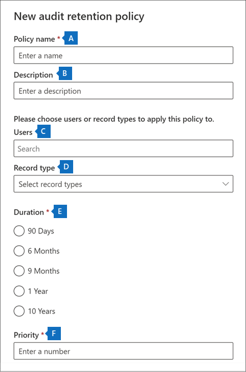

# <a name="manage-audit-log-retention-policies"></a>管理审核日志保留策略

可在 Microsoft 365 合规中心中创建和管理审核日志保留策略。 审核日志保留策略是 Microsoft 365 中新增的高级审核功能的一部分。 通过审核日志保留策略，可指定组织中审核日志的保留时间。 可将审核日志保留长达 10 年时间。 可以根据以下标准创建策略：

- 一个或多个 Microsoft 365 服务中的所有活动
- 所有用户或特定用户执行的特定活动（在 Microsoft 365 服务中）
- 优先级，用于指定当组织中有多个策略时优先使用哪个策略

## <a name="default-audit-log-retention-policy"></a>默认审核日志保留策略

Microsoft 365 中的高级审核功能为所有组织提供默认审核日志保留策略。 此策略将所有的 Exchange Online、SharePoint Online、OneDrive for Business 和 Azure Active Directory 审核记录保留一年。 此默认策略将保留审核记录，其中包含针对 **工作负载** 属性（即活动所发生的服务）的 **Exchange**、**SharePoint**、**OneDrive**、**AzureActiveDirectory** 的值。 无法修改默认策略。 请参阅本文的[详细信息](#more-information)部分，以获取默认策略中包含的每个工作负载的记录类型列表。

> [!NOTE]
> 默认审核日志保留策略仅适用于分配了 Office 365 或 Microsoft 365 E5 许可证或具有 Microsoft 365 E5 合规版或 E5 电子数据展示和审核加载项许可证的用户执行的活动审核记录。 如果你的组织中有非 E5 用户或来宾用户，则其相应的审核记录将保留 90 天。

## <a name="before-you-create-an-audit-log-retention-policy"></a>在创建审核日志保留策略之前

- 你必须在 Microsoft 365 合规中心内分配有组织配置角色，才能创建或修改审核保留策略。

- 在组织中，你最多可以拥有 50 个审核日志保留策略。

- 若要将审核日志保留超过 90 天（以及最多 1 年），必须为生成审核日志的用户（通过执行审核活动）分配 Office 365 E5 或 Microsoft 365 E5 许可证，或者该用户必须具有 Microsoft 365 E5 合规或 E5 电子数据展示和审核加载项许可证。 若要将审核日志保留 10 年，除 E5 许可证外，还必须向生成审核日志的用户分配 10 年审核日志保留附加产品许可证以及 E5 许可证。

- 所有自定义审核日志保留策略（由组织创建）均优先于默认保留策略。例如，如果为具有短于一年保留期的 Exchange 邮箱活动创建审核日志保留策略，则 Exchange 邮箱活动的审核记录将按照自定义策略所指定的较短期限保留。

## <a name="create-an-audit-log-retention-policy"></a>创建审核日志保留策略

1. 转到 <https://compliance.microsoft.com>，然后使用在 Microsoft 365 合规中心的权限页上分配了组织配置角色的用户帐户登录。

2. 在 Microsoft 365 合规中心的左侧窗格中，单击“**审核**”。

3. 点击“**审核保留保留策略**”选项卡。

4. 单击“**创建审核保留策略**”，然后在弹出页面上填写以下字段：

   

   1. **原则名称**：审核日志保留策略的名称。 此名称在你的组织中必须是唯一的，并且在创建策略后不能更改。

   2. **说明**：可选，但有助于提供有关策略的信息，例如记录类型或工作负载、策略中指定的用户以及期限。

   3. **用户**：选择一个或多个要为其应用策略的用户。 如果将此框留空，则该策略将应用于所有用户。 如果将“**记录类型**”留空，则必须选择用户。

   4. **记录类型**：将为其应用策略的审核记录类型。 如果将此属性留空，则必须在“**用户**”框中选择用户。 可选择一种记录类型或多个记录类型：
      - 如果选择一条记录类型，将动态显示“**活动**”字段。 可使用下拉列表从所选记录类型中选择活动，以便对其应用策略。 如果未选择特定活动，则该策略将应用于所选记录类型的所有活动。
      - 如果选择多个记录类型，则不能选择活动。 该策略将应用于所选记录类型的所有活动。

   5. **期限**：保留符合策略条件的审核日志的时间。

   6. **优先级**：此值确定处理组织中的审核日志保留策略的顺序。 该值越小，表示优先级越高。 有效优先级为 **1** 到 **10000** 之间的数值。 值 **1** 优先级最高，值为 **10000** 则优先级最低。 例如，如果策略的值为 **5**，则优先于值为 **10** 的策略。 如前文所述，任何自定义审核日志保留策略都优先于组织的默认策略。

5. 单击“**保存**”以创建新的审核日志保留策略。

新策略将显示在“**审核保留策略**”选项卡上的列表中。

## <a name="manage-audit-log-retention-policies-in-the-microsoft-365-compliance-center"></a>在 Microsoft 365 合规中心管理审核日志保留策略

审核日志保留策略列在“**审核保留策略**”选项卡（也称为 *仪表板*）上。 可使用仪表板查看、编辑和删除审核保留策略。

### <a name="view-policies-in-the-dashboard"></a>在仪表板中查看策略

审核日志保留策略列在仪表板中。 在仪表板中查看策略的一个优点是，可以单击“**优先级**”列以按它们应用的优先级列出策略。 如前所述，值越小表示优先级越高。


也可以选择一个策略以在浮出页面上显示其设置。

> [!NOTE]
> 仪表板中不显示你的组织的默认审核日志保留策略。

### <a name="edit-policies-in-the-dashboard"></a>在仪表板中编辑策略

要编辑策略，请选择它以显示浮出页面。 可以修改一个或多个设置，然后保存更改。

> [!IMPORTANT]
>
> 如果使用 **New UnifiedAuditLogRetentionPolicy** cmdlet，则可以为仪表板中“**创建审核保留策略**”工具中不可用的记录类型或活动创建审核日志保留策略。 在这种情况下，你将无法从“**审核保留策略**”仪表板编辑策略（例如，更改保留期或添加和删除活动）。 只能在合规中心中查看和删除策略。 若要编辑策略，必须在安全与合规中心 PowerShell 中使用 [Set-UnifiedAuditLogRetentionPolicy](/powershell/module/exchange/set-unifiedauditlogretentionpolicy) cmdlet。>
>
> **提示**：对于必须使用 PowerShell 编辑的策略，浮出页面顶部会显示一条消息。

### <a name="delete-policies-in-the-dashboard"></a>在仪表板中删除策略

若要删除策略，请单击 **删除**  图标，然后确认要删除策略。 已从仪表板中删除策略，但从组织中删除策略最长可能需要 30 分钟。

## <a name="create-and-manage-audit-log-retention-policies-in-powershell"></a>在 PowerShell 中创建和管理审核日志保留策略

还可以使用安全与合规中心 PowerShell 来创建和管理审核日志保留策略。 使用 PowerShell 的一个原因是为 UI 中不可用的记录类型或活动创建策略。

### <a name="create-an-audit-log-retention-policy-in-powershell"></a>在 PowerShell 中创建审核日志保留策略

请按照以下步骤在 PowerShell 中创建审核日志保留策略：

1. [连接到安全与合规中心 PowerShell](/powershell/exchange/connect-to-scc-powershell)。

2. 运行以下命令以创建审核日志保留策略：

   ```powershell
   New-UnifiedAuditLogRetentionPolicy -Name "Microsoft Teams Audit Policy" -Description "One year retention policy for all Microsoft Teams activities" -RecordTypes MicrosoftTeams -RetentionDuration TenYears -Priority 100
   ```

   本示例使用以下设置创建名为“Microsoft Teams 审核策略”的审核日志保留策略：

   - 策略说明。
   - 保留所有 Microsoft Teams 活动（由 *RecordType* 参数定义）。
   - 将 Microsoft Teams 审核日志保留 10 年。
   - 优先级为 100。

下面是创建审核日志保留策略的另一个示例。 此策略将用户 admin@contoso.onmicrosoft.com 的“用户登录”活动的审核日志保留六个月。

```powershell
New-UnifiedAuditLogRetentionPolicy -Name "SixMonth retention for admin logons" -RecordTypes AzureActiveDirectoryStsLogon -Operations UserLoggedIn -UserIds admin@contoso.onmicrosoft.com -RetentionDuration SixMonths -Priority 25
```

有关详细信息，请参阅 [New-UnifiedAuditLogRetentionPolicy](/powershell/module/exchange/new-unifiedauditlogretentionpolicy)。

### <a name="view-policies-in-powershell"></a>在 PowerShell 中查看策略

使用安全与合规中心 PowerShell 中的 [Get-UnifiedAuditLogRetentionPolicy](/powershell/module/exchange/get-unifiedauditlogretentionpolicy) cmdlet 查看审核日志保留策略。

下面是用于显示组织中所有审核日志保留策略的设置的示例命令。 此命令从最高优先级到最低优先级对策略进行排序。

```powershell
Get-UnifiedAuditLogRetentionPolicy | Sort-Object -Property Priority -Descending | FL Priority,Name,Description,RecordTypes,Operations,UserIds,RetentionDuration
```

> [!NOTE]
> **Get-UnifiedAuditLogRetentionPolicy** cmdlet 不会返回组织的默认审核日志保留策略。

### <a name="edit-policies-in-powershell"></a>在 PowerShell 中编辑策略

使用安全与合规中心 PowerShell 中的 [Set-UnifiedAuditLogRetentionPolicy](/powershell/module/exchange/set-unifiedauditlogretentionpolicy) cmdlet 编辑现有审核日志保留策略。

### <a name="delete-policies-in-powershell"></a>在 PowerShell 中删除策略

使用安全与合规中心 PowerShell 中的 [Remove-UnifiedAuditLogRetentionPolicy](/powershell/module/exchange/remove-unifiedauditlogretentionpolicy) cmdlet 删除审核日志保留策略。 从组织中删除策略最长可能需要 30 分钟。

## <a name="more-information"></a>详细信息

如前文所述，Azure Active Directory，Exchange Online, SharePoint Online 和 OneDrive for Business 中针对操作的审核记录将默认保留一年。 下表列出了默认审核日志保留策略中包括的所有记录类型（针对每个服务）。 这意味着具有此记录类型的任何操作的审核日志都将保留一年，除非自定义审核日志保留策略对特定的记录类型、操作或用户具有优先权。 括号中显示了每种记录类型的枚举值（在审核记录中显示为 RecordType 属性值）。

<br>

****

|AzureActiveDirectory|Exchange |SharePoint 或 OneDrive|
|---|---|---|
|AzureActiveDirectory (8)|ExchangeAdmin (1)|ComplianceDLPSharePoint (11)|
|AzureActiveDirectoryAccountLogon (9)|ExchangeItem (2)|ComplianceDLPSharePointClassification (33)|
|AzureActiveDirectoryStsLogon (15)|Campaign (62)|Project (35)|
||ComplianceDLPExchange (13)|SharePoint (4)|
||ComplianceSupervisionExchange (68)|SharePointCommentOperation (37)|
||CustomerKeyServiceEncryption (69)|SharePointContentTypeOperation (55)|
||ExchangeAggregatedOperation (19)|SharePointFieldOperation (56)|
||ExchangeItemAggregated (50)|SharePointFileOperation (6)|
||ExchangeItemGroup (3)|SharePointListOperation (36)|
||InformationBarrierPolicyApplication (53)|SharePointSharingOperation (14)|
||||
