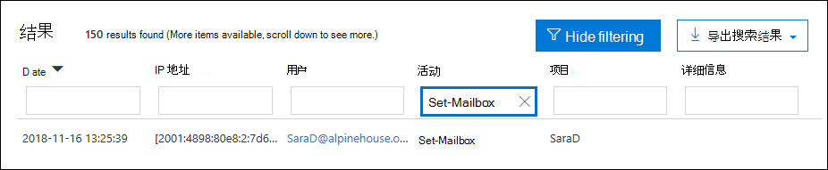
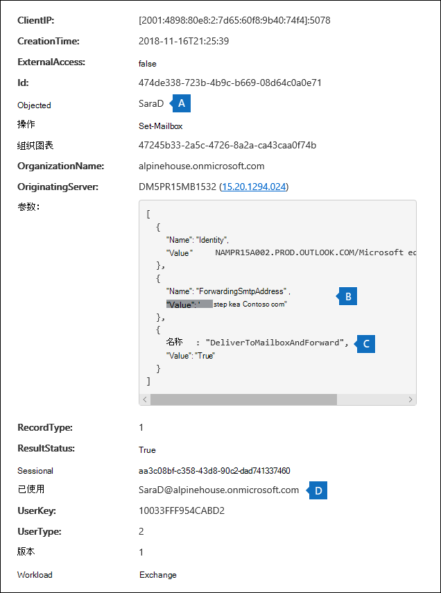
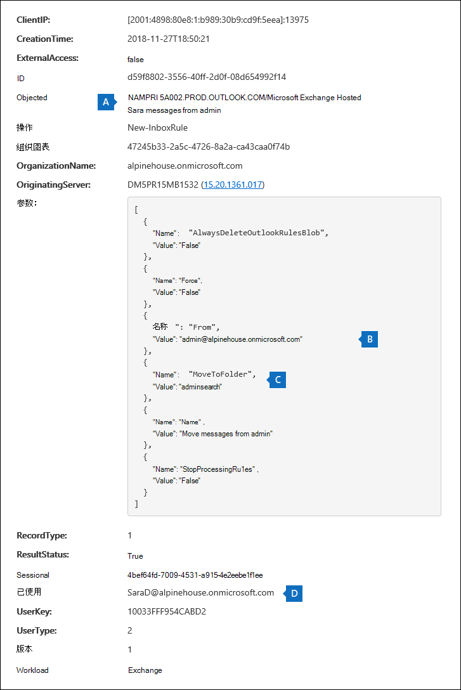

# <a name="search-the-audit-log-to-investigate-common-support-issues"></a>搜索审核日志调查常见支持问题

本文介绍如何使用 审核日志 搜索工具来帮助您调查常见的支持问题。 这包括使用审核日志：

- 查找用于访问遭到入侵的帐户的计算机的 IP 地址
- 确定为邮箱设置电子邮件转发的用户
- 确定用户是否删除了其邮箱中的电子邮件项目
- 确定用户是否创建了收件箱规则
- 调查为什么组织外部的用户成功登录
- 搜索具有非 E5 许可证的用户执行的邮箱活动
- 搜索委派用户执行的邮箱活动

## <a name="using-the-audit-log-search-tool"></a>使用审核日志搜索工具

本文中介绍的每个疑难解答方案都基于使用 审核日志 搜索Microsoft 365 合规中心。 本节列出搜索搜索所需的权限审核日志并介绍访问和运行审核日志搜索的步骤。 每个方案部分介绍如何配置审核日志搜索查询，以及如何在符合搜索条件的审核记录的详细信息中查找内容。

### <a name="permissions-required-to-use-the-audit-log-search-tool"></a>使用搜索工具审核日志所需的权限

必须分配有"审核View-Only或审核日志"角色Exchange Online搜索审核日志。 默认情况下，在 Exchange 管理中心中的“**权限**”页上将这些角色分配给“合规性管理”和“组织管理”角色组。 Office 365 和 Microsoft 365 中的全局管理员将自动添加为 Exchange Online 的组织管理角色组成员。 有关详细信息，请参阅[在 Exchange Online 中管理角色组](/Exchange/permissions-exo/role-groups)。

### <a name="running-audit-log-searches"></a>运行审核日志搜索

本节介绍创建和运行搜索审核日志基础知识。 使用这些说明作为本文中每个疑难解答方案的起点。 有关更详细的分步说明， [请参阅搜索](search-the-audit-log-in-security-and-compliance.md#step-1-run-an-audit-log-search)审核日志。

1. 转到 <https://compliance.microsoft.com/auditlogsearch>，使用工作或学校帐户登录。
  
    将显示“**审核**”页。
  
    
  
2. 可以配置以下搜索条件。 本文中的每个疑难解答方案都推荐了有关配置这些字段的特定指南。
  
   a. **开始日期** 和 **结束日期：** 选择日期和时间范围以显示该时段内发生的事件。 默认情况下选择最近七天。 日期和时间将以协调世界时 (UTC) 格式显示。 可指定的最大日期范围为 90 天。

   b. **活动：** 选择下拉列表以显示可搜索的活动。 运行搜索后，仅将显示所选活动的审核日志项目。 选择 **"显示所有活动的结果"** 将显示满足其他搜索条件的所有活动的结果。 在某些疑难解答方案中，您还必须将此字段留空。
  
    c. **用户：** 单击此框，然后选择一个或多个要显示其搜索结果的用户。 在此框中选择的用户执行的选定活动的审核记录将显示在结果列表中。 将此框留空以返回组织中所有用户（和服务帐户）的条目。
  
    d. **文件、文件夹或网站：** 键入部分或所有文件或文件夹名称，以搜索与包含指定关键字的文件夹文件相关的活动。 你还可以指定文件或文件夹的 URL。 如果使用 URL，请确保键入完整 URL 路径，或者如果您只键入 URL 的一部分，则不要包含任何特殊字符或空格。 将此框留空以返回组织中所有文件和文件夹的条目。 此字段在本文的所有疑难解答方案中都保留为空。
  
3. 选择 **"** 搜索"以使用搜索条件运行搜索。
  
    将加载搜索结果，片刻后，它们将显示在搜索工具的审核日志页面上。 本文中的各节提供有关特定疑难解答方案的上下文中要查找的内容的指南。

    有关查看和导出搜索结果审核日志，请参阅：

    - [查看搜索结果](search-the-audit-log-in-security-and-compliance.md#step-2-view-the-search-results)
  
    - [导出搜索结果](search-the-audit-log-in-security-and-compliance.md#step-3-export-the-search-results-to-a-file)

## <a name="find-the-ip-address-of-the-computer-used-to-access-a-compromised-account"></a>查找用于访问遭到入侵的帐户的计算机的 IP 地址

与由任何用户执行的活动对应的 IP 地址包含在大多数审核记录中。 有关使用的客户端的信息也包含在审核记录中。

下面是如何为此方案配置审核日志搜索查询：

**活动：** 如果与案例相关，请选择要搜索的特定活动。 有关帐户遭到入侵的疑难解答，请考虑在"邮箱活动"下选择"用户登录 **Exchange活动"**。 这将返回审核记录，这些记录显示登录邮箱时使用的 IP 地址。 否则，将此字段留空可返回所有活动的审核记录。 

> [!TIP]
> 将此字段留空将返回 **UserLoggedIn** 活动，Azure Active Directory用户登录用户帐户的一种活动。 使用搜索结果中的筛选功能显示 **UserLoggedIn** 审核记录。

**开始日期****和结束日期**：选择适用于你的调查的日期范围。

**用户：** 如果要调查遭到入侵的帐户，请选择其帐户遭到入侵的用户。 这将返回该用户帐户执行的活动的审核记录。

**文件、文件夹或网站：** 将此字段留空。

运行搜索后，每个活动的 IP 地址将显示在搜索结果中的 **IP** 地址列中。 选择搜索结果中的记录以查看飞出页面上的更多详细信息。

## <a name="determine-who-set-up-email-forwarding-for-a-mailbox"></a>确定为邮箱设置电子邮件转发的用户

为邮箱配置电子邮件转发时，发送到邮箱的电子邮件将被转发到另一个邮箱。 可以将邮件转发给组织内部或外部的用户。 在邮箱上设置电子邮件转发时，Exchange Online使用的基础 cmdlet 为 **Set-Mailbox**。

下面是如何为此方案配置审核日志搜索查询：

**活动：** 将此字段留空，以便搜索返回所有活动的审核记录。 这是返回与 **Set-Mailbox** cmdlet 相关的任何审核记录所必需的。

**开始日期****和结束日期**：选择适用于你的调查的日期范围。

**用户：** 除非您正在调查特定用户的电子邮件转发问题，否则将此字段留空。 这可以帮助您确定电子邮件转发是否设置为任何用户。

**文件、文件夹或网站：** 将此字段留空。

运行搜索后，在 **搜索结果页面上选择** "筛选结果"。 在"活动列 **标题"** 下的框中，键入 **Set-Mailbox，** 以便只显示与 **Set-Mailbox** cmdlet 相关的审核记录。



此时，您必须查看每个审核记录的详细信息，以确定活动是否与电子邮件转发相关。 选择审核记录以显示"**详细信息**"飞出页，然后选择"**详细信息"。** 以下屏幕截图和说明突出显示了指示邮箱上设置了电子邮件转发的信息。



a. 在 **ObjectId** 字段中，将显示设置了电子邮件转发的邮箱的别名。 此邮箱还会显示在搜索结果 **页** 的"项目"列上。

b. 在 **"参数"** 字段中，值 *ForwardingSmtpAddress* 指示邮箱上设置了电子邮件转发。 本示例中，邮件被转发到组织 mike@contoso.com 外部的电子邮件地址 alpinehouse.onmicrosoft.com 邮箱。

c. *DeliverToMailboxAndForward* 参数的 *True* 值指示邮件副本将传递到 sarad@alpinehouse.onmicrosoft.com 并转发到 *ForwardingSmtpAddress* 参数指定的电子邮件地址，本示例中为 mike@contoso.com。  如果 *DeliverToMailboxAndForward* 参数的值设置为 *False，* 则电子邮件仅转发到 *ForwardingSmtpAddress* 参数指定的地址。 不会传递到在 **ObjectId** 字段中指定的邮箱。

d. **UserId** 字段指示在 **ObjectId** 字段中指定的邮箱上设置电子邮件转发的用户。 此用户还会显示在 **搜索结果页上的** "用户"列中。 在这种情况下，邮箱所有者似乎在邮箱上设置了电子邮件转发。

如果您确定不应在邮箱上设置电子邮件转发，可以在 PowerShell 中运行以下命令Exchange Online转发：

```powershell
Set-Mailbox <mailbox alias> -ForwardingSmtpAddress $null 
```

有关与电子邮件转发相关的参数详细信息，请参阅 [Set-Mailbox](/powershell/module/exchange/set-mailbox) 文章。

## <a name="determine-if-a-user-deleted-email-items"></a>确定用户是否已删除电子邮件项目

从 2019 年 1 月开始，Microsoft 将默认为所有 Office 365 和 Microsoft 组织启用邮箱审核日志记录。 这意味着自动记录由邮箱所有者执行的某些操作，并且当您在邮箱中搜索相应的邮箱审核记录时审核日志。 默认情况下，在启用邮箱审核之前，您必须为组织的每个用户邮箱手动启用它。 

默认情况下记录的邮箱操作包括邮箱所有者执行的 SoftDelete 和 HardDelete 邮箱操作。 这意味着您可以使用以下步骤在电子邮件审核日志搜索与已删除电子邮件项目相关的事件。 有关默认情况下的邮箱审核功能详细信息，请参阅 [管理邮箱审核](enable-mailbox-auditing.md)。

下面是如何为此方案配置审核日志搜索查询：

**活动：** 在 **Exchange邮箱活动"下**，选择以下一个或两个活动：

- **从"已删除邮件"文件夹中删除的邮件：** 此活动对应于 **SoftDelete** 邮箱审核操作。 当用户通过选择项目并按 **Shift+Delete** 来永久删除某个项目时，也会记录此活动。 在永久删除某个项目后，用户可以恢复它，直到已删除项目的保留期过期为止。

- **从邮箱中清除的邮件：** 此活动对应于 **HardDelete** 邮箱审核操作。 当用户从"可恢复的项目"文件夹中清除项目时，会记录此记录。 管理员可以使用安全与合规中心的内容搜索工具搜索和恢复已清除的项目，直到已删除项目的保留期过期或用户邮箱保留的时间更长。

**开始日期****和结束日期**：选择适用于你的调查的日期范围。

**用户：** 如果在此字段中选择用户，审核日志 搜索工具将返回由指定用户 (SoftDeleted 或 HardDeleted) 删除的电子邮件项目的审核记录。 有时，删除电子邮件的用户可能不是邮箱所有者。

**文件、文件夹或网站：** 将此字段留空。

运行搜索后，可以筛选搜索结果以显示软删除项目或硬删除项目的审核记录。 选择审核记录以显示"**详细信息**"飞出页，然后选择"**详细信息"。** 有关已删除项目的其他信息（如主题行和项目被删除时的位置）将显示在 **AffectedItems** 字段中。 以下屏幕截图显示了软删除项和硬删除项中的 **AffectedItems** 字段示例。

**软删除项的 AffectedItems 字段示例**


**硬删除项的 AffectedItems 字段示例**


### <a name="recover-deleted-email-items"></a>恢复已删除的电子邮件项目

如果已删除项目的保留期尚未过期，用户可以恢复软删除的项目。 在Exchange Online，默认已删除项目的保留期为 14 天，但管理员可以将此设置最长增加至 30 天。 将用户指向本文中的["恢复已删除项目或](https://support.office.com/article/Recover-deleted-items-or-email-in-Outlook-Web-App-C3D8FC15-EEEF-4F1C-81DF-E27964B7EDD4)Outlook 网页版，获得有关恢复已删除项目的说明。

如前所述，如果已删除项目的保留期尚未过期或邮箱已置于保留状态（在这种情况下，项目将一直保留到保留期到期，则管理员可以恢复硬删除的项目）。 运行内容搜索时，搜索结果中将返回"可恢复的项目"文件夹中的软删除和硬删除项目（如果它们与搜索查询匹配）。 有关运行内容搜索的信息，请参阅内容搜索[Office 365。](content-search.md)

> [!TIP]
> 若要搜索已删除的电子邮件项目，请搜索在审核记录的 **AffectedItems** 字段中显示的整个或部分主题行。

## <a name="determine-if-a-user-created-an-inbox-rule"></a>确定用户是否创建了收件箱规则

当用户为邮箱创建收件箱规则Exchange Online，相应的审核记录将保存到审核日志。 有关收件箱规则详细信息，请参阅：

- [使用收件箱中的Outlook 网页版](https://support.office.com/article/use-inbox-rules-in-outlook-on-the-web-8400435c-f14e-4272-9004-1548bb1848f2)
- [使用规则Outlook电子邮件](https://support.office.com/article/Manage-email-messages-by-using-rules-C24F5DEA-9465-4DF4-AD17-A50704D66C59)

下面是如何为此方案配置审核日志搜索查询：

**活动：** 在 **Exchange邮箱活动"下**，选择以下一个或两个活动：

- **New-InboxRule 从新建收件箱规则Outlook Web App。** 当使用 Web 应用或 PowerShell 创建收件箱规则时Outlook此活动Exchange Online审核记录。

- **更新了客户端 中的Outlook规则**。 当使用桌面客户端创建、修改或删除收件箱规则时，此活动Outlook审核记录。

**开始日期****和结束日期**：选择适用于你的调查的日期范围。

**用户：** 除非您正在调查特定用户，否则将此字段留空。 这可帮助你识别由任何用户设置的新收件箱规则。

**文件、文件夹或网站：** 将此字段留空。

运行搜索后，此活动的任何审核记录都将显示在搜索结果中。 选择审核记录以显示"**详细信息**"飞出页，然后选择"**详细信息"。** 有关收件箱规则设置的信息显示在" **参数"** 字段中。 以下屏幕截图和说明突出显示有关收件箱规则的信息。



a. 在 **ObjectId** 字段中，显示收件箱规则的完整名称。 此名称包括用户邮箱名称的别名 (例如 SaraD) 以及收件箱规则的名称 (例如"从管理员移动邮件") 。

b. 在 **"参数"** 字段中，显示收件箱规则的条件。 本示例中，条件由 *From* 参数指定。 为 From 参数 *定义的* 值指示收件箱规则对由邮件发送 admin@alpinehouse.onmicrosoft.com。 有关可用于定义收件箱规则条件的参数的完整列表，请参阅 [New-InboxRule](/powershell/module/exchange/new-inboxrule) 文章。

c. *MoveToFolder* 参数指定收件箱规则的操作。 本示例中，从邮件 admin@alpinehouse.onmicrosoft.com 邮件将移动到名为 *AdminSearch 的文件夹*。 另请参阅 [New-InboxRule](/powershell/module/exchange/new-inboxrule) 文章，了解可用于定义收件箱规则操作的参数的完整列表。

d. **UserId** 字段指示创建在 **ObjectId** 字段中指定的收件箱规则的用户。 此用户还会显示在 **搜索结果页上的** "用户"列中。

## <a name="investigate-why-there-was-a-successful-login-by-a-user-outside-your-organization"></a>调查为什么组织外部的用户成功登录

在检查审核记录审核日志，您可能会看到指示外部用户已通过 Azure Active Directory 身份验证并成功登录到组织的记录。 例如，contoso.onmicrosoft.com 管理员可能会看到一条审核记录，显示来自不同组织的用户 (例如，fabrikam.onmicrosoft.com) 已成功登录到 contoso.onmicrosoft.com。 同样，你可能会看到指示具有 Microsoft 帐户 (MSA) 的用户（如 Outlook.com 或 Live.com）成功登录到组织的审核记录。 在这些情况下，审核的活动为 **"用户登录"。** 

此行为是设计使然。 Azure Active Directory (Azure AD) ，目录服务允许外部用户尝试访问组织中 SharePoint站点或 OneDrive 位置时称为传递身份验证。 当外部用户尝试这样做时，系统会提示他们输入其凭据。 Azure AD使用凭据对用户进行身份验证，这意味着Azure AD验证用户的身份。 审核记录中成功登录的指示是用户Azure AD验证的结果。 成功的登录并不意味着用户能够访问任何资源或在组织中执行任何其他操作。 它仅指示用户已通过身份验证Azure AD。 为了让传递用户访问 SharePoint 或 OneDrive 资源，您组织的用户必须通过向外部用户发送共享邀请或匿名共享链接来显式共享资源。 

> [!NOTE]
> Azure AD仅允许第一方应用程序（如 SharePoint Online 和 OneDrive for Business）进行传递OneDrive for Business。 其他第三方应用程序不允许使用。

下面是作为传递身份验证结果的用户登录事件的审核记录中的相关属性的示例和说明。 选择审核记录以显示"**详细信息**"飞出页，然后选择"**详细信息"。**


   a. 此字段指示未在组织的组织中找到尝试访问组织中资源Azure AD。

   b. 此字段显示尝试访问组织中资源的外部用户的 UPN。 此用户 ID 也在审核记录的 **User** 和 **UserId** 属性中标识。

   c. **ApplicationId** 属性标识触发登录请求的应用程序。 此审核记录中的 ApplicationId 属性中显示的值 00000003-0000-0ff1-ce00-000000000000000 指示 SharePoint Online。 OneDrive for Business也具有相同的 ApplicationId。

   d. 这表示传递身份验证成功。 换句话说，用户已通过身份验证成功通过Azure AD。 

   e. **RecordType** 值 **15** 指示已审核的活动 (UserLoggedIn) 是 Azure AD 中的安全令牌服务 (STS) 登录事件。

有关 UserLoggedIn 审核记录中显示的其他属性Azure AD管理活动 API 架构Office 365[相关的架构信息](/office/office-365-management-api/office-365-management-activity-api-schema#azure-active-directory-base-schema)。

下面是由于传递身份验证导致用户成功登录审核活动的两个示例方案： 

  - 拥有 Microsoft 帐户 (（如 SaraD@outlook.com) ）的用户尝试访问 fourthcoffee.onmicrosoft.com 中 OneDrive for Business 帐户中的文档，fourthcoffee.onmicrosoft.com 中没有 SaraD@outlook.com 的相应来宾用户帐户。

  - 在组织中拥有工作或学校帐户的用户 (如 pilarp@fabrikam.onmicrosoft.com) 已尝试访问 contoso.onmicrosoft.com 中的 SharePoint 网站，contoso.onmicrosoft.com 中没有 pilarp@fabrikam.com 对应的来宾用户帐户。

### <a name="tips-for-investigating-successful-logins-resulting-from-pass-through-authentication"></a>使用技巧方法，用于调查通过传递身份验证成功登录

- 搜索审核日志用户登录审核记录中标识的外部 **用户执行的活动** 。 在"用户"框中键入外部用户的 UPN，并使用日期范围（如果与方案相关）。  例如，您可以使用以下搜索条件创建搜索：

   

    除了"用户登录"活动外，可能返回其他审核记录，例如指示组织中用户与外部用户共享资源的记录，以及外部用户是否访问、修改或下载了与外部用户共享的文档。

- 搜索SharePoint共享活动，这些活动指示文件已与由登录审核记录的用户标识 **的外部用户** 共享。 有关详细信息，请参阅[在审核日志中使用共享审核](use-sharing-auditing.md)。

- 导出审核日志包含与调查相关的记录的搜索结果，以便Excel搜索与外部用户相关的其他活动。 有关详细信息，请参阅导出  [、配置和查看审核日志记录](export-view-audit-log-records.md)。

## <a name="search-for-mailbox-activities-performed-by-users-with-non-e5-licenses"></a>搜索具有非 E5 许可证的用户执行的邮箱活动

即使默认情况下 [](enable-mailbox-auditing.md)为组织启用邮箱审核，您可能会注意到，使用合规性中心 **、Search-UnifiedAuditLog** cmdlet 或 Office 365 管理活动 API 在 审核日志 搜索中找不到某些用户的邮箱审核事件。 这样做的原因是，当您使用之前的方法之一搜索统一邮箱时，将仅为具有 E5 许可证的用户返回邮箱审核审核日志。

若要检索审核日志 E5 用户的邮箱记录，可以执行以下解决方法之一：

- 手动启用单个邮箱的邮箱审核 (在 PowerShell Exchange Online `Set-Mailbox -Identity <MailboxIdentity> -AuditEnabled $true` 中运行) 。 完成此操作后，使用合规性中心 **、Search-UnifiedAuditLog** cmdlet 或 Office 365 活动 API 搜索邮箱审核活动。
  
  > [!NOTE]
  > 如果邮箱审核在邮箱上显示为已启用，但搜索未返回任何结果，请更改 _AuditEnabled_ 参数的值，然后再更改 `$false` 回 `$true` 。
  
- 在 PowerShell 中使用以下 cmdlet Exchange Online：

  - [Search-MailboxAuditLog](/powershell/module/exchange/search-mailboxauditlog) 搜索特定审核日志邮箱邮箱。

  - [New-MailboxAuditLogSearch](/powershell/module/exchange/new-mailboxauditlogsearch) 可搜索特定审核日志邮箱邮箱，并通过电子邮件将结果发送给指定收件人。

## <a name="search-for-mailbox-activities-performed-in-a-specific-mailbox-including-shared-mailboxes"></a>搜索特定邮箱邮箱中执行的邮箱 (包括共享邮箱) 

使用合规性中心的审核日志 搜索工具中的"用户"下拉列表或在 Exchange Online PowerShell 中使用 **Search-UnifiedAuditLog -UserIds** 命令时，可以搜索特定用户执行的活动。 对于邮箱审核活动，这种类型的搜索将搜索指定用户执行的活动。 这并不保证在同一邮箱中执行的所有活动都返回在搜索结果中。 例如，审核日志 搜索不会返回由委派用户执行的活动的审核记录，因为搜索特定用户执行的邮箱活动不会返回由分配了访问其他用户邮箱的权限的代理用户执行的活动。  (委派用户是已分配有其他用户邮箱的 SendAs、SendOnBehalf 或 FullAccess 邮箱权限的用户。) 

此外，使用审核日志 中的"用户"下拉列表或 **Search-UnifiedAuditLog -UserIds** 不会返回共享邮箱中执行的活动的结果。

若要搜索特定邮箱中执行的活动或搜索共享邮箱中执行的活动，在运行 **Search-UnifiedAuditLog** cmdlet 时，请使用以下语法：

```powershell
Search-UnifiedAuditLog  -StartDate <date> -EndDate <date> -FreeText (Get-Mailbox <mailbox identity).ExchangeGuid
```

例如，以下命令返回 2020 年 8 月到 2020 年 10 月之间在 Contoso 合规性团队共享邮箱中执行的活动的审核记录：

```powershell
Search-UnifiedAuditLog  -StartDate 08/01/2020 -EndDate 10/31/2020 -FreeText (Get-Mailbox complianceteam@contoso.onmicrosoft.com).ExchangeGuid
```

或者，您可以使用 **Search-MailboxAuditLog** cmdlet 搜索特定邮箱中执行的活动的审核记录。 这包括搜索在共享邮箱中执行的活动。

下面的示例返回 Contoso 合规性审核日志共享邮箱中执行的活动的邮箱记录：

```powershell
Search-MailboxAuditLog -Identity complianceteam@contoso.onmicrosoft.com -StartDate 08/01/2020 -EndDate 10/31/2020 -ShowDetails
```

下面的示例返回由审核日志用户指定的邮箱中执行的活动的邮箱记录：

```powershell
Search-MailboxAuditLog -Identity <mailbox identity> -StartDate <date> -EndDate <date> -LogonTypes Delegate -ShowDetails
```

您还可以使用 **New-MailboxAuditLogSearch** cmdlet 在 审核日志 中搜索特定邮箱，并通过电子邮件将结果发送给指定的收件人。