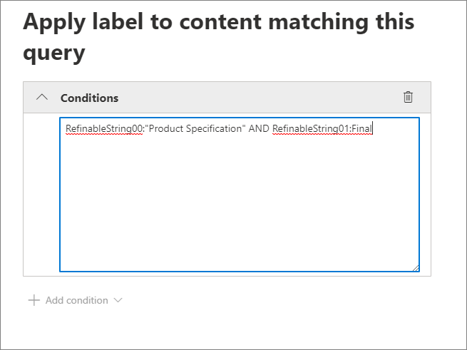

# <a name="manage-the-lifecycle-of-sharepoint-documents-with-retention-labels"></a><span data-ttu-id="a4a20-104">使用保留标签管理 SharePoint 文档的生命周期</span><span class="sxs-lookup"><span data-stu-id="a4a20-104">Manage the lifecycle of SharePoint documents with retention labels</span></span>

><span data-ttu-id="a4a20-105">*[Microsoft 365 安全性与合规性许可指南](https://aka.ms/ComplianceSD)。*</span><span class="sxs-lookup"><span data-stu-id="a4a20-105">*[Microsoft 365 licensing guidance for security & compliance](https://aka.ms/ComplianceSD).*</span></span>

<span data-ttu-id="a4a20-106">本文介绍如何通过使用保留标签管理存储在 SharePoint Online 中的产品相关文档的生命周期，具体方法是自动应用标签并配置基于事件的保留。</span><span class="sxs-lookup"><span data-stu-id="a4a20-106">This article describes how you can manage the lifecycle of product-related documents stored in SharePoint Online by using retention labels, and specifically by auto-applying labels and configuring event-based retention.</span></span> <span data-ttu-id="a4a20-107">自动应用功能通过使用 SharePoint 元数据来利用文档分类。</span><span class="sxs-lookup"><span data-stu-id="a4a20-107">The auto-apply functionality leverages document classification by the use of SharePoint metadata.</span></span> <span data-ttu-id="a4a20-108">本文中的方案基于与产品相关的文档，但是相同的概念也可以用于其他方案。</span><span class="sxs-lookup"><span data-stu-id="a4a20-108">The scenario in this article is based on product-related documents, but the same concepts can be used for other scenarios.</span></span> <span data-ttu-id="a4a20-109">例如，在石油和天然气行业，可以管理与石油平台、钻井日志或生产许可证等实物资产相关的文档的生命周期。</span><span class="sxs-lookup"><span data-stu-id="a4a20-109">For example, in the oil and gas industry, you could manage the lifecycle of documents related to physical assets such as oil platforms, well logs, or production licenses.</span></span> <span data-ttu-id="a4a20-110">在金融服务行业，你可以管理与银行账户、抵押或保险合同相关的文档。</span><span class="sxs-lookup"><span data-stu-id="a4a20-110">In the financial services industry, you can manage documents related to bank accounts, mortgages, or insurance contracts.</span></span> <span data-ttu-id="a4a20-111">在公共部门，你可以管理与施工许可证或纳税表相关的文档。</span><span class="sxs-lookup"><span data-stu-id="a4a20-111">In the public sector, you can manage documents related to construction permits or tax forms.</span></span>

<span data-ttu-id="a4a20-112">让我们看一下本文中的方案。</span><span class="sxs-lookup"><span data-stu-id="a4a20-112">Let's look at the scenario for this article.</span></span> <span data-ttu-id="a4a20-113">我们将探讨信息体系结构和保留标签的定义。</span><span class="sxs-lookup"><span data-stu-id="a4a20-113">We'll look at the information architecture and the definition of the retention labels.</span></span> <span data-ttu-id="a4a20-114">然后，我们将通过自动应用标签对文档进行分类，最后生成用于触发保留期的事件。</span><span class="sxs-lookup"><span data-stu-id="a4a20-114">Then we'll look at classifying documents by auto-applying the labels, and finally generating the events that initiate the start of the retention period.</span></span>

## <a name="information-architecture"></a><span data-ttu-id="a4a20-115">信息体系结构</span><span class="sxs-lookup"><span data-stu-id="a4a20-115">Information architecture</span></span>

<span data-ttu-id="a4a20-116">本文中的方案基于一家制造公司，它使用 SharePoint Online 来存储与公司开发的产品相关的所有文档。</span><span class="sxs-lookup"><span data-stu-id="a4a20-116">The scenario for this article is based on a manufacturing company that uses SharePoint Online to store all the documents related to the products the company develops.</span></span> <span data-ttu-id="a4a20-117">这些文档包括产品规范、与供应商签订的协议以及用户手册。</span><span class="sxs-lookup"><span data-stu-id="a4a20-117">These documents include product specifications, agreements with suppliers, and user manuals.</span></span> <span data-ttu-id="a4a20-118">将这些文档作为企业内容管理策略的一部分存储在 SharePoint 中时，需要定义文档元数据并将其用于分类。</span><span class="sxs-lookup"><span data-stu-id="a4a20-118">When these documents are stored in SharePoint as part of the Enterprise Content Management policies, document metadata is defined and used to classify them.</span></span> <span data-ttu-id="a4a20-119">每个文档都具有以下元数据属性：</span><span class="sxs-lookup"><span data-stu-id="a4a20-119">Each document has the following metadata properties:</span></span>

- <span data-ttu-id="a4a20-120">**文档类型**（例如产品规范、协议和用户手册）</span><span class="sxs-lookup"><span data-stu-id="a4a20-120">**Doc Type** (such as product specification, agreement, and user manual)</span></span>

- <span data-ttu-id="a4a20-121">**产品名称**</span><span class="sxs-lookup"><span data-stu-id="a4a20-121">**Product Name**</span></span>

- <span data-ttu-id="a4a20-122">**状态**（草稿或终稿）</span><span class="sxs-lookup"><span data-stu-id="a4a20-122">**Status** (draft or final)</span></span>

<span data-ttu-id="a4a20-123">此元数据形成所有文档的基本内容类型，它称为**生产文档**。</span><span class="sxs-lookup"><span data-stu-id="a4a20-123">This metadata forms the base content type called **Production Document** for all documents.</span></span>


> [!NOTE]
> <span data-ttu-id="a4a20-125">在方案的后面部分中，保留策略将使用**文档类型**和**状态**属性进行分类并自动应用保留标签。</span><span class="sxs-lookup"><span data-stu-id="a4a20-125">The **Doc Type** and **Status** properties are used by retention policies later in the scenario to classify and auto-apply retention labels.</span></span>

<span data-ttu-id="a4a20-126">我们可以拥有几种表示不同类型文档的内容类型，但我们将重点介绍产品文档。</span><span class="sxs-lookup"><span data-stu-id="a4a20-126">We can have several content types that represent different types of documents, but let's focus on the Product Documentation.</span></span>

<span data-ttu-id="a4a20-127">在此方案中，我们使用托管元数据服务和术语库为**文档类型**创建一个术语集，并为**产品名称**创建另一个术语集。</span><span class="sxs-lookup"><span data-stu-id="a4a20-127">In this scenario, we use the Managed Metadata service and the Term store to create a term set for **Doc Type** and another one for **Product Name**.</span></span> <span data-ttu-id="a4a20-128">对于每个术语集，我们将为每个值创建一个术语。</span><span class="sxs-lookup"><span data-stu-id="a4a20-128">For each term set, we create a term for each value.</span></span> <span data-ttu-id="a4a20-129">在 SharePoint 组织的术语库中，它看起来类似于以下示例：</span><span class="sxs-lookup"><span data-stu-id="a4a20-129">It would look like something like this in Term store for your SharePoint organization:</span></span>


<span data-ttu-id="a4a20-131">可以使用[内容类型中心](https://support.office.com/article/manage-content-type-publishing-06f39ac0-5576-4b68-abbc-82b68334889b)创建和发布内容类型。</span><span class="sxs-lookup"><span data-stu-id="a4a20-131">Content Type can be created and published using the [Content Type Hub](https://support.office.com/article/manage-content-type-publishing-06f39ac0-5576-4b68-abbc-82b68334889b).</span></span> <span data-ttu-id="a4a20-132">也可以使用网站预配工具（例如 [PnP 预配框架](https://docs.microsoft.com/sharepoint/dev/solution-guidance/pnp-provisioning-framework)或[网站设计 JSON 架构](https://docs.microsoft.com/sharepoint/dev/declarative-customization/site-design-json-schema#define-a-new-content-type)）创建和发布内容类型。</span><span class="sxs-lookup"><span data-stu-id="a4a20-132">A content type can also be created and published using site provisioning tools such as the [PnP provisioning framework](https://docs.microsoft.com/sharepoint/dev/solution-guidance/pnp-provisioning-framework) or the [site design JSON schema](https://docs.microsoft.com/sharepoint/dev/declarative-customization/site-design-json-schema#define-a-new-content-type).</span></span>

<span data-ttu-id="a4a20-133">每个产品都有一个专用的 SharePoint Online 网站，其中包含一个文档库，并且已启用正确的内容类型。</span><span class="sxs-lookup"><span data-stu-id="a4a20-133">Each product has a dedicated SharePoint Online site that contains one document library, with the right content types enabled.</span></span> <span data-ttu-id="a4a20-134">所有文档都存储在此文档库中。</span><span class="sxs-lookup"><span data-stu-id="a4a20-134">All documents are stored in this document library.</span></span>


> [!NOTE]
> <span data-ttu-id="a4a20-136">在此方案中，制造公司可以为每个产品使用 Microsoft 团队以支持与团队成员的协作（例如持久聊天），而不是使每个产品都有一个 SharePoint Online 网站，它还可使用团队中的“**文件**”选项卡进行文档管理。</span><span class="sxs-lookup"><span data-stu-id="a4a20-136">Instead of having a SharePoint Online site per product, the manufacturing company in this scenario could use a Microsoft Team per product that would support collaboration with members of the team, such as persistent chat and use the **Files** tab in the team for document management.</span></span> <span data-ttu-id="a4a20-137">在本文中，我们只重点介绍文档，因此我们将只使用一个网站。</span><span class="sxs-lookup"><span data-stu-id="a4a20-137">In this article we only focus on documents, therefore we will only use a site.</span></span>

<span data-ttu-id="a4a20-138">以下是旋转小组件产品的文档库视图：</span><span class="sxs-lookup"><span data-stu-id="a4a20-138">Here's a view of the document library for the Spinning Widget product:</span></span>


<span data-ttu-id="a4a20-140">现在，我们拥有用于文档管理的基本信息体系结构，下面让我们看一下使用元数据和文档分类的文档保留和处置策略。</span><span class="sxs-lookup"><span data-stu-id="a4a20-140">Now that we have the basic information architecture in place for document management, let's look at the retention and disposal strategy of the documents that use the metadata and classification of documents.</span></span>

## <a name="retention-and-disposition"></a><span data-ttu-id="a4a20-141">保留和处置</span><span class="sxs-lookup"><span data-stu-id="a4a20-141">Retention and disposition</span></span>

<span data-ttu-id="a4a20-142">制造公司的合规性和数据管理策略规定了保存和处置数据的方式。</span><span class="sxs-lookup"><span data-stu-id="a4a20-142">The manufacturing company's compliance and data governance policies dictate the way data is preserved and disposed of.</span></span> <span data-ttu-id="a4a20-143">与产品相关的文档必须在产品生产期间保存，并在生产之后保存一段时间。</span><span class="sxs-lookup"><span data-stu-id="a4a20-143">Product-related documents must be kept for as long as the product is manufactured, and for a certain period after that.</span></span> <span data-ttu-id="a4a20-144">对于产品规范、协议和用户手册，此期限有所不同。</span><span class="sxs-lookup"><span data-stu-id="a4a20-144">This period is different for product specifications, agreements, and user manuals.</span></span> <span data-ttu-id="a4a20-145">下表列出了保留和处置要求：</span><span class="sxs-lookup"><span data-stu-id="a4a20-145">The following table indicates the retention and disposition requirements:</span></span>

| <span data-ttu-id="a4a20-146">**文档类型**</span><span class="sxs-lookup"><span data-stu-id="a4a20-146">**Document type**</span></span>          | <span data-ttu-id="a4a20-147">**保留**</span><span class="sxs-lookup"><span data-stu-id="a4a20-147">**Retention**</span></span>                          | <span data-ttu-id="a4a20-148">**处置**</span><span class="sxs-lookup"><span data-stu-id="a4a20-148">**Disposition**</span></span>                              |
| -------------------------- | -------------------------------------- | -------------------------------------------- |
| <span data-ttu-id="a4a20-149">产品规范</span><span class="sxs-lookup"><span data-stu-id="a4a20-149">Product specification</span></span>      | <span data-ttu-id="a4a20-150">产品停产后保留 5 年</span><span class="sxs-lookup"><span data-stu-id="a4a20-150">5 years after cessation of production</span></span>  | <span data-ttu-id="a4a20-151">删除</span><span class="sxs-lookup"><span data-stu-id="a4a20-151">Delete</span></span>                                       |
| <span data-ttu-id="a4a20-152">产品协议</span><span class="sxs-lookup"><span data-stu-id="a4a20-152">Product agreement</span></span>          | <span data-ttu-id="a4a20-153">产品停产后保留 10 年</span><span class="sxs-lookup"><span data-stu-id="a4a20-153">10 years after cessation of production</span></span> | <span data-ttu-id="a4a20-154">审阅</span><span class="sxs-lookup"><span data-stu-id="a4a20-154">Review</span></span>                                       |
| <span data-ttu-id="a4a20-155">用户手册</span><span class="sxs-lookup"><span data-stu-id="a4a20-155">User manual</span></span>                | <span data-ttu-id="a4a20-156">产品停产后保留 5 年</span><span class="sxs-lookup"><span data-stu-id="a4a20-156">5 years after cessation of production</span></span>  | <span data-ttu-id="a4a20-157">删除</span><span class="sxs-lookup"><span data-stu-id="a4a20-157">Delete</span></span>                                       |
| <span data-ttu-id="a4a20-158">所有其他类型的文档</span><span class="sxs-lookup"><span data-stu-id="a4a20-158">All other types of documents</span></span> | <span data-ttu-id="a4a20-159">不主动保留其他文档</span><span class="sxs-lookup"><span data-stu-id="a4a20-159">Don't actively retain other documents</span></span>  | <span data-ttu-id="a4a20-160">文档超过 3 年时删除<sup>\*</sup></span><span class="sxs-lookup"><span data-stu-id="a4a20-160">Delete when document is older than 3 years<sup>\*</sup></span></span>  |
|||

> [!NOTE]
> <span data-ttu-id="a4a20-161"><sup>\*</sup> 如果文档在过去 3 年内未曾修改，则视为超过 3 年。</span><span class="sxs-lookup"><span data-stu-id="a4a20-161"><sup>\*</sup> A document is considered older than 3 years if it hasn't been modified within the last 3 years.</span></span>

<span data-ttu-id="a4a20-162">使用安全与合规中心，我们将创建以下保留标签：</span><span class="sxs-lookup"><span data-stu-id="a4a20-162">Using the security and compliance center, we create the following retention labels:</span></span>

  - <span data-ttu-id="a4a20-163">产品规范</span><span class="sxs-lookup"><span data-stu-id="a4a20-163">Product Specification</span></span>

  - <span data-ttu-id="a4a20-164">产品协议</span><span class="sxs-lookup"><span data-stu-id="a4a20-164">Product Agreement</span></span>

  - <span data-ttu-id="a4a20-165">用户手册</span><span class="sxs-lookup"><span data-stu-id="a4a20-165">User Manual</span></span>

<span data-ttu-id="a4a20-166">在本文中，我们只介绍如何创建和自动应用产品规范保留标签。</span><span class="sxs-lookup"><span data-stu-id="a4a20-166">In this article, we only show how to create and auto-apply the Product Specification retention label.</span></span> <span data-ttu-id="a4a20-167">若要实施完整方案，可创建并自动应用其他两种文档类型的保留标签。</span><span class="sxs-lookup"><span data-stu-id="a4a20-167">To implement the complete scenario, you would create and auto-apply retention labels for the other two document types.</span></span>

### <a name="settings-for-the-product-specification-retention-label"></a><span data-ttu-id="a4a20-168">产品规范保留标签的设置</span><span class="sxs-lookup"><span data-stu-id="a4a20-168">Settings for the Product Specification retention label</span></span>

<span data-ttu-id="a4a20-169">以下是产品规范保留标签的[文件计划](file-plan-manager.md)：</span><span class="sxs-lookup"><span data-stu-id="a4a20-169">Here's the [file plan](file-plan-manager.md) for the Product Specification retention label:</span></span> 

- <span data-ttu-id="a4a20-170">**名称：** 产品规范</span><span class="sxs-lookup"><span data-stu-id="a4a20-170">**Name:** Product Specification</span></span>

- <span data-ttu-id="a4a20-171">**管理员说明：** 产品规范标签，产品停产后保留五年，自动删除，基于事件的保留，事件类型为“产品停产”。</span><span class="sxs-lookup"><span data-stu-id="a4a20-171">**Description for admins:** Product Specification Label, retain for five years after cessation of production, auto delete, event-based retention, event type is Product Cessation.</span></span>

- <span data-ttu-id="a4a20-172">**用户说明：** 在产品停产后保留五年。</span><span class="sxs-lookup"><span data-stu-id="a4a20-172">**Description for users:** Retain for five years after cessation of production.</span></span>

- <span data-ttu-id="a4a20-173">**保留操作：** 保留和删除</span><span class="sxs-lookup"><span data-stu-id="a4a20-173">**Retention action:** Keep and delete</span></span>

- <span data-ttu-id="a4a20-174">**保留期：** 五年（1825 天）</span><span class="sxs-lookup"><span data-stu-id="a4a20-174">**Retention duration:** Five years (1825 days)</span></span>

- <span data-ttu-id="a4a20-175">**记录标签：** 配置保留标签以将内容分类为[记录](records.md)（用户无法修改或删除分类为记录的文档）</span><span class="sxs-lookup"><span data-stu-id="a4a20-175">**Record label**: Configure the retention label to classify content as a [record](records.md) (documents that are classified as a record can't be modified or deleted by users)</span></span>

- <span data-ttu-id="a4a20-176">**文件计划描述符：**（为简化方案，未提供文件描述符）</span><span class="sxs-lookup"><span data-stu-id="a4a20-176">**File plan descriptors:** (for simplifying the scenario, no file descriptors are provided)</span></span>

<span data-ttu-id="a4a20-177">以下屏幕截图显示了在 Microsoft 365 合规中心内创建产品规范[保留标签](retention.md#retention-labels)时的设置。</span><span class="sxs-lookup"><span data-stu-id="a4a20-177">The following screenshot shows the settings when you create the Product Specification [retention label](retention.md#retention-labels) in the Microsoft 365 compliance center.</span></span> <span data-ttu-id="a4a20-178">创建保留标签时，可创建“**产品停产**”事件类型。</span><span class="sxs-lookup"><span data-stu-id="a4a20-178">You can create the **Product Cessation** event type when you create the retention label.</span></span> <span data-ttu-id="a4a20-179">请参阅以下步骤。</span><span class="sxs-lookup"><span data-stu-id="a4a20-179">See the steps below.</span></span>


> [!NOTE]
> <span data-ttu-id="a4a20-181">出于实用目的，为了避免需要等待 5 年才能看到自动删除的文档，如果要在测试环境中重新创建此方案，请将保留期设置为 1 天。</span><span class="sxs-lookup"><span data-stu-id="a4a20-181">For the practical purposes and to avoid having to wait 5 years to see a document automatically deleted, set the retention duration to 1 day if you're recreating this scenario in your test environment.</span></span>

### <a name="create-an-event-type-when-creating-a-retention-label"></a><span data-ttu-id="a4a20-182">创建保留标签时创建事件类型</span><span class="sxs-lookup"><span data-stu-id="a4a20-182">Create an event type when creating a retention label</span></span>

1. <span data-ttu-id="a4a20-183">在“**基于以下条件保留或删除内容**”下拉列表中，选择“**事件**”。</span><span class="sxs-lookup"><span data-stu-id="a4a20-183">In the **Retain or delete content based** on dropdown list, select **an event**.</span></span>

2. <span data-ttu-id="a4a20-184">选择“**选择事件类型**”。</span><span class="sxs-lookup"><span data-stu-id="a4a20-184">Select **Choose an event type**.</span></span>

   

3. <span data-ttu-id="a4a20-186">在“**选择事件类型**”页面上，选择“**你可以在此处创建新的事件类型**”。</span><span class="sxs-lookup"><span data-stu-id="a4a20-186">On the **Choose an event type** page, select **You can create new event types here**.</span></span>

4. <span data-ttu-id="a4a20-187">创建名为“**产品停产**”的事件类型，提供说明，然后选择“**完成**”以创建它。</span><span class="sxs-lookup"><span data-stu-id="a4a20-187">Create an event type named **Product Cessation**, give a description, and select **Finish** to create it.</span></span> 

5. <span data-ttu-id="a4a20-188">返回到“**选择事件类型**”页面上，选择所创建的“**产品停产**”事件类型，然后选择“**添加**”。</span><span class="sxs-lookup"><span data-stu-id="a4a20-188">Back on the **Choose an event type** page, select the **Product Cessation** event type that you created, and then select **Add**.</span></span>

<span data-ttu-id="a4a20-189">以下是产品规范保留标签的设置的示例。</span><span class="sxs-lookup"><span data-stu-id="a4a20-189">Here's what the settings look like for the Product Specification retention label.</span></span> <span data-ttu-id="a4a20-190">选择“**创建此标签**”以创建它。</span><span class="sxs-lookup"><span data-stu-id="a4a20-190">Select **Create this label** to create it.</span></span>


> [!TIP]
> <span data-ttu-id="a4a20-192">有关更详细的步骤，请参阅[创建保留期基于事件的标签](event-driven-retention.md#step-1-create-a-label-whose-retention-period-is-based-on-an-event)。</span><span class="sxs-lookup"><span data-stu-id="a4a20-192">For more detailed steps, see [Create a label whose retention period is based on an event](event-driven-retention.md#step-1-create-a-label-whose-retention-period-is-based-on-an-event).</span></span>

<span data-ttu-id="a4a20-193">现已创建保留标签，让我们看一下如何将保留标签自动应用于产品规范内容。</span><span class="sxs-lookup"><span data-stu-id="a4a20-193">Now that the retention label is created, let's look at auto-applying the retention label to product specification content.</span></span>

## <a name="classifying-content-by-auto-applying-retention-labels"></a><span data-ttu-id="a4a20-194">通过自动应用保留标签对内容进行分类</span><span class="sxs-lookup"><span data-stu-id="a4a20-194">Classifying content by auto-applying retention labels</span></span>

<span data-ttu-id="a4a20-195">我们将使用关键字查询语言 (KQL) [自动应用](apply-retention-labels-automatically.md)为此方案创建的保留标签。</span><span class="sxs-lookup"><span data-stu-id="a4a20-195">We're going to [auto-apply](apply-retention-labels-automatically.md) the retention labels that we've created for this scenario by using Keyword Query Language (KQL).</span></span> <span data-ttu-id="a4a20-196">KQL 是用于构建搜索查询的语言。</span><span class="sxs-lookup"><span data-stu-id="a4a20-196">KQL is the language used to build search queries.</span></span> <span data-ttu-id="a4a20-197">在 KQL 中，可使用关键字或托管属性进行搜索。</span><span class="sxs-lookup"><span data-stu-id="a4a20-197">In KQL, you can search by using keywords or managed properties.</span></span> <span data-ttu-id="a4a20-198">有关 KQL 的详细信息，请参阅 <https://docs.microsoft.com/sharepoint/dev/general-development/keyword-query-language-kql-syntax-reference></span><span class="sxs-lookup"><span data-stu-id="a4a20-198">For more information about KQL, see <https://docs.microsoft.com/sharepoint/dev/general-development/keyword-query-language-kql-syntax-reference></span></span>

<span data-ttu-id="a4a20-199">在较高级别中，我们希望告诉 Microsoft 365 将“产品规范”\*\*\*\* 保留标签应用于所有“状态”\*\*\*\* 为“终稿”\*\*\*\* 且“文档类型”\*\*\*\* 为“产品规范”\*\*\*\* 的文档。</span><span class="sxs-lookup"><span data-stu-id="a4a20-199">At a high level, we want to tell Microsoft 365 to "apply the **Product Specification** retention label to all documents that have a **Status** of **Final** and a **Doc Type** of **Product Specification**.</span></span> <span data-ttu-id="a4a20-200">请记住，**状态**和**文档类型**是我们先前在“[信息体系结构](#information-architecture)”部分中为产品文档内容类型定义的网站栏。</span><span class="sxs-lookup"><span data-stu-id="a4a20-200">Recall that **Status** and **Doc Type** are the site columns we previously defined for Product Documentation content type in the [Information architecture](#information-architecture) section.</span></span> <span data-ttu-id="a4a20-201">为了完成此操作，我们需要配置搜索架构。</span><span class="sxs-lookup"><span data-stu-id="a4a20-201">To achieve this, we need to configure the search schema.</span></span>

<span data-ttu-id="a4a20-202">当 SharePoint 为内容创建索引时，它将自动为每个网站栏生成已爬网属性。</span><span class="sxs-lookup"><span data-stu-id="a4a20-202">When SharePoint indexes content, it automatically generates crawled properties for each site column.</span></span> <span data-ttu-id="a4a20-203">对于此方案，我们对**文档类型**和**状态**属性感兴趣。</span><span class="sxs-lookup"><span data-stu-id="a4a20-203">For this scenario, we're interested in the **Doc Type** and **Status** properties.</span></span> <span data-ttu-id="a4a20-204">对于库中的文档，需要使用正确的内容类型，并填写网站栏，以便搜索并创建已爬网属性。</span><span class="sxs-lookup"><span data-stu-id="a4a20-204">We need documents in the library using the right content type and have the site columns filled in, in order for search to create the crawled properties.</span></span>

<span data-ttu-id="a4a20-205">在 SharePoint 管理中心，我们可以打开“搜索”配置，然后选择“**管理搜索架构**”以查看并配置已爬网属性。</span><span class="sxs-lookup"><span data-stu-id="a4a20-205">In the SharePoint admin center, we can open the Search configuration, and select **Manage Search Schema** to view and configure the crawled properties.</span></span>


<span data-ttu-id="a4a20-207">如果在“**已爬网属性**”框中键入**状态**，然后选择绿色箭头，则会看到如下所示的结果：</span><span class="sxs-lookup"><span data-stu-id="a4a20-207">If we type **status** in the **Crawled properties** box, and select the green arrow, we should see a result like this:</span></span>


<span data-ttu-id="a4a20-209">属性 **ows\_\_Status**（注意双下划线）是我们感兴趣的属性。</span><span class="sxs-lookup"><span data-stu-id="a4a20-209">The property **ows\_\_Status** (notice the double underscore) is the one that interests us.</span></span> <span data-ttu-id="a4a20-210">它将映射到生产文档内容类型的**状态**属性。</span><span class="sxs-lookup"><span data-stu-id="a4a20-210">This maps to the **Status** property of the Production Document content type.</span></span>

<span data-ttu-id="a4a20-211">现在，如果我们键入 **ows\_doc** 并选择绿色箭头，则会看到如下所示的内容：</span><span class="sxs-lookup"><span data-stu-id="a4a20-211">Now if we type **ows\_doc** and select the green arrow we should see something like this:</span></span>


<span data-ttu-id="a4a20-213">属性 **ows\_Doc\_x0020\_Type** 是我们感兴趣的第二个属性。</span><span class="sxs-lookup"><span data-stu-id="a4a20-213">The property **ows\_Doc\_x0020\_Type** is the second property that interests us.</span></span> <span data-ttu-id="a4a20-214">它将映射到生产文档内容类型的**文档类型**属性。</span><span class="sxs-lookup"><span data-stu-id="a4a20-214">This maps to the **Doc Type** property of the Production Document content type.</span></span>

> [!TIP]
> <span data-ttu-id="a4a20-215">若要标识此方案的已爬网属性的名称，请转到包含生产文档的文档库，然后转到库设置。</span><span class="sxs-lookup"><span data-stu-id="a4a20-215">To identify the name of a crawled property for this scenario, go the document library that contains the production documents and then go to the library settings.</span></span> <span data-ttu-id="a4a20-216">在“**栏**”中，选择栏名称（例如**状态**或**文档类型**）以打开网站栏页面。</span><span class="sxs-lookup"><span data-stu-id="a4a20-216">In the **Columns**, select the name of the column (for example, **Status** or **Doc Type**) to open the site column page.</span></span> <span data-ttu-id="a4a20-217">该页面的 URL 中的“**字段**”参数包含字段名称。</span><span class="sxs-lookup"><span data-stu-id="a4a20-217">The **Field** parameter in the URL for that page contains the name of the field.</span></span> <span data-ttu-id="a4a20-218">该字段名称以“ows_”为前缀，是已爬网属性的名称。</span><span class="sxs-lookup"><span data-stu-id="a4a20-218">This field name, prefixed with "ows_", is the name of the crawled property.</span></span> <span data-ttu-id="a4a20-219">例如，URL `https://tenantname.sharepoint.com/sites/SpinningWidget/_layouts/15/FldEdit.aspx?List=%7BC38C2F45-3BD6-4C3B-AA3B-EF5DF6B3D172%7D&Field=_Status` 对应于 **ows\_\_Status** 已爬网属性。</span><span class="sxs-lookup"><span data-stu-id="a4a20-219">For example, the URL `https://tenantname.sharepoint.com/sites/SpinningWidget/_layouts/15/FldEdit.aspx?List=%7BC38C2F45-3BD6-4C3B-AA3B-EF5DF6B3D172%7D&Field=_Status` corresponds to the **ows\_\_Status** crawled property.</span></span>

<span data-ttu-id="a4a20-220">如果你要查找的已爬网属性未显示在 SharePoint 管理中心的“管理搜索架构”部分中，则可能是由以下原因之一造成的：</span><span class="sxs-lookup"><span data-stu-id="a4a20-220">If the crawled properties you're looking for don't appear in the Manage Search Schema section in the SharePoint admin center, it could be for one of the following reasons:</span></span>

- <span data-ttu-id="a4a20-221">文档尚未编入索引。</span><span class="sxs-lookup"><span data-stu-id="a4a20-221">The documents haven't been indexed.</span></span> <span data-ttu-id="a4a20-222">你可以通过转到“文档库设置”>“高级设置”来强制重新编制库的索引。</span><span class="sxs-lookup"><span data-stu-id="a4a20-222">You can force a re-index of the library by going to Document library settings > Advanced Settings.</span></span>

- <span data-ttu-id="a4a20-223">如果文档库位于新式网站中，请确保 SharePoint 管理员也是网站集管理员。</span><span class="sxs-lookup"><span data-stu-id="a4a20-223">If the document library is in a modern site, make sure that the SharePoint admin is also a site collection admin.</span></span>

<span data-ttu-id="a4a20-224">有关已爬网属性和托管属性的详细信息，请参阅[在 SharePoint 服务器中自动创建托管的属性](https://docs.microsoft.com/sharepoint/technical-reference/automatically-created-managed-properties-in-sharepoint)。</span><span class="sxs-lookup"><span data-stu-id="a4a20-224">For more information about crawled and managed properties, see [Automatically created managed properties in SharePoint Server](https://docs.microsoft.com/sharepoint/technical-reference/automatically-created-managed-properties-in-sharepoint).</span></span>

### <a name="mapping-crawled-properties-to-pre-defined-managed-properties"></a><span data-ttu-id="a4a20-225">将已爬网属性映射到预定义的托管属性。</span><span class="sxs-lookup"><span data-stu-id="a4a20-225">Mapping crawled properties to pre-defined managed properties</span></span>

<span data-ttu-id="a4a20-226">KQL 不能在搜索查询中使用已爬网属性。</span><span class="sxs-lookup"><span data-stu-id="a4a20-226">KQL can't use crawled properties in search queries.</span></span> <span data-ttu-id="a4a20-227">它必须使用托管属性。</span><span class="sxs-lookup"><span data-stu-id="a4a20-227">It has to use a managed property.</span></span> <span data-ttu-id="a4a20-228">在普通搜索方案中，我们将创建托管属性，并将其映射到所需的已爬网属性。</span><span class="sxs-lookup"><span data-stu-id="a4a20-228">In a normal search scenario, we create a managed property and map it to the crawled property that we need.</span></span> <span data-ttu-id="a4a20-229">但是，对于自动应用保留标签，只能在 KQL 中指定预定义的托管属性，而不能指定自定义托管属性。</span><span class="sxs-lookup"><span data-stu-id="a4a20-229">However, for auto-applying retention labels, you can only specify in KQL pre-defined managed properties and not custom managed properties.</span></span> <span data-ttu-id="a4a20-230">已在系统中创建一组预定义的托管属性，可使用字符串 RefinableString00 到 RefinableString199。</span><span class="sxs-lookup"><span data-stu-id="a4a20-230">There's a set of predefined managed properties already created in the system for string RefinableString00 to RefinableString199 that can be used.</span></span> <span data-ttu-id="a4a20-231">有关完整列表，请参阅[默认未使用托管属性](https://docs.microsoft.com/sharepoint/manage-search-schema#default-unused-managed-properties)。</span><span class="sxs-lookup"><span data-stu-id="a4a20-231">For a complete list, see [Default unused managed properties](https://docs.microsoft.com/sharepoint/manage-search-schema#default-unused-managed-properties).</span></span> <span data-ttu-id="a4a20-232">这些默认托管属性通常用于定义搜索精简程序。</span><span class="sxs-lookup"><span data-stu-id="a4a20-232">These default managed properties are typically used for defining search refiners.</span></span>

<span data-ttu-id="a4a20-233">为了使 KQL 查询正常工作并自动将正确的保留标签应用于产品文档内容，我们将已爬网属性 **ows\_Doc\_x0020\_Type** 和 **ows\_\_Status** 映射到两个可精简的托管属性。</span><span class="sxs-lookup"><span data-stu-id="a4a20-233">For the KQL query to work and automatically apply the correct retention label to product document content, we map the crawled properties **ows\_Doc\_x0020\_Type** and **ows\_\_Status** to two refinable managed properties.</span></span> <span data-ttu-id="a4a20-234">在此方案的测试环境中，未使用 **RefinableString00** 和 **RefinableString01**。</span><span class="sxs-lookup"><span data-stu-id="a4a20-234">In our test environment for this scenario, **RefinableString00** and **RefinableString01** aren't being used.</span></span> <span data-ttu-id="a4a20-235">通过在 SharePoint 管理中心的“**管理搜索架构**”中查看“**托管属性**”，可以确定这一点。</span><span class="sxs-lookup"><span data-stu-id="a4a20-235">We determined this by looking at **Managed Properties** in the **Manage Search Schema** in the SharePoint admin center.</span></span>


<span data-ttu-id="a4a20-237">请注意，先前屏幕截图中的“**映射的已爬网属性**”栏为空。</span><span class="sxs-lookup"><span data-stu-id="a4a20-237">Notice that the **Mapped Crawled Properties** column in the previous screenshot is empty.</span></span>

<span data-ttu-id="a4a20-238">若要映射 **ows\_Doc\_x0020\_Type** 已爬网属性，请执行下列操作：</span><span class="sxs-lookup"><span data-stu-id="a4a20-238">To map the **ows\_Doc\_x0020\_Type** crawled property, do the following:</span></span>

1. <span data-ttu-id="a4a20-239">在“**托管属性**”筛选器框中，键入 **RefinableString00**，然后选择绿色箭头。</span><span class="sxs-lookup"><span data-stu-id="a4a20-239">In the **Managed property** filter box, type **RefinableString00** and select the green arrow.</span></span>

2. <span data-ttu-id="a4a20-240">在结果列表中，选择**RefinableString00** 链接，然后向下滚动到“**到已爬网属性的映射**”部分。</span><span class="sxs-lookup"><span data-stu-id="a4a20-240">In the results list, select the **RefinableString00** link, and then scroll down to the **Mappings to crawled properties** section.</span></span>  

3. <span data-ttu-id="a4a20-241">选择“**添加映射**”，然后在“**已爬网属性选择**”窗口的“**搜索已爬网属性名称**”框中键入 **ows\_Doc\_x0020\_Type**。</span><span class="sxs-lookup"><span data-stu-id="a4a20-241">Select **Add a Mapping**, and then type **ows\_Doc\_x0020\_Type** in the **Search for a crawled property name** box in the **Crawled property selection** window.</span></span> <span data-ttu-id="a4a20-242">选择“**查找**”。</span><span class="sxs-lookup"><span data-stu-id="a4a20-242">Select **Find**.</span></span>  

4. <span data-ttu-id="a4a20-243">在结果列表中，选择“**ows\_Doc\_x0020\_Type**”，然后选择“**确定**”。</span><span class="sxs-lookup"><span data-stu-id="a4a20-243">In the results list, select **ows\_Doc\_x0020\_Type** and then select **OK**.</span></span>

   <span data-ttu-id="a4a20-244">在**映射的已爬网属性**部分中，你将看到类似于以下屏幕截图的内容：</span><span class="sxs-lookup"><span data-stu-id="a4a20-244">In the **Mapped Crawled Properties** section, you should see something similar to this screenshot:</span></span>

   

5. <span data-ttu-id="a4a20-246">滚动到页面的底部，然后选择“**确定**”以保存映射。</span><span class="sxs-lookup"><span data-stu-id="a4a20-246">Scroll to the bottom of the page and select **OK** to save the mapping.</span></span>

<span data-ttu-id="a4a20-247">重复上述步骤，以映射 RefinableString01 和 ows\_\_Status。</span><span class="sxs-lookup"><span data-stu-id="a4a20-247">Repeat this same procedure to map RefinableString01 and ows\_\_Status.</span></span>

<span data-ttu-id="a4a20-248">现在，应该已将两个托管属性映射到两个已爬网属性：</span><span class="sxs-lookup"><span data-stu-id="a4a20-248">Now you should have two managed properties mapped to the two crawled properties:</span></span>


<span data-ttu-id="a4a20-250">通过运行企业级搜索来验证所有这一切都正确设置。</span><span class="sxs-lookup"><span data-stu-id="a4a20-250">Let's verify that all this is set up correctly by running an enterprise search.</span></span> <span data-ttu-id="a4a20-251">在浏览器中，转到 https://yourtenant.sharepoint.com/search。</span><span class="sxs-lookup"><span data-stu-id="a4a20-251">In a browser, go to https://yourtenant.sharepoint.com/search.</span></span> <span data-ttu-id="a4a20-252">在搜索框中，键入 **RefinableString00：“产品规范”**，然后按 Enter。</span><span class="sxs-lookup"><span data-stu-id="a4a20-252">In the search box, type **RefinableString00:"Product Specification"** and press enter.</span></span> <span data-ttu-id="a4a20-253">这会返回**文档类型**为产品规范的所有文档。</span><span class="sxs-lookup"><span data-stu-id="a4a20-253">This should return all documents that have Product Specification as **Doc Type**.</span></span>

<span data-ttu-id="a4a20-254">现在，在搜索框中，键入 **RefinableString00：“产品规范”和 RefinableString01：终稿**，然后按 Enter。</span><span class="sxs-lookup"><span data-stu-id="a4a20-254">Now in the search box, type **RefinableString00:"Product Specification" AND RefinableString01:Final** and press enter.</span></span> <span data-ttu-id="a4a20-255">这会返回**文档类型**为产品规范且状态为**终稿**的所有文档。</span><span class="sxs-lookup"><span data-stu-id="a4a20-255">This should return all documents that have Product Specification as **Doc Type** and a Status of **Final**.</span></span>

### <a name="creating-the-auto-apply-label-policies"></a><span data-ttu-id="a4a20-256">创建自动应用标签策略</span><span class="sxs-lookup"><span data-stu-id="a4a20-256">Creating the auto-apply label policies</span></span>

<span data-ttu-id="a4a20-257">现在，我们已验证 KQL 查询可正常工作，下面让我们创建标签策略，它使用 KQL 查询将产品规范保留标签自动应用于相应的文档。</span><span class="sxs-lookup"><span data-stu-id="a4a20-257">Now that we verified that the KQL query is working correctly, let's create the label policy that uses a KQL query to auto-apply the Product Specification retention label to the appropriate documents.</span></span>

1. <span data-ttu-id="a4a20-258">在[合规中心](https://compliance.microsoft.com/homepage)，转到“**记录管理**” > “**标签策略**”，然后选择“**标签**”。</span><span class="sxs-lookup"><span data-stu-id="a4a20-258">In the [compliance center](https://compliance.microsoft.com/homepage), go to **Records management** > **Label policies**, and then select **Auto-apply a label**.</span></span> 

   

2. <span data-ttu-id="a4a20-260">在“**选择要自动应用的标签**”向导页面上，选择“**选择要自动应用的标签**”。</span><span class="sxs-lookup"><span data-stu-id="a4a20-260">On the **Choose a label to auto-apply** wizard page, select **Choose a label to auto-apply**.</span></span>

3. <span data-ttu-id="a4a20-261">在标签列表中，选择“**产品规范**”，选择“**添加**”，然后选择“**下一步**”。</span><span class="sxs-lookup"><span data-stu-id="a4a20-261">In the list of labels, select **Product Specification**, select **Add**, and then select **Next**.</span></span>

4. <span data-ttu-id="a4a20-262">选择“**将标签应用到包含特定字词或短语或属性的内容**”，然后选择“**下一步**”。</span><span class="sxs-lookup"><span data-stu-id="a4a20-262">Select **Apply label to content that contains specific words or phrases, or properties**, and then select **Next**.</span></span>

   

   <span data-ttu-id="a4a20-264">在下一步中，提供与我们在上一节中测试的查询相同的 KQL 搜索查询。</span><span class="sxs-lookup"><span data-stu-id="a4a20-264">In the next step, you will provide the same KQL search query that we tested in the previous section.</span></span> <span data-ttu-id="a4a20-265">回忆一下，此查询返回状态为“终稿”的所有产品规范文档。</span><span class="sxs-lookup"><span data-stu-id="a4a20-265">As you recall, this query returned all Product Specification documents that have a status of Final.</span></span> <span data-ttu-id="a4a20-266">在标签策略中使用此相同查询的结果意味着，产品规范保留标签将自动应用于与该搜索查询匹配的所有文档。</span><span class="sxs-lookup"><span data-stu-id="a4a20-266">The result of using this same query in the label policy means that the Product Specification retention label will be automatically applied to all documents that match this search query.</span></span>

5. <span data-ttu-id="a4a20-267">在“**关键字查询编辑器**”框中，键入 **RefinableString00：“产品规范”和 RefinableString01：终稿**，然后选择“**下一步**”。</span><span class="sxs-lookup"><span data-stu-id="a4a20-267">In the **Keyword query editor** box, type **RefinableString00:"Product Specification" AND RefinableString01:Final**, and then select **Next**.</span></span>

   

6. <span data-ttu-id="a4a20-269">输入标签策略的名称（例如，“**自动应用产品规范标签**”）和可选说明，然后选择“**下一步**”。</span><span class="sxs-lookup"><span data-stu-id="a4a20-269">Type a name (for example, **Auto apply Product Specification label**) and an optional description for the label policy, and then select **Next**.</span></span> 

7. <span data-ttu-id="a4a20-270">在**选择位置**向导页面上，选择要应用策略的内容位置。</span><span class="sxs-lookup"><span data-stu-id="a4a20-270">On the **Choose locations** wizard page, you select the content locations that you want to apply the policy to.</span></span> <span data-ttu-id="a4a20-271">对于此方案，我们将策略仅应用于 SharePoint 位置，因为所有生产文档仅存储在 SharePoint 文档库中。</span><span class="sxs-lookup"><span data-stu-id="a4a20-271">For this scenario, we apply the policy only to SharePoint locations because all production documents are stored only in SharePoint document libraries.</span></span> <span data-ttu-id="a4a20-272">选择“让我选择特定位置”\*\*\*\*，将 Exchange 电子邮件、OneDrive 帐户和 Microsoft 365 组的状态切换为关闭，并确保将 SharePoint 网站的状态切换为打开。</span><span class="sxs-lookup"><span data-stu-id="a4a20-272">Select **Let me choose specific locations**, toggle the status for Exchange email, OneDrive accounts, and Microsoft 365 Groups to off and make sure the status for SharePoint sites is toggled on.</span></span> 

    

   > [!TIP]
   > <span data-ttu-id="a4a20-274">可以选择“**选择网站**”并添加特定 SharePoint 网站的 URL，而不是将策略应用于所有 SharePoint 网站。</span><span class="sxs-lookup"><span data-stu-id="a4a20-274">Instead of applying the policy to all SharePoint sites, you can select **Choose sites** and add the URLs for specific SharePoint sites.</span></span>

8. <span data-ttu-id="a4a20-275">选择“**下一步**”以显示“**查看你的设置**”页面。</span><span class="sxs-lookup"><span data-stu-id="a4a20-275">Select **Next** to display the **Review your settings** page.</span></span> 

    

9. <span data-ttu-id="a4a20-277">选择“**自动应用**”以创建标签策略。</span><span class="sxs-lookup"><span data-stu-id="a4a20-277">Select **Auto-apply** to create the label policy.</span></span> <span data-ttu-id="a4a20-278">最多需要七天时间才能将产品规范标签自动应用到与你提供的 KQL 搜索查询匹配的所有文档。</span><span class="sxs-lookup"><span data-stu-id="a4a20-278">It takes up to seven days to automatically apply the Product Specification label to all documents that match the KQL search query that you provided.</span></span>

### <a name="verifying-the-retention-label-was-automatically-applied"></a><span data-ttu-id="a4a20-279">验证保留标签是否已自动应用</span><span class="sxs-lookup"><span data-stu-id="a4a20-279">Verifying the retention label was automatically applied</span></span>

<span data-ttu-id="a4a20-280">7 天后，使用合规中心内的“[标签活动资源管理器](view-label-activity-for-documents.md)”查看我们创建的标签策略是否已自动将此方案中的保留标签应用于产品文档。</span><span class="sxs-lookup"><span data-stu-id="a4a20-280">After seven days, use the [Label activity explorer](view-label-activity-for-documents.md) in the compliance center to see that the label policy that we created has automatically applied the retention labels in this scenario to the product documents.</span></span> 

<span data-ttu-id="a4a20-281">另一个验证步骤是查看文档库中文档的属性。</span><span class="sxs-lookup"><span data-stu-id="a4a20-281">Another verification step is to look at the properties of the document in the Document Library.</span></span> <span data-ttu-id="a4a20-282">在信息面板中，你可以看到保留标签已应用于所选文档。</span><span class="sxs-lookup"><span data-stu-id="a4a20-282">In the information panel, you can see that the retention label is applied to a selected document.</span></span>


<span data-ttu-id="a4a20-284">由于保留标签已自动应用于文档，因此可以保护文档免遭删除，因为该保留标签已配置为将文档声明为记录。</span><span class="sxs-lookup"><span data-stu-id="a4a20-284">Because the retention labels have been auto-applied to documents, the documents are protected from being deleted because the retention label was configured to declare the documents as records.</span></span> <span data-ttu-id="a4a20-285">作为此保护的示例，当我们试图删除其中一个文档时，会收到以下屏幕截图所示的错误消息。</span><span class="sxs-lookup"><span data-stu-id="a4a20-285">As an example of this protection, we receive an error message shown in the following screenshot when we try to delete one of these documents.</span></span>


## <a name="generating-the-events-that-trigger-the-start-of-the-retention-period"></a><span data-ttu-id="a4a20-287">生成用于触发保留期的事件</span><span class="sxs-lookup"><span data-stu-id="a4a20-287">Generating the events that trigger the start of the retention period</span></span>

<span data-ttu-id="a4a20-288">现在已成功地自动应用了保留标签，下面我们将重点介绍用于指示特定产品停产的事件。</span><span class="sxs-lookup"><span data-stu-id="a4a20-288">Now that the retention labels were successfully automatically applied, let's focus on the event that will indicate the end of production for a particular product.</span></span> <span data-ttu-id="a4a20-289">发生此事件时，它将触发在自动应用于文档的保留标签中定义的保留期。</span><span class="sxs-lookup"><span data-stu-id="a4a20-289">When this event occurs, it triggers the beginning of the retention period defined in retention labels auto-applied to documents.</span></span> <span data-ttu-id="a4a20-290">例如，对于产品规范文档，当触发“产品停产”事件时，将开始五年的保留期。</span><span class="sxs-lookup"><span data-stu-id="a4a20-290">For example, for product specification documents, the five-year retention period begins when the "end of production" event is triggered.</span></span>

<span data-ttu-id="a4a20-291">可在安全与合规中心内手动创建事件（方法是转到**记录管理** > **事件**），选择事件类型，设置正确的资产 ID，然后输入事件的日期。</span><span class="sxs-lookup"><span data-stu-id="a4a20-291">You can manually create the event in the security and compliance center by going to **Records Managements** > **Events** and choosing the event type, setting the correct Asset Ids, and entering a date for the event.</span></span> <span data-ttu-id="a4a20-292">有关详细信息，请参阅[从事件发生时开始计算保留期](event-driven-retention.md)。</span><span class="sxs-lookup"><span data-stu-id="a4a20-292">For more information, see [Start retention when an event occurs](event-driven-retention.md).</span></span>

<span data-ttu-id="a4a20-293">对于此方案，我们将通过从外部生产系统生成事件来自动创建事件。</span><span class="sxs-lookup"><span data-stu-id="a4a20-293">For this scenario, we'll automatically create the event by generating it from an external production system.</span></span> <span data-ttu-id="a4a20-294">在这种情况下，生成事件的系统是一个简单的 SharePoint 列表，它指示产品是否在生产中，[Microsoft 流程](https://docs.microsoft.com/flow/getting-started)是否与列表相关并触发事件。</span><span class="sxs-lookup"><span data-stu-id="a4a20-294">In this case, the system that generates the event is a simple SharePoint list that indicates whether a product is in production and a [Microsoft Flow](https://docs.microsoft.com/flow/getting-started) that's associated with the list and will trigger the event.</span></span> <span data-ttu-id="a4a20-295">在现实方案中，它可以是生成事件的任何系统，例如 HR 或 CRM 系统。</span><span class="sxs-lookup"><span data-stu-id="a4a20-295">In a real-world scenario, it could be any system that generates the event, such as an HR or CRM system.</span></span> <span data-ttu-id="a4a20-296">Flow 包含许多可供 Microsoft 365 工作负载（例如 Exchange、SharePoint、Teams 和 Dynamics 365）及第三方应用（例如 Twitter、Box、Salesforce 和 Workdays）使用的交互和构建块。</span><span class="sxs-lookup"><span data-stu-id="a4a20-296">Flow contains many ready-to-use interactions and building block for Microsoft 365 workloads such as Exchange, SharePoint, Teams, and Dynamics 365, and third-party apps such as Twitter, Box, Salesforce, and Workdays.</span></span> <span data-ttu-id="a4a20-297">这使你可以轻松地将 Flow 与这些系统进行集成。</span><span class="sxs-lookup"><span data-stu-id="a4a20-297">This makes it easy to integrate Flow with these systems.</span></span> <span data-ttu-id="a4a20-298">有关详细信息，请参阅[自动执行事件驱动的保留](automate-event-driven-retention.md)。</span><span class="sxs-lookup"><span data-stu-id="a4a20-298">For more information, see [Automate event-driven retention](automate-event-driven-retention.md).</span></span>

<span data-ttu-id="a4a20-299">以下屏幕截图显示将用于触发事件的 SharePoint 列表：</span><span class="sxs-lookup"><span data-stu-id="a4a20-299">The following screenshot shows the SharePoint list that will be used the trigger the event:</span></span> 


<span data-ttu-id="a4a20-301">目前有两种产品已投入生产，“**投入生产**”栏中的“**是**”值指明了这一点。</span><span class="sxs-lookup"><span data-stu-id="a4a20-301">There are two products currently in production, which is indicated by the value of **Yes** in the **In Production** column.</span></span> <span data-ttu-id="a4a20-302">当产品的此栏中的值设置为“**否**”时，与列表关联的流将自动生成事件。</span><span class="sxs-lookup"><span data-stu-id="a4a20-302">When the value in this column is set to **No** for a product, the flow associated with the list will automatically generate the event.</span></span> <span data-ttu-id="a4a20-303">反过来，这会触发自动应用到相应产品文档的保留标签的保留期。</span><span class="sxs-lookup"><span data-stu-id="a4a20-303">This in turn triggers the start of the retention period for the retention label that was auto-applied to the corresponding product documents.</span></span>

<span data-ttu-id="a4a20-304">对于此方案，我们将使用以下流来触发事件：</span><span class="sxs-lookup"><span data-stu-id="a4a20-304">For this scenario, we use the following flow to trigger the event:</span></span>


<span data-ttu-id="a4a20-306">若要创建此流，请从 SharePoint 连接器开始，并选择“**创建或修改项目时**”触发器。</span><span class="sxs-lookup"><span data-stu-id="a4a20-306">To create this flow, start from a SharePoint connector and select the **When an item is created or modified** trigger.</span></span> <span data-ttu-id="a4a20-307">指定网站地址和列表名称，然后根据“**投入生产**”列表栏值是否设置为“**否**”（或在条件卡中等于“false”）来添加条件。</span><span class="sxs-lookup"><span data-stu-id="a4a20-307">Specify the site address and list name, and then add a condition based on when the **In Production** list column value is set to **No** (or equal to false in the condition card).</span></span> <span data-ttu-id="a4a20-308">然后添加基于内置 HTTP 模板的操作。</span><span class="sxs-lookup"><span data-stu-id="a4a20-308">Then add an action based on the built-in HTTP template.</span></span> <span data-ttu-id="a4a20-309">使用以下部分中的值来配置 HTTP 操作。</span><span class="sxs-lookup"><span data-stu-id="a4a20-309">Use the values in the following section to configure the HTTP action.</span></span> <span data-ttu-id="a4a20-310">可复制以下部分中的 URI 和正文属性值，然后将其粘贴到模板中。</span><span class="sxs-lookup"><span data-stu-id="a4a20-310">You can copy the values for the URI and Body properties from the section below and then paste them into the template.</span></span>

- <span data-ttu-id="a4a20-311">**方法**：POST</span><span class="sxs-lookup"><span data-stu-id="a4a20-311">**Method**: POST</span></span>
- <span data-ttu-id="a4a20-312">**URI**：`https://ps.compliance.protection.outlook.com/psws/service.svc/ComplianceRetentionEvent`</span><span class="sxs-lookup"><span data-stu-id="a4a20-312">**URI**: `https://ps.compliance.protection.outlook.com/psws/service.svc/ComplianceRetentionEvent`</span></span>
- <span data-ttu-id="a4a20-313">**标头**：键 = Content-Type，值 = application/atom+xml</span><span class="sxs-lookup"><span data-stu-id="a4a20-313">**Headers**: Key = Content-Type, Value = application/atom+xml</span></span>
- <span data-ttu-id="a4a20-314">**正文**：</span><span class="sxs-lookup"><span data-stu-id="a4a20-314">**Body**:</span></span>
    
    ```HTML
    <?xml version='1.0' encoding='utf-8' standalone='yes'>
    <entry xmlns:d='http://schemas.microsoft.com/ado/2007/08/dataservices' xmlns:m='http://schemas.microsoft.com/ado/2007/08/dataservices/metadata' xmlns='https://www.w3.org/2005/Atom'>
    <category scheme='http://schemas.microsoft.com/ado/2007/08/dataservices/scheme' term='Exchange.ComplianceRetentionEvent'>
    <updated>9/9/2017 10:50:00 PM</updated>
    <content type='application/xml'>
    <m:properties>
    <d:Name>Cessation Production @{triggerBody()?['Product_x0020_Name']?['Value']}</d:Name>
    <d:EventType>Product Cessation&lt;</d:EventType>
    <d:SharePointAssetIdQuery>ProductName:&quot;@{triggerBody()?['Product_x0020_Name']?['Value']}<d:SharePointAssetIdQuery>
    <d:EventDateTime>@{formatDateTime(utcNow(),'yyyy-MM-dd')}</d:EventDateTime>
    </m:properties>
    </content&gt>
    </entry>
    ```

<span data-ttu-id="a4a20-315">以下部分介绍必须专为此方案配置的操作*正文*属性内的参数。</span><span class="sxs-lookup"><span data-stu-id="a4a20-315">The following section describes the parameters within the *Body* property of the action that must be configured specifically for this scenario.</span></span>

- <span data-ttu-id="a4a20-316">**名称**：此参数指定将在安全与合规中心内创建的事件的名称。</span><span class="sxs-lookup"><span data-stu-id="a4a20-316">**Name**: This parameter specifies the name of the event that will be created in the security and compliance center.</span></span> <span data-ttu-id="a4a20-317">对于此方案，名称为“产品停产 xxx”，其中 xxx 是我们之前创建的 ProductName 托管属性的值。</span><span class="sxs-lookup"><span data-stu-id="a4a20-317">For this scenario, the name is "Cessation Production xxx", where xxx is the value of the ProductName managed property that we created earlier.</span></span>
- <span data-ttu-id="a4a20-318">**EventType**：此参数的数值与将应用已创建事件的事件类型对应。</span><span class="sxs-lookup"><span data-stu-id="a4a20-318">**EventType**: The value for this parameter corresponds to the event type that the created event will apply to.</span></span> <span data-ttu-id="a4a20-319">此事件类型是在创建保留标签时定义的。</span><span class="sxs-lookup"><span data-stu-id="a4a20-319">This event type was defined when you created the retention label.</span></span> <span data-ttu-id="a4a20-320">对于此方案，事件类型为“产品停产”。</span><span class="sxs-lookup"><span data-stu-id="a4a20-320">For this scenario, the event type is "Product Cessation".</span></span>
- <span data-ttu-id="a4a20-321">**SharePointAssetIdQuery**：此参数定义事件的资产 ID。</span><span class="sxs-lookup"><span data-stu-id="a4a20-321">**SharePointAssetIdQuery**:This parameter defines the Asset Id for the event.</span></span> <span data-ttu-id="a4a20-322">基于事件的保留需要文档的唯一标识符。。</span><span class="sxs-lookup"><span data-stu-id="a4a20-322">Event-based retention needs a unique identifier for the document.</span></span> <span data-ttu-id="a4a20-323">我们可以使用资产 ID 来标识特定事件适用的文档，或者像此方案一样，使用元数据栏（自己的产品名称）进行标识。</span><span class="sxs-lookup"><span data-stu-id="a4a20-323">We can use Asset Ids to identify the documents that a particular event applies to, or as we do for this scenario, a metadata column, our own Product Name.</span></span> <span data-ttu-id="a4a20-324">为此，我们必须创建一个名为 ProductName 的新托管属性，可在 KQL 查询中使用该属性（或我们可以使用 RefinableString00，而不是创建新的托管属性）。</span><span class="sxs-lookup"><span data-stu-id="a4a20-324">To do  this, we have to create a new managed property named ProductName that can be used in the KQL query (or we could have used RefinableString00 instead of creating a new managed property).</span></span> <span data-ttu-id="a4a20-325">我们还需要将此新托管属性映射到 ows_Product_x0020_Name 已爬网属性。</span><span class="sxs-lookup"><span data-stu-id="a4a20-325">We also need to map this new managed property to the ows_Product_x0020_Name crawled property.</span></span> <span data-ttu-id="a4a20-326">下面是此托管属性的屏幕截图。</span><span class="sxs-lookup"><span data-stu-id="a4a20-326">Here's a screenshot of this managed property.</span></span>

    

- <span data-ttu-id="a4a20-328">**EventDateTime**：此参数定义事件发生的日期。</span><span class="sxs-lookup"><span data-stu-id="a4a20-328">**EventDateTime**: This parameter defines the date the event occurs.</span></span> <span data-ttu-id="a4a20-329">使用当前日期格式：*formatDateTime(utcNow(),'yyyy-MM-dd'*)</span><span class="sxs-lookup"><span data-stu-id="a4a20-329">Use the current date format: *formatDateTime(utcNow(),'yyyy-MM-dd'*)</span></span>

### <a name="putting-it-all-together"></a><span data-ttu-id="a4a20-330">汇总</span><span class="sxs-lookup"><span data-stu-id="a4a20-330">Putting it all together</span></span>

<span data-ttu-id="a4a20-331">现在，已创建并自动应用保留标签，并且已创建并配置流，下面是当产品列表中旋转小组件产品的“**投入生产**”栏中的值从“**是**”更改为“**否**”时发生的情况。</span><span class="sxs-lookup"><span data-stu-id="a4a20-331">Now that the retention label is created and auto-applied and the flow is configured and created, here's what happens when the value in the **In Production** column for the Spinning Widget product in the Products list is changed from **Yes** to **No**.</span></span> <span data-ttu-id="a4a20-332">将触发流并创建事件。</span><span class="sxs-lookup"><span data-stu-id="a4a20-332">The flow is triggered and creates the event.</span></span> <span data-ttu-id="a4a20-333">若要在安全与合规中心内查看此事件，请转到“**记录管理**” > “**事件**”。</span><span class="sxs-lookup"><span data-stu-id="a4a20-333">To see this event in the security and compliance center, go to **Records management** > **Events**.</span></span>


<span data-ttu-id="a4a20-335">选择事件以查看弹出页面上的详细信息。</span><span class="sxs-lookup"><span data-stu-id="a4a20-335">Select the event to view the details on the flyout page.</span></span> <span data-ttu-id="a4a20-336">请注意，即使已创建事件，事件状态中的详细信息仍显示未处理任何 SharePoint 网站或文档。</span><span class="sxs-lookup"><span data-stu-id="a4a20-336">Notice that even though the event is created, the details in the event status show that no SharePoint sites or documents have been processed.</span></span>


<span data-ttu-id="a4a20-338">但在一段时间后，“事件状态”部分将显示已处理 SharePoint 网站和 SharePoint 文档。</span><span class="sxs-lookup"><span data-stu-id="a4a20-338">But after some time, the event status section shows that for a SharePoint site and a SharePoint document have been processed.</span></span>  


 
<span data-ttu-id="a4a20-340">这意味着，根据旋转小组件产品停产事件的事件日期，已触发应用于旋转小组件产品文档的标签的保留期。</span><span class="sxs-lookup"><span data-stu-id="a4a20-340">This means the retention period for the label applied to the Spinning Widget product document has been initiated, based on the event date of the Cessation Production Spinning Widget event.</span></span> <span data-ttu-id="a4a20-341">假设你通过配置一天的保留期在测试环境中实施了该方案，则可以在创建事件后的几天内转到产品文档的文档库，并验证该文档是否已被删除（在运行 SharePoint 中的删除作业之后）。</span><span class="sxs-lookup"><span data-stu-id="a4a20-341">Assuming you implemented the scenario in your test environment by configuring a one-day retention period, you can go to the document library for your product documents a few days after the event was created and verify that the document is deleted (after the deletion job in SharePoint has run).</span></span>

### <a name="more-about-asset-ids"></a><span data-ttu-id="a4a20-342">有关资产 ID 的详细信息</span><span class="sxs-lookup"><span data-stu-id="a4a20-342">More about Asset Ids</span></span>

<span data-ttu-id="a4a20-343">正如[从事件发生时开始计算保留期](event-driven-retention.md)一文中所解释的，理解事件类型、保留标签、事件和资产 ID 之间的关系非常重要。</span><span class="sxs-lookup"><span data-stu-id="a4a20-343">As explained in the [Start retention when an event occurs](event-driven-retention.md) article, it's important to understand the relationship between event types, retention labels, events, and asset Ids.</span></span> <span data-ttu-id="a4a20-344">资产 ID 只是 SharePoint 和 OneDrive 中的另一种文档属性。</span><span class="sxs-lookup"><span data-stu-id="a4a20-344">The Asset Id is simply another document property in SharePoint and OneDrive.</span></span> <span data-ttu-id="a4a20-345">它可以帮助你进一步标识将由事件触发其保留期的文档。</span><span class="sxs-lookup"><span data-stu-id="a4a20-345">It helps you to further identify the documents whose retention period will be triggered by the event.</span></span> <span data-ttu-id="a4a20-346">默认情况下，SharePoint 具有一个资产 ID 属性，你可以将其用于事件驱动的保留：</span><span class="sxs-lookup"><span data-stu-id="a4a20-346">By default, SharePoint has an Asset Id property that you can use for event-driven retention:</span></span>


<span data-ttu-id="a4a20-348">如以下屏幕截图所示，资产 ID 托管属性称为 **ComplianceAssetId**。</span><span class="sxs-lookup"><span data-stu-id="a4a20-348">As shown in the following screenshot, the Asset Id managed property is called **ComplianceAssetId**.</span></span>


<span data-ttu-id="a4a20-350">像此方案一样，你也可以使用任何其他属性，而不是使用默认资产 ID 属性。</span><span class="sxs-lookup"><span data-stu-id="a4a20-350">Instead of using the default Asset Id property, you can also use any other property, as we do in this scenario.</span></span> <span data-ttu-id="a4a20-351">但是，请务必注意，如果没有为事件指定资产 ID 或关键字，则具有该事件类型标签的所有内容均由该事件触发保留期。</span><span class="sxs-lookup"><span data-stu-id="a4a20-351">But it's important to understand that if you don't specify an asset ID or keywords for an event, all of the content with a label of that event type will have its retention period triggered by the event.</span></span>

### <a name="using-advanced-search-in-sharepoint"></a><span data-ttu-id="a4a20-352">在 SharePoint 中使用高级搜索</span><span class="sxs-lookup"><span data-stu-id="a4a20-352">Using advanced search in SharePoint</span></span>

<span data-ttu-id="a4a20-353">在前一屏幕截图中，我们还可以看到有另一个与保留标签相关的托管属性，它称为 **ComplianceTag** 并且已映射到已爬网属性。</span><span class="sxs-lookup"><span data-stu-id="a4a20-353">In the previous screenshot, we can also see that there's another managed property related to retention labels called **ComplianceTag** and that it's mapped to a crawled property.</span></span> <span data-ttu-id="a4a20-354">**ComplianceAssetId** 托管属性也已映射到已爬网属性。</span><span class="sxs-lookup"><span data-stu-id="a4a20-354">The **ComplianceAssetId** managed property is also mapped to a crawled property.</span></span> <span data-ttu-id="a4a20-355">这意味着可在高级搜索中使用这些托管属性来检索已应用保留标签的所有文档。</span><span class="sxs-lookup"><span data-stu-id="a4a20-355">This means you can use these managed properties in advanced search to retrieve all documents that have been tagged with a retention label.</span></span>

## <a name="summary"></a><span data-ttu-id="a4a20-356">总结</span><span class="sxs-lookup"><span data-stu-id="a4a20-356">Summary</span></span>

<span data-ttu-id="a4a20-357">本文介绍了一种文档管理方案，它根据 SharePoint 中的网站栏自动应用了保留标签。</span><span class="sxs-lookup"><span data-stu-id="a4a20-357">This article illustrated a document management scenario where we automatically applied a retention label based on a site column in SharePoint.</span></span> <span data-ttu-id="a4a20-358">然后，我们使用基于事件的保留和 Microsoft Flow 根据外部事件自动触发保留期。</span><span class="sxs-lookup"><span data-stu-id="a4a20-358">Then we used event-based retention and Microsoft Flow to automatically trigger the start of the retention period based on an external event.</span></span>

## <a name="credits"></a><span data-ttu-id="a4a20-359">制作人员</span><span class="sxs-lookup"><span data-stu-id="a4a20-359">Credits</span></span>

<span data-ttu-id="a4a20-360">该方案的作者：</span><span class="sxs-lookup"><span data-stu-id="a4a20-360">This scenario was authored by:</span></span> 

<span data-ttu-id="a4a20-361">Frederic Lapierre</span><span class="sxs-lookup"><span data-stu-id="a4a20-361">Frederic Lapierre</span></span><br/><span data-ttu-id="a4a20-362">Microsoft 服务首席顾问</span><span class="sxs-lookup"><span data-stu-id="a4a20-362">Principal Consultant, Microsoft Services</span></span>
