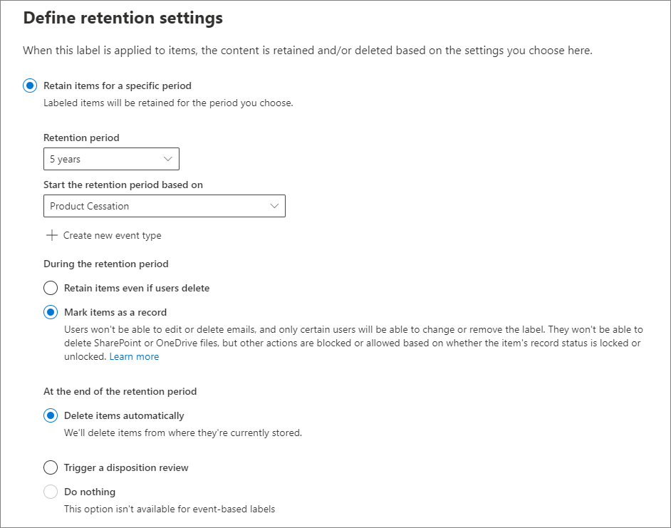

# <a name="use-retention-labels-to-manage-the-lifecycle-of-documents-stored-in-sharepoint"></a>使用保留标签管理存储在 SharePoint 中的文档的生命周期

>*[Microsoft 365 安全性与合规性许可指南](/office365/servicedescriptions/microsoft-365-service-descriptions/microsoft-365-tenantlevel-services-licensing-guidance/microsoft-365-security-compliance-licensing-guidance)。*

本文介绍如何通过使用自动应用的保留标签和基于事件的保留来管理存储在 SharePoint 中的文档的生命周期。

自动应用功能使用 SharePoint 元数据来进行文档分类。 本文中的示例针对产品相关文档，但相同的概念也可以用于其他方案。 例如，在石油和天然气行业，可以使用它来管理与石油平台、钻井日志或生产许可证等实物资产相关的文档的生命周期。 在金融服务行业，你可以管理银行账户、抵押或保险合同方面的文档。 在公共部门，你可以管理与施工许可证或纳税表。

在本文章，我们将探讨信息体系结构和保留标签的定义。 然后，我们将通过自动应用标签对文档进行分类， 最后生成用于触发保留期的事件。

## <a name="information-architecture"></a>信息体系结构

我们的方案基于一家制造公司，它使用 SharePoint 来存储与公司开发的产品相关的所有文档。 这些文档包括产品规范、与供应商签订的协议以及用户手册。 通过企业内容管理策略将这些文档存储在 SharePoint 中时，需要定义文档元数据，用于将其分类。 每个文档都具有以下元数据属性：

- **文档类型**（例如产品规范、协议或用户手册）

- **产品名称**

- **状态**（草稿或终稿）

此元数据形成所有文档的基本内容类型，它称为 *生产文档*。


> [!NOTE]
> 在方案的后面部分中，保留策略将使用 **文档类型** 和 **状态** 属性进行分类并自动应用保留标签。

我们可能有几种表示不同类型文档的内容类型，但我们将重点介绍产品文档。

在此方案中，我们使用托管元数据服务和术语库为 *文档类型* 创建一个术语集，并为 *产品名称* 创建另一个术语集。 对于每个术语集，我们将为每个值创建一个术语。 在 SharePoint 组织的术语库中，它看起来类似于以下示例：


可以使用 [内容类型中心](https://support.office.com/article/manage-content-type-publishing-06f39ac0-5576-4b68-abbc-82b68334889b)创建和发布 *内容类型*， 也可以使用网站预配工具（例如 [PnP 预配框架](/sharepoint/dev/solution-guidance/pnp-provisioning-framework)或[网站设计 JSON 架构](/sharepoint/dev/declarative-customization/site-design-json-schema#define-a-new-content-type)）创建和发布内容类型。

每个产品都有一个专用的 SharePoint 网站，其中包含一个文档库，并且已启用正确的内容类型。所有文档都存储在此文档库中。

[  ](../media/SPRetention3.png#lightbox)

> [!NOTE]
> 在此方案中，制造公司可以为每个产品使用 Microsoft 团队以支持团队成员之间的协作（例如持久聊天），而不是为每个产品建立一个 SharePoint 网站，它还可使用 Teams 中的“**文件**”选项卡进行文档管理。在本文中，我们将仅关注文档，因此我们将仅使用一个网站。

以下是旋转小组件产品的文档库视图：

[  ](../media/SPRetention4.png#lightbox)

现在，我们拥有用于文档管理的基本信息体系结构，下面让我们看一下使用元数据的文档保留和处置策略以及如何分类这些文档。

## <a name="retention-and-disposition"></a>保留和处置

制造公司的合规性和数据管理策略规定了保存和处置数据的方式。 与产品相关的文档必须在产品生产期间保存，并在生产之后额外保存一段时间。 对于产品规范、协议和用户手册，该额外期限有所不同。 下表列出了保留和处置要求：

|   文档类型            |   保留                            |   处置                                |
| -------------------------- | -------------------------------------- | -------------------------------------------- |
| 项目规范      | 产品停产后保留 5 年  | 删除                                       |
| 产品协议          | 产品停产后保留 10 年 | 审阅                                       |
| 用户手册                | 产品停产后保留 5 年  | 删除                                       |
| 所有其他类型的文档 | 不主动保留  | 文档超过 3 年时删除 <br /><br /> 如果文档在过去 3 年内未曾修改，则视为超过 3 年。 |
|||

我们使用 Microsoft 365 合规中心创建以下[保留标签](retention.md#retention-labels)：

  - 产品规范

  - 产品协议

  - 用户手册

在本文中，我们只介绍如何创建和自动应用产品规范保留标签。 若要实施完整方案，也可创建并自动应用其他两种文档类型的保留标签。

### <a name="settings-for-the-product-specification-retention-label"></a>产品规范保留标签的设置

以下是产品规范保留标签的[文件计划](file-plan-manager.md)：

- **名称：** 产品规范

- **用户说明：** 在产品停产后保留 5 年。

- **管理员说明：** 产品停产后保留 5 年，自动删除，基于事件的保留，事件类型为“*产品停产*”。

- **保留操作：** 保留和删除。

- **保留期：** 5 年（1,825 天）。

- **记录标签**：配置保留标签以将项目标记为“[记录](records-management.md#records)”，这意味着用户无法修改或删除已标记的文档。

- **文件计划描述符：** 为简化方案，未提供可选的文件描述符。

以下屏幕截图显示了在 Microsoft 365 合规中心内创建产品规范保留标签时的设置。 创建保留标签时，可创建“*产品停产*”事件类型。 请在下一节中查看相关程序。



> [!NOTE]
> 为了避免需要等待 5 年才能删除文档，如果要在测试环境中重新创建此方案，请将保留期设置为 ***1 天***。

### <a name="create-an-event-type-when-you-create-a-retention-label"></a>创建保留标签时创建事件类型

1. 在“创建保留标签向导”的“**定义保留设置**”页面上， 在“**启动保留期，基于：**”后，选择“**创建新事件类型**”：

    

3. 在 **为事件类型命名** 页上，输入 **产品停产** 和可选说明。然后依次选择“**下一步**”、**提交** 和“**完成**”。

4. 返回到“**定义保留设置**”页面，对于“**启动保留期，基于：**”一项，请使用下拉框选择所创建的“**产品停产**”事件类型。

    以下是产品规范保留标签的设置的示例：

   

6. 选择“**创建标签**”，然后当你在下一页上看到发布标签、自动应用标签或仅保存标签的选项时，请选择“**仅保存标签**”，然后选择“**完成**”。

    > [!TIP]
    > 有关更详细的步骤，请参阅[创建保留期基于事件的标签](event-driven-retention.md#step-1-create-a-label-whose-retention-period-is-based-on-an-event)。

现在，让我们看一下如何将保留标签自动应用于产品规范内容。

## <a name="auto-apply-retention-labels-to-documents"></a>将保留标签自动应用于文档

我们将使用关键字查询语言 (KQL) [自动应用](apply-retention-labels-automatically.md)创建的保留标签。 KQL 是用于构建搜索查询的语言。 在 KQL 中，可使用关键字或托管属性进行搜索。 有关详细信息，请参阅[关键字查询语言 (KQL) 语法参考](/sharepoint/dev/general-development/keyword-query-language-kql-syntax-reference)。

一般来说，我们希望告诉 Microsoft 365 将“**产品规范**”保留标签应用于所有“**状态**”为“**终稿**”且“**文档类型**”为“**产品规范**”的文档。 请记住，“**状态**”和“**文档类型**”是我们在“[信息体系结构](#information-architecture)”部分中为产品文档内容类型定义的网站栏。 若要执行此操作，我们需要配置搜索架构。

当 SharePoint 为内容创建索引时，它将自动为每个网站栏生成已爬网属性。 对于此方案，我们对 **文档类型** 和 **状态** 属性感兴趣。 我们需要库中的文档属于正确的内容类型，并填写网站栏，以便搜索并创建已爬网属性。

在 <a href="https://go.microsoft.com/fwlink/?linkid=2185219" target="_blank">SharePoint 管理中心</a>中，打开“搜索配置”，然后选择“**管理搜索架构**”查看和配置已爬网属性。


如果在_“*已爬网属性**”框中键入“***状态**”_，然后选择绿色箭头，则会看到如下所示的结果：


**ows\_\_Status** 属性（注意双下划线）是我们感兴趣的属性。 它将映射到生产文档内容类型的 **状态** 属性。

现在，如果我们键入 ***ows\_doc*** 并选择绿色箭头，则会看到如下所示的内容：


**ows\_Doc\_x0020\_Type** 属性是我们感兴趣的第二个属性。 它将映射到生产文档内容类型的 **文档类型** 属性。

> [!TIP]
> 若要标识此方案的已爬网属性的名称，请转到包含生产文档的文档库， 然后转到库设置。 对于“**栏**”，选择栏名称（例如“**状态**”或“**文档类型**”）以打开网站栏页面。 该页面的 URL 中的“*字段*”参数包含字段名称。 该字段名称以“ows_”为前缀，是已爬网属性的名称。 例如，URL `https://tenantname.sharepoint.com/sites/SpinningWidget/_layouts/15/FldEdit.aspx?List=%7BC38C2F45-3BD6-4C3B-AA3B-EF5DF6B3D172%7D&Field=_Status` 对应于 *ows\_\_Status* 已爬网属性。

如果你要查找的已爬网属性未显示在 SharePoint 管理中心的“管理搜索架构”部分中：

- 可能尚未对文档编制索引。可以通过转到“**文档库设置**” > “**高级设置**”来强制重新编制库的索引。

- 如果文档库位于新式网站中，请确保 SharePoint 管理员也是网站集管理员。

有关已爬网属性和托管属性的详细信息，请参阅[在 SharePoint 服务器中自动创建托管的属性](/sharepoint/technical-reference/automatically-created-managed-properties-in-sharepoint)。

### <a name="map-crawled-properties-to-pre-defined-managed-properties"></a>将已爬网属性映射到预定义的托管属性

KQL 不能在搜索查询中使用已爬网属性。 它必须使用托管属性。 在典型搜索方案中，我们将创建托管属性，并将其映射到所需的已爬网属性。 但是，对于自动应用保留标签，只能指定预定义的托管属性，而不能指定自定义托管属性。 已在系统中为字符串 *RefinableString00* 到 *RefinableString199* 创建一组预定义的托管属性。 有关完整列表，请参阅[默认未使用托管属性](/sharepoint/manage-search-schema#default-unused-managed-properties)。 这些默认托管属性通常用于定义搜索精简程序。

为了使 KQL 查询自动将正确的保留标签应用于产品文档内容，我们将已爬网属性 **ows\_Doc\_x0020\_Type* 和 *ows\_\_Status** 映射到两个可精简的托管属性。 在此方案的测试环境中，未使用 **RefinableString00** 和 **RefinableString01**。 通过查看 <a href="https://go.microsoft.com/fwlink/?linkid=2185219" target="_blank">SharePoint 管理中心</a>中 **管理搜索架构** 中的 **托管属性**，可以确定这一点。

[  ](../media/SPRetention12.png#lightbox)

请注意，先前屏幕截图中的“**映射的已爬网属性**”栏为空。

若要映射 **ows\_Doc\_x0020\_Type** 已爬网属性，请按以下步骤操作：

1. 在“**托管属性**”筛选器框中，键入 **_RefinableString00_**，然后选择绿色箭头。

2. 在结果列表中，选择 **RefinableString00** 链接，然后向下滚动到“**到已爬网属性的映射**”部分。

3. 选择“**添加映射**”，然后键入 **_ows\_Doc\_x0020\_Type_*至“* 搜索已爬网属性名称**”框，位于 **已爬网属性选择** 窗口。选择 **查找**。

4. 在结果列表中，选择“**ows\_Doc\_x0020\_Type**”，然后选择“**确定**”。

   在 **映射的已爬网属性** 部分中，你将看到类似于以下屏幕截图的内容：

   [ ](../media/SPRetention13.png#lightbox)


5. 滚动到页面的底部，然后选择“**确定**”以保存映射。

重复上述步骤，以映射 **RefinableString01** 和 **ows\_\_Status**。

现在，应该已将两个托管属性映射到两个已爬网属性：

[  ](../media/SPRetention14.png#lightbox)

通过运行企业级搜索来验证设置是否正确。 在浏览器中，转到 *https://\<your_tenant>.sharepoint.com/search*。 在搜索框中，键入 ***RefinableString00：“产品规范”** _，然后按 Enter。 此搜索应该会返回“**_文档类型_**”为_“*产品规范*”的所有文档。

现在，在搜索框中，键入 **RefinableString00：“产品规范”和 RefinableString01：终稿**，然后按 Enter。 这会返回“**_文档类型_*”_为“**产品规范**”且_“* 状态**”为“**_终稿_**”的所有文档。

### <a name="create-auto-apply-label-policies"></a>创建自动应用标签策略

现在，我们已验证 KQL 查询可正常工作，下面让我们创建自动应用标签策略，它使用 KQL 查询将产品规范保留标签自动应用于相应的文档。

1. 在“<a href="https://go.microsoft.com/fwlink/p/?linkid=2077149" target="_blank">Microsoft 365 合规中心</a>”，转到“**记录管理**” > “**标签策略**” > “**标签**”。

   [](../media/SPRetention16.png#lightbox)

2. 在创建自动标记策略向导中，在“**命名你的自动标记策略**”页面上，输入一个名称，如 **自动应用产品规范标签** 和可选说明。然后选择“**下一步**”。

3. 在“**选择要向其应用此标签的内容类型**”页面上，选择“**将标签应用于包含特定字词或短语或者属性的内容**”，然后选择“**下一步**”。

   [  ](../media/SPRetention17.png#lightbox)

   这个选项让我们提供与我们在上一节中测试的查询相同的 KQL 搜索查询。 此查询返回状态为“*终稿*”的所有产品规范文档。 在自动应用标签策略中使用此相同查询时，产品规范保留标签将自动应用于与该其匹配的所有文档。

4. 在“**将标签应用于与此查询匹配的内容”** 页面上，键入 “**RefinableString00:"Product Specification" AND RefinableString01:Final**”，然后选择“**下一步**”。

   

5. 在“**选择位置以应用策略**”页面上，选择要应用策略的内容位置。 对于此方案，我们将策略仅应用于 SharePoint 位置，因为所有生产文档都存储在 SharePoint 文档库中。 切换 **Exchange 电子邮件**、**OneDrive 帐户** 和 **Microsoft 365 组** 的状态为“**关闭**”。 在你选择“**下一步**”之前，请确保将 SharePoint 网站的状态切换为“**开启**”：

    

   > [!TIP]
   > 可以选择“**选择网站**”并添加特定 SharePoint 网站的 URL，而不是将策略应用于所有 SharePoint 网站。

6. 在“**选择要自动应用的标签**”页面上，选择“**添加标签**”。

7. 从保留标签列表中，选择“**产品规范**”。然后选择“**添加**”和“**下一步**”。

8. 查看设置：

    

9. 选择“**提交**”以创建自动应用标签策略。

   > [!NOTE]
   > 最多需要 7 天时间才能将产品规范标签自动应用到与 KQL 搜索查询匹配的所有文档。

### <a name="verify-that-the-retention-label-was-automatically-applied"></a>验证保留标签是否已自动应用

7 天后，使用合规中心内的[活动资源管理器](data-classification-activity-explorer.md)，确认我们所创建的自动应用标签策略确实已自动将保留标签应用于产品文档。

此外，查看文档库中文档的属性。 在信息面板中，你可以看到保留标签已应用于所选文档。

[  ](../media/SPRetention21.png#lightbox)

由于保留标签已自动应用于文档，因此可以保护文档免遭删除，因为该保留标签已配置为将文档声明为 *记录*。 作为此保护的示例，我们会在尝试删除其中一个文档时收到以下错误消息：

[](../media/SPRetention22.png#lightbox)

## <a name="generate-the-event-that-triggers-the-retention-period"></a>生成触发保留期限的事件

现在已应用保留标签，下面我们将重点介绍用于指示特定产品停产的事件。 此事件触发保留标签中定义的保留期。 例如，对于产品规范文档，当触发“产品停产”事件时，将开始 5 年的保留期。

可以通过转到“**记录管理**” > “**事件**”，在 Microsoft 365 合规中心手动创建事件。 可选择事件类型、设置正确的资产 ID 并输入事件的日期。 有关详细信息，请参阅[从事件发生时开始计算保留期](event-driven-retention.md)。

对于此方案，我们将从外部生产系统自动生成事件。 系统是一个简单的 SharePoint 列表，用于指示产品是否已投入生产。 与列表关联的 [Power Automate](/power-automate/getting-started) 流将触发事件。 在现实方案中，它可以使用各种系统（例如 HR 或 CRM 系统）生成事件。 Power Automate 包含许多可供 Microsoft 365 工作负载（例如 Microsoft Exchange、SharePoint、Teams 和 Dynamics 365）及第三方应用（例如 Twitter、Box、Salesforce 和 Workdays）使用的交互和构建块。 此功能使你可以轻松地将 Power Automate 与各种系统集成。 有关详细信息，请参阅[自动执行事件驱动的保留](./event-driven-retention.md#automate-events-by-using-a-rest-api)。

以下屏幕截图显示将用于触发事件的 SharePoint 列表：

[  ](../media/SPRetention23.png#lightbox)

目前有两种产品已投入生产，_“*投入生产*”列中的“***是**”_指明了这一点。 当产品此列中的值设置为“**_否_**”时，与列表关联的流将自动生成事件。 该事件会触发自动应用到相应产品文档的保留标签的保留期。

对于此方案，我们将使用以下流来触发事件：

[  ](../media/SPRetention24.png#lightbox)

若要创建此流，请从 SharePoint 连接器开始，并选择“**创建或修改项目时**”触发器。 指定网站地址和列表名称， 然后根据“**投入生产**”列表栏值是否设置为“**_否_*”（或在条件卡中等于“_false*”）来添加条件。 然后添加基于内置 HTTP 模板的操作。 使用以下部分中的值来配置 HTTP 操作。 可从以下部分复制 **URI** 和 **正文** 属性值，然后将其粘贴到模板中。

- **方法**：POST
- **URI**：`https://ps.compliance.protection.outlook.com/psws/service.svc/ComplianceRetentionEvent`
- **标头**：键 = Content-Type，值 = application/atom+xml
- **正文**：

    ```xml
    <?xml version='1.0' encoding='utf-8' standalone='yes'>
    <entry xmlns:d='http://schemas.microsoft.com/ado/2007/08/dataservices' xmlns:m='http://schemas.microsoft.com/ado/2007/08/dataservices/metadata' xmlns='https://www.w3.org/2005/Atom'>
    <category scheme='http://schemas.microsoft.com/ado/2007/08/dataservices/scheme' term='Exchange.ComplianceRetentionEvent'>
    <updated>9/9/2017 10:50:00 PM</updated>
    <content type='application/xml'>
    <m:properties>
    <d:Name>Cessation Production @{triggerBody()?['Product_x0020_Name']?['Value']}</d:Name>
    <d:EventType>Product Cessation&lt;</d:EventType>
    <d:SharePointAssetIdQuery>ProductName:&quot;@{triggerBody()?['Product_x0020_Name']?['Value']}<d:SharePointAssetIdQuery>
    <d:EventDateTime>@{formatDateTime(utcNow(),'yyyy-MM-dd')}</d:EventDateTime>
    </m:properties>
    </content&gt>
    </entry>
    ```

此列表介绍必须专为此方案配置的操作的 **正文** 属性内的参数：

- **名称**：此参数指定将在 Microsoft 365 合规中心内创建的事件的名称。 对于此方案，名称为“产品停产 *xxx*”，其中 *xxx* 是我们之前创建的 **ProductName** 托管属性的值。
- **EventType**：此参数的数值与将应用已创建事件的事件类型对应。 此事件类型是在创建保留标签时定义的。 对于此方案，事件类型为“产品停产”。
- **SharePointAssetIdQuery**：此参数定义事件的资产 ID。 基于事件的保留需要文档的唯一标识符。 我们可以使用资产 ID 来标识特定事件适用的文档，或者像此方案一样，使用元数据栏 **Product Name** 进行标识。 为此，我们需要创建一个名为 **ProductName** 的新托管属性，可在 KQL 查询中使用该属性。 （或者，我们可以使用 **RefinableString00**，而不是创建新的托管属性）。 我们还需要将此新托管属性映射到 **ows_Product_x0020_Name** 已爬网属性。 下面是此托管属性的屏幕截图。

    [  ](../media/SPRetention25.png#lightbox)

- **EventDateTime**：此参数定义事件发生的日期。 使用当前日期格式：<br/><br/>*formatDateTime(utcNow(),'yyyy-MM-dd'*)

### <a name="putting-it-all-together"></a>汇总

现在，将创建并自动应用保留标签，并将配置及创建流。当产品列表中旋转小组件"**投入生产**"列中的值从 **_"是"_*_ 更改为 _*_"否"_*_时，将触发流以创建事件。若要在合规中心查看此事件，请转到_* 记录管理** > **事件**。

[](../media/SPRetention28.png#lightbox)

选择事件以查看弹出页面上的详细信息。 请注意，即使已创建事件，事件状态仍显示未处理任何 SharePoint 网站或文档。


但一段时间后，“事件状态”将显示已处理 SharePoint 网站和 SharePoint 文档。


它显示根据 *旋转小组件产品停产* 事件的事件日期，已触发应用于旋转小组件产品文档的标签的保留期。 假设你通过配置一天的保留期在测试环境中实施了该方案，则可以在创建事件后的几天内转到产品文档的文档库，并验证该文档是否已被删除（在运行 SharePoint 中的删除作业之后）。

### <a name="more-about-asset-ids"></a>有关资产 ID 的详细信息

正如[从事件发生时开始计算保留期](event-driven-retention.md)一文中所述，理解事件类型、保留标签、事件和资产 ID 之间的关系非常重要。 资产 ID 只是 SharePoint 和 OneDrive 中的一种文档属性。 它可以帮助你标识将由事件触发其保留期的文档。 默认情况下，SharePoint 具有一个 **资产 ID** 属性，你可以将其用于事件驱动的保留：


如以下屏幕截图所示，资产 ID 托管属性称为 **ComplianceAssetId**。

[  ](../media/SPRetention27.png#lightbox)

像此方案一样，你也可以使用任何其他属性，而不是使用默认 **资产 ID** 属性。 但是，请务必了解，如果没有为事件指定资产 ID 或关键字，则具有该事件类型标签的所有内容均由该事件触发保留期。

### <a name="using-advanced-search-in-sharepoint"></a>在 SharePoint 中使用高级搜索

在前一屏幕截图中，还可以看到有另一个与保留标签相关的托管属性，它称为 **ComplianceTag** 并且已映射到已爬网属性。 **ComplianceAssetId** 托管属性也已映射到已爬网属性。 这意味着可在高级搜索中使用这些托管属性来检索已应用保留标签的所有文档。