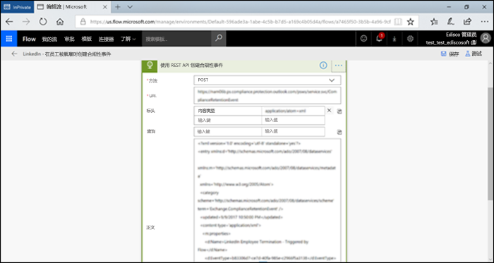
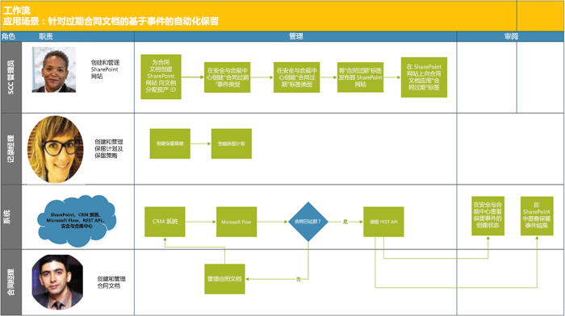

# <a name="automate-event-based-retention"></a>自动执行基于事件的保留

>*[Microsoft 365 安全性与合规性许可指南](https://aka.ms/ComplianceSD)。*

The explosion of content in organizations and how it can become ROT (redundant, obsolete, trivial) is serious business. To continue to meet legal, business, and regulatory compliance challenges, organizations must be able to keep and protect important information and quickly find what’s relevant. Retaining only important, pertinent information is key to an organization's success.

To help meet this need, organizations can take advantage of retention solutions in the Office 365 Security & Compliance Center. Retention can be triggered by using [retention labels](labels.md). A retention label has the option to [base the retention period on a specific event](event-driven-retention.md). Typically, the retention period is based on a known date, such as the creation date or last modified date for the content. However, organizations also have requirements to dispose of content based on the occurrence of an event, such as seven years after an employee leaves an organization.

To ensure compliant disposal of content, it's imperative to know when an event takes place. With the volume of content increasing rapidly, it's becoming challenging to retain and dispose content in a timely and compliant manner.

Event-based retention solves this problem. This topic explains how to set up your business process flows to automate retention through events by using the Microsoft 365 REST API.

## <a name="about-event-based-retention"></a>关于基于事件的保留

An organization can be small, medium, or large. The number of business documents, legal documents, employee files, contracts, and product documents that get created and managed on a day-to-day basis is increasing dramatically.

For example, each day, tens and hundreds of employees are joining and leaving organizations. The HR department continues to create, update, or delete employee-related documents as per business requirements. This process is subject to the different retention policies outlined for the business:

- **The period of retention for content can be a known date** such as the date the content was created, last modified, or labeled. For example, you might retain documents for seven years after they're created and then delete them.

- **The period of retention of content can also be an unknown date**. For example, with retention labels, you can also base a retention period on when a specific type of event occurs, such as an employee leaving the organization.

The event triggers the start of the retention period, and all content with a label applied for that type of event get the label's retention actions enforced on them. This is called event-based retention. To learn more, see [Overview of event-driven retention](event-driven-retention.md).

## <a name="set-up-event-based-retention"></a>设置基于事件的保留

本节介绍在保留内容之前需要执行的操作。

### <a name="identify-roles"></a>标识角色

确定执行记录管理任务的组织中的不同角色，并且这些角色将负责有效且高效地保留业务文档。

  | Persona | 角色 |
  | - | - |
  | 管理员 | 在 SharePoint 中创建保留事件类型、保留标签和记录存储库 |
  | 记录经理                                  | 提供保留策略和保留计划指南和合规性详细信息   |
  | 系统管理员（企业）                          | 设置和管理外部系统以使用 Microsoft 365                       |
  | 信息工作者                               | 管理业务流程的生命周期（人力资源、财务、IT 等）                 |

### <a name="set-up-the-security--compliance-center"></a>设置安全与合规中心
  
1. 合规性管理员可创建事件类型 &ndash; 例如“雇佣终止”、“合同到期”或“产品制造结束”。 （请在[事件驱动保留](event-driven-retention.md)中查看分步流程）。
    
2. 合规性管理员根据事件创建保留标签，并将标签与事件类型相关联。
    
    保留标签具有 4 种类型的触发器：
            
    1. 创建日期
                
    2. 上次修改时间
                
    3. 标签日期（标记内容的时间）
                
    4. 基于事件
    
3. 合规性管理员发布保留标签。

### <a name="set-up-sharepoint"></a>设置 SharePoint
   
若要创建记录存储库，合规性管理员需要：

1. 创建 SharePoint 网站。

2. 执行下列操作之一：
        
   - Creates a SharePoint library: Set event-based label at the library level. For more information, see [Applying a default retention label to all content in a SharePoint library, folder, or document set](labels.md#applying-a-default-retention-label-to-all-content-in-a-sharepoint-library-folder-or-document-set).
          
   - 在 SharePoint 中设置文档集。 有关详细信息，请参阅[文档集简介](https://support.microsoft.com/zh-CN/office/introduction-to-document-sets-3dbcd93e-0bed-46b7-b1ba-b31de2bcd234)。
      
3. 为每个员工文档集分配资产 ID。 资产 ID 是组织使用的产品名称或代码，例如员工编号可以是资产 ID。 通过将资产 ID 分配给文件夹，该文件夹中的每个项目都会自动继承相同的资产 ID。 这意味着所有项目的保留期都可以由同一事件触发。

## <a name="ways-to-trigger-event-based-retention"></a>触发基于事件的保留的方法

可通过两种方法触发基于事件的保留：

- **使用管理中心 UI** 此流程适用于一次保留较少内容或者不经常触发保留的情形，例如每月或每年保留一次。 有关此方法的详细信息，请参阅[事件驱动保留概述](event-driven-retention.md)。 但是，这种触发保留的方法可能比较耗时且容易出错，这会影响可伸缩性。 用于触发保留的自动化无缝解决方案可以增强数据的安全性和合规性。

- **Using a M365 REST API** This process can be used when large amounts of content are to be retained at a time and/or the frequency to trigger retention is often such as daily or weekly. The flow detects when an event occurs in your line-of-business system, and then automatically creates a related event in the Security & Compliance Center. You don't need to manually create an event in the UI each time one occurs.

使用 REST API 有两种选择：

- **Microsoft Flow 或类似的应用程序**可用于自动触发事件的发生。 Microsoft Flow 是用于连接到其他系统的协调程序。 使用 Microsoft Flow 不需要自定义解决方案。

- **使用 PowerShell 或 HTTP 客户端调用 REST API **使用 PowerShell（版本 6 或更高版本）调用 Microsoft 365 REST API 以创建事件。 

Rest API 是一个支持多组 HTTP 操作（方法）的服务终结点，提供对服务资源的创建/检索/更新/删除操作权限。 有关详细信息，请参阅 [REST API 请求/响应组件](https://docs.microsoft.com/rest/api/gettingstarted/#components-of-a-rest-api-requestresponse)。 在这种情况下，通过使用 Microsoft 365 REST API，可以使用 POST 和 GET 操作（方法）来创建和检索事件。

## <a name="example-scenarios"></a>示例场景

让我们以如下场景为例。

### <a name="scenario-1-employees-leaving-the-organization"></a>场景 1：员工离开组织 

组织为每个员工创建和存储许多员工相关文档。 这些文档在每位员工的雇佣期内进行管理和保留。 但是，当员工离开组织或终止雇佣关系时，组织有义务根据法律和业务要求在规定的时间内保留该员工的文档。

现在，如果每天有多名员工离开组织，组织必须在每天触发数百甚至数千个文档的保留期。

除此之外，还需要根据员工记录的类型计算每个员工的保留期，即雇佣终止日期 + 天数、月数或年数。 例如，同一员工的职工薪酬档案与福利档案可能需要不同的保留期。

下图显示如何将多个标签与单个事件关联。 在此处，员工薪酬标签下的所有文件和员工福利标签下的所有文件都与单个事件相关联，即员工离开组织。 每个不同的文件都有不同的保留期。 因此，当员工离开组织时，每个标签中的这些文件都会经历不同的保留期。 为每个员工的每种文件类型或标签触发所有这些不同的保留期是一项极具挑战的任务。 想象一下，为多名员工做这件事将会如何。


为多个员工触发这些不同保留期的自动化流程将节省时间、无错误且极为高效。

**为此场景配置基于事件的自动保留：**


  - 管理员为文档集创建员工文件夹，如 Jane Doe、John Smith。

  - 管理员将员工文件（如福利、工资单、员工薪酬）添加到每个员工文件夹中。

  - 管理员为每个员工文件夹分配资产 ID。 

  - SCC 管理员登录到安全与合规中心。

  - SCC 管理员创建与员工相关的事件类型，例如“雇佣终止”和“员工雇用”事件。

  - SCC 管理员创建“员工留任”标签。

  - 此“员工保留”标签将手动或自动发布并应用于 SharePoint 中的员工文件。

  - HR 管理系统（如 Workday）可以与 Microsoft Flow 一起定期运行以管理员工文件。

  - 如果员工离开组织，Flow 将触发 M365 基于事件的保留 REST API，该 API 将开始特定员工文件的保留期。

#### <a name="using-microsoft-flow"></a>使用 Microsoft Flow

步骤 1 - 使用 Microsoft 365 REST API 创建用于创建事件的流




##### <a name="create-an-event"></a>创建事件

用于调用 REST API 的示例代码：

- **方法**：POST
- **URL**: `https://ps.compliance.protection.outlook.com/psws/service.svc/ComplianceRetentionEvent`
- **标头**：键 = Content-Type，值 = application/atom+xml
- **正文**：
    
    ```xml
    <?xml version='1.0' encoding='utf-8' standalone='yes'?>
    
    <entry xmlns:d='http://schemas.microsoft.com/ado/2007/08/dataservices'
    
    xmlns:m='http://schemas.microsoft.com/ado/2007/08/dataservices/metadata'
    
    xmlns='http://www.w3.org/2005/Atom'>
    
    <category scheme='http://schemas.microsoft.com/ado/2007/08/dataservices/scheme' term='Exchange.ComplianceRetentionEvent' />
    
    <updated>9/9/2017 10:50:00 PM</updated>
    
    <content type='application/xml'>
    
    <m:properties>
    
    <d:Name>Employee Termination </d:Name>
    
    <d:EventType>99e0ae64-a4b8-40bb-82ed-645895610f56</d:EventType>
    
    <d:SharePointAssetIdQuery>1234</d:SharePointAssetIdQuery>
    
    <d:EventDateTime>2018-12-01T00:00:00Z </d:EventDateTime>
    
    </m:properties>
    
    </content>
    
    </entry>
    ```
- **身份验证**: 基本
- **用户名**: "Complianceuser"
- **密码**: "Compliancepassword"


##### <a name="available-parameters"></a>可用参数


|参数|说明|注释|
|--- |--- |--- |
|<d:Name></d:Name>|为事件提供唯一的名称，|不能包含尾随空格和以下字符： % * \ & < \> \| # ? , : ;|
|<d:EventType></d:EventType>|输入事件类型名称（或 Guid），|Example: “Employee termination”. Event type has to be associated with a retention label.|
|<d:SharePointAssetIdQuery></d:SharePointAssetIdQuery>|输入“ComplianceAssetId:” + 员工 Id|示例："ComplianceAssetId:12345"|
|<d:EventDateTime></d:EventDateTime>|事件日期和时间|格式：yyyy-MM-ddTHH:mm:ssZ，示例：2018-12-01T00:00:00Z
|

##### <a name="response-codes"></a>响应代码

| 响应代码 | 说明       |
| ----------------- | --------------------- |
| 302               | 重定向              |
| 201               | 已创建               |
| 403               | 授权失败  |
| 401               | 身份验证失败 |

##### <a name="get-events-based-on-time-range"></a>根据时间范围获取事件

- **方法**: GET

- **URL**: `https://ps.compliance.protection.outlook.com/psws/service.svc/ComplianceRetentionEvent?BeginDateTime=2019-01-11&EndDateTime=2019-01-16`

- **标头**：键 = Content-Type，值 = application/atom+xml

- **身份验证**: 基本

- **用户名**: "Complianceuser"

- **密码**: "Compliancepassword"


##### <a name="response-codes"></a>响应代码

| 响应代码 | 说明                   |
| ----------------- | --------------------------------- |
| 200               | 正常，atom+ xml 中的事件列表 |
| 404               | 未找到                         |
| 302               | 重定向                          |
| 401               | 授权失败              |
| 403               | 身份验证失败             |

##### <a name="get-an-event-by-id"></a>按 ID 获取事件。

- **方法**: GET

- **URL**: `https://ps.compliance.protection.outlook.com/psws/service.svc/ComplianceRetentionEvent('174e9a86-74ff-4450-8666-7c11f7730f66')`

- **标头**：键 = Content-Type，值 = application/atom+xml

- **身份验证**: 基本

- **用户名**: "Complianceuser"

- **密码**: "Compliancepassword"


##### <a name="response-codes"></a>响应代码

| 响应代码 | 说明                                      |
| ----------------- | ---------------------------------------------------- |
| 200               | 正常，响应正文包含 atom+xml 中的事件 |
| 404               | 未找到                                            |
| 302               | 重定向                                             |
| 401               | 授权失败                                 |
| 403               | 身份验证失败                                |

##### <a name="get-an-event-by-name"></a>按名称获取事件

- **方法**: GET

- **URL**: `https://ps.compliance.protection.outlook.com/psws/service.svc/ComplianceRetentionEvent`

- **标头**：键 = Content-Type，值 = application/atom+xml

- **身份验证**: 基本

- **用户名**: "Complianceuser"

- **密码**: "Compliancepassword"


##### <a name="response-codes"></a>响应代码

| 响应代码 | 说明                                      |
| ----------------- | ---------------------------------------------------- |
| 200               | 正常，响应正文包含 atom+xml 中的事件 |
| 404               | 未找到                                            |
| 302               | 重定向                                             |
| 401               | 授权失败                                 |
| 403               | 身份验证失败                                |

#### <a name="using-powershell-version-6-or-later-or-any-http-client"></a>使用 PowerShell（版本 6 或更高版本）或任何 HTTP 客户端

步骤 1：连接到 PowerShell。

步骤 2：运行以下脚本。

```powershell
param([string]$baseUri)

$userName = "UserName"

$password = "Password"

$securePassword = ConvertTo-SecureString $password -AsPlainText -Force

$credentials = New-Object System.Management.Automation.PSCredential($userName, $securePassword)

$EventName="EventByRESTPost-$(([Guid]::NewGuid()).ToString('N'))"

Write-Host "Start to create an event with name: $EventName"

$body = "<?xml version='1.0' encoding='utf-8' standalone='yes'?>

<entry xmlns:d='http://schemas.microsoft.com/ado/2007/08/dataservices'

xmlns:m='http://schemas.microsoft.com/ado/2007/08/dataservices/metadata'

xmlns='http://www.w3.org/2005/Atom'>

<category scheme='http://schemas.microsoft.com/ado/2007/08/dataservices/scheme' term='Exchange.ComplianceRetentionEvent' />

<updated>7/14/2017 2:03:36 PM</updated>

<content type='application/xml'>

<m:properties>

<d:Name>$EventName</d:Name>

<d:EventType>e823b782-9a07-4e30-8091-034fc01f9347</d:EventType>

<d:SharePointAssetIdQuery>'ComplianceAssetId:123'</d:SharePointAssetIdQuery>

</m:properties>

</content>

</entry>"

$event = $null

try

{

$event = Invoke-RestMethod -Body $body -Method 'POST' -Uri "$baseUri/ComplianceRetentionEvent" -ContentType "application/atom+xml" -Authentication Basic -Credential $credentials -MaximumRedirection 0

}

catch

{

$response = $_.Exception.Response

if($response.StatusCode -eq "Redirect")

{

$url = $response.Headers.Location

Write-Host "redirected to $url"

$event = Invoke-RestMethod -Body $body -Method 'POST' -Uri $url -ContentType "application/atom+xml" -Authentication Basic -Credential $credentials -MaximumRedirection 0

}

}

$event | fl *

```


#### <a name="verify-the-outcome-in-both-options"></a>验证两个选项的结果

步骤 1：转到安全与合规中心。

步骤 2：选择“**信息治理**”下的“**事件**”。

步骤 3：验证已创建事件。

同样，上述用于自动执行基于事件的保留的选项也可用于以下场景。

### <a name="scenario-2-contracts-expiring"></a>场景 2：合同到期

对于与客户、供应商和合作伙伴签订的单份合同，组织可能拥有多条记录。 这些文档可以驻留在 SharePoint 等文档库中。 合同的终止决定了与合同关联的文档保留期的开始。 例如：与合同相关的所有记录都需要在合同到期后保留 5 年。 触发 5 年保留期的事件是合同到期。

客户关系管理 (CRM) 系统可以与 Microsoft 365 一起使用，用于触发合同文档的保留。

**为此场景配置基于事件的自动保留：**



  - 管理员为每种合同类型创建一个包含各种文件夹的 SharePoint 库。

  - 管理员将合同文件（如许可合同、开发合同）添加到每个合同文件夹。

  - 管理员为每个合同文件夹分配资产 ID。

  - SCC 管理员登录到安全与合规中心。

  - SCC 管理员创建与合同相关的事件类型，例如“合同创建”和“合同到期”事件。

  - SCC 管理员创建“合同到期”标签。

  - 此“合同到期”标签将手动或自动发布并应用于 SharePoint 中的合同文件。

  - 合同管理系统可以与 Microsoft Flow 或类似的应用程序一起定期运行以管理合同文件。

  - 如果合同到期，Microsoft Flow 将触发 M365 基于事件的保留 REST API，该 API 将开始特定合同文件的保留期。

### <a name="scenario-3-end-of-product-manufacturing"></a>场景 3：产品制造终止

A manufacturing company that produces different lines of products creates many manufacturing specifications and pricing documents. When the product is no longer manufactured, all specifications and documents linked to this product need to be retained for a specific period after the end of the lifetime of the product.

企业资源规划 (ERP) 系统可以与 Microsoft 365 和 Microsoft Flow 一起使用，用于触发保留。

**为此场景配置基于事件的自动保留：**


  - 管理员在文档集中创建产品文件夹，如产品 1、产品 2 等。

  - 管理员将产品文件（如制造规格、产品定价、产品许可）添加到每个产品文件夹中。

  - 管理员为每个产品文件夹分配资产 ID。

  - SCC 管理员登录到安全与合规中心。

  - SCC 管理员创建与员工相关的事件类型，例如“产品制造开始”和“产品制造结束”事件。

  - SCC 管理员创建“产品制造结束”标签。

  - 此“产品制造终止”标签将手动或自动发布并应用于 SharePoint 中的产品文件。

  - ERP 系统可以与 Microsoft Flow 或类似的应用程序一起定期运行以管理产品文件。

  - 如果产品制造终止，Microsoft Flow 将触发 M365 基于事件的保留 REST API，该 API 将开始特定产品文件的保留期。

## <a name="appendix"></a>附录

### <a name="using-redirect-302-response-results-to-call-the-rest-api"></a>使用重定向 302 响应结果来调用 REST API

1. 通过使用 REST API URL 调用 POST 保留事件调用：`https://ps.compliance.protection.outlook.com/psws/service.svc/ComplianceRetentionEvent`
    
    需要全局管理员权限。

2. 检查响应代码。 如果是 302，则从响应标头的“位置”属性中获取重定向的 URL。

3. 使用重定向的 URL 再次调用 POST 保留事件调用。

## <a name="credits"></a>制作人员

本主题经过以下人员的审阅：

Antonio Maio<br/>Microsoft Office 应用和服务 MVP<br/> Antonio.Maio@Protiviti.com
