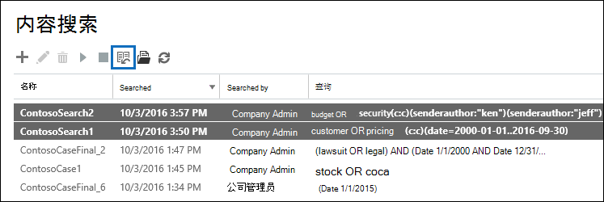

# 批量编辑内容搜索

您可以使用内容搜索工具中的批量搜索编辑器同时编辑多个搜索。 使用此工具可以快速更改一个或多个搜索的查询和内容位置。 然后，您可以重新运行搜索，并获取修订后的搜索的新估计搜索结果。 编辑器还允许您从 Microsoft Excel 文件或文本文件复制和粘贴查询和内容位置。 这意味着您可以使用搜索统计信息工具查看一个或多个搜索的统计信息，将统计信息导出到 CSV 文件，您可以在其中编辑 Excel 中的查询和内容位置。 然后，使用批量搜索编辑器将修改后的查询和内容位置添加到搜索。 修改一个或多个搜索后，可以重新启动它们并获取新的估计搜索结果。
  
有关使用搜索统计信息工具的信息，请参阅 [查看内容搜索结果的关键字统计信息](view-keyword-statistics-for-content-search.md)。
  
## 使用批量搜索编辑器更改查询

1. 转到 [https://protection.office.com](https://protection.office.com) ，然后选择"搜索 **内容** \> **搜索"。**
    
2. 在搜索列表中，选择一个或多个搜索，然后选择批量 **搜索编辑器**  。
    
    
  
    以下信息显示在批量搜索编辑器 **的"** 查询"页上。 
    
    
  
    a. " **搜索** "列显示内容搜索的名称。 如前所述，您可以编辑多个搜索的查询。 
    
    b. " **查询** "列显示"搜索"列中列出的内容搜索 **的** 查询。 如果查询是使用关键字列表功能创建的，则关键字用文本 ** 分隔 `(c:s)` **。这表示关键字由 **OR** 运算符连接。此外，如果查询包含条件，关键字和条件 `(c:c)`** 用文本 ** 分隔。 这表示关键字 (或关键字阶段) **AND** 运算符连接到条件。 例如，在上一张屏幕截图中，搜索 ContosoSearch1 的 等效 KQL 查询  `customer (c:s) pricing(c:c)(date=2000-01-01..2016-09-30)` 为  `(customer OR pricing) AND (date=2002-01-01..2016-09-30)` 。
    
3. 若要编辑查询，请在要更改的查询单元格中选择并执行以下操作之一。 选择单元格时，单元格边框为蓝色框。
    
   - 在单元格中键入新查询。 无法编辑查询的一部分。 您必须键入整个查询。
    
      或
    
    - 在单元格中粘贴新查询。 这假定你已复制文件（如文本文件或 Excel 文件）中的查询文本。
    
4. 在"查询"页上编辑一个或多个查询后，选择"保存 **"。**
    
    修订后的查询将显示在所选搜索的 **"** 查询"列中。 
    
5. 选择 **"关闭** "以关闭批量搜索编辑器。 
    
6. 在" **内容搜索** "页上，选择您编辑的搜索，然后选择"启动 **搜索"** 以使用修改后的查询重新启动搜索。 
    
以下是使用批量搜索编辑器编辑查询的一些提示：
  
- 使用 Ctrl **C** (将现有查询) 复制到文本文件。 编辑文本文件中的查询，然后复制修改后的查询， (**Ctrl V** ) 粘贴回 **"** 查询"页上的单元格。 
    
- 您还可以从其他应用程序（如 Microsoft Word 或 Microsoft Excel (）复制) 。 但是，您可能会无意中使用批量搜索编辑器将不受支持的字符添加到查询中。 防止不受支持的字符的最好办法就是只需在"查询"页上的单元格 **中** 键入查询。 或者，可以从 Word 或 Excel 复制查询，然后将其粘贴到纯文本编辑器（如 Microsoft 记事本）中的文件中。 接下来，保存文本文件，并在" **编码**"下拉列表中选择" **ANSI**"。 这将删除任何格式和不受支持的字符。 然后，您可以将查询从文本文件复制并粘贴到 **"查询"** 页。 
    
  
## 使用批量搜索编辑器更改内容位置

1. 在一个或多个选定搜索的批量搜索编辑器中，选择"**启用批量** 位置编辑器"，然后选择页面上显示的位置链接。 
    
    以下信息显示在批量搜索 **编辑器的** "位置"页上。 
    
    
  
    a. **要搜索的邮箱** 此部分显示每个选定内容搜索的列，以及搜索中包含的每个邮箱的一行。 一个选中标记指示该邮箱包含在搜索中。 可以通过在空白行中键入邮箱的电子邮件地址，然后选中要添加到的内容搜索的复选框，将邮箱添加到搜索。 或者，可以通过清除复选框从搜索中删除邮箱。
    
    b. **要搜索的 SharePoint 网站** 此部分显示每个选定内容搜索中包含的每个 SharePoint 和 OneDrive 网站的行。 一个选中标记指示网站包含在搜索中。 您可以通过在空白行中键入网站的 URL，然后选中要添加到的内容搜索的复选框，将网站添加到搜索。 或者，可以通过清除此复选框从搜索中删除网站。
    
    c. **其他搜索选项** 此部分指示搜索中是否包括未索引的项目和公用文件夹。 若要包括它们，请确保选中了复选框。 若要删除它们，请清除此复选框。
    
2. 编辑"位置"页面上的一个或多个节后，选择"保存 **"。**
    
    修订的内容位置显示在所选搜索的适当部分中。
    
3. 选择 **"关闭** "以关闭批量搜索编辑器。 
    
4. 在" **内容搜索** "页上，选择您编辑的搜索，然后选择"启动 **搜索"** 以使用修改后的内容位置重新启动搜索。 
    
以下是使用批量搜索编辑器编辑内容位置的一些提示：
  
- 您可以编辑内容搜索以搜索组织的所有邮箱或网站，在"要搜索的邮箱"或"要搜索的 **SharePoint** 网站"部分中的空白行中键入"全部"，然后选中此复选框。 
    
- 可以通过从文本文件或 Excel 文件复制多行，然后将这些行粘贴到"位置"页上的某一节中，向一个或多个搜索 **添加多个内容** 位置。 添加新位置后，请确保为要添加位置的每个搜索选中复选框。 
    
    > [!TIP]
    > 若要为组织中所有用户生成电子邮件地址列表，请运行步骤 [2：](search-the-mailbox-and-onedrive-for-business-for-a-list-of-users.md#step-2-generate-a-list-of-users)生成用户列表中的步骤 2 中的 PowerShell 命令。 或者按照获取组织中每个用户 [OneDrive URL](/onedrive/list-onedrive-urls) 列表中的步骤生成组织中所有 OneDrive for Business 网站的列表。 请注意，您必须将组织的"MySite"域的 URL (例如，附加到脚本创建的 https://contoso-my.sharepoint.com) OneDrive for Business 网站。 获得电子邮件地址或 OneDrive for Business 网站列表后，可以在批量搜索编辑器中将其复制并粘贴到"位置"页。 
  
- 选择" **保存"** 以在批量搜索编辑器中保存更改后，将验证添加到搜索的邮箱的电子邮件地址。 如果电子邮件地址不存在，则会显示一条错误消息，指出无法找到该邮箱。 不验证网站的 URL。 
