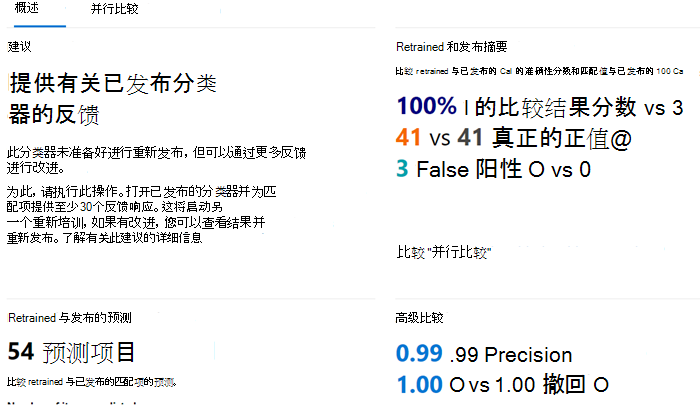

# 如何重新训练内容资源管理器中的分类器

可Microsoft 365分类器是一种工具，你可以训练它，通过提供要查看的示例来识别各种类型的内容。 接受培训后，可用于标识用于应用敏感度Office、通信合规性策略和保留标签策略的项目。

本文介绍了如何通过提供其他反馈来提高自定义可训练分类器以及一些预先训练的分类器的性能。

若要详细了解不同类型的分类器，请参阅 [了解可训练分类器](classifier-learn-about.md)。

观看此视频，简要了解调整和重新调试过程。 你仍然需要阅读此完整文章才能获取详细信息。

 

> [!VIDEO https://www.microsoft.com/videoplayer/embed/RWyGMs]

## 权限

若要访问分类器Microsoft 365合规中心：

- 要求合规性管理员角色或合规性数据管理员对分类器进行培训

在这些情况下，你需要具有这些权限的帐户才能使用分类器：

- 保留标签策略方案：记录管理和保留管理角色 

## 总体工作流

> [!IMPORTANT]
> 您可以在内容资源管理器中提供反馈，以自动应用保留标签策略Exchange项并使用分类器作为条件。 **如果没有保留策略，该保留策略自动将保留标签应用于Exchange并使用分类器作为条件，请在此处停止。**

使用分类器时，可能需要提高分类器所分类的精度。 为此，可评估对已标识为匹配项或不匹配项进行的分类质量。 对分类器进行 30 次评估后，它将接受该反馈并自动自我重新培训。

若要了解有关重新设置分类器的整体工作流的更多信息，请参阅用于重新设置 [分类器的流程](classifier-learn-about.md#retraining-classifiers)。

> [!NOTE]
> 必须先发布并使用分类器，然后才能重新设置分类器。

## 如何重新训练内容资源管理器中的分类器

1. 登录以使用Microsoft 365 合规中心管理员或安全管理员角色访问权限登录，**然后打开Microsoft 365 合规中心**  >  **数据分类**  >  **内容资源管理器"。** 
2. 在"**筛选标签、信息类型** 或类别"列表下，展开 **"可训练分类器"。**

> [!IMPORTANT]
> 聚合项目最多可能需要 8 天才能显示在可训练分类器标题下。

3. 选择在自动应用保留标签策略中使用的可训练分类器。 这是你要提供反馈的可训练分类器。

> [!NOTE]
> 如果某个项目在"保留标签"列中有一个条目，则意味着该项目被分类为 `match` 。  如果某个项目在"保留标签"列中没有条目，则意味着该项目被分类为 `close match` 。 通过提供有关项目的反馈，可以最大提高分类器 `close match` 精度。 

4. 选择一个项目并打开它。
 
 > [!TIP]
> 通过选择所有项目，然后在命令栏中选择"改进分类"，可以同时 **提供多个项目** 的反馈。

5. 选择 **"提供反馈"。**
6. 在"**详细反馈"** 窗格中，如果项目为真正的正数，请选择"匹配 **"。**  如果项目为误报，即分类中未正确包含，请选择"**不匹配"。**
7. 如果有另一个分类器更适用于该项目，您可以从"建议其他可训练分类器"**列表中选择它。** 这将触发其他分类器来评估该项目。
8. 选择 **"发送** 反馈"发送对 `match` 、分类的评估， `not a match` 并建议其他可训练分类器。 向分类器提供 30 个反馈实例后，分类器将自动重新播放。 重新培训可能需要 1 到 4 个小时。 每天只能重新对分类器进行两次重新分类。

> [!IMPORTANT]
> 此信息将转到租户中的分类器 **，不会返回到 Microsoft。**

9. 打开 **可训练分类器**。
10. 通信合规性策略中使用的分类器将显示在"重新培训" **标题** 下。

11. 完成重新培训后，选择分类器以打开重新培训概述。

12. 查看建议的操作，以及分类器重新更新和当前发布的版本预测比较。
13. 如果对重新发布的结果感到满意，请选择"**重新发布"。**
14. 如果您对重新设置的结果不满意，可以选择在内容资源管理器界面中向分类器提供其他反馈，并开始另一个重新设置循环，或者不执行任何操作，在这种情况下将继续使用当前发布的分类器版本。 

## 有关重新发布建议的详细信息

下面提供一些有关我们如何重新发布重新发布的分类器或建议进一步重新编制的建议的信息。 这需要更深入地了解可训练分类器如何工作。

经过重新测试后，我们将评估具有反馈的项上分类器的性能，以及最初用于训练分类器的任何项目的性能。 

- 对于内置模型，用于训练分类器的项目是 Microsoft 用于生成模型的项目。
- 对于自定义模型，原始培训中使用的分类器项目来自已添加用于测试和审阅的网站。

我们将比较经过重新检查和发布的分类器这两组项目的性能数字，以提供有关重新发布是否有改进的建议。 

## 另请参阅

- [了解可训练的分类器](classifier-learn-about.md)
- [SharePoint Server 中的默认爬网文件扩展名和分析文件类型](/sharepoint/technical-reference/default-crawled-file-name-extensions-and-parsed-file-types)