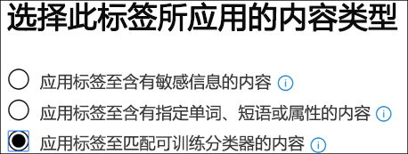

# 使用就绪分类器（预览）

Microsoft 已通过大量的示例数据集进行了培训和测试了大量分类程序，这有助于确定特定的内容类别。 请参阅[trainable 分类器的入门（预览）](classifier-getting-started-with.md)。 默认情况下， `Ready to use`这些分类器显示在组中。

- **冒犯性语言**：检测包含 profanities、slurs、taunts 和伪装的表达式的文本项（这是与更具冒犯性的术语具有相同意义的表达式）。
- **恢复**：检测作为申请人个人、教育、专业资格、工作经验以及其他个人标识信息的文本帐户的项目。
- **SourceCode**：检测包含一组用广泛使用的计算机编程语言编写的指令和语句的项。
- **骚扰**：根据以下特性，检测与针对一个或多个用户的攻击性行为相关的冒犯性语言文本项的特定类别：种族、ethnicity、宗教、民族、性别、色情方向、年龄、残疾。
- **猥亵**语言：检测包含 embarrass 大多数人的表达式的冒犯性语言文本项的特定类别。
- **威胁**：检测与威胁相关的冒犯性语言文本项的特定类别，以提交暴力或对人员或财产造成物理伤害或损坏。

> [!NOTE]
> 在使用准备就绪以在分类和标记工作流中使用分类器之前，应根据您认为适合类别的组织内容示例对其进行测试，以验证其分类预测是否符合您的预期。

> [!IMPORTANT]
> 请注意，冒犯性语言、骚扰、猥亵和威胁分类器仅适用于可搜索文本不详尽或完整。 此外，语言和文化标准不断变化，而在这些现实中，Microsoft 保留在决定时更新这些分类器的权利。 虽然分类程序可以帮助组织监视攻击性和其他使用的语言，但分类程序不会解决此类语言的后果，也不打算提供组织的唯一方法来监视或响应使用此类语言。 您的组织（而不是 Microsoft 或其子公司）仍负责与监控、强制执行、阻止、删除和保留预先培训的分类器所标识的任何内容相关的所有决策。

## 如何准备和使用分类器准备就绪

1. 收集您认为属于已准备好使用分类器的类别（正匹配）和您要测试的类别中不应包括的（负匹配）的 "可释放测试内容" 项。

> [!IMPORTANT]
> 示例项目不能加密且必须为英语。

2. 创建专用的 SharePoint Online 文件夹;至少等待1小时，将文件夹添加到搜索索引中。 请记下文件夹 URL。

3. 使用合规性管理或安全管理员角色访问和打开**microsoft 365 合规性中心** > **记录管理（预览）** > **标签策略**选项卡登录 microsoft 365 合规中心。

4. 选择`Auto-apply a label`。

5. 选择`Choose a label to auto-apply`。

6. 选择`Create new labels`并创建一个标签，以便在此测试中直接使用。 执行此操作时，请`Retention`将设置为 "关闭"。 您不希望启用任何保留或其他操作。 在这种情况下，您将使用保留标签，只是将其用作文本标签，而不会强制执行任何操作。 例如，您可以创建一个名为 "SourceCode 分类程序测试" 的保留标签，无操作，然后将该保留标签自动应用于将源代码分类器作为条件的内容。 若要了解有关创建保留标签的详细信息，请参阅[保留标签概述](labels.md)。
  
7. 依次`Auto-apply a label` `Choose a label to auto-apply`选择 "" 和 ""。 若要了解有关使用基于条件的自动应用标签的详细信息，请参阅[根据条件自动应用保留标签策略](labels.md#applying-a-retention-label-automatically-based-on-conditions)。

8. 从列表中选择您的测试标签， `Next`然后选择 ""。

9. 选择`Apply label to content that matches a trainable classifier`。

.

10. 从列表中选择分类程序，在此示例中`Source Code`

11. 对策略进行命名，例如 "源代码已准备好使用分类程序测试"。

12. 选择`Let me choose specific locations`。

13. 关闭除和选择`SharePoint sites` `Choose sites`之外的所有位置。

14. 输入步骤2中的网站的 URL。

15. 完成向导并选择`Auto-apply`

16. 将测试项放入专用的 SharePoint Online 文件夹中。

17. 为应用标签留一个小时。

18. 检查标签文档的属性以查看分类器是否包含并排除了您所需的测试内容。

19. 查看标记的项目。

20. 如果你已完成测试，请删除内容和标签策略。

另请参阅：

- [可训练分类器入门（预览）](classifier-getting-started-with.md)
- [保留标签概述](labels.md)
- [根据条件自动应用保留标签策略](labels.md#applying-a-retention-label-automatically-based-on-conditions)
