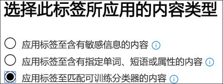

# 使用保留标签测试内置分类器（预览）Testing built-in classifiers using retention labels (preview)

Microsoft 已培训并测试了五个分类器，可帮助确定特定的内容类别。Microsoft has trained and tested five classifiers which can help to identify certain categories of content. 这些类元在 `Ready to use` 默认情况下显示在组中，并使用非常大的示例数据集进行了培训。These classifiers show up in the `Ready to use` group by default and were trained using very large sample data sets.

> [!IMPORTANT]
> 在分类和标记工作流中使用内置分类器之前，应根据您认为适合类别的组织内容示例对其进行测试，以验证其分类预测是否符合您的预期。Before using built-in classifiers in your classification and labeling workflow, you should test it against a sample of your organization's content that you feel fits the category to verify that its classification predictions meet your expectations.

有关 trainable 类元的详细信息，请参阅[trainable 分类器的入门（预览）](classifier-getting-started-with.md)。For more information on trainable classifiers, see [Getting started with trainable classifiers (preview)](classifier-getting-started-with.md).

Microsoft 365 附带了五个建议的内置分类器：Microsoft 365 comes with five recommended built-in classifiers:

> [!CAUTION]
> 我们正在弃用**冒犯性语言**内置分类器，因为它会生成大量误报。We are deprecating the **Offensive Language** built-in classifier because it has been producing a high number of false positives. 请勿使用该功能，如果您当前正在使用它，则应将业务流程移出它。Don't use it and if you are currently using it, you should move your business processes off of it. 我们建议改为使用**威胁**、**猥亵**和**骚扰**内置分类符。We recommend using the **Threat**, **Profanity**, and **Harassment** built-in classifiers instead.

- **恢复**：检测作为申请人个人、教育、专业资格、工作经验和其他个人身份信息的文本帐户的项目**Resumes**: detects items that are textual accounts of an applicant's personal, educational, professional qualifications, work experience, and other personally identifying information
- **源代码**：检测包含一组由 GitHub 上的前25个使用的计算机编程语言编写的指令和语句的项**Source Code**: detects items that contain a set of instructions and statements written in the top 25 used computer programming languages on GitHub

  |语言名称language name|||||
  |---------|---------|---------|---------|---------|
  |ActionScriptActionScript|CC        |Lc#C#       |CC++     |ClojureClojure  |
  |CoffeeScriptCoffeeScript|CSSCSS     |转到Go       |HaskellHaskell |HTMLHTML     |
  |JavaJava     |JavaScriptJavaScript|LuaLua      |MATLABMATLAB   |Objective-CObjective-C|
  |编写Perl     |PHPPHP      |PythonPython   |RR        |RubyRuby     |
  |ScalaScala    |命令行管理程序Shell    |反应Swift    |TexTex      |Vim 脚本Vim Script|

> [!NOTE]
> 源代码经过培训，可在大部分文本是源代码时进行检测。Source Code is trained to detect when the bulk of the text is source code. 它不检测与纯文本交错的源代码文本。It does not detect source code text that is interspersed with plain text.

- **骚扰**：根据以下特性，检测与针对一个或多个用户的攻击性行为相关的冒犯性语言文本项的特定类别：种族、ethnicity、宗教、国家/地区、性别、色情方向、年龄、残疾**Harassment**: detects a specific category of offensive language text items related to offensive conduct targeting one or multiple individuals based on the following traits: race, ethnicity, religion, national origin, gender, sexual orientation, age, disability
- **猥亵**语言：检测包含 embarrass 大多数人的表达式的冒犯性语言文本项的特定类别**Profanity**: detects a specific category of offensive language text items that contain expressions that embarrass most people
- **威胁**：检测与威胁相关的攻击性语言文本项的特定类别，以提交暴力或对人员或属性造成物理伤害或损坏**Threat**: detects a specific category of offensive language text items related to threats to commit violence or do physical harm or damage to a person or property

> [!IMPORTANT]
> 请注意，冒犯性语言、骚扰、猥亵和威胁分类器仅适用于可搜索文本不详尽或完整。Please note that the offensive language, harassment, profanity, and threat classifiers only work with searchable text are not exhaustive or complete. 此外，语言和文化标准不断变化，而在这些现实中，Microsoft 保留在决定时更新这些分类器的权利。Further, language and cultural standards continually change, and in light of these realities, Microsoft reserves the right to update these classifiers in its discretion. 虽然分类程序可以帮助组织监视攻击性和其他使用的语言，但分类程序不会解决此类语言的后果，也不能提供组织的唯一方法来监视或响应此类语言的使用。While the classifiers may assist your organization in monitoring offensive and other language used, the classifiers do not address consequences of such language and are not intended to provide your organization's sole means of monitoring or responding to the use of such language. 您的组织（而不是 Microsoft 或其子公司）仍负责与监控、强制执行、阻止、删除和保留预先培训的分类器所标识的任何内容相关的所有决策。Your organization, and not Microsoft or its subsidiaries, remains responsible for all decisions related to monitoring, enforcement, blocking, removal and retention of any content identified by a pre-trained classifier.

## 如何验证内置分类器是否满足你的需求How to verify that a built-in classifier will meet your needs

1. 收集您认为属于内置分类符的类别（正匹配）和您要测试的类别中不应包括的（负匹配）的 "可释放测试内容" 项。Collect disposable test content items that you feel belong in the category of the built-in classifier (positive matches) and ones that shouldn't be included (negative matches) in the category you're testing.

   > [!IMPORTANT]
   > 示例项目不能加密且必须为英语。The sample items must not be encrypted and they must be in English.

2. 创建专用的 SharePoint Online 文件夹;至少等待1小时，将文件夹添加到搜索索引中。Create a dedicated SharePoint Online folder; wait at least an hour for the folder to be added to the search index. 请记下文件夹 URL。Make note of the folder URL.

3. 使用合规性管理或安全管理员角色访问和打开**microsoft 365 合规性中心**  >  **记录管理（预览）**  >  **标签策略**选项卡登录 microsoft 365 合规中心。Sign in to Microsoft 365 compliance center with compliance admin or security admin role access and open **Microsoft 365 compliance center** > **Records management (preview)** > **Label policies** tab.

4. 选择 `Auto-apply a label` 。Choose `Auto-apply a label`.

5. 选择 `Choose a label to auto-apply` 。Choose `Choose a label to auto-apply`.

6. 选择 `Create new labels` 并创建一个标签，以便在此测试中直接使用。Choose `Create new labels` and create a label for use just with this test. 执行此操作时，请将 `Retention` 设置为 `off` 。When you do this, leave `Retention` set to `off`. 您不希望启用任何保留或其他操作。You don't want to turn on any retention or other actions. 在这种情况下，您将使用保留标签，只是将其用作文本标签，而不会强制执行任何操作。In this case, you'll be using the retention label simply as a text label, without enforcing any actions. 例如，您可以创建一个名为 "SourceCode 分类程序测试" 的保留标签，无操作，然后将该保留标签自动应用于将源代码分类器作为条件的内容。For example, you can create a retention label named "SourceCode classifier test" with no actions, and then auto-apply that retention label to content that has Source code classifier as a condition. 若要了解有关创建保留标签的详细信息，请参阅[保留标签概述](labels.md)。To learn more about creating retention labels, see [Overview of retention labels](labels.md).
  
7. 依次选择 "" 和 "" `Auto-apply a label` `Choose a label to auto-apply` 。Choose `Auto-apply a label` and then `Choose a label to auto-apply`. 若要了解有关使用基于条件的自动应用标签的详细信息，请参阅[根据条件自动应用保留标签策略](labels.md#applying-a-retention-label-automatically-based-on-conditions)。To learn more about using condition based auto-apply a label see, [auto-apply retention label policy based on a condition](labels.md#applying-a-retention-label-automatically-based-on-conditions).

8. 从列表中选择您的测试标签，然后选择 "" `Next` 。Choose your test label from the list and choose `Next`.

9. 选择 `Apply label to content that matches a trainable classifier` 。Choose `Apply label to content that matches a trainable classifier`.

   

10. 从列表中选择分类程序，在此示例中`Source Code`Choose your classifier from the list, in this case `Source Code`

11. 为策略命名，例如 "源代码内置分类器测试"。Name the policy, for example "Source code built-in classifier test".

12. 选择 `Let me choose specific locations` 。Choose `Let me choose specific locations`.

13. 关闭除和选择之外的所有位置 `SharePoint sites` `Choose sites` 。Turn off all locations except `SharePoint sites` and choose `Choose sites`.

14. 输入步骤2中的网站的 URL。Enter the URL for the site from step 2.

15. 完成向导并选择`Auto-apply`Finish the wizard and choose `Auto-apply`

16. 将测试项放入专用的 SharePoint Online 文件夹中。Place the test items into the dedicated SharePoint Online folder.

17. 为应用标签留一个小时。Allow an hour for the label to be applied.

18. 检查标签文档的属性以查看分类器是否包含并排除了您所需的测试内容。Check the properties of the documents for the label to see if the classifier included and excluded the test content as you expected.

19. 查看标记的项目。Review the items that were labeled.

20. 如果你已完成测试，请删除内容和标签策略。Delete the content and the label policy if you're done with your testing.

另请参阅：See also:

- [可训练分类器入门（预览）Getting started with trainable classifiers (preview)](classifier-getting-started-with.md)
- [保留标签概述Overview of retention labels](labels.md)
- [根据条件自动应用保留标签策略Auto-apply retention label policy based on a condition](labels.md#applying-a-retention-label-automatically-based-on-conditions)
