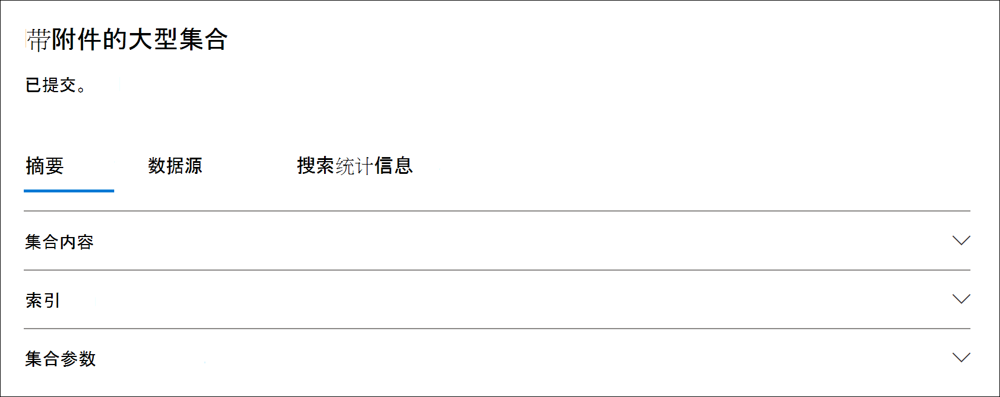

# 集合中的统计信息和报告Advanced eDiscovery

创建草稿集合后，您可以查看检索到的项目的统计信息，如包含最符合搜索条件的项目的内容位置和搜索查询返回的项目数。 还可以预览结果的子集。

确定要进一步检查的文档集后，可以将搜索结果添加到审阅集以收集和处理。

## 草稿集合的统计信息和报告

本节介绍可用于草稿集合的统计信息。 这些统计信息位于 **草稿集合的** 飞出页面上的"搜索统计信息"选项卡上。

### 收集估计值

此部分显示集合返回的估计项目的图形摘要。 这指示与集合的搜索条件匹配的项数。 通过此信息，您可以了解集合返回的预计项目数。

- **按位置估计的项目**：集合返回的估计项目总数。 还会显示位于邮箱和网站中的特定数量的项目。

- **估计发生位置**：包含集合返回的项目的内容位置总数。 还会显示特定数量的邮箱和站点位置。

- **按位置数据量 (MB)**：集合返回的所有估计项目的总大小。 还会显示邮箱项目和网站项目的特定大小。

### 条件报告

此部分显示有关集合搜索查询和与搜索查询的不同部分匹配的估计项目数的统计信息。 可以使用这些统计信息来分析与搜索查询的每个组件匹配的项目数。 这可以帮助您优化集合的搜索条件，并在必要时缩小集合的范围。

- **位置** 类型：查询统计信息适用于的内容位置类型。 值 **Exchange指示** 邮箱位置;值 **SharePoint** 指示站点位置。

- **部分**：统计信息适用于的搜索查询部分。 **Primary** 指示整个搜索查询。 **Keyword** 指示行中的统计信息用于特定关键字。 如果在对集合中的搜索查询使用关键字列表时，此表中将包含查询的每个组件的统计信息。

- **条件**：实际组件 (关键字或条件) ，该搜索查询针对返回相应行中显示的统计信息的草稿集合运行。

- **命中位置**：由"位置类型"列 (指定的内容位置) 包含与"条件"列中列出的主查询或关键字查询 **匹配的项。**

- **项目**：指定内容 (与条件列中列出的) 匹配 **的项目数。** 如前所述，如果一个项目包含要搜索的关键字的多个实例，则此列中只计算一次。

- **大小 (MB)**：在"条件"列中 (内容位置找到) 搜索查询的所有 **项目的总大小** 。

### 热门位置

此部分显示有关特定内容位置以及集合返回的项目最多的统计信息。

- 位置名称的名称 (邮箱的电子邮件地址和网站名称的 URL) 。

- 邮箱 (网站的位置类型) 。

- 集合返回的内容位置中的估计项目数。

- 每个内容位置中估计项目的总大小。

## 已提交集合的统计信息和报告

本节介绍将集合提交到审阅集后可用的统计信息，包括添加到审阅集的实际项目数。 除了 (集信息外，这些统计信息) 有关添加到案例的内容的历史信息。

将集合提交到审阅集后，以下选项卡将显示在已提交连接的飞出页面上。 其中每个选项卡都包含有关集合的不同类型的信息。

### 集合内容

"摘要 **"选项卡的** 这一部分包含有关从集合中的数据源收集并添加到审阅集中的项目的统计信息和其他信息。

- **提取的项目总数**。 添加到审阅集的项目总数。 此数字指示添加到审阅集的父项和子项的总和。

  > [!TIP]
  > 将光标悬停在父项或子项栏上可显示父项或子项的总数。

- **父项**。 集合返回的项目数，用于收集已添加到审阅集的项目。 此数字对应于 (，) 集合参数部分中显示的估计 **项目数** 。 他收集的用于收集已添加到审阅集中的项目的父项目数。
 
   父项可能包含多个子项。 例如，如果电子邮件包含附加文件或具有云附件，则电子邮件为父项目。 在这种情况下，附加文件或云附件的目标文件被视为子项。 提交集合时，父项和任何相应的子项 (附加文件和云附件) 作为单个项目或文件添加到审阅集中。

- **子项**。 添加到审阅集的子项目数。 仅作为文件附件和云附件的子项作为单个文件添加到审阅集。 其他类型的子项（如电子邮件签名和图像）从父项中提取，然后由光学字符识别 (OCR) 处理，以从子项中提取任何文本。 然后，从这些类型的子项中提取的文本将添加到其父项中，以便您可以在审阅集内查看它。 通过不将子项目作为单独的文件添加到审阅集，Advanced eDiscovery审阅集内可能不重要的项目的数量，帮助简化审阅过程。

- **唯一项**。 添加到审阅集的唯一项数。 唯一项目对于审阅集是唯一的。 当第一个集合添加到新的审阅集中时，所有项目都是唯一的，因为审阅集中没有以前的项目。

- **标识的重复项**。 集合中由于审阅集中已存在同一项目而未添加到审阅集的项目数。 有关重复项的统计信息有助于说明草稿集合中的估计项目数与添加到审阅集的实际项目数之间的差异。

### 索引

已 **提交审阅** 集的 **"摘要** "选项卡上的"索引"部分包含有关添加到审阅集的项目的索引信息。

**新的索引项**。 在将项目添加到审阅集之前新编制索引的项目数。 新索引项的示例是从父项中提取的子项，然后在将子项添加到审阅集之前编制索引。 此外，在将项目添加到审阅之前，会先对不在"数据源"选项卡上列出的主要数据源和非主要内容位置中的项目编制索引。 例如，新编制索引的项目将包括从其他位置收集的项目。

**更新了索引项**。 已成功编制索引并添加到审阅集的部分索引项的数量。 此统计信息指示在将集合提交到审阅集时成功编制索引的来自当前内容位置和非内容位置的"数据源"选项卡中的部分索引项。

**索引错误**。 在将部分索引项添加到审阅集之前无法编制索引的项目数。 这些项目可能需要错误修正。

### 集合参数

此部分显示用于收集已添加到审阅集的项目的集合信息。 此选项卡显示的信息类似于"搜索统计信息"选项卡 **上** 的信息。本节提供集合使用的搜索查询的快速快照、搜索的内容位置和估计的集合结果。 如前所述，本节中的估计项目数将等于"集合内容"部分中显示的父 **项** 数。

### 搜索统计信息选项卡

"搜索统计信息 **"** 选项卡上显示的统计信息与上次运行草稿集合以来的统计信息相同。 这包括集合估计值、条件报告以及首要位置。 此信息从草稿集合中保留，仅供历史参考，并可以与提交到审阅集的实际集合进行比较。

## 草稿收集估计值与实际提交集合之间的差异

当您运行草稿集合时，满足集合条件的 (项目数及其总大小) 的估计值将显示在"摘要"选项卡上和"搜索统计信息"选项卡的"集合估计 **"部分。** 将草稿集合提交到审阅集后，项目的实际 (以及添加审阅集) 总大小通常与估计值不同。 在大多数情况下，添加到审阅集的项目多于草稿集合中估计的项目数。 以下列表描述了这些差异的最常见原因以及标识这些差异的提示：

- **子项**。 子 (，如文件附件和云) 从父项中提取并添加为单个文件。 子项目数可能会增加实际添加到审阅集的项目数。 通常，在已提交集合的"摘要"选项卡上的"集合内容"部分中标识的父项数量应等于草稿集合中的估计项目数。

- **重复项**。 不会添加草稿集合中已添加到上一集合中审阅集的项目。 如前所述，集合中的重复项数显示在"摘要"选项卡上的"集合内容 **"部分。**

- **集合配置选项**。 将草稿集合提交到审阅集时，必须选择包括对话线程、云附件和文档版本。 添加到审阅集中的任何项目不包括在草稿集合的估计值中。 只有在提交集合时，才能标识和收集它们。 选择这些选项很可能会增加添加到审阅集的项目数。 

    例如，草稿集合的SharePoint不包括文档的多个版本。 但是，如果您选择在提交草稿集合时包括所有文档版本的选项，则实际数量 (以及添加到审阅集的项目) 总大小将增加。

    有关这些选项的详细信息，请参阅 [将草稿集合提交到审阅集](commit-draft-collection.md#commit-a-draft-collection-to-a-review-set-in-advanced-ediscovery)。 

下面是草稿集合中的估计结果不同于实际提交结果的其他原因。

- **估计草稿集合结果的方式**。 草稿集合返回的搜索结果的估计值就是估计值 (而不是满足集合查询条件) 项的实际计数。 若要编译电子邮件项目的估计值，请从数据库请求满足搜索条件的邮件EXCHANGE列表。 但是，当您将集合提交到审阅集时，该集合将重新运行，并且实际邮件会从 Exchange数据库中检索。 因此，由于项目的估计数量和实际项数的确定方式，可能会导致差异。

- **在估计和提交草稿集合之间发生的更改**。 将草稿集合提交到审阅集时，重新运行搜索以收集搜索索引中满足搜索条件的最新项目。 在上次运行草稿集合到将草稿集合提交到审阅集这两个时间之间，可能会创建、发送或删除符合搜索条件的其他项目。 在估计草稿集合结果时，搜索索引中的项目可能不再存在，因为它们在提交集合之前从数据源中清除。 缓解此问题的一个方法就是指定集合的日期范围。 另一种方式是保留内容位置，以便保留项目且无法清除。

- **未索引项**。 如果草稿集合包含搜索所有 Exchange 邮箱或所有 SharePoint 网站，则只会将来自包含与集合条件匹配的项目的内容位置的未索引项目添加到审阅集。 换句话说，如果在邮箱或网站中未找到任何结果，该邮箱或网站中任何未建立索引的项目将不会添加到审阅集。 但是，来自所有内容位置的未 (，即使是不包含与集合查询结果匹配的项) 也会包含在估计的集合结果中。

    或者，如果草稿集合包含特定内容位置 (这意味着在草稿集合向导) 的"其他位置"页上指定的特定邮箱或网站，那么将导出未按集合条件) 从搜索中指定的内容位置排除的未索引项目 (。 在这种情况下，未建立索引的项目的估计数量和添加到审阅集的未索引项目数应该相同。
