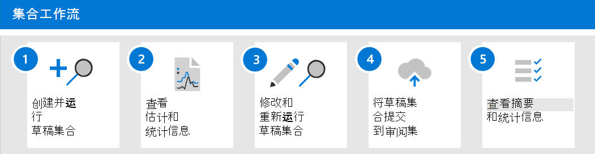

# 了解 Advanced eDiscovery

当组织面临收集可能与调查或潜在诉讼相关的通信和内容时，他们在最佳情况下面临重大挑战。 在当今的现代工作场所中，内容的数量、种类和速度实现了创新与远程工作，同时还扩展了管理电子数据展示调查集合的要求和流程。

收集工作流在从本机位置和源提取内容方面带来了重大技术挑战。 在常见诉讼或调查方案的评估和策略中，这也是一个关键点。 当组织开始评估调查时，第一个问题询问了哪些人参与？ 确定所涉及的人员后，可以快速将这些保管人置于保留状态以保留相关内容。 下一个问题是什么？ 要回答任何调查的第二个基本问题，经理必须转向该数据。 为了快速评估与所发生问题最相关的内容，经理开始优化问题的目标，以确保收集结果全面，而不会过于宽泛。

Advanced eDiscovery中的集合可帮助电子数据展示管理员快速确定跨电子邮件、文档和其他内容搜索Microsoft 365。 集合为经理提供与案例相关的内容的估计值。 这使经理能够做出有关与案例相关的内容大小和范围的快速、明智的决策。 电子数据展示管理员可以创建一个集合来搜索诸如邮箱和 SharePoint 网站) 等高级数据源 (并且通过使用特定的搜索条件 (如关键字和日期范围) 来快速定义其集合的范围。

定义集合后，电子数据展示管理员可以将集合另存为草稿并获取估计值，包括数据量估计值、包含结果的内容位置以及搜索查询条件的命中数。 这些见解有助于在继续电子数据展示工作流中的审阅和分析阶段之前，告知是否应修改集合以缩小或扩展集合的范围。

当经理对集合的范围和可能做出响应的估计内容量感到满意时，经理可以将内容添加或提交到审阅集。 将集合提交到审阅集时，该经理还可以选择包括聊天对话、云附件和文档版本。 在将集合中的内容纳入审阅集期间，该集合中的内容也会经历另一个处理级别。 集合将更新为最终集合摘要。 将内容添加到审阅集后，电子数据展示管理员可继续查询、分组和优化中的内容，以帮助实现最小化和审阅。 此外，该集合还更新了与提交到审阅集的内容有关的信息和统计信息。 这将提供有关集合中内容的历史参考。

随着集合在集合中的发布Advanced eDiscovery，"搜索"选项卡已重命名为"集合"，Advanced eDiscovery中Microsoft 365 合规中心。 定义集合的范围和大小的步骤遵循与搜索相同的过程来定义位置和条件。 另存为草稿并获取预览估计值可在将完全搜索和集合提交到审阅集中之前快速验证集合的目标范围。 这样，可以改进作业管理和目标迭代，以便开始在搜索和收集过程中最小化内容。

## 集合工作流

若要开始使用 Advanced eDiscovery 集合，下面是一个基本工作流以及过程中每个步骤的说明。

1. **创建并运行草稿集合**。 第一步是创建一个草稿集合，并定义要搜索的首次使用和非托管数据源。 您还可以搜索尚未添加到案例的其他数据源。 添加数据源后，您将搜索查询配置为在数据源中搜索与案例相关的内容。 您可以使用关键字、属性和条件来构建搜索查询，以返回与案例最相关的内容。 有关详细信息，请参阅 [创建草稿集合](create-draft-collection.md)。

2. **查看估计值和统计信息**。 创建并运行草稿集合后，下一步是查看集合统计信息，以帮助您验证是否找到相关内容以及点击量最多的内容位置。 您还可以预览搜索结果示例，以进一步帮助您确定内容是否位于调查范围内。 有关详细信息，请参阅 [草稿集合的统计信息和报告](collection-statistics-reports.md#statistics-and-reports-for-draft-collections)。

3. **修改并重新运行草稿集合**。 根据集合返回的估计值和统计信息，您可以编辑草稿集合，方法为更改搜索的数据源以及扩展或缩小集合的搜索查询。 您可以更新和重新运行草稿集合，直到您确信该集合包含与案例最相关的内容。

4. **将草稿集合提交到审阅集**。 如果对集合返回与案例相关的类型内容感到满意，可以将该集合提交到审阅集。 提交集合时，可以选择将对话线程、云附件和文档版本添加到审阅集，所有这些版本可能都与大小写相关。

   提交集合时，子项目（如电子邮件签名和图像）从父项目 (（如电子邮件、聊天消息或文档) ）中提取，然后由光学字符识别 (OCR) 处理以从子项中提取任何文本。 然后，从子项中提取的文本将添加到其父项中，以便您可以在审阅集内查看它。 通过不将子项目作为单独的文件添加到审阅集，Advanced eDiscovery有助于限制添加到审阅集的潜在非实质性项目的数量。 有关如何处理子项的信息，请参阅 [集合统计信息和报告](collection-statistics-reports.md#collection-contents)。

   有关详细信息，请参阅 [将草稿集合提交到审阅集](commit-draft-collection.md)。

5. **查看集合摘要和统计信息**。 将集合提交到审阅集后，将保留有关该集合的信息，例如有关提取项的统计信息、深度索引、用于集合的搜索查询以及从中收集项目的内容位置。 此外，无法编辑或重新运行已提交的集合。 只能复制或删除它们。 保留集合提供已添加到审阅集的已收集项目的历史记录。 有关详细信息，请参阅已提交 [集合的统计信息和报告](collection-statistics-reports.md#statistics-and-reports-for-committed-collections)。
