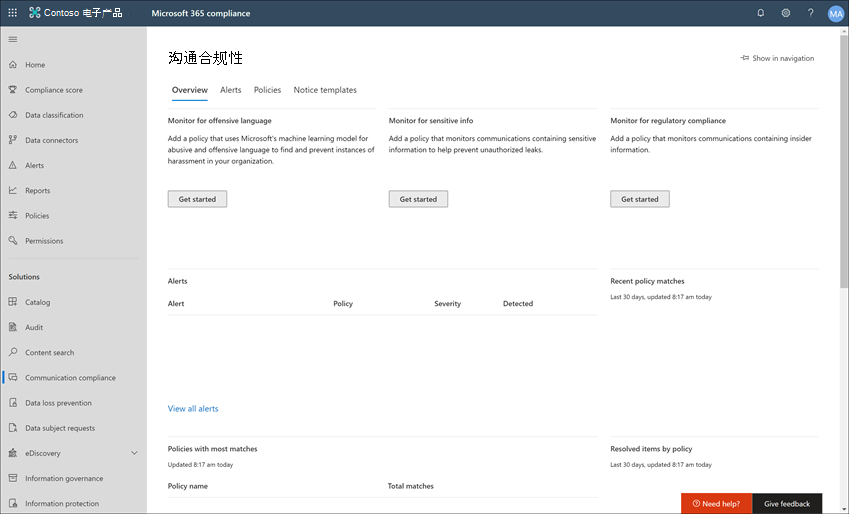
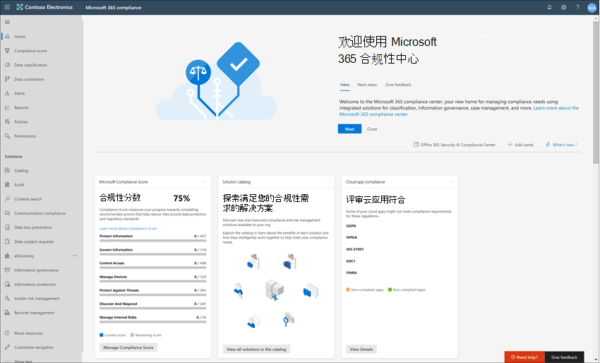
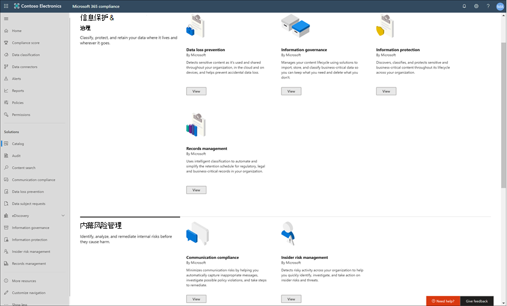
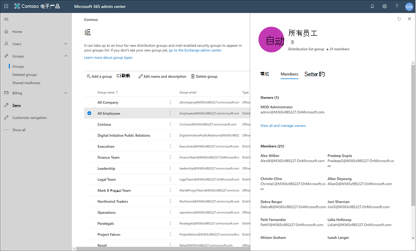

# 案例研究 - Contoso 快速配置不恰当的文本策略，Microsoft Teams、Exchange和Yammer通信

组织中通信合规性Microsoft 365检测、捕获和操作组织中具有不当文本的邮件，从而有助于将通信风险降至最低。 不适当的文本可能包括亵亵、威胁、骚扰和不当图像。 预定义和自定义的策略让你能够扫描内部和外部通讯，查看与策略的匹配情况，让委派的审阅者能检查它们。 审阅者可以调查组织中扫描的电子邮件、Microsoft Teams、Yammer 或第三方通信，并采取适当的补救措施以确保他们符合组织的邮件标准。

Contoso Corporation 是一个虚构组织，需要快速配置策略以监视不恰当的文本。 他们一直在将Microsoft 365主要用于电子邮件、Microsoft Teams和Yammer支持，但对于强制执行公司关于工作场所骚扰的策略有新的要求。 Contoso IT 管理员和合规性专家对使用 Microsoft 365 的基础知识有基本的了解，并且正在寻找有关如何快速开始使用通信合规性的端到端指南。

此案例研究将涵盖快速配置通信合规性策略以监视不恰当的文本通信的基础知识。 本指南包括：

- 第一步–通信合规性规划
- 第二步–在 Microsoft 365 中评估通信合规性
- 第三步–配置先决条件并创建通信合规性策略
- 第四步–调查并修正警报

## 步骤 1：规划通信合规性

Contoso IT 管理员和合规性专家参加 Microsoft 365 中有关合规性解决方案的联机网络研讨会，并决定通信合规性策略帮助他们满足更新的公司策略要求，以减少工作场所骚扰。 通过协同工作，他们制定了创建和启用通信合规性策略的计划，该策略将监视在 Microsoft Teams 中发送的聊天、Yammer 中的私人消息和社区对话以及 Exchange Online 中发送的电子邮件中发送的不当文本。 他们的计划包括识别:

- 需要访问通信合规性功能的 IT 管理员。
- 需要创建和管理通信策略的合规性专家。
- 合规专家和其他部门的同事 (人力资源、法律等) 需要调查和修正通信合规性警报。
- 在通信合规性不恰当的文本策略范围内的用户。

### 许可

第一步是确认 Contoso Microsoft 365许可包括对通信合规性解决方案的支持。 若要访问和使用通信合规性，Contoso IT 管理员需要验证 Contoso 是否具有以下项之一：

- Microsoft 365 E5 订阅（付费或试用版本）
- Microsoft 365 E3 订阅 + Microsoft 365 E5 合规加载项
- Microsoft 365 E3 订阅 + Microsoft 365 E5 预览体验成员风险管理加载项
- Microsoft 365 A5 订阅（付费或试用版本）
- Microsoft 365 A3 订阅 + Microsoft 365 A5 合规加载项
- Microsoft 365 A3 订阅 + Microsoft 365 A5 预览体验成员风险管理加载项
- Microsoft 365 G5 订阅（付费或试用版本）
- Microsoft 365 G5 订阅 + Microsoft 365 G5 合规加载项
- Microsoft 365 G5 订阅 + Microsoft 365 G5 预览体验成员风险管理加载项
- Office 365 企业版 E5 订阅（付费或试用版本）
- Office 365 企业版 E3 订阅 + Office 365 高级合规版加载项（新订阅已不再可用，请参阅注释）

他们还必须确认必须为通信合规性策略中包含的用户分配上述许可证之一。

> [!IMPORTANT]
> Office 365 高级合规版已不再作为独立订阅销售。 当前订阅到期后，客户应过渡到以上订阅之一，其中包含了相同的或其它合规性功能。

Contoso IT 管理员执行以下步骤来验证 Contoso 的许可支持：

1. IT 管理员登录到网站Microsoft 365 管理中心 <https://admin.microsoft.com> 转到"Microsoft 365 管理中心 >**许可证**  >  <a href="https://go.microsoft.com/fwlink/p/?linkid=842264" target="_blank">**"。**</a>

2. 在这里，他们确认他们具有一个许可证 [选项](communication-compliance-configure.md#subscriptions-and-licensing) ，其中包括对通信合规性的支持。

### 通信合规性权限

共有 5 个角色组，用于配置权限以管理通信合规性功能。 若要使 **通信合规性** 作为菜单中的菜单选项Microsoft 365 合规中心继续执行这些配置步骤，为 Contoso 管理员分配 *了通信合规性管理员* 角色。

Contoso 决定使用 *Communication Compliance* 角色组向该组分配所有通信合规性管理员、分析员、研究人员和查看者。 这样，Contoso 可以更轻松地快速入门，并最好地满足其合规性管理要求。

|**角色**|**角色权限**|
|:-----|:-----|
| **通信合规性** | 使用此角色组在单个组中管理组织的通信合规性。 通过添加指定管理员、分析者、调查者和查看者的所有用户账户，可以在单个组中配置通信合规性权限。 此角色组包含所有通信合规性权限角色。 这一配置是通信合规性快速入门的最简单方式，非常适合不需要为单独用户组定义单独权限的组织。 |
| **通信合规性管理员** | 使用此角色组进行通信合规性初始配置，后期可将通信合规性管理员隔离到已定义组中。 分配到此角色组的用户可以创建、读取、更新和删除通信合规性策略、全局设置和角色组分配。 分配到此角色组的用户无法查看消息警报。 |
| **通信合规性分析者** | 使用此组向执行通信合规性分析者操作的用户分配权限。 分配到此角色组的用户可以查看分配其为审阅者的策略，查看消息元数据（而不是消息内容）、升级到其他审阅者，或向用户发送通知。 分析者不能解决挂起的警报。 |
| **通信合规性调查者** | 使用此组向执行通信合规性调查者操作的用户分配权限。 分配到此角色组的用户可以查看消息元数据和内容、升级到其他审阅者、升级到高级 eDiscovery 案例、向用户发送通知、以及解决警报。 |
| **通信合规性查看者** | 使用此组向管理通信报告的用户分配权限。 分配到此角色组的用户可以访问通信合规性主页上的所有报告小组件，并且可以查看所有通信合规性报告。 |

1. Contoso IT 管理员使用全局Microsoft 365 合规中心帐户的凭据登录到"Microsoft 365 合规中心 权限"页，并选择链接以查看和管理 Microsoft 365 中的角色。
2. 在Microsoft 365 合规中心中，他们转到"权限"并选择链接以查看和管理角色Office 365。
3. 管理员选择"*通信合规性"* 角色组，然后选择"**编辑角色组"。**
4. 管理员从左侧导航 **窗格中选择**"选择成员"，然后选择"编辑 **"。**
5. 他们选择 **"** 添加"，然后选中将管理通信合规性、调查和查看警报的所有 Contoso 用户的复选框。
6. 管理员选择"添加 **"，** 然后选择"完成 **"。**
7. 他们选择 **"保存** "将 Contoso 用户添加到角色组。 他们选择 **"关闭** "以完成这些步骤。

## 步骤 2：访问 Microsoft 365

配置通信合规性权限后，分配给 Communication Compliance 角色组的 Contoso IT 管理员和合规性专家可以访问 Microsoft 365 中的通信合规性解决方案。 Contoso IT 管理员和合规性专家通过多种方式访问通信合规性并开始创建新策略：

- 直接从通信合规性解决方案开始
- 从以下Microsoft 365 合规中心
- 从解决方案Microsoft 365开始
- 从以下Microsoft 365 管理中心

### 直接从通信合规性解决方案开始

访问解决方案的最快方法就是直接登录通信合规性 <https://compliance.microsoft.com/supervisoryreview> () 解决方案。 使用此链接，Contoso IT 管理员和合规性专家将被定向到通信合规性概述仪表板，您可以在其中快速查看警报状态，并基于预定义模板创建新策略。

### 从以下Microsoft 365 合规中心

Contoso IT 管理员和合规性专家访问通信合规性解决方案的另一种简单方式是直接登录到 Microsoft 365 合规中心[。](https://compliance.microsoft.com) 登录后，用户只需选择“**显示全部**”控件来显示所有合规性解决方案，然后选择“**通信合规性**”解决方案，就可以开始了。

### 从解决方案Microsoft 365开始

Contoso IT 管理员和合规性专家还可以选择访问通信合规性解决方案，Microsoft 365解决方案目录。 通过在左侧 **导航****的"** 解决方案"部分选择"目录"，Microsoft 365 合规中心 **打开列出** 所有合规性解决方案Microsoft 365目录。 向下滚动到" **内部风险管理** "部分，Contoso IT 管理员可以选择"通信合规性"以开始操作。 Contoso IT 管理员还决定使用"在导航中显示"控件将通信合规性解决方案固定到左侧导航窗格，以便他们今后登录时更快地访问。

### 从以下Microsoft 365 管理中心

若要在从 Microsoft 365 管理中心 开始访问通信合规性，Contoso IT 管理员和合规性专家登录到 Microsoft 365 管理中心[ (https://admin.microsoft.com) ](https://admin.microsoft.com)并转到Microsoft 365 合规中心

此操作 **将Office 365安全** 与合规中心，并且他们必须选择页面顶部的Microsoft 365 合规中心横幅 **中** 提供的链接。

完成 **此Microsoft 365 合规中心后**，Contoso IT 管理员选择"全部显示"以显示合规性解决方案的完整列表。

选择" **全部显示"** 后，Contoso IT 管理员可以访问通信合规性解决方案。

## 步骤 3：配置先决条件并创建通信合规性策略

若要开始使用通信合规性策略，Contoso IT 管理员需要在设置新策略以监视不恰当的文本之前配置几个先决条件。 完成这些先决条件后，Contoso IT 管理员和合规性专家可以配置新策略，合规性专家可以开始调查和修正任何生成的警报。

### 启用审核Microsoft 365

通信合规性需要审核日志显示警报和跟踪审阅者采取的修正操作。 审核日志是与已定义的组织策略相关的所有活动的摘要，也可以是通信合规性策略任何发生更改时的摘要。

Contoso IT 管理员检查并完成“[逐步说明](turn-audit-log-search-on-or-off.md)”来打开审核。 打开审核之后，将显示一条消息，内容为正在准备审核日志，他们可以在准备完成后几个小时内运行搜索。 Contoso IT 管理员只需完成此操作一次。

### 为本机Yammer配置租户

通信合规性要求组织的 Yammer 租户在本机模式下监视私人消息和公共社区对话中的不当文本。

Contoso IT 管理员确保他们查看 Microsoft 365 中的 Yammer 本机模式概述文章中的信息，并按照为[Microsoft 365](/yammer/configure-your-yammer-network/overview-native-mode)的本机模式配置[Yammer](/yammer/configure-your-yammer-network/native-mode)网络一文中的步骤运行迁移工具。

### 为范围内用户设置组

Contoso 合规性专家希望将所有用户添加到将监视不当文本的通信策略中。 他们可以决定将每个用户帐户分别添加到策略中，但他们决定使用此策略的用户的"所有用户"通讯组要容易得多，并节省时间。 

他们需要创建一个新组以包括所有 Contoso 用户，以便执行以下步骤：

1. Contoso IT 管理员 IT 登录到 Microsoft 365 管理中心 [ https://admin.microsoft.com) (](https://admin.microsoft.com)并转到"Microsoft 365 管理中心 >**组**  >  <a href="https://go.microsoft.com/fwlink/p/?linkid=2052855" target="_blank">**"。**</a>
2. 他们选择 **"添加组"** 并完成向导，以创建新的Microsoft 365 *组* 或 *通讯组*。

    

3. 创建新组后，他们需要添加所有的 Contoso 用户到此组。 他们打开管理 **Exchange中心**[ (https://outlook.office365.com/ecp)](https://outlook.office365.com/ecp)并导航Exchange **管理** 中心  >  **收件人**  >  <a href="https://go.microsoft.com/fwlink/?linkid=2183233" target="_blank">**组"**</a>。 Contoso IT 管理员选择"成员身份"区域及其创建的新"*所有员工*"组，并选择"编辑"控件以将所有 Contoso 用户添加到向导中的新组。

    

### 创建策略以监视不恰当的文本

完成所有先决条件后，CONtoso 的 IT 管理员和合规性专家已准备好配置通信合规性策略，以监视不恰当的文本。 使用新的不恰当的文本策略模板，可简单快速地配置此策略。

1. Contoso IT 管理员和合规性专家登录到 **Microsoft 365 合规中心**，然后选择左侧导航窗格中的“**通信合规性**”。 此操作会打开“**概述**”仪表板，其中有通信合规性策略模版的快速链接。 他们通过选择 **模板的** "入门"来选择"监视 **不恰当的文本** 模板"。

    

2. 在策略模版向导中，Contoso IT 管理员和合规性专家一同完成三项必填字段：“**策略名称**”、“**要监督的用户或组**、“**审查者**”。
3. 因为策略向导已经给出了策略的建议名称，IT 管理员和合规性专家决定就使用建议名称，然后专注完成剩下字段。 他们选择 *"要监督的用户* 或组"字段的"所有用户"组，并选择应调查和修正"审阅者"字段的策略警报的 **合规性专家。** 配置策略并开始收集警报信息的最后一步是选择"创建 **策略"。**

    

## 步骤 4: 调查并修正警报

现在已配置用于监视不恰当的文本的通信合规性策略，Contoso 合规性专家的下一步是调查和修正策略生成的任何警报。 最多 24 小时后，策略才能正常处理所有通信源通道中的通信，并且让所有警报显示在“**警报仪表板**”中。

生成警报后，Contoso 合规性专家将按照工作流说明调查和修正不适当的文本问题。