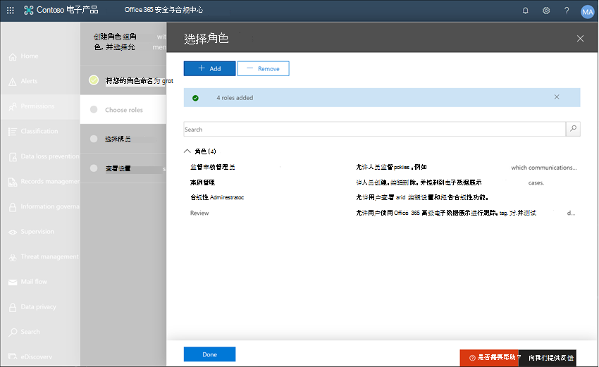

# 案例研究-Contoso 为 Microsoft 团队和 Exchange 通信快速配置冒犯性语言策略

Microsoft 365 中的通信合规性通过帮助您检测、捕获和采取补救措施对组织中不适当的邮件进行补救，来帮助最大限度地减少通信风险。 通过预定义和自定义策略，可以扫描策略匹配的内部和外部通信，以便指定的审阅者可以对其进行检查。 审阅者可以调查组织中扫描的电子邮件、Microsoft 团队或第三方通信，并采取适当的补救措施以确保它们符合组织的邮件标准。

Contoso Corporation 是一个虚构的组织，需要快速配置一个策略来监视冒犯性语言。 他们一直使用 Microsoft 365，主要是为他们的员工提供电子邮件和 Microsoft 团队支持，但在工作场所骚扰方面有新的要求强制实施公司政策。 Contoso IT 管理员和合规性专家对使用 Microsoft 365 的基础有一个基本的了解，并且正在寻找有关如何快速开始实现通信合规性的端到端指南。

此案例研究将介绍快速配置通信合规性策略以监视攻击性语言通信的基础知识。 本指南包括：

- 第1步-规划通信合规性
- 第2步-访问 Microsoft 365 中的通信合规性
- 步骤 3-配置系统必备组件和创建通信合规性策略
- 第4步-调查和修正警报

## 第1步-规划通信合规性

Contoso IT 管理员和合规性专家在 Microsoft 365 中参加了有关合规性解决方案的在线网络研讨会，并确定通信合规性策略将帮助他们满足更新的公司策略要求以减少工作区骚扰. 它们共同开发了一个计划，用于创建和启用通信合规性策略，该策略将监视在 Exchange Online 中发送的电子邮件的 Microsoft 团队中发送的用于聊天的攻击性语言。 其计划包括标识：

- 需要访问通信合规性功能的 IT 管理员。
- 需要创建和管理通信策略的合规性专家。
- 需要调查和修正通信合规性警报的合规性专家和其他部门（人力资源、法律等）中的其他同事。
- 将为通信合规性攻击性语言策略的范围内的用户。

### 许可

第一步是确认 Contoso 的 Microsoft 365 许可包括对通信合规性解决方案的支持。 若要访问和使用通信合规性，Contoso IT 管理员需要验证 Contoso 是否具有以下各项之一：

- Microsoft 365 E5 订阅（付费或试用版）
- 具有 "高级合规性" 加载项的 Office 365 企业版 E3 许可证
- Office 365 企业版 E5 订阅（付费或试用版）

他们还必须确认必须将通信合规性策略中包含的用户分配给上面列出的许可证之一。

Contoso IT 管理员需要执行以下步骤来验证 Contoso 的许可支持：

1. IT 管理员登录到**microsoft 365 管理中心** [（https://admin.microsoft.com) ](https://admin.microsoft.com)并导航到**microsoft 365 管理中心** > **帐单** > **许可证**。

2. 在这里，他们确认他们有一个[许可证选项](https://docs.microsoft.com/microsoft-365/compliance/communication-compliance-configure?view=o365-worldwide#before-you-begin)，其中包括支持通信合规性。

### 通信合规性的权限

默认情况下，全局管理员不具有对通信合规性功能的访问权限。 [必须配置权限](https://docs.microsoft.com/microsoft-365/compliance/communication-compliance-configure?view=o365-worldwide#step-1-required-enable-permissions-for-communication-compliance)，以便 Contoso IT 管理员和合规性专家可以访问通信合规性。

1. Contoso IT 管理员登录到**office 365 安全与合规中心**权限页面[（https://protection.office.com/permissions) ](https://protection.office.com/permissions)使用全局管理员帐户的凭据，并选择用于查看和管理 Office 365 中的角色的链接。
2. 选择 "**创建**" 后，将新角色组命名为 "*通信合规性*" 的友好名称，然后选择 "**下一步**"。
3. 他们选择 "**选择角色**"，然后选择 "**添加**"。 他们通过选中*监管审核管理员*、*案例管理*、*合规性管理员*和*审阅*的复选框来添加所需的角色，然后选择 "**添加**"、 **"完成" 和 "** **下一步**"。

4. 接下来，IT 管理员选择 "**选择成员**"，然后选择 "**添加**"。 选中要为其创建策略并管理策略匹配的邮件的所有用户和组的复选框。 他们将 IT 管理员、合规性专家和其他同事添加到在初始规划中确定的人力资源和法律部门，然后选择 "**添加**"、"**完成**" 和 "**下一步**"。
5. 若要完成权限，IT 管理员选择 "**创建角色组**" 以完成。 在 Contoso 的 Microsoft 365 服务中，角色将需要大约30分钟的时间才能生效。

## 第2步-访问 Microsoft 365 中的通信合规性

为通信合规性配置权限后，在新角色组中定义的 Contoso IT 管理员和合规性专家可以访问 Microsoft 365 中的通信合规性解决方案。 Contoso IT 管理员和合规性专家有几种方法可以访问通信合规性并开始创建新策略：

- 直接从通信合规性解决方案开始
- 从 Microsoft 365 合规性中心开始
- 从 Microsoft 365 解决方案目录开始
- 从 Microsoft 365 管理中心开始

### 直接从通信合规性解决方案开始

访问解决方案的最快方法是直接登录到**通信合规性**（<https://compliance.microsoft.com/supervisoryreview>）解决方案。 使用此链接，Contoso IT 管理员和合规性专家将转到通信合规性概述仪表板，您可以在其中快速查看通知的状态并从预定义的模板创建新策略。

### 从 Microsoft 365 合规性中心开始

Contoso IT 管理员和合规性专家访问通信合规性解决方案的另一种简单方法是直接登录**Microsoft 365 合规中心** [（https://compliance.microsoft.com)](https://compliance.microsoft.com)。 登录后，用户只需选择 "**全部显示**" 控制即可显示所有合规性解决方案，然后选择要开始的**通信合规性**解决方案。

### 从 Microsoft 365 解决方案目录开始

Contoso IT 管理员和合规性专家也可以通过选择 Microsoft 365 解决方案目录来选择访问通信合规性解决方案。 通过在**Microsoft 365 合规性中心**中选择左侧导航的 "**解决方案**" 部分中的 "**目录**"，他们可以打开列出所有 Microsoft 365 合规性解决方案的解决方案目录。 向下滚动到 "**内幕风险管理**" 部分，Contoso IT 管理员可以选择通信合规性以开始。 Contoso IT 管理员还决定使用导航控件中的 "显示" 将通信合规性解决方案固定到左导航窗格中，以便在以后登录时更快地进行访问。

### 从 Microsoft 365 管理中心开始

若要在从 microsoft 365 管理中心开始时访问通信合规性，Contoso IT 管理员和合规性专家登录到 microsoft 365 管理中心[（https://admin.microsoft.com) ](https://admin.microsoft.com)并导航到**microsoft 365 管理中心** > **合规性**。

这将打开**Office 365 安全与合规中心**，并且必须选择页面顶部的横幅中提供的**Microsoft 365 合规性中心**的链接。

在**Microsoft 365 合规性中心**中，Contoso IT 管理员选择 "**全部显示**" 以显示完整的合规性解决方案列表。

选择 "**全部显示**" 后，Contoso IT 管理员可以访问通信合规性解决方案。

## 步骤 3-配置系统必备组件和创建通信合规性策略

若要开始使用通信合规性策略，Contoso IT 管理员需要先配置一些先决条件，然后再设置新策略来监视冒犯性语言。 完成这些先决条件后，Contoso IT 管理员和合规性专家可以配置新策略和合规性专家，以开始调查并修正任何生成的警报。

### 在 Office 365 中启用审核

通信合规性需要审核日志来显示通知并跟踪审阅者采取的修正操作。 审核日志汇总了与已定义的组织策略相关联的所有活动，或只要有对通信合规性策略的更改。

Contoso IT 管理员查看并完成有关启用审核的[分步说明](https://docs.microsoft.com/microsoft-365/compliance/turn-audit-log-search-on-or-off)。 在他们启用审核后，会显示一条消息，指出正在准备审核日志，并且在准备完成后，可以在几个小时内运行搜索。 Contoso IT 管理员只需执行一次此操作。

### 为范围内用户设置组

Contoso 合规性专家希望将所有员工添加到将监视攻击性语言的通信策略中。 他们可以决定单独将每个员工用户帐户添加到策略中，但他们已决定在使用此策略的用户的**所有员工**通讯组时，会轻松得多，并节省大量时间。

他们需要创建一个新组来包含所有 Contoso 员工，因此他们需要执行以下步骤：

1. Contoso it 管理员：登录**microsoft 365 管理中心** [（https://admin.microsoft.com) ](https://admin.microsoft.com)并导航到**microsoft 365 管理中心** > **组** > **组**。
2. 他们选择 "**添加组**" 并完成向导，以创建新的*Office 365 组*或*通讯组*。

3. 创建新组之后，需要将所有 Contoso 用户添加到新组中。 他们打开**exchange 管理中心** [（https://outlook.office365.com/ecp) ](https://outlook.office365.com/ecp)并导航到**exchange 管理中心** > "**收件人** > "**组**。 Contoso IT 管理员选择成员资格区域和他们创建的新的*所有员工*组，并在向导中选择 "**编辑**" 控件以将所有 Contoso 员工添加到新组中。

### 创建用于监视冒犯性语言的策略

在满足所有先决条件的前提下，Contoso 的 IT 管理员和合规性专家可以配置通信合规性策略以监视攻击性语言。 使用新的冒犯性语言策略模板，配置此策略既简单又快速。

1. Contoso IT 管理员和合规性专家登录**Microsoft 365 合规性中心**，并从左侧导航窗格中选择 "**通信合规性**"。 此操作将打开**概述**仪表板，其中包含有关通信合规性策略模板的快速链接。 它们通过选择模板的 "**入门**" 来选择**用于攻击性语言**模板的监视器。

2. 在策略模板向导中，Contoso IT 管理员和合规性专家将共同完成以下三个必填字段：**策略名称**、**要监督的用户或组**以及**审阅者**。
3. 由于策略向导已经为策略建议了名称，IT 管理员和合规性专家决定保留建议的名称，并将重点放在其余字段上。 他们选择 "要管理的**用户或组**的*所有雇员*" 组，然后选择应调查和修正 "**审阅者**" 字段的策略通知的合规性专家。 配置策略和开始收集警报信息的最后一步是选择 "**创建策略**"。

## 第4步–调查和修正警报

现在已配置用于监视攻击性语言的通信合规性策略，Contoso 合规性专家的下一步是调查并修正该策略生成的任何警报。 该策略最长需要24小时才能完全处理所有通信源通道中的通信，并且警报**仪表板**中显示警报。

生成警报后，Contoso 合规性专家将遵循[工作流说明](https://docs.microsoft.com/microsoft-365/compliance/communication-compliance-investigate-remediate)来调查和修正攻击性语言问题。
