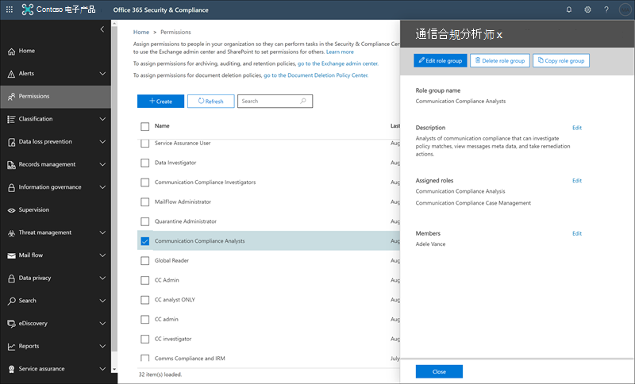

# 通信合规性入门Get started with communication compliance

使用通信合规性策略来确定内部或外部审阅者进行检查的用户通信。Use communication compliance policies to identify user communications for examination by internal or external reviewers. 有关通信合规性策略如何帮助您监视组织中的通信的详细信息，请参阅[Microsoft 365 中的通信合规性策略](communication-compliance.md)。For more information about how communication compliance policies can help you monitor communications in your organization, see [communication compliance policies in Microsoft 365](communication-compliance.md). 如果您想要查看 Contoso 如何快速将通信合规性策略配置为在 Microsoft 团队、Exchange Online 和 Yammer 通信中监视攻击性语言，请查看此[案例研究](communication-compliance-case-study.md)。If you'd like to review how Contoso quickly configured a communication compliance policy to monitor for offensive language in Microsoft Teams, Exchange Online, and Yammer communications, check out this [case study](communication-compliance-case-study.md).

## 准备工作Before you begin

在开始进行通信合规性之前，应确认你的[Microsoft 365 订阅](https://www.microsoft.com/microsoft-365/compare-all-microsoft-365-plans)和任何加载项。Before you get started with communication compliance, you should confirm your [Microsoft 365 subscription](https://www.microsoft.com/microsoft-365/compare-all-microsoft-365-plans) and any add-ons. 若要访问和使用通信合规性，您的组织必须具有以下订阅或加载项之一：To access and use communication compliance, your organization must have one of the following subscriptions or add-ons:

- Microsoft 365 E5 订阅 (付费或试用版) Microsoft 365 E5 subscription (paid or trial version)
- Microsoft 365 E3 订阅 + Microsoft 365 E5 合规性加载项Microsoft 365 E3 subscription + the Microsoft 365 E5 Compliance add-on
- Microsoft 365 E3 订阅 + Microsoft 365 E5 内幕人士风险管理加载项Microsoft 365 E3 subscription + the Microsoft 365 E5 Insider Risk Management add-on
- Microsoft 365 A5 订阅 (付费版或试用版) Microsoft 365 A5 subscription (paid or trial version)
- Microsoft 365 A3 订阅 + Microsoft 365 A5 合规性加载项Microsoft 365 A3 subscription + the Microsoft 365 A5 Compliance add-on
- Microsoft 365 A3 订阅 + Microsoft 365 A5 内幕成员风险管理加载项Microsoft 365 A3 subscription + the Microsoft 365 A5 Insider Risk Management add-on
- Microsoft 365 G5 订阅 (付费版或试用版) Microsoft 365 G5 subscription (paid or trial version)
- Microsoft 365 G5 订阅 + Microsoft 365 G5 合规性附加Microsoft 365 G5 subscription + the Microsoft 365 G5 Compliance add-on
- Microsoft 365 G5 订阅 + Microsoft 365 G5 内幕版风险管理加载项Microsoft 365 G5 subscription + the Microsoft 365 G5 Insider Risk Management add-on
- Office 365 企业版 E5 订阅 (付费或试用版) Office 365 Enterprise E5 subscription (paid or trial version)
- Office 365 企业版 E3 订阅 + Office 365 高级合规性外接程序 (不再可用于新订阅，请参阅 note) Office 365 Enterprise E3 subscription + the Office 365 Advanced Compliance add-on (no longer available for new subscriptions, see note)

必须为通信合规性策略中包含的用户分配上述许可证之一。Users included in communication compliance policies must be assigned one of the licenses above.

>[!IMPORTANT]
>Office 365 高级合规性不再作为独立订阅销售。Office 365 Advanced Compliance is no longer sold as a standalone subscription. 当当前订阅过期时，客户应转换为上述订阅之一，其中包含相同或更多的合规性功能。When current subscriptions expire, customers should transition to one of the subscriptions above, which contain the same or additional compliance features.

如果您没有现成的 Office 365 企业版 E5 计划，并且想要尝试使用内幕风险管理，则可以[将 Microsoft 365 添加](https://docs.microsoft.com/office365/admin/try-or-buy-microsoft-365)到现有订阅或注册 Office 365 企业版 e5 的[试用版](https://www.microsoft.com/microsoft-365/enterprise)。If you don't have an existing Office 365 Enterprise E5 plan and want to try insider risk management, you can [add Microsoft 365](https://docs.microsoft.com/office365/admin/try-or-buy-microsoft-365) to your existing subscription or [sign up for a trial](https://www.microsoft.com/microsoft-365/enterprise) of Office 365 Enterprise E5.

## 步骤 1 (必需) ：启用通信合规性的权限Step 1 (required): Enable permissions for communication compliance

>[!Important]
>默认情况下，全局管理员不具有对通信合规性功能的访问权限。By default, Global Administrators do not have access to communication compliance features. 在此步骤中分配的角色在所有通信合规性功能都可访问之前是必需的。The roles assigned in this step are required before any communication compliance features will be accessible.

有五个角色用于配置管理通信合规性功能的权限。There are five roles used to configure permissions to manage communication compliance features. 为了使**通信合规性**在 Microsoft 365 合规性中心中可用作菜单选项，若要继续执行这些配置步骤，您必须分配有*通信合规性管理员*角色。To make **Communication compliance** available as a menu option in Microsoft 365 compliance center and to continue with these configuration steps, you must be assigned the *Communication Compliance Admin* role.

根据您希望管理通信策略和通知的方式，您需要为管理员、审阅者和调查人员创建一个或多个新的角色组。Depending on how you wish to manage communication policies and alerts, you'll need to create one or more new role groups for administrators, reviewers, and investigators. 您可以选择将用户分配给特定角色组，以管理通信合规性功能的不同方面。You have the option to assign users to specific role groups to manage different areas of communication compliance features. 或者，您可以决定创建一个角色组，并将所有通信合规性角色分配给该组。Or you may decide to create one role group and assign all the communication compliance roles to the group. 创建一个或多个角色组，以最大限度地满足合规性管理要求。Create a single role group or multiple role groups to best fit your compliance management requirements.

配置通信合规性角色组时，请从以下角色选项中进行选择：Choose from these role options when configuring your communication compliance role groups:

|**角色****Role**|**角色权限****Role permissions**|
|:-----|:-----|
| **通信合规性管理员****Communication Compliance Admin** | 分配了此角色的用户可以创建、读取、更新和删除通信合规性策略、全局设置和角色组分配。Users assigned this role can create, read, update, and delete communication compliance policies, global settings, and role group assignments. 分配了此角色的用户无法查看邮件警报。Users assigned this role cannot view message alerts. |
| **通信合规性分析****Communication Compliance Analysis** | 分配了此角色的用户可以查看将其分配为审阅者的策略、查看邮件元数据 (不是邮件内容) 、升级到其他审阅者或向用户发送通知。Users assigned this role can view policies where they are assigned as Reviewers, view message metadata (not message content), escalate to additional reviewers, or send notifications to users. 分析师无法解决待处理的警报。Analysts cannot resolve pending alerts. |
| **通信合规性调查****Communication Compliance Investigation** | 分配了此角色的用户可以查看邮件元数据和内容、升级到其他审阅者、升级到高级电子数据展示事例、向用户发送通知以及解决警报。Users assigned this role can view message metadata and content, escalate to additional reviewers, escalate to an Advanced eDiscovery case, send notifications to users, and resolve the alert. |
| **通信合规性查看器****Communication Compliance Viewer** | 分配了此角色的用户可以访问通信合规性主页上的所有报告小部件，并且可以查看所有通信合规性报告。Users assigned this role can access all reporting widgets on the communication compliance home page and can view all communication compliance reports. |
| **通信合规性案例管理****Communication Compliance Case Management** | 分配了此角色的用户可以管理案例并对通知进行操作。Users assigned this role can manage cases and act on alerts. 为管理员、分析师和调查人员创建自定义角色组时，需要此角色。This role is required for when creating custom role groups for administrators, analysts, and investigators. 查看器的自定义组不需要分配此角色。Custom groups for viewers do not need this role assigned. |

### 选项1：创建具有所有通信合规性角色的新角色组Option 1: Create a new role group with all communication compliance roles

1. [https://protection.office.com/permissions](https://protection.office.com/permissions)在 Microsoft 365 组织中使用管理员帐户的凭据进行登录。Sign into [https://protection.office.com/permissions](https://protection.office.com/permissions) using credentials for an admin account in your Microsoft 365 organization.

2. 在 "安全 &amp; 合规性中心" 中，转到 "**权限**"。In the Security &amp; Compliance Center, go to **Permissions**. 选择用于查看和管理 Office 365 中的角色的链接。Select the link to view and manage roles in Office 365.

3. 选择“创建”\*\*\*\*。Select **Create**.

4. 在 "**名称**" 字段中，为新角色组指定一个友好名称。In the **Name** field, give the new role group a friendly name. 选择“**下一步**”。Select **Next**.

5. 选择 "**选择角色**"，然后选择 "**添加**"。Select **Choose roles** and then select **Add**. 选中以下角色对应的复选框：Select the checkboxes for the following roles:

    - 通信合规性管理员Communication Compliance Admin
    - 通信合规性分析Communication Compliance Analysis
    - 通信合规性调查Communication Compliance Investigation
    - 通信合规性查看器Communication Compliance Viewer
    - 通信合规性案例管理Communication Compliance Case Management

    

6. 选择 "**添加**并**完成**"，然后选择 "**下一步**" 继续。select **Add** and **Done**, then select **Next** to continue.

7. 选择 "**选择成员**"，然后选择 "**添加**"。Select **Choose members** and then select **Add**. 选中您想要创建策略的所有用户和组的复选框，并使用策略匹配来管理邮件，然后选择 "**添加**并**完成**"。Select the checkbox for all the users and groups you want create policies and manage messages with policy matches, then select **Add** and **Done**. 选择“**下一步**”。Select **Next**.

8. 选择 "**创建角色组**" 以完成。Select **Create role group** to finish.

### 选项2：使用不同的通信合规性角色创建新的角色组Option 2: Create new role groups with different communication compliance roles

创建多个角色组，以在组织中的不同用户之间细分通信合规性访问和责任。Create multiple role groups to segment communication compliance access and responsibilities among different users in your organization. 对于每个新的角色组，您将分配不同的通信合规性角色。For each new role group, you'll assign different communication compliance roles.

1. [https://protection.office.com/permissions](https://protection.office.com/permissions)在 Microsoft 365 组织中使用管理员帐户的凭据进行登录。Sign into [https://protection.office.com/permissions](https://protection.office.com/permissions) using credentials for an admin account in your Microsoft 365 organization.

2. 在 "安全 &amp; 合规性中心" 中，转到 "**权限**"。In the Security &amp; Compliance Center, go to **Permissions**. 选择用于查看和管理 Office 365 中的角色的链接。Select the link to view and manage roles in Office 365.

3. 选择“创建”\*\*\*\*。Select **Create**.

4. 在 "**名称**" 字段中，为新角色组指定一个友好名称。In the **Name** field, give the new role group a friendly name. 选择“**下一步**”。Select **Next**.

5. 选择 "**选择角色**"，然后选择 "**添加**"。Select **Choose roles** and then select **Add**. 选中要分配给此组的通信合规性角色对应的复选框。Select the checkbox for the communication compliance roles you want to assign to this group. 例如，如果此角色组适用于组织中的合规分析师，则可以选择*通信合规性分析*和*通信合规性案例管理*角色。For example, if this role group is for compliance analysts in your organization, you would select the *Communication Compliance Analysis* and *Communication Compliance Case Management* roles. 如果此角色组适用于合规性调查人员，则应选择*通信合规性调查*和*通信合规性案例管理*角色。If this role group is for compliance investigators, you would select the *Communication Compliance Investigation* and *Communication Compliance Case Management* roles.

    

6. 选择 "**添加**并**完成**"，然后选择 "**下一步**" 继续。Select **Add** and **Done**, then select **Next** to continue.

7. 选择 "**选择成员**"，然后选择 "**添加**"。Select **Choose members** and then select **Add**. 选中您想要创建策略的所有用户和组的复选框，并使用策略匹配来管理邮件，然后选择 "**添加**并**完成**"。Select the checkbox for all the users and groups you want create policies and manage messages with policy matches, then select **Add** and **Done**. 选择“**下一步**”。Select **Next**.

8. 选择 "**创建角色组**" 以完成。Select **Create role group** to finish.

9. 根据需要，创建其他通信合规性角色组。Create additional communication compliance role groups as needed.

有关角色组和权限的详细信息，请参阅[合规性中心中的权限](../security/office-365-security/protect-against-threats.md)。For more information about role groups and permissions, see [Permissions in the Compliance Center](../security/office-365-security/protect-against-threats.md).

## 步骤 2 (必需) ：启用审核日志Step 2 (required): Enable the audit log

通信合规性需要审核日志来显示通知并跟踪审阅者采取的修正操作。Communication compliance requires audit logs to show alerts and track remediation actions taken by reviewers. 审核日志是与定义的组织策略关联的所有活动的摘要，也是任何与通信合规性策略更改相关的活动。The audit logs are a summary of all activities associated with a defined organizational policy or anytime a communication compliance policy changes.

有关启用审核的分步说明，请参阅[打开或关闭审核日志搜索](turn-audit-log-search-on-or-off.md)。For step-by-step instructions to turn on auditing, see [Turn audit log search on or off](turn-audit-log-search-on-or-off.md). 启用审核后，会显示一条消息，指出正在准备审核日志，并且您可以在准备完成后的几小时内运行搜索。After you turn on auditing, a message is displayed that says the audit log is being prepared and that you can run a search in a couple of hours after the preparation is complete. 您只需执行一次此操作。You only have to do this action once. 有关使用审核日志的详细信息，请参阅[Search the audit log](search-the-audit-log-in-security-and-compliance.md)。For more information about the using the audit log, see [Search the audit log](search-the-audit-log-in-security-and-compliance.md).

## 步骤 3 (可选) ：为通信合规性设置组Step 3 (optional): Set up groups for communication compliance

 创建通信合规性策略时，您需要定义哪些用户已查看其通信，以及谁执行了评论。When you create a communication compliance policy, you define who has their communications reviewed and who performs reviews. 在策略中，您将使用电子邮件地址来标识个人或用户组。In the policy, you'll use email addresses to identify individuals or groups of people. 为简化您的设置，您可以为已查看其通信的用户创建组，并为查看这些通信的用户分组。To simplify your setup, you can create groups for people who have their communication reviewed and groups for people who review those communications. 如果使用的是组，可能需要多个。If you're using groups, you may need several. 例如，如果要监视两个不同的人员组之间的通信，或者要指定不受监督的组。For example, if you want to monitor communications between two distinct groups of people or if you want to specify a group that isn't going to be supervised.

使用下图可帮助您为组织中的通信合规性策略配置组：Use the following chart to help you configure groups in your organization for communication compliance policies:

| **Policy 成员****Policy Member** | **支持的组****Supported Groups** | **不受支持的组****Unsupported Groups** |
|:-----|:-----|:-----|
|受监督用户Supervised users   非监督用户Non-supervised users | 通讯组Distribution groups   Microsoft 365 组Microsoft 365 Groups | 动态通讯组Dynamic distribution groups |
| ReviewersReviewers | 无None | 通讯组Distribution groups   动态通讯组Dynamic distribution groups   启用邮件功能的安全组Mail-enabled security groups |
  
当您在策略中分配通讯组时，该策略将监视通讯组中每个用户的所有电子邮件。When you assign a distribution group in the policy, the policy monitors all emails from each user in distribution group. 当您在策略中分配 Microsoft 365 组时，该策略将监视发送到该组的所有电子邮件，而不是每个组成员收到的单个电子邮件。When you assign a Microsoft 365 group in the policy, the policy monitors all emails sent to that group, not the individual emails received by each group member.

如果您是具有 Exchange 本地部署或外部电子邮件提供商的组织，并且您要为用户监视 Microsoft 团队聊天，则必须为具有内部部署或外部邮箱的用户创建通讯组以进行监视。If you're an organization with an Exchange on-premises deployment or an external email provider and you want to monitor Microsoft Teams chats for your users, you must create a distribution group for the users with on-premises or external mailboxes to monitor. 在后面的这些步骤中，您将分配此通讯组作为策略向导中的受**监督的用户和组**选择。Later in these steps, you'll assign this distribution group as the **Supervised users and groups** selection in the policy wizard.

>[!IMPORTANT]
>您必须将请求与 Microsoft 支持文件一起使用，以使组织能够在安全 & 合规性中心中使用图形用户界面搜索本地用户的团队聊天数据。You must file a request with Microsoft Support to enable your organization to use the graphical user interface in the Security & Compliance Center to search for Teams chat data for on-premises users. 有关详细信息，请参阅针对[本地用户搜索基于云的邮箱](search-cloud-based-mailboxes-for-on-premises-users.md)。For more information, see [Searching cloud-based mailboxes for on-premises users](search-cloud-based-mailboxes-for-on-premises-users.md).

有关设置组的详细信息，请参阅：For more information about setting up groups, see:

- [创建和管理通讯组Create and manage distribution groups](https://docs.microsoft.com/Exchange/recipients-in-exchange-online/manage-distribution-groups/manage-distribution-groups)
- [Microsoft 365 组概述Overview of Microsoft 365 Groups](https://docs.microsoft.com/office365/admin/create-groups/office-365-groups?view=o365-worldwide)

## 步骤 4 (可选) ：验证 Yammer 租户是否处于本机模式Step 4 (optional): Verify your Yammer tenant is in Native Mode

在本机模式中，所有 Yammer 用户都在 Azure Active Directory (AAD) 中，所有组都是 Office 365 组，并且所有文件都存储在 SharePoint Online 中。In Native Mode, all Yammer users are in Azure Active Directory (AAD), all groups are Office 365 Groups, and all files are stored in SharePoint Online. 您的 Yammer 租户必须处于本机模式，以实现通信合规性策略，以扫描和识别 Yammer 中的私人邮件和社区对话中的有风险的对话。Your Yammer tenant must be in Native Mode for communication compliance policies to scan and identify risky conversations in private messages and community conversations in Yammer.

有关在本机模式中配置 Yammer 的详细信息，请参阅：For more information about configuring Yammer in Native Mode, see:

- [Microsoft 365 中的 Yammer 本机模式概述Overview of Yammer Native Mode in Microsoft 365](https://docs.microsoft.com/yammer/configure-your-yammer-network/overview-native-mode)
- [配置适用于 Microsoft 365 本机模式的 Yammer 网络Configure your Yammer network for Native Mode for Microsoft 365](https://docs.microsoft.com/yammer/configure-your-yammer-network/native-mode)

## 步骤 5 (必需) ：创建通信合规性策略Step 5 (required): Create a communication compliance policy
  
>[!Important]
>不支持使用 PowerShell 创建和管理通信合规性策略。Using PowerShell to create and manage communication compliance policies is not supported. 若要创建和管理这些策略，必须使用[Microsoft 365 通信合规性解决方案](https://compliance.microsoft.com/supervisoryreview)中的策略管理控件。To create and manage these policies, you must use the policy management controls in the [Microsoft 365 communication compliance solution](https://compliance.microsoft.com/supervisoryreview).

1. [https://compliance.microsoft.com](https://compliance.microsoft.com)在 Microsoft 365 组织中使用管理员帐户的凭据进行登录。Sign into [https://compliance.microsoft.com](https://compliance.microsoft.com) using credentials for an admin account in your Microsoft 365 organization.

2. 在 Microsoft 365 合规性中心中，选择 "**通信合规性**"。In the Microsoft 365 compliance center, select **Communication compliance**.
  
3. 选择 "**策略**" 选项卡。Select the **Policies** tab.

4. 选择 "**创建策略**"，从模板创建和配置新策略，或创建和配置自定义策略。Select **Create policy** to create and configure a new policy from a template or to create and configure a custom policy.

    如果选择策略模板来创建策略，您将：If you choose a policy template to create a policy, you will:

    - 确认或更新策略名称。Confirm or update the policy name. 一旦创建了策略，便无法更改策略名称。Policy names cannot be changed once the policy is created.
    - 选择要监督的用户或组，包括选择要排除的用户或组。Choose the users or groups to supervise, including choosing users or groups you'd like to exclude.
    - 选择策略的审阅者。Choose the reviewers for the policy. 审阅者是单个用户，并且所有审阅者都必须在 Exchange Online 上托管邮箱。Reviewers are individual users and all reviewers must have mailboxes hosted on Exchange Online. 在这里添加的审阅者是在调查和修正工作流中上报通知时可供选择的审阅者。Reviewers added here are the reviewers that you can choose from when escalating an alert in the investigation and remediation workflow. 将审阅者添加到策略时，他们将自动收到一封电子邮件，通知他们对策略的分配，并提供有关审阅过程的信息的链接。When reviewers are added to a policy, they automatically receive an email message that notifies them of the assignment to the policy and provides links to information about the review process.
    - 选择 "受限条件" 字段，通常是要应用于策略的敏感信息类型或关键字词典。Choose a limited condition field, usually a sensitive info type or keyword dictionary to apply to the policy.

    如果您选择使用策略向导创建自定义策略，您将：If you choose to use the policy wizard to create a custom policy, you will:

    - 为策略指定名称和说明。Give the policy a name and description. 一旦创建了策略，便无法更改策略名称。Policy names can't be changed once the policy is created.
    - 选择要监督的用户或组，包括组织中的所有用户、特定用户和组，或者要排除的其他用户和组。Choose the users or groups to supervise, including all users in your organization, specific users and groups, or other users and groups you'd like to exclude.
    - 选择策略的审阅者。Choose the reviewers for the policy. 审阅者是单个用户，并且所有审阅者都必须在 Exchange Online 上托管邮箱。Reviewers are individual users and all reviewers must have mailboxes hosted on Exchange Online. 在这里添加的审阅者是在调查和修正工作流中上报通知时可供选择的审阅者。Reviewers added here are the reviewers that you can choose from when escalating an alert in the investigation and remediation workflow. 将审阅者添加到策略时，他们将自动收到一封电子邮件，通知他们对策略的分配，并提供有关审阅过程的信息的链接。When reviewers are added to a policy, they automatically receive an email message that notifies them of the assignment to the policy and provides links to information about the review process.
    - 选择要扫描的通信通道，包括 Exchange、Microsoft 团队、Yammer 或 Skype for Business。Choose the communication channels to scan, including Exchange, Microsoft Teams, Yammer, or Skype for Business. 如果您在 Microsoft 365 中配置了连接器，您还将选择扫描第三方源。You'll also choose to scan third-party sources if you've configured a connector in Microsoft 365.
    - 选择要监视的通信方向，包括入站、出站或内部通信。Choose the communication direction to monitor, including inbound, outbound, or internal communications.
    - 定义通信合规性策略[条件](communication-compliance-feature-reference.md#ConditionalSettings)。Define the communication compliance policy [conditions](communication-compliance-feature-reference.md#ConditionalSettings). 您可以从 "消息地址"、"关键字"、"文件类型" 和 "大小匹配条件" 中进行选择。You can choose from message address, keyword, file types, and size match conditions.
    - 选择是否要包含敏感信息类型。Choose if you'd like to include sensitive information types. 在此步骤中，您可以选择默认和自定义的敏感信息类型。This step is where you can select default and custom sensitive info types. 从 "通信合规性策略向导" 中的现有自定义敏感信息类型或自定义关键字词典中进行选择。Pick from existing custom sensitive information types or custom keyword dictionaries in the communication compliance policy wizard. 如果需要，可以在运行向导之前创建这些项目。You can create these items before running the wizard if needed. 您还可以在 "通信合规性策略" 向导中创建新的敏感信息类型。You can also create new sensitive information types from within the communication compliance policy wizard.
    - 选择是否要启用分类器。Choose if you'd like to enable classifiers. 分类器可以检测在电子邮件正文或其他类型的文本中发送或接收的不正确的语言和图像。Classifiers can detect inappropriate language and images sent or received in the body of email messages or other types of text. 您可以选择以下内置分类符：*威胁*、*猥亵*、*目标骚扰*、*成人图像*、 *Racy 图像*和*Gory 图像*。You can choose the following built-in classifiers: *Threat*, *Profanity*, *Targeted harassment*, *Adult images*, *Racy images*, and *Gory images*.

    >[!CAUTION]
    >我们正在弃用**冒犯性语言**内置分类器，因为它会生成大量误报。We are deprecating the **Offensive Language** built-in classifier because it has been producing a high number of false positives. 请勿使用该功能，如果您当前正在使用它，则应将业务流程移出它。Don't use it and if you are currently using it, you should move your business processes off of it. 建议改为使用**威胁**、**猥亵**和**目标骚扰**内置分类符。We recommend using the **Threat**, **Profanity**, and **Targeted harassment** built-in classifiers instead.

    - 定义要查看的通信百分比。Define the percentage of communications to review.
    - 查看策略选择并创建策略。Review your policy selections and create the policy.

5. 使用 "自定义策略" 向导时，选择 "使用模板或**提交**时**创建策略**"。Select **Create policy** when using the templates or **Submit** when using the custom policy wizard.

6. **您的策略已创建**页面将显示有关何时激活策略以及将捕获哪些通信的指南。The **Your policy was created** page is displayed with guidelines on when policy will be activated and which communications will be captured.

## 步骤 6 (可选) ：创建通知模板和配置用户 anonymizationStep 6 (optional): Create notice templates and configure user anonymization

如果希望通过向关联用户发送提醒通知来选择对策略警报做出响应，您需要在组织中至少创建一个通知模板。If you want to have the option of responding to a policy alert by sending a reminder notice to the associated user, you'll need to create at least one notice template in your organization. 在将 "通知模板" 字段作为警报修正过程的一部分发送并为每个通信合规性策略创建自定义的通知模板之前，这些字段都是可编辑的。The notice template fields are editable before they're sent as part of the alert remediation process, and creating a customized notice template for each communication compliance policy is recommended.

您还可以选择在调查策略匹配和对邮件采取操作时为显示的用户名启用 anonymization。You can also choose to enable anonymization for displayed usernames when investigating policy matches and taking action on messages.

1. [https://compliance.microsoft.com](https://compliance.microsoft.com)在 Microsoft 365 组织中使用管理员帐户的凭据进行登录。Sign into [https://compliance.microsoft.com](https://compliance.microsoft.com) using credentials for an admin account in your Microsoft 365 organization.

2. 在 Microsoft 365 合规性中心中，转到 "**通信合规性**"。In the Microsoft 365 compliance center, go to **Communication compliance**.

3. 若要为用户名配置 anonymization，请选择 "**隐私**" 选项卡。To configure anonymization for usernames, select the **Privacy** tab.

4. 若要启用 anonymization，请选择 "**显示匿名版本的用户名**"。To enable anonymization, select **Show anonymized versions of usernames**.

5. 选择“**保存**”。Select **Save**.

6. 导航到 "**通知模板**" 选项卡，然后选择 "**创建通知模板**"。Navigate to the **Notice templates** tab and then select **Create notice template**.

7. 在 "**修改通知模板**" 页上，填写下列字段：On the **Modify a notice template** page, complete the following fields:

    - 模板名称 (必需) Template name (required)
    -  (必需的发送) Send from (required)
    - "抄送" 和 "密件抄送" (可选) Cc and Bcc (optional)
    - 必需的主题 () Subject (required)
    - 邮件正文 (必需的) Message body (required)

8. 选择 "**保存**" 以创建并保存 "通知" 模板。Select **Save** to create and save the notice template.

## 第7步 (可选) ：测试通信合规性策略Step 7 (optional): Test your communication compliance policy

创建通信合规性策略后，最好对其进行测试，以确保策略正确地强制实施了您定义的条件。After you create a communication compliance policy, it's a good idea to test it to make sure that the conditions you defined are being properly enforced by the policy. 如果通信合规性策略包含敏感信息类型，您可能还需要[测试您的数据丢失防护 (DLP) 策略](create-test-tune-dlp-policy.md)。You may also want to [test your data loss prevention (DLP) policies](create-test-tune-dlp-policy.md) if your communication compliance policies include sensitive information types. 请确保为策略激活时间，以便捕获要测试的通信。Make sure you give your policies time to activate so that the communications you want to test are captured.

按照以下步骤测试您的通信合规性策略：Follow these steps to test your communication compliance policy:

1. 在以要测试的策略中定义的受监督用户身份登录时，打开电子邮件客户端、Microsoft 团队或 Yammer。Open an email client, Microsoft Teams, or Yammer while signed in as a supervised user defined in the policy you want to test.
2. 发送符合您在通信合规性策略中定义的条件的电子邮件、Microsoft 团队聊天或 Yammer 邮件。Send an email, Microsoft Teams chat, or Yammer message that meets the criteria you've defined in the communication compliance policy. 此测试可以是关键字、附件大小、域等。请确保您确定策略中配置的条件设置过于严格或太 lenient。This test can be a keyword, attachment size, domain, etc. Make sure you determine if your configured conditional settings in the policy are too restrictive or too lenient.

    > [!NOTE]
    > 所有源通道中的通信可能需要长达24小时才能在策略中完全处理。Communications in all source channels can take up to 24 hours to fully process in a policy.

3. 以通信合规性策略中指定的审阅者的资格登录到 Microsoft 365。Sign in to Microsoft 365 as a reviewer designated in the communication compliance policy. 导航到 "**通信合规性**  >  **警报**" 以查看策略的警报。Navigate to **Communication compliance** > **Alerts** to view the alerts for your policies.

4. 使用修正控件修正警报，并验证是否正确解决了警报。Remediate the alert using the remediation controls and verify that the alert is properly resolved.

## 后续步骤Next steps

完成这些步骤以创建您的第一个通信合规性策略后，您将在大约24小时后开始接收来自活动指示器的警报。After you've completed these steps to create your first communication compliance policy, you'll start to receive alerts from activity indicators after about 24 hours. 根据需要使用本文步骤5中的指导配置其他策略。Configure additional policies as needed using the guidance in Step 5 of this article.

若要了解有关调查通信合规性警报的详细信息，请参阅[调查和修正通信合规性警报](communication-compliance-investigate-remediate.md)。To learn more about investigating communication compliance alerts, see [Investigate and remediate communication compliance alerts](communication-compliance-investigate-remediate.md).
