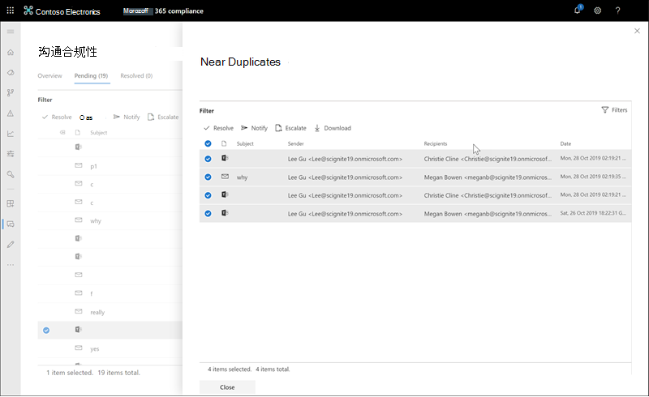
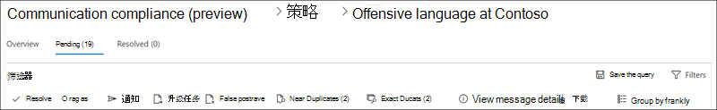
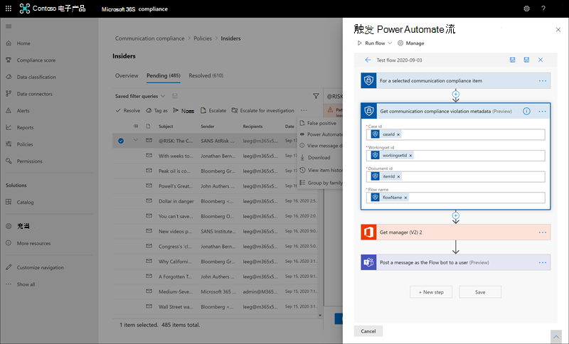

# <a name="investigate-and-remediate-communication-compliance-alerts"></a>调查和修正通信合规性警报

配置通信合规性策略后，你将开始在 Microsoft 365 合规中心 收到与策略条件匹配的消息问题的警报。 请按照此处的工作流说明调查和修正警报问题。

## <a name="investigate-alerts"></a>调查警报

调查策略检测到的问题的第一步是查看策略中的通信合规性Microsoft 365 合规中心。 通信合规性解决方案区域中有几个区域可帮助您快速调查警报，具体取决于您更希望查看警报分组的情况：

- **通信合规性策略页面**：登录使用组织中管理员帐户 [https://compliance.microsoft.com](https://compliance.microsoft.com) Microsoft 365，选择"通信合规性"以显示通信合规性 **策略** 页面。  此页面显示为组织配置的通信合规性策略Microsoft 365策略模板的链接。 列出的每个策略包括需要检查的警报计数、已升级和已解决项目的数量、策略的状态以及上次策略扫描的日期和时间。 选择策略将显示与策略匹配的所有待定警报，选择特定警报以打开策略详细信息页面并开始修正操作。
- **警报：** 导航到"**通信** 合规性警报"，以显示过去 30 天按策略匹配  >  分组的警报。 此视图可以让你快速看到哪个通信合规性策略生成最多警报，并按严重性排序。 若要启动修正操作，请选择与警报关联的策略以启动" **策略详细信息"** 页。 从 **"策略详细信息**"页中，你可以查看"概述"页上的活动摘要，查看并处理"挂起"页上的警报消息，或在"已解决"页上查看已关闭警报 **的** 历史记录。
- **报告**：导航到 **"通信合规性**  >  **报告**"以显示通信合规性报告小组件。 每个小组件提供通信合规性活动和状态的概述，包括访问有关策略匹配和修正操作更深入的见解。

### <a name="using-filters"></a>使用筛选器

下一步是对邮件进行排序，以便更轻松地调查警报。 在" **策略详细信息** "页中，通信合规性支持对多个邮件字段进行多级筛选，以帮助您快速调查和查看包含策略匹配项的邮件。 每个配置策略的待定和已解决项目都可以使用筛选。 您可以配置策略的筛选器查询，或配置并保存在每个特定策略中使用的自定义和默认筛选器查询。 为筛选器配置字段后，筛选器字段将显示在警报邮件队列顶部，并可以配置为特定筛选值。

对于日期筛选器，事件日期和时间在协调世界时 utc (中) 。 筛选视图消息时，请求用户的本地日期/时间将基于用户的本地日期/时间转换为 UTC 确定结果。 例如，如果美国太平洋夏令时 (PDT) 在 00：00 筛选从 2021 年 8 月 30 日到 2021 年 8 月 31 日 00：00 的报告，该报告将包含从 UTC 8/30 07：00 到 8/31/2021 07：00 UTC 的邮件。 如果筛选时间为 00：00 时，同一用户位于美国东部夏令时 (EDT) ，报告将包含从 8/30/2021 04：00 UTC 到 8/31/2021 04：00 UTC 的邮件。

#### <a name="filter-details"></a>筛选器详细信息

通信合规性筛选器允许你筛选和排序警报消息，以便更快地调查和修正操作。 筛选在每个策略的 **"** 挂起" **和"** 已解决"选项卡上可用。 若要将筛选器或筛选器集另存为保存的筛选器查询，必须将一个或多个值配置为筛选器选择。

下表概述了筛选器详细信息：

|**Filter**|**详细信息**|
|:-----|:-----|
| **Date** | 组织中用户发送或接收邮件的日期。 若要筛选一天，请选择一个日期范围，从希望结果的日期开始，到第二天结束。 例如，如果要筛选 9/20/2020 的结果，请选择筛选日期范围 9/20/2020-9/21/2020。|
| **文件类** | 基于邮件类型（邮件或附件）*的邮件**类*。 |
| **具有附件** | 邮件中的附件状态。 |
| **Item 类** | 基于消息类型、电子邮件、Microsoft 团队聊天、Bloomberg 等的消息源。有关常见项目类型和邮件类的详细信息，请参阅 [项目类型和邮件类](/office/vba/outlook/concepts/forms/item-types-and-message-classes)。 |
| **收件人域** | 邮件发送到的域。 默认情况下，此域Microsoft 365订阅域。 |
| **收件人** | 邮件发送到的用户。 |
| **Sender** | 发送消息的人。 |
| **发件人域** | 发送邮件的域。 |
| **Size** | 邮件的大小（以 KB 为单位）。 |
| **主题/标题** | 消息主题或聊天标题。 |
| **Tags** | 分配给邮件的标记，可以是 *Questionable* *、Compliant* 或 *Non-compliant*。 |
| **Language** | 邮件中检测到的文本语言。 邮件根据大多数邮件文本的语言进行分类。 例如，对于同时包含德语和意大利语文本的邮件，但大部分文本为德语，则邮件被归类为德语 (DE) 。 支持以下语言：简体中文 (-ZH) 、英语 (EN) 、法语 (FR) 、德语 (DE) 、意大利语 (IT) 、日语 (JP) 、葡萄牙语 (PT) 和西班牙语 (ES) 。 例如，若要筛选分类为德语和意大利语的邮件，请在"语言 (搜索框中输入"DE，IT") 2 位数字的语言代码。 若要查看检测到的邮件语言分类，请选择一封邮件，选择"查看邮件详细信息"，然后滚动到 EmailDetectedLanguage 字段。 |
| **升级到** | 作为邮件升级操作一部分包含的用户的用户名。 |
| **分类器** | 应用于邮件的内置和自定义分类器的名称。 一些示例 *包括冒犯性语言*、*定向冒犯**、冒犯性*、*威胁* 等。

#### <a name="to-configure-a-filter"></a>配置筛选器

1. 使用 Microsoft 365 组织中的管理员账户凭据登录 [https://compliance.microsoft.com](https://compliance.microsoft.com)。

2. 在 Microsoft 365 合规中心中，转到“**通信合规性**”。

3. 选择" **策略"** 选项卡，然后选择用于调查的策略，双击以打开"策略 **"** 页。

4. 在" **策略"** 页上，选择" **挂起"** 或"已解决 **"选项卡以显示** 要筛选的项目。

5. 选择" **筛选器"** 控件以打开" **筛选器详细信息** "页。

6. 选中一个或多个复选框以启用这些警报的筛选器。 可以从多个筛选器中选择，包括 *日期*、发件人、主题 */标题*、*分类器**、语言* 等。

7. 如果要将所选的筛选器另存为默认筛选器，请选择"**另存为默认"。** 如果要使用此筛选器作为保存的筛选器，请选择"完成 **"。**

8. 如果要将所选筛选器另存为筛选器查询，请在配置了至少一个筛选器值后选择"保存查询控件"。 输入筛选器查询的名称，然后选择"保存 **"。** 此筛选器仅可用于此策略，并列在"筛选器详细信息"页的"保存的筛选器 **查询"部分**。

    

### <a name="using-near-and-exact-duplicate-analysis"></a>使用接近和完全重复的分析

通信合规性策略会自动扫描并预组合接近和完全一致的重复邮件，无需执行其他配置步骤。 此视图允许您对类似邮件进行一对一或一组快速操作，从而减少审阅者的邮件调查负担。 检测到重复项后，**近似重复项** 和/或 **完全重复项** 的控件会显示在修正操作工具栏中。 如果找不到接近或确切的重复项，则此视图不可用。

#### <a name="to-remediate-duplicates"></a>修正重复项

1. 使用 Microsoft 365 组织中的管理员账户凭据登录 [https://compliance.microsoft.com](https://compliance.microsoft.com)。

2. 在 Microsoft 365 合规中心中，转到“**通信合规性**”。

3. 选择" **策略"** 选项卡，然后选择用于调查的策略，双击以打开"策略 **"** 页。

4. 在" **策略"** 页上，选择" **挂起"** 或"已解决 **"** 选项卡以显示重复消息。

5. 选择" **接近重复项"** 或" **完全重复项"** 控件以打开重复项详细信息页。

6. 选择一个或多个邮件以修正这些邮件的操作控件。

7. 选择 **"解析****"、"通知**"、"升级"或"**下载**"，将操作作为默认筛选器应用于所选的重复邮件。 

8. 对 **邮件** 完成修正操作后，选择"关闭"。

    

## <a name="remediate-alerts"></a>修正警报

无论从哪里开始审阅警报，用什么筛选器配置，接下来都要采取措施修正警报。 在"策略"或"通知"页上，**通过以下工作流****启动警报** 修正。

### <a name="step-1-examine-the-message-basics"></a>步骤 1：检查邮件基础知识

 有时，从源或主题很明显，邮件可以立即修正。 可能是邮件有误或与策略有误，应作为错误分类进行解析。 选择 **"报告为错误分类** "控件以与 Microsoft 共享错误分类内容，立即解决警报并从挂起的警报队列中删除。 从源或发件人信息中，您可能已经知道在这些情况下邮件应被如何传递或处理。 请考虑使用 “**标记为**” 或 “**上报**” 控件为适用邮件指定标记或向指定审阅者发送邮件。



### <a name="step-2-examine-the-message-details"></a>步骤 2：检查邮件详细信息

查看邮件基础知识后，可以打开一封邮件来检查详细信息并确定进一步修正操作。 选择邮件以查看完整的邮件标题和正文信息。 有几种不同的选项和视图可以帮助你确定正确的操作过程：

- **附件**：此选项允许你检查与策略条件匹配的新式附件。 新式附件内容提取为文本，并且可查看策略的挂起警报仪表板。 有关详细信息，请参阅通信 [合规性功能参考](/microsoft-365/compliance/communication-compliance-channels)。
- **源**：此视图是大多数基于 Web 的邮件平台中通常看到的标准邮件视图。 邮件头信息采用正常样式格式，邮件正文支持带符号的图形文件和换行文本。 如果为策略 ([OCR ](communication-compliance-policies.md#optical-character-recognition-ocr)) ，则包含匹配策略条件的打印或手写文本的图像将在此视图中视为关联邮件的子项。
- **纯** 文本：文本视图显示邮件的行号仅文本视图，并包括邮件和附件中与关联的通信合规性策略中匹配的敏感信息类型术语或关键字的关键字突出显示。 关键字突出显示可以帮助您快速扫描长邮件和附件中感兴趣的区域。 在某些情况下，突出显示的文本可能仅在匹配策略条件的邮件的附件中。 分配给策略的内置分类器标识的术语不支持关键字突出显示。 不显示嵌入文件，并且此视图的行号有助于在多个审阅者之间引用相关详细信息。
- **批注**：此视图允许审阅者直接在保存到邮件视图中的邮件上添加批注。 如果为策略启用了 [OCR，](communication-compliance-policies.md#optical-character-recognition-ocr) 则包含符合策略条件的打印或手写文本的图像将在此视图中查看为关联邮件的子项，并可以添加注释。
- **对话 (预览**) ：此视图可用于 Microsoft Teams 聊天消息，最多在警告消息之前和之后显示五条消息，以帮助审阅者查看对话上下文中的活动。 此上下文可帮助审阅者快速评估邮件并做出更明智的邮件解析决策。 将显示对话中的实时消息添加内容，包括所有可用的内联图像、表情符号和Teams。 不显示邮件的图像或文本文件附件。 对于已编辑的邮件或从对话窗口中删除的邮件，将自动显示通知。 解析邮件后，关联的对话消息不会与解析的邮件一起保留。 标识警报消息后，对话消息的可用时间最多为 60 天。
- **用户历史记录**：用户历史记录视图显示通信合规性策略针对发送邮件的用户生成的所有其他警报。
- **模式检测到通知**：随着时间的推移，许多威胁和威胁操作都涉及用户重复出现相同行为的实例。 检测到 *的模式* 通知显示在警报详细信息中，并引发对警报的注意。 模式检测基于每个策略，并评估发件人向同一收件人发送至少两个邮件时过去 30 天内的行为。 研究人员和审阅者可以使用此通知识别重复行为，以根据情况评估警报。
- **翻译**：此视图自动将通知邮件文本转换为每个审阅者在 Microsoft 365订阅中的"显示语言"设置中配置的语言。 " *翻译* "视图有助于扩大对具有多语言用户的组织的调查支持，并且无需在通信合规性审阅过程之外提供其他翻译服务。 使用 Microsoft 翻译服务 *，可以* 根据需要打开和关闭翻译视图，并支持多种语言。 有关支持的语言的完整列表，请参阅Microsoft 翻译工具[语言](https://www.microsoft.com/translator/business/languages/)。 翻译视图中 *翻译工具语言列表**中列出的语言*。

### <a name="step-3-decide-on-a-remediation-action"></a>步骤 3：确定修正操作

现在，你已查看了警报消息的详细信息，您可以选择多个修正操作：

- **Resolve**：选择 **"解析** "控件将立即将邮件从挂起 **警报** 队列中删除，并且无法对邮件执行进一步操作。 通过选择 **"** 解析"，你基本上关闭了警报，而没有进一步分类。 所有解析的邮件都显示在"已解析 **"选项卡** 中。
- **报告为错误分类 (预览**) ：在邮件审阅工作流期间，您始终可以在任何时间点将邮件解析为错误分类。 错误分类表示警报不可操作，或者警报进程和任何可训练分类器错误生成警报。 将项目解析为错误分类会向 Microsoft 发送邮件内容、附件和邮件 (包括元数据) Microsoft，以帮助改进可训练分类器。 发送给 Microsoft 的数据不包含可能标识或用于标识组织中任何用户的信息。 无法对邮件执行进一步操作，所有错误分类的邮件都显示在"已解决 **"选项卡** 中。
- **Power Automate (预览) ：** 使用Power Automate流自动处理警报消息的任务。 默认情况下，当用户具有通信合规性警报流模板时，通信合规性包括通知管理器，审阅者可以使用该模板为具有邮件警报的用户自动执行通知流程。 有关创建和管理通信合规性Power Automate流，请参阅本文中的步骤 **5：Power Automate流** 部分。
- **标记为**：将邮件标记为 *符合*、*不符合* 或与组织的策略和标准相关时为问题。 添加标记和标记注释可帮助你针对升级或作为其他内部审阅过程的一部分进行微筛选策略警报。 标记完成后，还可以选择解析邮件以将其从挂起的审阅队列中移开。
- **通知**：可以使用"通知" **控件向** 通知分配自定义通知模板，并将警告通知发送给用户。 选择"通信合规性设置"区域中配置的适当通知模板，然后选择"通过电子邮件发送给发送邮件的用户的提醒"并解决问题。
- **升级**：使用 **"升级** "控件，可以选择组织中应审阅邮件的其他人。 从通信合规性策略中配置的审阅者列表中选择，以发送电子邮件通知，请求对邮件警报进行其他审阅。 所选审阅者可使用电子邮件通知中的链接直接转到上报给他们审阅的项目。
- **上报进行调查**：使用 **升级以** 进行调查控制，你可以为Advanced eDiscovery [或](overview-ediscovery-20.md)多条消息创建新的案例。 你将提供新案例的名称和注释，并且发送与策略匹配的邮件的用户将自动分配为案例保管人。 管理案例不需要任何其他权限。 创建案例不会解析邮件或为邮件创建新标记。 在修正过程中创建一个事件Advanced eDiscovery总共可以选择 100 条消息。 支持通过通信合规性监视的所有通信频道中的消息。 例如，为用户打开新的Microsoft Teams案例时，可以选择 50 Microsoft Teams聊天、25 Exchange Online Advanced eDiscovery 电子邮件和 25 Yammer 消息。
- Remove **message in Teams**： Using the Remove message in **Teams** control， you can block inappropriate messages and content identified in alerts from Microsoft Teams channels and 1：1 and group chats. 已删除的消息和内容将替换为说明其被阻止的策略提示以及应用于从视图中删除的策略。 在策略提示中为收件人提供了链接，以了解有关适用策略和审阅过程的信息。 发件人会收到阻止的邮件和内容的策略提示，但可以查看阻止邮件的详细信息和内容，了解删除的上下文。

    

### <a name="step-4-determine-if-message-details-should-be-archived-outside-of-communication-compliance"></a>步骤 4：确定是否应在通信合规性之外存档邮件详细信息

如果需要在单独的存储解决方案中存档邮件，可以导出或下载邮件详细信息。 选择 **下载** 控件将自动添加所选邮件至一个 ZIP 文件，并可将其保存至 Microsoft 365 外部的存储器。

### <a name="step-5-consider-power-automate-flows"></a>步骤 5：考虑Power Automate流

[Microsoft Power Automate](/power-automate/getting-started)是一种工作流服务，可跨应用程序和服务自动执行操作。 通过使用来自模板的流或手动创建的流，可以自动执行与这些应用程序和服务关联的常见任务。 启用通信Power Automate流时，可以自动执行警报和用户的重要任务。 您可以配置Power Automate流，以在用户具有通信合规性警报和其他应用程序时通知管理员。

具有包含Microsoft 365合规性的订阅的客户无需额外的 Power Automate 许可证，就可使用建议的默认通信合规性Power Automate模板。 可以自定义默认模板以支持您的组织并涵盖核心通信合规性方案。 如果您选择使用这些模板中的高级 Power Automate 功能、使用 Microsoft 365 合规性连接器创建自定义模板或使用 Microsoft 365 中其他合规性领域的 Power Automate 模板，您可能需要其他 Power Automate 许可证。

> [!IMPORTANT]
> 在测试流时是否收到额外的许可证验证Power Automate提示？ 您的组织可能尚未收到此预览功能的服务更新。 更新正在部署中，具有 Microsoft 365 订阅（包括通信合规性）的所有组织都应具有对在 2020 年 10 月 30 日从推荐的 Power Automate 模板创建的流的许可证支持。



以下Power Automate模板提供给客户，以支持通信合规性警报的流程自动化：

- **当用户具有通信合规性警报** 时通知经理：当用户具有通信合规性警报时，某些组织可能需要立即发送管理通知。 配置和选择此流后，会向案例用户的经理发送一封电子邮件，包含有关所有警报的以下信息：
  - 警报的适用策略
  - 警报的日期/时间
  - 警报的严重性级别

#### <a name="create-a-power-automate-flow"></a>创建Power Automate流

若要从Power Automate模板创建流，在警报中直接操作 **时，将使用**"自动化"控件中的"管理 Power Automate 流"选项。 若要使用管理Power Automate流创建Power Automate流，您必须是至少一个通信合规性角色组的成员。

完成以下步骤以从默认Power Automate流：

1. In the Microsoft 365 合规中心， go to **Communication compliance**  >  **Policies** and select the policy with the alert you want review.
2. 从策略中，选择" **挂起"** 选项卡并选择挂起的警报。
3. Select **Power Automate** from the alert action menu.
4. 在 **"Power Automate"** 页上，从页面上的"通信合规性模板 **"部分选择** 默认模板。
5. 该流将列出该流所需的嵌入连接，并显示连接状态是否可用。 如果需要，请更新任何未显示为可用的连接。 选择 **继续**。
6. 默认情况下，推荐流预配置了推荐的通信合规性，Microsoft 365为流完成分配的任务所需的服务数据字段。 如果需要，使用"显示高级选项"控件并配置流组件的可用属性来自定义流组件。
7. 如果需要，通过选择"新建步骤"按钮将任何其他步骤 **添加到** 流中。 在大多数情况下，建议的默认模板不需要此更改。
8. 选择 **"保存草稿**"保存流以稍后进行进一步配置，或选择"保存"以完成流的配置。
9. 选择 **"** 关闭"以返回到Power Automate流"页。 新模板将在"我的流"选项卡上作为流列出，并且会自动从 Power Automate 控件中为在使用通信合规性警报时创建流的用户使用。

#### <a name="share-a-power-automate-flow"></a>共享Power Automate流

默认情况下，Power Automate创建的流仅对该用户可用。 若要使其他通信合规性用户具有访问权限并使用流，该流必须由流创建者共享。 若要共享流，在警报中直接操作 **时** Power Automate控件。

若要共享Power Automate流，您必须至少是一个通信合规性角色组的成员。
完成以下步骤以共享Power Automate流：

1. In the Microsoft 365 合规中心， go to **Communication compliance**  >  **Policies** and select the policy with the alert you want review.
2. 从策略中，选择" **挂起"** 选项卡并选择挂起的警报。
3. Select **Power Automate** from the alert action menu.
4. 在 **"Power Automate流"** 页上，选择"**我的** 流"或"**团队流"** 选项卡。
5. 选择要共享的流 **，然后从** "流选项"菜单中选择"共享"。
6. 在"流共享"页上，输入要添加为流所有者的用户或组的名称。
7. 在" **已使用** 连接"对话框中，选择 **"确定** "确认添加的用户或组将具有对流的完全访问权限。

#### <a name="edit-a-power-automate-flow"></a>编辑Power Automate流

如果需要编辑流，在警报中直接操作时 **，Power Automate** 控件。 若要编辑Power Automate流，您必须至少是一个通信合规性角色组的成员。

完成以下步骤以编辑Power Automate流：

1. In the Microsoft 365 合规中心， go to **Communication compliance**  >  **Policies** and select the policy with the alert you want review.
2. 从策略中，选择" **挂起"** 选项卡并选择挂起的警报。
3. Select **Power Automate** from the alert action menu.
4. 在 **"Power Automate流"** 页上，选择要编辑的流。 从 **流控制** 菜单中选择"编辑"。
5. 选择省略 **号**  >  **设置** 更改流组件设置或省略 **号**  >  **删除** 流组件。
6. 选择 **"保存****"，** 然后选择"关闭"以完成流的编辑。

#### <a name="delete-a-power-automate-flow"></a>删除Power Automate流

如果需要删除流，在警报中直接操作 **时，Power Automate** 控件。 若要删除Power Automate流，您必须至少是一个通信合规性角色组的成员。

完成以下步骤以删除Power Automate流：

1. In the Microsoft 365 合规中心， go to **Communication compliance**  >  **Policies** and select the policy with the alert you want review.
2. 从策略中，选择" **挂起"** 选项卡并选择挂起的警报。
3. Select **Power Automate** from the alert action menu.
4. 在 **"Power Automate流"** 页上，选择要删除的流。 从 **流控制** 菜单中选择"删除"。
5. 在删除确认对话框中，选择 **"删除** "以删除流，或选择" **取消** "退出删除操作。

### <a name="step-6-consider-creating-notice-templates"></a>步骤 6：考虑创建通知模板

如果要在问题解决过程中向用户发送策略匹配的电子邮件提醒通知，可以创建通知模板。 通知只能发送到与生成特定警报进行修正的策略匹配关联的用户电子邮件地址。 选择要作为修正工作流的一部分应用于策略违反的通知模板时，可以选择接受模板中定义的字段值或根据需要覆盖这些字段。

通知模板是自定义电子邮件模板，可以在其中定义通信合规性设置区域中的以下 **邮件** 字段：

|**Field**|**Required**| **详细信息** |
|:-----|:-----|:-----|
|**模板名称** | 是 | 修复过程中将在通知工作流中选择的通知模板的友好名称支持文本字符。 |
| **发件人地址** | 是 | 一个或多个用户或组的地址，这些用户或组通过策略匹配（从订阅的 Active Directory 选择）向用户发送邮件。 |
| **抄送和密件抄送地址** | 否 | 要接收策略匹配通知的可选用户或组（从订阅的 Active Directory 中选择）。 |
| **主题** | 是 | 邮件的主题行中显示的信息支持文本字符。 |
| **邮件正文** | 是 | 邮件正文中显示的信息支持文本或 HTML 值。 |

### <a name="html-for-notices"></a>通知的 HTML

如果要为通知创建多个基于文本的简单电子邮件，可以在通知模板的邮件正文字段中使用 HTML 来创建更详细的邮件。 以下示例提供基于 HTML 的基本电子邮件通知模板的邮件正文格式：

```HTML
<!DOCTYPE html>
<html>
    <body>
        <h2>Action Required: Contoso Employee Code of Conduct Policy Training</h2>
        <p>A recent message you've sent has generated a policy alert for the Contoso Employee <a href='https://www.contoso.com'>Code of Conduct Policy</a>.</p>
        <p>You are required to attend the Contoso Employee Code of Conduct <a href='https://www.contoso.com'>training</a> within the next 14 days. Please contact <a href='mailto:hr@contoso.com'>Human Resources</a> with any questions about this training request.</p>
        <p>Thank you,</p>
        <p><em>Human Resources</em></p>
    </body>
</html>
```

> [!NOTE]
> 通信合规性通知模板中的 HTML href 属性实现当前仅支持单引号，而不支持 URL 引用的双引号。

## <a name="unresolve-messages-preview"></a>无法解析的邮件 (预览) 

解析邮件后，将从"待定"选项卡视图中删除邮件，并显示在"已解决 **"** 选项卡视图中。 调查和修正操作不适用于"已解决 *"视图中的邮件* 。 但是，在某些情况下，可能需要对错误解决的邮件执行其他操作，或在初始解决后需要进一步调查。 可以使用 unresolve 命令功能将一个或多个邮件从"已解决 *"* 视图移回 *"挂起"* 视图。

若要解析邮件，请完成以下步骤：

1. 使用分配给 [Microsoft 365 合规中心](https://compliance.microsoft.com)组织中 *通信* 合规性分析员或 *通信* 合规调查角色组的用户的凭据登录到 Microsoft 365 组。
2. 在 Microsoft 365 合规中心中，转到“**通信合规性**”。
3. 选择" **策略** "选项卡，然后选择包含已解决警报消息的策略，双击以打开"策略 **"** 页。
4. 在" **策略"** 页上，选择" **已解决"** 选项卡。
5. 在" **已解决"** 选项卡上，选择要移回"挂起"的一个或多个 *邮件*。
6. 在命令栏上，选择 **"Unresolve"。**
7. 在 **"Unresolve"项** 窗格中，添加适用于"unresolve"操作的任何注释，然后选择"保存"将项目移回"挂起 *"。*
8. 选择" **待** 定"选项卡以验证是否显示所选项目。