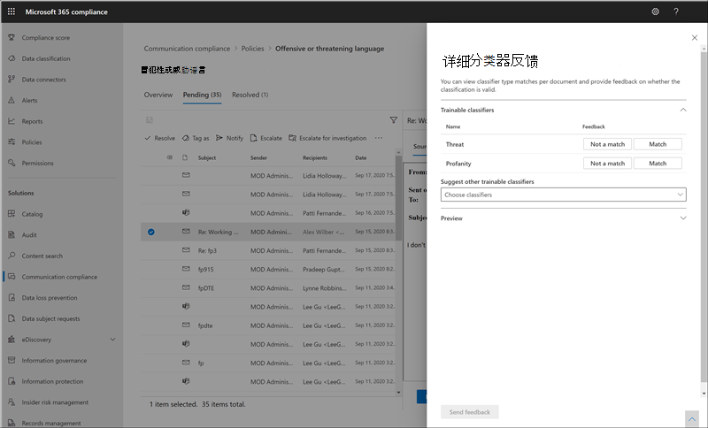

# 调查和修正通信合规性警报Investigate and remediate communication compliance alerts

配置通信合规性策略后，您将开始在 Microsoft 365 合规性中心中接收通知，以了解与策略条件相匹配的邮件问题。After you've configured your communication compliance policies, you'll start to receive alerts in the Microsoft 365 compliance center for message issues that match your policy conditions. 按照此处的工作流说明，调查并修正警报问题。Follow the workflow instructions here to investigate and remediate alert issues.

## 调查通知Investigate alerts

调查策略检测到的问题的第一步是查看 Microsoft 365 合规性中心中的通信合规性警报。The first step to investigate issues detected by your policies is to review communication compliance alerts in the Microsoft 365 compliance center. 通信合规性解决方案领域有几个方面可帮助您快速调查警报，具体取决于您更愿意查看警报分组的方式：There are several areas in the communication compliance solution area to help you to quickly investigate alerts, depending on how you prefer to view alert grouping:

- **通信合规性策略页**：当您在 [https://compliance.microsoft.com](https://compliance.microsoft.com) Microsoft 365 组织中使用管理员帐户的凭据登录时，请选择 " **通信合规性** " 以显示 "通信合规性 **策略** " 页。**Communication compliance policy page**: When you sign in to [https://compliance.microsoft.com](https://compliance.microsoft.com) using credentials for an admin account in your Microsoft 365 organization, select **Communication compliance** to display the communication compliance **Policy** page. 此页面显示为 Microsoft 365 组织配置的通信合规性策略以及指向推荐的策略模板的链接。This page displays communication compliance policies configured for your Microsoft 365 organization and links to recommended policy templates. 列出的每个策略都包含需要审阅的警报数、已升级和已解决的项目数以及策略的当前状态。Each policy listed includes the count of alerts that need review, the number of escalated and resolved items, and the current status of the policy. 选择策略将显示与策略匹配的所有待处理警报，选择启动 "策略详细信息" 页的特定警报并启动修正操作。Selecting a policy displays all the pending alerts for matches to the policy, select a specific alert to launch the policy details page and to start remediation actions.
- **警报**：导航到 "**通信合规性**"  >  **警报**以显示按策略匹配项分组的最近30天的警报。**Alerts**: Navigate to **Communication compliance** > **Alerts** to display the last 30 days of alerts grouped by policy matches. 通过此视图，可以快速查看哪些通信合规性策略生成的按严重性排序的最多警报。This view allows you to quickly see which communication compliance policies are generating the most alerts ordered by severity. 若要启动修正操作，请选择与警报关联的策略以启动 " **策略详细信息** " 页。To start remediation actions, select the policy associated with the alert to launch the **Policy details** page. 在 " **策略详细信息** " 页上，您可以查看 " **概述** " 页面上的活动摘要，查看并对 **待处理** 的页面上的通知邮件执行操作，或查看 **已解决** 的页面上已关闭的通知的历史记录。From the **Policy details** page, you can review a summary of the activities on the **Overview** page, review and act on alert messages on the **Pending** page, or review the history of closed alerts on the **Resolved** page.
- **报告**：导航到 "**通信合规性**  >  **报告**" 以显示通信合规性报告小部件。**Reports**: Navigate to **Communication compliance** > **Reports** to display communication compliance report widgets. 每个小部件都提供了有关通信合规性活动和状态的概述，包括有关策略匹配和修正操作的深入见解的访问。Each widget provides an overview of communication compliance activities and statuses, including access to deeper insights about policy matches and remediation actions.

### 使用筛选器Using filters

下一步是对邮件进行排序，以便更轻松地调查警报。The next step is to sort the messages so that it's easier for you to investigate alerts. 从 " **策略详细信息** " 页，通信合规性支持多个邮件字段的多级别筛选，以帮助您使用策略匹配快速调查和查看邮件。From the **Policy details** page, communication compliance supports multi-level filtering for several message fields to help you quickly investigate and review messages with policy matches. 筛选可用于每个配置策略的挂起和已解决项。Filtering is available for pending and resolved items for each configured policy. 您可以配置策略的筛选器查询，或配置并保存用于每个特定策略的自定义筛选器查询和默认筛选器查询。You can configure filter queries for a policy or configure and save custom and default filter queries for use in each specific policy. 为筛选器配置字段后，您将看到 "筛选器" 字段显示在通知邮件队列的顶部，可以为特定筛选器值配置这些字段。After configuring fields for a filter, you'll see the filter fields displayed on the top of the alert message queue that you can configure for specific filter values.

有关筛选器和字段详细信息的完整列表，请参阅功能参考文章中的 [筛选器](communication-compliance-feature-reference.md#filters) 。For a complete list of filters and field details, see [Filters](communication-compliance-feature-reference.md#filters) in the feature reference article.

#### 配置筛选器To configure a filter

1. [https://compliance.microsoft.com](https://compliance.microsoft.com)在 Microsoft 365 组织中使用管理员帐户的凭据进行登录。Sign into [https://compliance.microsoft.com](https://compliance.microsoft.com) using credentials for an admin account in your Microsoft 365 organization.

2. 在 Microsoft 365 合规性中心中，转到 " **通信合规性**"。In the Microsoft 365 compliance center, go to **Communication compliance**.

3. 选择 " **策略** " 选项卡，然后选择要调查的策略，双击以打开 " **策略** " 页。Select the **Policies** tab and then select a policy for investigation, double-click to open the **Policy** page.

4. 在 " **策略** " 页上，选择 " **挂起** " 或 " **已解析** " 选项卡以显示要筛选的项。On the **Policy** page, select either the **Pending** or **Resolved** tab to display the items for filtering.

5. 选择 " **筛选器** " 控件以打开 " **筛选器** 详细信息" 页。Select the **Filters** control to open the **Filters** details page.

6. 选择一个或多个复选框以启用这些通知的筛选器。Select one or more checkboxes to enable filters for these alerts. 您可以从多个筛选器中进行选择，包括 *日期*、 *发件人*、 *主题/标题*、 *分类*符等。You can choose from numerous filters, including *Date*, *Sender*, *Subject/Title*, *Classifiers*, and more.

7. 如果要保存选定的筛选器作为默认筛选器，请选择 " **另存为默认值**"。If you'd like to save the filter selected as the default filter, select **Save as default**. 如果要将此筛选器用作已保存的筛选器，请选择 " **完成**"。If you want to use this filter as a saved filter, select **Done**.

8. 如果要将选定的筛选器另存为筛选器查询，请在配置了至少一个筛选器值后，选择 **"保存查询控件"** 。If you'd like to save the selected filters as a filter query, select **Save the query** control after you've configured at least one filter value. 输入筛选器查询的名称，然后选择 " **保存**"。Enter a name for the filter query and select **Save**. 此筛选器仅可用于此策略，并在 "**筛选器**详细信息" 页的 "**已保存的筛选器查询**" 部分中列出。This filter is available to use for only this policy and is listed in the **Saved filter queries** section of the **Filters** details page.

    

### 使用接近和完全重复的分析Using near and exact duplicate analysis

通信合规性策略在不进行任何其他配置步骤的情况下自动扫描和预先分组的邻近邮件和完全邮件重复。Communication compliance policies automatically scan and pre-group near and exact message duplicates without any additional configuration steps. 此视图使您可以快速对类似的邮件执行操作，也可以作为一个组进行操作，从而减少审阅者的邮件调查负担。This view allows you to quickly act on similar messages one-by-one or as a group, reducing the message investigation burden for reviewers. 在检测到重复项时，"修正操作" 工具栏中将显示 " **接近的重复项** " 和 "/" 和 " **完全重复** " 控件。As duplicates are detected, the **Near Duplicates** and/or the **Exact Duplicates** controls are displayed in the remediation action toolbar. 如果找不到或不找到精确的重复项，则此视图不可用。This view isn't available if near or exact duplicates aren't found.

#### 更正重复项To remediate duplicates

1. [https://compliance.microsoft.com](https://compliance.microsoft.com)在 Microsoft 365 组织中使用管理员帐户的凭据进行登录。Sign into [https://compliance.microsoft.com](https://compliance.microsoft.com) using credentials for an admin account in your Microsoft 365 organization.

2. 在 Microsoft 365 合规性中心中，转到 " **通信合规性**"。In the Microsoft 365 compliance center, go to **Communication compliance**.

3. 选择 " **策略** " 选项卡，然后选择要调查的策略，双击以打开 " **策略** " 页。Select the **Policies** tab and then select a policy for investigation, double-click to open the **Policy** page.

4. 在 " **策略** " 页上，选择 " **挂起** " 或 " **已解决** " 选项卡以显示重复消息。On the **Policy** page, select either the **Pending** or **Resolved** tab to display duplicate messages.

5. 选择 **临近的重复** 项或 **完全重复** 的控件以打开 "重复项详细信息" 页。Select the **Near Duplicates** or **Exact Duplicates** controls to open the duplicates details page.

6. 为这些邮件选择一个或多个要修正的操作控件的邮件。Select one or more messages to remediation action controls for these messages.

7. 选择 " **解决**"、" **通知**"、" **升级**" 或 " **下载** " 以将操作作为默认筛选器应用于所选的重复邮件。Select **Resolve**, **Notify**, **Escalate**, or **Download** to apply the action to the selected duplicate messages as the default filter.

8. 完成对邮件的修正操作后，选择 " **关闭** "。Select **Close** after completing the remediation actions on the messages.

    

## 修正警报Remediate alerts

无论您在何处开始查看警报或您配置的筛选，下一步都是采取措施修正警报。No matter where you start to review alerts or the filtering you configure, the next step is to take action to remediate the alert. 使用 " **策略** " 或 " **通知** " 页面上的以下工作流启动通知修补程序。Start your alert remediation using the following workflow on the **Policy** or **Alerts** pages.

### 步骤1：检查邮件基础知识Step 1: Examine the message basics

 有时，可以从来源或主题中看出邮件可以立即修正。Sometimes it's obvious from the source or subject that a message can be immediately remediated. 可能是邮件是虚假的或与策略不正确匹配，应将其解析为误报。It may be that the message is spurious or incorrectly matched to a policy and it should be resolved as a false positive. 选择 **误报** 控件以立即解析警报，并从挂起的警报队列中删除。Select the **False Positive** control to immediately resolve the alert and remove from the pending alert queue. 在源或发件人信息中，您可能已经知道在这些情况下应如何路由或处理邮件。From the source or sender information, you may already know how the message should be routed or handled in these circumstances. 请考虑使用 **标记作为** 或 **升级** 控件将标记分配给适用的邮件，或将邮件发送给指定的审阅者。Consider using the **Tag as** or **Escalate** controls to assign a tag to applicable messages or to send messages to a designated reviewer.

### 步骤2：检查邮件详细信息Step 2: Examine the message details

查看邮件基础知识后，可以打开一条消息以检查详细信息并确定进一步的修正操作。After reviewing the message basics, it's time to open a message to examine the details and to determine further remediation actions. 选择一封邮件以查看完整的邮件头和正文信息。Select a message to view the complete message header and body information. 有几种不同的视图可用于帮助您确定正确的操作过程：Several different views are available to help you decide the proper course of action:

- **源视图**：此视图是在大多数基于 web 的邮件平台中通常会看到的标准邮件视图。**Source view**: This view is the standard message view commonly seen in most web-based messaging platforms. 标头信息的格式为 "正文" 样式，邮件正文支持嵌入的图形文件和换行的文本。The header information is formatted in the normal style and the message body supports imbedded graphic files and word-wrapped text.
- **文本视图**：文本视图显示邮件的单行文本视图，并包括关联通信合规性策略中匹配术语的关键字突出显示。**Text view**: Text view displays a line-numbered text-only view of the message and includes keyword highlighting for terms matched in the associated communication compliance policy. 关键字突出显示可帮助您快速扫描感兴趣区域的长邮件。Keyword highlighting can help you quickly scan long messages for the area of interest. 嵌入的文件不会显示，并且该视图的行号有助于在多个审阅者之间引用相关详细信息。Embedded files aren't displayed and the line numbering this view is helpful for referencing pertinent details among multiple reviewers.
- **批注视图**：通过此视图，审阅者可以直接在保存到邮件视图中的邮件上添加批注。**Annotate view**: This view allows reviewers to add annotations directly on the message that are saved to the view of the message.
- **用户历史记录**：用户历史记录视图显示发送邮件的用户的任何通信合规性策略生成的所有其他警报。**User history**: User history view displays all other alerts generated by any communication compliance policy for the user sending the message.
- **消息详细信息视图**：邮件元数据和配置信息的高级视图。**Message detail view**: Advanced view of message metadata and configuration information.
- \*\*模式检测到通知 (预览) \*\*：许多 harassing 和威胁操作一段时间，并涉及到用户对同一行为的重复实例。**Pattern detected notification (preview)**: Many harassing and bullying actions over time and involve reoccurring instances of the same behavior by a user. 警报详细信息中显示 *检测到模式* 的通知，并对警报引起注意。The *Pattern detected* notification is displayed in the alert details and raises attention to the alert. 模式检测基于每个策略，并在最近30天内对发件人向同一收件人发送至少两封邮件时评估行为。Detection of patterns is on a per-policy basis and evaluates behavior over the last 30 days when at least two messages are sent to the same recipient by a sender. 调查人员和审阅者可以使用此通知来确定根据情况评估警报的重复行为。Investigators and reviewers can use this notification to identify repeated behavior to evaluate the alert as appropriate.

    

### 步骤3：确定修正操作Step 3: Decide on a remediation action

现在，您已经查看了警报的邮件的详细信息，您可以选择多个修正操作：Now that you've reviewed the details of the message for the alert, you can choose several remediation actions:

- **解决**：选择 " **解析** " 控件会立即从 " **待处理的警报** " 队列中删除邮件，而不能对邮件执行进一步的操作。**Resolve**: Selecting the **Resolve** control immediately removes the message from the **Pending alerts** queue and no further action can be taken on the message. 通过选择 " **解析**"，实际上是在不进一步分类的情况下关闭了警报，并且无法重新打开它以进行进一步操作。By selecting **Resolve**, you've essentially closed the alert without further classification and it can't be reopened for further actions. 所有已解决的邮件都显示在 " **已解决** " 选项卡中。All resolved messages are displayed in the **Resolved** tab.
- **误报**：在邮件审阅工作流的任何时候，都可以随时将邮件解析为误报。**False Positive**: You can always resolve a message as a false positive at any point during the message review workflow. 误报表示警报不是可操作的，或者警报过程不能由警报过程中错误生成。False positive signifies that the alert was non-actionable or that the alert was incorrectly generated by the alerting process. 无法重新打开该邮件，并在 " **已解决** " 选项卡中显示所有误报邮件。The message cannot be reopened and all false positive messages are displayed in the **Resolved** tab.
- \*\*Power (preview) 的自动 \*\*操作：使用电源自动化流自动处理警报消息的处理任务。**Power Automate (preview)**: Use a Power Automate flow to automate process tasks for an alert message. 默认情况下， *当用户具有通信合规性警报* 流模板时，通信合规性包括通知管理器，审阅者可使用这些通知管理器为具有邮件警报的用户自动执行通知过程。By default, communication compliance includes the *Notify manager when a user has a communication compliance alert* flow template that reviewers can use to automate the notification process for users with message alerts. 有关在通信合规性中创建和管理电源自动化流的详细信息，请参阅 [通信合规性功能参考](communication-compliance-feature-reference.md#power-automate-flows-preview) 一文。For more information about creating and managing Power Automate flows in communication compliance, see the [Communication compliance feature reference](communication-compliance-feature-reference.md#power-automate-flows-preview) article.
- **标记为**：将邮件标记为 *兼容性*、 *不符合要求*或为 *可疑* ，因为它与组织的策略和标准相关。**Tag as**: Tag the message as *compliant*, *non-compliant*, or as *questionable* as it relates to the policies and standards for your organization. 添加标签和标记注释可帮助您微筛选策略警报以进行升级或作为其他内部审核流程的一部分。Adding tags and tagging comments helps you micro-filter policy alerts for escalations or as part of other internal review processes. 完成标记后，您还可以选择解析邮件以将其从挂起的审阅队列中移出。After tagging is complete, you can also choose to resolve the message to move it out of the pending review queue.
- **通知**：您可以使用 **通知** 控件向警报分配自定义通知模板并向用户发送警告通知。**Notify**: You can use the **Notify** control to assign a custom notice template to the alert and to send a warning notice to the user. 选择 " **通信合规性设置** " 区域中配置的相应声明模板，然后选择 " **发送** " 以通过电子邮件提醒发送邮件的用户并解决该问题。Choose the appropriate notice template configured in the **Communication compliance settings** area and select **Send** to email a reminder to the user that sent the message and to resolve the issue.
- **升级**：使用 **提升** 的控件，您可以选择组织中的其他人应查看邮件。**Escalate**: Using the **Escalate** control, you can choose who else in your organization should review the message. 从通信合规性策略中配置的审阅者列表中进行选择，以发送电子邮件通知，请求对邮件警报进行其他审阅。Choose from a list of reviewers configured in the communication compliance policy to send an email notification requesting additional review of the message alert. 所选审阅者可以使用电子邮件通知中的链接直接转到升级到这些项目以供审阅的项目。The selected reviewer can use a link in the email notification to go directly to items escalated to them for review.
- **升级以进行调查**：使用 **升级后的调查** 控制，可以为单个或多个邮件创建新的 [高级电子数据展示事例](overview-ediscovery-20.md) 。**Escalate for investigation**: Using the **Escalate for investigation** control, you can create a new [Advanced eDiscovery case](overview-ediscovery-20.md) for single or multiple messages. 你将提供新事例的名称和注释，发送与策略匹配的邮件的用户将自动分配为事例管理员。You'll provide a name and notes for the new case, and user who sent the message matching the policy is automatically assigned as the case custodian. 不需要任何其他权限即可管理该案例。You don't need any additional permissions to manage the case. 创建案例不会解析或创建邮件的新标记。Creating a case does not resolve or create a new tag for the message. 在修正过程中创建高级电子数据展示事例时，可以选择所有100邮件。You can select a total of 100 messages when creating an Advanced eDiscovery case during the remediation process. 支持通过通信合规性监控的所有通信通道中的邮件。Messages in all communication channels monitored by communication compliance are supported. 例如，在为用户打开新的高级电子数据展示事例时，可以选择 50 Microsoft 团队聊天、25个 Exchange Online 电子邮件和25条 Yammer 消息。For example, you could select 50 Microsoft Teams chats, 25 Exchange Online email messages, and 25 Yammer messages when you open a new Advanced eDiscovery case for a user.
- \*\*改进分类 (预览) \*\*：从分类器类型匹配创建的通知可能需要反馈以帮助最大限度地减少组织中的误报。**Improve classification (preview)**: Alerts created from classifier type matches may need feedback to help minimize false positives in your organization. 如果通信合规性分类有效或为此类型的匹配建议其他 trainable 的分类器，请使用 " **改进分类** " 控件来提供反馈。Use the **Improve classification** control to provide feedback on if the communication compliance classification is valid or to suggest other trainable classifiers for this type of match. 您可以确认分类器是一个 *匹配* 项或不是一个 *匹配项*，或者建议其他 trainable 的分类器在将来与此类型的警报活动相关联。You can confirm that the classifiers are either a *Match* or *Not a match*, or suggest other trainable classifiers to associate with this type of alert activity in the future.

    1. 从 "通知" 列表中选择一封邮件。Select a message from the alert list.
    2. 选择省略号，然后选择 " **改善分类**"。Choose the ellipsis and select **Improve classification**.
    3. 在 " **详细分类器反馈** " 窗格中，如果项目是真正的正值，请选择 " **匹配**"。In the **Detailed classifier feedback** pane, if the item is a true positive, choose **Match**.  如果项目在类别中错误地包含为误报，请选择 " **不匹配**"。If the item was incorrectly included in the category as a false positive, choose **Not a match**.
    4. 如果有更适合该项目的另一个分类器，请从 " **建议其他 trainable 类元** 组" 列表中进行选择。If there is another classifier that would be more appropriate for the item, choose it from the **Suggest other trainable classifiers** list. 此反馈会触发其他分类器来评估项目。This feedback triggers the other classifier to evaluate the item.

    > [!TIP]
    > 您可以通过选择所有项目并在命令栏中选择 " **提供详细反馈** " 来同时提供对多个项目的反馈。You can provide feedback on multiple items simultaneously by choosing them all and then choosing **Provide detailed feedback** in the command bar.

    5. 选择 " **发送反馈** " 以发送对 **匹配项** 的评估，而 **不是 "匹配** 分类" 和 "建议其他 trainable 分类器"。Choose **Send feedback** to send your evaluation of the **Match** and **Not a match** classifications and suggest other trainable classifiers. 向分类器提供了30个反馈的实例后，它会自动 retrains。When you've provided 30 instances of feedback to a classifier, it automatically retrains. 重新培训可能需要1-4 小时才能完成。Retraining may take 1-4 hours to complete. 分类器每日只能有两次 retrained。Classifiers can only be retrained twice per day.

    > [!IMPORTANT]
    > 此信息会转到租户中的分类器，而 **不会返回到 Microsoft**。This information goes to the classifier in your tenant, **it does not go back to Microsoft**.

    若要了解有关针对通信合规性重新培训分类器的详细信息，请参阅 [如何在通信合规性文章中重新培训分类符](classifier-how-to-retrain-comms-compliance.md) 。To learn more about retraining classifier for communication compliance, see the [How to retrain a classifier in communications compliance](classifier-how-to-retrain-comms-compliance.md) article.

    

- **删除工作组中的邮件**：使用 " **删除工作组中的邮件** " 控件，可以阻止来自 Microsoft 团队频道和1:1 和组聊天的警报中标识的不适当的邮件和内容。**Remove message in Teams**: Using the **Remove message in Teams** control, you can block inappropriate messages and content identified in alerts from Microsoft Teams channels and 1:1 and group chats. 删除的邮件和内容将被替换为策略提示，表明已阻止该邮件和应用于从视图中删除的策略。Removed messages and content are replaced with a policy tip that explains that it is blocked and the policy that applies to its removal from view. 收件人在策略提示中提供了一个链接，以了解有关适用策略和审阅过程的详细信息。Recipients are provided a link in the policy tip to learn more about the applicable policy and the review process. 发件人接收被阻止的邮件和内容的策略提示，但可以查看阻止的邮件的详细信息和有关删除上下文的内容。The sender receives a policy tip for the blocked message and content but can review the details of the blocked message and content for context regarding the removal.

    

### 步骤4：确定是否应在通信合规性之外存档消息详细信息Step 4: Determine if message details should be archived outside of communication compliance

如果需要在单独的存储解决方案中存档邮件，则可以导出或下载消息详细信息。Message details can be exported or downloaded if you need to archive the messages in a separate storage solution. 选择 **下载** 控件会自动将选定的邮件添加到。可以保存到 Microsoft 365 之外的存储中的 ZIP 文件。Selecting the **Download** control automatically adds selected messages to a .ZIP file that can be saved to storage outside of Microsoft 365.
