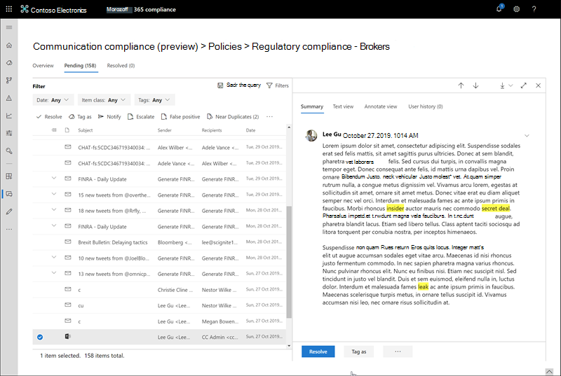

# 调查和修正通信合规性警报

配置通信合规性策略后，您将开始在 Microsoft 365 合规性中心中接收通知，以了解与策略条件相匹配的邮件问题。 按照此处的工作流说明，调查并修正警报问题。

## 调查通知

调查策略检测到的问题的第一步是查看 Microsoft 365 合规性中心内生成的警报。 合规中心中有多个区域可帮助您快速调查通知，具体取决于您更愿意查看警报分组的方式：

- **通信合规性主页**： [https://compliance.microsoft.com](https://compliance.microsoft.com)使用 Microsoft 365 组织中的管理员帐户登录时，请选择 "**通信合规性** > **概述**" 以显示通信合规性主页。 你将看到以下内容：
    - 需要查看的通知从高到低严重性列出。 选择一个警报以启动警报详细信息页面并启动修正操作。
    - 按策略名称列出的最近策略匹配项。
    - 按策略名称列出的已解决项目。
    - 按策略名称列出的升级。
    - 具有最多策略匹配的用户从最多匹配数最多列出。
- **"警报" 选项卡**：导航到 "**通信合规性** > **警报**" 以显示按匹配的通信合规性策略分组的警报。 通过此视图，可以快速查看哪些通信合规性策略生成的按严重性排序的最多警报。  若要启动修正操作，请展开策略以选择特定警报并启动警报详细信息页。
- **"策略" 选项卡**：导航到 "**通信合规性** > **策略**" 以显示为 Microsoft 365 组织配置的通信合规性策略。 列出的每个策略都包含需要审阅的警报的计数。 选择策略将显示与策略匹配的所有待处理警报，选择启动 "策略详细信息" 页的特定警报并启动修正操作。

### 使用筛选器

下一步是对邮件进行排序，以便更轻松地调查警报。 通信合规性支持多个邮件字段的多级别筛选，以帮助您使用策略匹配快速调查和查看邮件。 筛选可用于每个配置策略的挂起和已解决项。 您可以配置策略的筛选器查询，或配置并保存用于每个特定策略的自定义筛选器查询和默认筛选器查询。 为筛选器配置字段后，您将看到 "筛选器" 字段显示在通知邮件队列的顶部，可以为特定筛选器值配置这些字段。

有关筛选器和字段详细信息的完整列表，请参阅功能参考主题中的[筛选器](communication-compliance-feature-reference.md#filters)。

#### 配置筛选器

1. 在 Microsoft [https://compliance.microsoft.com](https://compliance.microsoft.com) 365 组织中使用管理员帐户的凭据进行登录。

2. 在 Microsoft 365 合规性中心中，转到 "**通信合规性**"。

3. 选择 "**策略**" 选项卡，然后选择要调查的策略，双击以打开 "**策略**" 页。

4. 在 "**策略**" 页上，选择 "**挂起**" 或 "**已解析**" 选项卡以显示要筛选的项。

5. 选择 "**筛选器**" 控件以打开 "**筛选器**详细信息" 页。

6. 选择一个或多个复选框以启用这些通知的筛选器。 您可以从多个筛选器中进行选择，包括*日期*、*发件人*、*主题/标题*、*分类*符等。

7. 如果要保存选定的筛选器作为默认筛选器，请选择 "**另存为默认值**"。 如果要将此筛选器用作已保存的筛选器，请选择 "**完成**"。

8. 如果要将选定的筛选器另存为筛选器查询，请在配置了至少一个筛选器值后，选择 **"保存查询控件"** 。 输入筛选器查询的名称，然后选择 "**保存**"。 此筛选器仅可用于此策略，并在 "**筛选器**详细信息" 页的 "**已保存的筛选器查询**" 部分中列出。

    

### 使用接近和完全重复的分析

通信合规性策略在不进行任何其他配置步骤的情况下自动扫描和预先分组的邻近邮件和完全邮件重复。 通过此视图，可以快速一次性地更正类似的邮件或作为一个组，从而减少审阅者的邮件调查负担。 在检测到重复项时，"修正操作" 工具栏中将显示 "**接近的重复项**" 和 "/" 和 "**完全重复**" 控件。

#### 更正重复项

1. 在 Microsoft [https://compliance.microsoft.com](https://compliance.microsoft.com) 365 组织中使用管理员帐户的凭据进行登录。

2. 在 Microsoft 365 合规性中心中，转到 "**通信合规性**"。

3. 选择 "**策略**" 选项卡，然后选择要调查的策略，双击以打开 "**策略**" 页。

4. 在 "**策略**" 页上，选择 "**挂起**" 或 "**已解决**" 选项卡以显示重复消息。

5. 选择**临近的重复**项或**完全重复**的控件以打开 "重复项详细信息" 页。

6. 为这些邮件选择一个或多个要修正的操作控件的邮件。

7. 选择 "**解决**"、"**通知**"、"**升级**" 或 "**下载**" 以将操作应用于所选的重复邮件。选择的作为默认筛选器。

8. 完成对邮件的修正操作后，选择 "**关闭**"。

    

## 修正警报

无论您在何处开始查看警报或您配置的筛选，下一步都是采取措施修正警报。 在 "**策略**" 或 "**通知**" 页面上使用以下工作流启动通知修补：

1. **检查邮件基础知识**：有时，可以直接修正邮件的来源或主题。 可能是邮件是虚假的或与策略不正确匹配，应将其解析为误报。 选择**误报**控件以立即解析警报，并从挂起的警报队列中删除。 在源或发件人信息中，您可能已经知道在这些情况下应如何路由或处理邮件。 请考虑使用**标记作为**或**升级**控件将标记分配给适用的邮件，或将邮件发送给指定的审阅者。

    

2. **检查邮件详细信息**：查看邮件基础知识后，可以打开邮件检查详细信息并确定进一步的修正操作。 选择一封邮件以查看完整的邮件头和正文信息。 有几种不同的视图可用于帮助您确定正确的操作过程：

    - **源视图**：此视图是在大多数基于 web 的邮件平台中通常会看到的标准邮件视图。 标头信息的格式为 "正文" 样式，邮件正文支持嵌入的图形文件和换行的文本。
    - **文本视图**：文本视图显示邮件的单行文本视图，并包括关联通信合规性策略中匹配术语的关键字突出显示。 关键字突出显示可帮助您快速扫描感兴趣区域的长邮件。 嵌入的文件不会显示，并且该视图的行号有助于在多个审阅者之间引用相关详细信息。
    - **批注视图**：通过此视图，审阅者可以直接在保存到邮件视图中的邮件上添加批注。
    - **用户历史记录**：用户历史记录视图显示发送邮件的用户的任何通信合规性策略生成的所有其他警报。

    

3. **确定修正操作**：现在您已经查看了警报消息的详细信息，您可以选择多个修正操作：

    - **解决**：选择 "**解析**" 控件会立即从 "**待处理的警报**" 队列中删除邮件，而不能对邮件执行进一步的操作。 通过选择 "**解析**"，实际上是在不进一步分类的情况下关闭了警报，并且无法重新打开它以进行进一步操作。 所有已解决的邮件都显示在 "**已解决**" 选项卡中。
    - **误报**：在邮件审阅工作流的任何时候，都可以随时将邮件解析为误报。 无法重新打开该邮件，并在 "**已解决**" 选项卡中显示所有误报邮件。
    - **标记为**：将邮件标记为*兼容性*、*不符合要求*或为*可疑*，因为它与组织的策略和标准相关。 添加标签和标记注释可帮助您微筛选策略警报以进行升级或作为其他内部审核流程的一部分。 完成标记后，您还可以选择解析邮件以将其从挂起的审阅队列中移出。
    - **通知**：您可以使用**通知**控件向警报分配自定义通知模板并向用户发送警告通知。 选择相应的 "通知" 模板，然后选择 "**发送**" 以通过电子邮件向发送邮件的员工发送提醒并解决问题。
    - **升级**：使用**提升**的控件，您可以选择组织中的其他人应查看邮件。 从通信合规性策略中配置的审阅者列表中进行选择，以发送电子邮件通知，请求对邮件警报进行其他审阅。 所选审阅者可以使用电子邮件通知中的链接直接转到升级到这些项目以供审阅的项目。
    - **创建案例**：使用**create a case**控件，可以为单个或多个邮件创建一个新的[高级电子数据展示事例](overview-ediscovery-20.md)。 你将提供新事例的名称和注释，发送与策略匹配的邮件的用户将自动分配为事例管理员。 不需要任何其他权限即可管理该案例。 创建案例不会解析或创建邮件的新标记。

4. **确定是否应将消息详细信息存档在通信合规性之外**：如果需要将邮件存档在单独的存储解决方案中，则可以导出或下载消息详细信息。 选择**下载**控件会自动将选定的邮件添加到。可以保存到 Microsoft 365 之外的存储中的 ZIP 文件。
