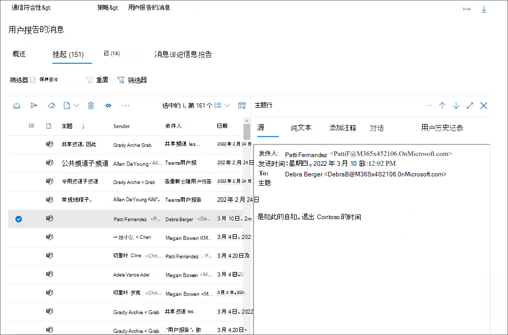

# 通信合规性策略

## 策略

> [!IMPORTANT]
> 不支持使用 PowerShell 创建和管理通信合规性策略。 若要创建和管理这些策略，必须使用 [Microsoft 365 通信合规性解决方案](https://compliance.microsoft.com/supervisoryreview) 中的策略管理控件。

你可以在 Microsoft 365 合规中心为 Microsoft 365 组织创建通信合规性策略。 通信合规性策略定义组织中需要审阅哪些通信和用户，定义通信必须满足哪些自定义条件，并指定谁应进行审阅。 分配了通信合规性 *管理员* 角色的用户可以设置策略，分配了此角色的任何人都可以访问通信合规性页面和 Microsoft 365 合规中心。 如果需要，可以将策略修改历史记录导出到 .csv (逗号分隔值) 文件中，该文件还包括挂起审阅的警报、升级的项目和已解决项目的状态。 策略无法重命名，并且可在不再需要时删除。

## 策略模板

策略模板是预定义的策略设置，可用于快速创建策略以解决常见的合规性方案。 其中每个模板在条件和范围上都有差异，并且所有模板都使用相同的扫描信号类型。 可以从以下策略模板中进行选择：

|**区域**|**策略模板**|**详细信息**|
|:-----|:-----|:-----|
| **不恰当的文本** | 检测不适当的文本 | - 位置：Exchange Online、Microsoft Teams、Yammer、Skype for Business   - 方向：入站、出站、内部   - 审阅百分比：100%   - 条件：威胁、骚扰和目标攻击分类器 |
| **不恰当的图像** | 检测不恰当的图像 | - 位置：Exchange Online、Microsoft Teams、Yammer、Skype for Business   - 方向：入站、出站、内部   - 审阅百分比：100%   - 条件：成人和 Racy 图像分类器 |
| **敏感信息** | 监视敏感信息 | - 位置：Exchange Online、Microsoft Teams、Yammer、Skype for Business   - 方向：入站、出站、内部   - 审阅百分比：10%   - 条件：敏感信息、开箱用内容模式和类型、自定义词典选项、大于 1 MB 的附件 |
| **法规遵从性** | 监视法规合规性 | - 位置：Exchange Online、Microsoft Teams、Yammer、Skype for Business   - 方向：入站、出站   - 审阅百分比：10%   - 条件：自定义词典选项，附件大于 1 MB |
| **冲突** | 监视利益冲突 | - 位置：Exchange Online、Microsoft Teams、Yammer、Skype for Business   - 方向：内部   - 审阅百分比：100%   - 条件：无 |

自创建策略起，每 24 小时扫描一次通信。 例如，如果您在上午 11：00 创建不恰当的内容策略，该策略将每 24 小时在每天的 11：00 AM 收集通信合规性信号。 编辑策略不会更改这一次。 若要查看策略的上次扫描日期和时间，请导航到"策略"页上的"上次策略扫描 **"** 列。 创建新策略后，可能需要 24 小时才能查看第一次策略扫描日期和时间。 上次扫描的日期和时间将转换为本地系统的时区。

## 暂停预览 (策略) 

创建通信合规性策略后，如果需要，该策略可能会暂时暂停。 暂停策略可用于测试或解决策略匹配项问题，或优化策略条件。 在这些情况下，暂停策略还会保留现有策略警报和消息，用于正在进行的调查和审查，而不是删除策略。 暂停策略可阻止在策略暂停时检查策略中定义的所有用户邮件条件并生成警报。 若要暂停或重新启动策略，用户必须是 *Communication Compliance Admin 角色组* 的成员。

若要暂停策略，请导航到" **策略** "页，选择一个策略，然后从操作工具栏 **中选择"暂停** 策略"。 在 **"暂停策略** "窗格中，通过选择"暂停"确认要暂停 **策略**。 在某些情况下，可能需要 24 小时才能暂停策略。 策略暂停后，不会创建与策略匹配的邮件警报。 但是，与在暂停策略之前创建的警报关联的邮件仍可用于调查、审阅和修正。

暂停的策略的策略状态可能指示以下几种状态：

- **Active**：策略处于活动状态
- **已暂停**：策略已完全暂停。
- **暂停：** 策略正在被暂停。
- **恢复**：正在恢复的策略。
- **恢复时出错**：恢复策略时遇到错误。 对于错误堆栈跟踪，将鼠标悬停在"策略"页上"状态"列中的"恢复状态时出错"上。
- **暂停时出错**：暂停策略时遇到错误。 对于错误堆栈跟踪，将鼠标悬停在"策略"页上"状态"列中的"暂停状态错误"上。

若要恢复策略，请导航到"策略 **"页，** 选择一个策略，然后从操作工具栏中选择" **恢复** 策略"。 在 **"恢复策略** "窗格中，通过选择"恢复"确认要恢复 **策略**。 在某些情况下，可能需要 24 小时才能恢复策略。 恢复策略后，将创建与策略匹配的邮件警报，并可用于调查、审阅和修正。

## 复制策略 (预览) 

对于具有现有通信合规性策略的组织，在某些情况下，从现有策略创建新策略可能会有所帮助。 复制策略会创建现有策略的准确副本，包括所有范围内用户、所有分配的审阅者以及所有策略条件。 一些方案可能包括：

- **达到策略存储限制**：活动通信合规性策略具有邮件存储限制。 当达到策略的存储限制时，该策略将自动停用。 需要继续检测、捕获和操作已停用策略涵盖的不当邮件的组织可以快速创建具有相同配置的新策略。
- **检测并检查** 不同用户组的不当消息：某些组织可能倾向于使用相同配置创建多个策略，但为每个策略包括不同的范围内用户和不同的审阅者。
- **具有少量更改的** 类似策略：对于具有复杂配置或条件的策略，通过类似的策略创建新策略可能会节省时间。

若要复制策略，用户必须是 *Communication Compliance* 或 *Communication Compliance Admin 角色组* 的成员。 从现有策略创建一个新策略后，可能需要 24 小时才能查看与新策略配置匹配的邮件。

若要复制策略并创建新策略，请完成以下步骤：

1. 选择要复制的策略。
2. 选择 **命令栏** 上的"复制策略命令栏按钮"，或者从策略的操作菜单中选择"复制策略"。
3. 在 **"复制策略** "窗格中，可以接受"策略名称"字段中策略 **的默认** 名称或重命名策略。 新策略的策略名称不能与现有的活动策略或已停用策略相同。 根据需要 **完成"说明** "字段。
4. 如果不需要进一步自定义策略，请选择" **复制策略** "以完成此过程。 如果需要更新新策略的配置，请选择"自定义 **策略"**。 这将启动策略向导，以帮助你更新和自定义新策略。

## 用户报告的邮件策略

作为分层防御的一部分，可以检测并修正组织中不适当的邮件，同时使用组织中用户报告的邮件来补充Microsoft Teams。 此功能使贵组织的用户能够自行报告不恰当的消息，例如骚扰或威胁语言、共享成人内容以及共享敏感或机密信息，以帮助改善安全合规的工作环境。

默认情况下，在 Teams 管理中心中启用，Teams 邮件中的"报告问题"选项允许贵组织的用户提交不适当的邮件，供策略的通信合规性审阅者审阅。 默认系统策略支持这些消息，该策略支持报告Teams、组和专用聊天中的消息。

当用户提交聊天Teams查看时，该消息将复制到用户报告的消息策略。 报告的消息最初仍对所有聊天成员可见，并且没有任何通知通知给聊天成员或提交者，指出消息已在频道、私人或群组聊天中报告。 用户不能多次报告同一条消息，并且该消息在策略审阅过程中对包含在聊天会话中的所有用户仍然可见。 

在审查过程中，通信合规性审阅者可以针对邮件执行所有标准修正操作，包括从聊天中删除Teams操作。 根据消息的修正方式，邮件发件人和收件人将在评论后在Teams看到不同的通知消息。

用户从Teams中报告的消息是由用户报告的消息策略处理的唯一消息，并且只能修改该策略的分配的审阅者。 所有其他策略属性均不可编辑。 创建策略时，分配给策略的初始审阅者是 *Communication Compliance Admins* 角色组 (的所有成员（如果填充了至少一个用户) 或组织的全局管理员角色组的所有成员）。 策略创建者是来自 *Communication Compliance Admins* 角色组 (（如果填充了至少一个用户) 或您组织的全局管理员角色组中随机选择的用户）中的随机用户。  

管理员应立即为组织分配此策略的自定义审阅者。 这可能包括您的合规部主管、风险部主管或人力资源部门的成员等审阅者。 若要自定义作为用户报告的消息提交的聊天消息的审阅者，请完成以下步骤：

1. 使用[Microsoft 365 合规中心](https://compliance.microsoft.com/)组织中管理员帐户的凭据登录Microsoft 365帐户。
2. 在 Microsoft 365 合规中心中，转到“**通信合规性**”。
3. 在" **策略"** 选项卡上，选择 *"用户报告的邮件"* 策略，然后选择"编辑 **"**。
4. 在" **监视用户报告的邮件"** 窗格中，为策略分配审阅者。 审阅者必须将邮箱托管在Exchange Online。 审阅者添加到策略时，他们会自动收到一封电子邮件，通知他们分配到此策略，并提供有关审阅过程的信息的链接。
5. 选择 **“保存”**。

若要禁止用户使用"报告Teams"选项报告邮件，请禁用"管理中心"中的"最终用户报告Teams[选项](/microsoftteams/manage-teams-in-modern-portal)。

## 存储预览 (限制) 

每个通信合规性策略的存储限制大小为 100 GB 或 100 万条消息，以先到达者为准。 当策略接近这些限制时，通知电子邮件会自动发送给分配到 *Communication Compliance* 或 *Communication Compliance Admin 角色* 组的用户。 当存储大小或邮件计数达到限制的 80%、90% 和 95% 时，将发送通知邮件。 达到策略限制时，该策略将自动停用，并且该策略将停止处理警报消息。

>[!IMPORTANT]
>如果策略因达到存储和邮件限制而停用，请务必评估如何管理已停用的策略。 如果删除该策略，将永久删除所有邮件、关联的附件和邮件警报。 如果需要保留这些项目供将来使用，请不要删除已停用的策略。

若要管理接近存储和邮件限制的策略，请考虑复制策略以保持覆盖范围连续性，或执行以下操作以帮助最大程度地减少当前策略存储大小和邮件计数：

- 请考虑减少分配给策略的用户数。 从策略中删除用户或为不同用户组创建不同的策略可以帮助降低策略大小和邮件总数。
- 检查策略中过多的误报警报。 请考虑将异常或更改添加到策略条件以忽略常见的误报警报。
- 如果策略已达到存储或邮件限制，并且已停用，请制作策略副本以继续检测相同的条件和用户并采取措施。

## 策略设置

### 用户

可以选择"所有用户 **"或在** 通信合规性策略中定义特定用户。 选择 **所有用户** 会将策略应用到所有用户和用户作为成员的所有组。 选择特定用户会将策略应用到特定用户和特定用户作为成员的所有组。

### 方向

默认情况下， **将显示 Direction 为** 条件，并且无法删除。 单独或一起选择策略中的通信方向设置：

- **入站**： **检测从外部** 和内部发件人（包括策略中其他受监督用户）发送给受监督用户的通信。
- **出站**： **检测从受** 监督用户发送给外部和内部收件人（包括策略中其他受监督用户）的通信。
- **内部**：检测 **策略** 中受监督用户或组之间的通信。

### 敏感信息类型

您可以选择将敏感信息类型作为通信合规性策略的一部分。 敏感信息类型是预定义的或自定义的数据类型，可帮助识别和保护信用卡号、银行帐号、护照号等。 作为了解 [数据丢失](dlp-learn-about-dlp.md)防护的一部分，敏感信息配置可以使用模式、字符邻近度、可信度甚至自定义数据类型来帮助标识和标记可能敏感的内容。 默认敏感信息类型为：

- 金融
- 医疗和健康
- 隐私
- 自定义信息类型

> [!IMPORTANT]
> SIT 有两种不同的定义最大唯一实例计数参数的方法。 若要了解详细信息，请参阅[ SIT 的实例计数支持的值](create-a-custom-sensitive-information-type.md#instance-count-supported-values-for-sit)。

若要了解有关敏感信息详细信息以及默认类型中包含的模式的详细信息，请参阅 [敏感信息类型实体定义](sensitive-information-type-entity-definitions.md)。

### 自定义关键字词典

配置自定义关键字词典 (或词典) ，以提供对特定于您的组织或行业的关键字的简单管理。 关键字词典最多支持 100 KB 的字词 (词典中的) 压缩后关键字，并支持任何语言。 压缩后租户限制也是 100 KB。 如果需要，可以将多个自定义关键字词典应用于一个策略，或者每个策略具有一个关键字词典。 这些字典在通信合规性策略中分配，并且可以从文件 (（如 .csv 或 .txt 列表) ）或者从可以在合规性中心导入的列表进行 [分配](create-a-keyword-dictionary.md)。 当你需要支持特定于你的组织和策略的术语或语言时，请使用自定义词典。

### 分类器

内置的可训练和全局分类器扫描组织中所有通信渠道发送或接收的邮件，以发现不同类型的合规性问题。 分类器将人工智能和关键字组合来识别消息中可能违背反骚扰策略的内容。 内置分类器当前支持多种语言的邮件关键字标识：

- 简体中文
- 英语
- 法语
- 德语
- 意大利语
- 日语
- 葡萄牙语
- 西班牙语

通信合规性内置可训练和全局分类器扫描针对以下类型语言和内容的术语、图像和情绪的通信：

- **成人图像**：扫描本质上非常明确的图像。
- **种族**：扫描明确的语言，与其他社区相比，对针对美洲/黑色社区的语言特别敏感。
- **Gory 图像**：扫描描述暴力和暴力的图像。
- **亵亵**：扫描对大多数人来说不解的亵亵表达式。
- **Racy 图像**：扫描本质上是建议但包含的显式内容少于视为成人的图像的图像。
- **针对性的冒犯**：扫描针对有关种族、颜色、种族、国家/地区的人的冒犯性行为。
- **威胁**：扫描对人员或属性实施暴力或身体损害的威胁。

*"成人*"*、Racy* 和 *Gory* 图像分类器扫描 .jpeg、.png、.gif 和 .bmp 格式的文件。 图像文件的大小必须小于 4 MB (MB) 并且图像的尺寸必须大于 50x50 像素且大于 50 KB (KB) 图像才符合评估条件。 图像标识受电子邮件Exchange Online频道和聊天Microsoft Teams支持。

内置可训练和全局分类器并未提供这些领域的术语或图像的详尽列表。 此外，语言和文化标准会不断改变，因此，Microsoft 保留自行决定更新分类器的权利。 虽然分类器可帮助组织监视这些方面，但分类器并不适合提供组织监视或处理此类语言或图像的唯一方式。 你的组织（而非 Microsoft）仍负责与监视、扫描和阻止这些领域的语言和图像相关的所有决策，包括遵守本地隐私和其他适用法律。 Microsoft 鼓励在部署和使用之前咨询法律顾问。

> [!NOTE]
> 使用分类器的策略将检查和评估字数为 6 或更大值的邮件。 在使用分类器的策略中，不评估包含少于 6 个单词的邮件。 若要识别包含不当内容的较短邮件并采取措施，我们建议在监控此类内容的通信合规性策略中包含自定义关键字词典。

有关可训练分类器在Microsoft 365的信息，请参阅[可训练分类器入门](classifier-get-started-with.md)。

### 光学字符识别 (OCR)

配置内置或自定义通信合规性策略，以扫描和识别组织中可能不适合的图像中的打印或手写文本。 集成的 [Azure 认知服务和](/azure/cognitive-services/computer-vision/overview-ocr) 用于识别图像文本的光学扫描支持可帮助分析员和研究人员检测并处理在主要非文本通信中可能错过不当行为的实例。

可以从模板 (、自定义策略) 新策略中启用光学字符识别功能，以扩展对处理嵌入图像和附件的支持。 在从策略模板创建的策略中启用时，电子邮件和聊天消息中的嵌入或附加图像Microsoft Teams自动扫描。 对于嵌入文档文件的图像，OCR 扫描不受支持。 对于自定义策略，必须在策略中配置一个或多个与关键字、内置分类器或敏感信息类型关联的条件设置，以允许选择 OCR 扫描。

扫描和处理采用以下图像格式的 50 KB 到 4 MB 的图像：

- .jpg/.jpeg (联合图像专家组) 
- .png (可移植网络图形) 
- .bmp (位图) 
- .tiff (标记图像文件格式) 
- .pdf (可移植文档格式) 

> [!NOTE]
> 目前，仅电子邮件.pdf嵌入和附加图像进行扫描和提取。

查看启用 OCR 的策略的挂起警报时，标识并匹配策略条件的图像将显示为关联警报的子项。 可以查看原始图像，以在原始邮件的上下文中评估标识的文本。 检测到的图像最多可能需要 48 小时才能与警报一起提供。

### 条件设置

为策略选择的条件适用于来自组织中电子邮件和第三方源的通信， (Instant Bloomberg) 。

下表对每种条件进行详细解释。

|**Condition**|**如何使用此条件**|
|:-----|:-----|
| **内容与这些分类器中的任意一个匹配** | 在邮件中包含或排除任何分类器时，应用于策略。 某些分类器在租户中预定义，自定义分类器必须单独配置，然后才能用于此条件。 策略中只能将一个分类器定义为条件。 有关配置分类器的详细信息，请参阅了解可训练分类器 ([预览) ](classifier-learn-about.md)。 |
| **内容包含这些敏感信息类型中的任意一种** | 在邮件中包含或排除任何敏感信息类型时，应用于策略。 某些分类器在租户中预定义，自定义分类器可以单独配置，也可以作为条件分配过程的一部分进行配置。 您选择的每个敏感信息类型都单独应用，只有其中一种敏感信息类型才能将策略应用于邮件。 有关自定义敏感信息类型的信息，请参阅 [了解敏感信息类型](sensitive-information-type-learn-about.md)。 |
| **从这些域中的任一域接收邮件**     **未从这些域中收到邮件** | 应用策略以包含或排除接收的邮件中的特定域或电子邮件地址。 输入每个域或电子邮件地址，用逗号分隔多个域或电子邮件地址。 每个输入的域或电子邮件地址将单独应用，只有一个域或电子邮件地址才能将策略应用于邮件。    如果要扫描来自特定域的所有电子邮件，但希望排除不需要查看 (新闻稿、公告等) 的邮件，则必须配置"未从这些域接收邮件"条件，以排除电子邮件地址 (例如"newsletter@contoso.com") 。 |
| **邮件发送到这些域中的任何域**     **不会将邮件发送到这些域中的任何域** | 应用策略以在已发送的邮件中包括或排除特定域。 输入每个域，然后用逗号分隔多个域。 每个域单独应用，只有一个域才能将策略应用于邮件。    如果要排除发送到两个特定域的所有电子邮件，则使用两个域配置"邮件未发送到这些域"条件 (例如"contoso.com，wingtiptoys.com") 。 |
| **邮件通过这些标签中的任意一个进行分类**     **邮件未使用这些标签中的任一分类** | 在邮件中包含或排除某些保留标签时应用策略。 保留标签必须单独配置，并且已配置的标签将选作此条件的一部分。 你选择的每个标签将单独应用 (其中一个标签必须应用，策略才能应用于邮件) 。 有关保留标签详细信息，请参阅 [了解保留策略和保留标签](retention.md)。|
| **邮件包含以下任何词语**     **邮件不包含这些词语** | 若要在邮件中包含或排除某些字词或短语时应用该策略，请输入每个用逗号分隔的单词。 对于两个或多个单词的短语，请使用引号将短语括起来。 您输入的每个单词或短语将单独 (一个单词，才能将策略应用于邮件) 。 若要详细了解如何输入字词或短语，请参阅下一部分[Matching words and phrases to emails or attachments](communication-compliance-policies.md#Matchwords)。|
| **Attachment 包含以下任何词语**     **Attachment 不包含这些词语** | 若要在邮件附件中包含或排除某些字词或短语时应用该策略 (如 Word 文档) ，请输入每个用逗号分隔的单词。 对于两个或多个单词的短语，请使用引号将短语括起来。 您输入的每个单词或短语将单独应用 (一个单词才能将策略应用于附件) 。 若要详细了解如何输入字词或短语，请参阅下一部分[Matching words and phrases to emails or attachments](communication-compliance-policies.md#Matchwords)。|
| **附件是其中任一文件类型**     **附件不是这些文件类型** | 要监督包含或排除特定类型的附件的通信，请输入文件扩展名 (例如.exe或.pdf) 。 如果要包含或排除多个文件扩展名，请输入用逗号分隔的文件类型 (例如 *.exe，.pdf，.zip*) 。 只有一个附件扩展名才能应用策略。|
| **邮件大小大于**     **邮件大小不大于** | 若要根据特定大小查看邮件，请使用这些条件指定邮件在经过审阅之前可以达到的最大或最小大小。 例如，如果\>指定邮件大小大于 **1.0 MB**，则 1.01 MB 及更大邮件都需接受审阅。 这种情况下，您可以选择字节、千字节、兆字节或千兆字节。|
| **附件大于**     **附件大小不超过** | 若要根据邮件附件的大小检查邮件，请指定邮件及其附件受审阅之前附件可以达到的最大或最小大小。 例如，如果指定 **Attachment 大于** \> **2.0 MB**，则所有附件为 2.01 MB 及更大的邮件都需接受审阅。 这种情况下，您可以选择字节、千字节、兆字节或千兆字节。|

#### 将字词和短语与电子邮件或附件匹配

每个输入和用逗号分隔的单词将单独应用 (只有一个单词适用于策略条件才能应用于电子邮件或附件) 。 例如，让我们使用条件"邮件包含以下任何词语"，关键字"银行"、"机密"和"内部交易"由逗号 (，机密，"预览体验成员交易") 分隔。 该策略适用于包含字词"银行"、"机密"或短语"insider trading"的任何邮件。 只有出现其中一个字词或短语，才能应用此策略条件。 邮件或附件中的单词必须与输入内容完全匹配。

> [!IMPORTANT]
>
> 导入自定义词典文件时，必须使用回车符和单独的行分隔每个单词或短语。 例如：
>
> *一个*  
> *confidential*  
> *预览体验成员交易*

若要扫描电子邮件和附件中的相同关键字，请为希望在邮件中扫描的术语创建自定义关键字词典。 此策略配置标识电子邮件或电子邮件附件中 **已定义的关键字** 。 使用标准条件策略设置 (*Message* 包含这些词语中的任意词语，并且 *Attachment* 包含这些词语中的任意词语) 来标识邮件和附件中的术语，这要求术语同时存在于邮件和附件中。

#### 输入多个条件

如果输入多个条件，Microsoft 365条件一起确定何时将通信合规性策略应用于通信项目。 设置多个条件时，除非输入例外，否则必须满足所有条件才能应用策略。 例如，您需要一个在邮件包含单词"trade"且大于 2 MB 时应用的策略。 但是，如果邮件还包含单词"Contoso financial approved by Contoso financial"，则不应应用该策略。 本示例中，将按如下方式定义三个条件：

- **邮件包含这些词语中的任意** 一个，关键字为"trade"
- **邮件大小大于，** 值 2 MB
- **邮件不包含这些词语，** 关键字为"由 Contoso 财务团队批准"

### 审阅百分比

如果要减少要审阅的内容量，可以指定由通信合规性策略控制的所有通信的百分比。 一个随机的样本会从匹配所选策略条件的内容中被实时选取出来。 如果你想要审查者所有项目，可以在通信合规性策略中配置 **100%** 审查。

## 警报策略

配置策略后，将自动创建相应的警报策略，并针对与策略中定义的条件匹配的邮件生成警报。 创建策略开始后，最多可能需要 24 小时才能收到来自活动指示器的警报。 默认情况下，所有策略匹配警报触发器在关联的警报策略中均分配有中等严重性级别。 在关联的警报策略中达到聚合触发器阈值级别后，会为通信合规性策略生成警报。 针对任何警报，每 24 小时发送一次单个电子邮件通知，而不考虑符合策略条件的单个邮件数量。 例如，Contoso 启用了不恰当的内容策略，在 1 月 1 日，有 100 个策略匹配项生成了六个警报。 1 月 1 日将发送针对六个警报的单个电子邮件通知。

对于通信合规性策略，默认情况下配置以下警报策略值：

|**警报策略触发器**|**默认值**|
|:-----|:-----|
| 聚合 | 简单聚合 |
| 阈值 | 默认值：4 个活动   最小值：3 个活动   最大值：2，147，483，647 个活动 |
| Window | 默认值：60 分钟   最小值：60 分钟   最大值：10，000 分钟 |

> [!NOTE]
> 活动的警报策略阈值触发器设置支持通信合规性策略的最小值为 3 或更高。

你可以更改活动数量、活动的时间段以及警报策略中警报策略中特定用户的默认设置，这些设置位于 Microsoft 365 合规中心。

### 更改警报策略的严重性级别

如果要更改特定通信合规性策略的警报策略中分配的严重性级别，请完成以下步骤：

1. 使用[Microsoft 365 合规中心](https://compliance.microsoft.com)组织中管理员帐户的凭据登录Microsoft 365帐户。

2. 在"Microsoft 365 合规中心中，转到"**策略"**。

3. 选择 **Office 365** 策略 **"** 页上选择"通知"以打开 **"警报策略"** 页。

4. 选中要更新的通信合规性策略的复选框，然后选择"编辑 **策略"**。

5. 在" **说明** "选项卡上，选择" **严重性"** 下拉列表以配置策略警报级别。

6. 选择 **"** 保存"将新严重性级别应用于策略。

7. 选择 **"关闭** "退出警报策略详细信息页面。
