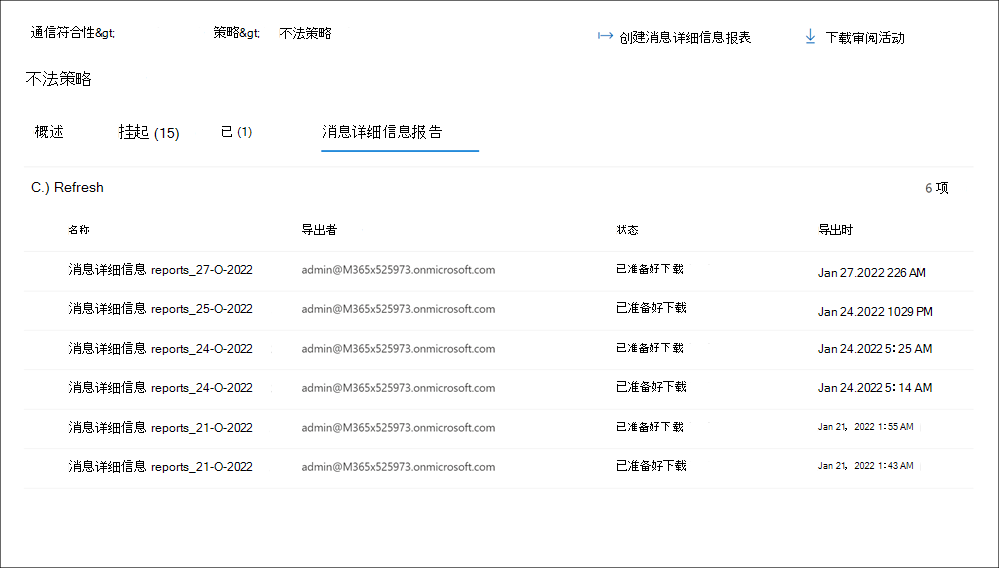

# <a name="use-communication-compliance-reports-and-audits"></a>使用通信合规性报告和审核

## <a name="reports"></a>报表

新的 **"报告** "仪表板是查看所有通信合规性报告的中央位置。 报告小组件提供对通信合规性活动状态进行总体评估最常用的见解的快速视图。 报表小部件中包含的信息不可导出。 详细报告提供与特定通信合规性领域相关的深入信息，并提供在查看时筛选、分组、排序和导出信息的能力。 

对于日期范围筛选器，事件日期和时间在协调世界时与 UTC (中) 。 筛选报告的邮件时，请求用户的本地日期/时间将基于用户本地日期/时间转换为 UTC 确定结果。 例如， 如果美国太平洋夏令时 (PDT) 在 00：00 筛选从 8/30/2021 到 2021/8/31/00 的报告，则报告包括从 8/30/2021 07：00 UTC 到 8/31/2021 07：00 UTC 的邮件。 如果筛选时间为 00：00 时，同一用户位于美国东部夏令时 (EDT) ，报告将包含从 8/30/2021 04：00 UTC 到 8/31/2021 04：00 UTC 的邮件。


" **报告"** 仪表板包含以下报告小组件和详细报告链接：

### <a name="report-widgets"></a>报告小组件

- **最近策略匹配**：按活动策略显示一段时间的匹配项数。
- **按策略解析的项目**：显示策略随着时间的推移解析的策略匹配警报数。
- **策略匹配最多的用户**：显示 (用户或匿名) 指定时间段的策略匹配数。
- **匹配次数最多的** 策略：显示给定时段的策略和匹配项数，对匹配项的排名从高到低。
- **按策略升级**：显示给定时间内每个策略的升级数。

### <a name="detailed-reports"></a>详细报告

使用 *"* 导出"选项可.csv详细报告的报告详细信息的报表文件。

- **策略设置和状态**：提供策略配置和设置的详细信息，以及邮件上每个策略的 (和操作) 常规状态。 包括策略信息以及策略如何与用户和组、位置、审阅百分比、审阅者、状态以及策略的上次修改时间相关联。 使用 *"* 导出"选项创建.csv报告详细信息的报表文件。
- **每个策略的项目和操作：** 查看和导出匹配的项以及每个策略的修正操作。 包括策略信息以及策略如何与：

    - 匹配的项
    - 已升级项目
    - 已解决项目
    - 标记为合规
    - 标记为不兼容
    - 标记为有问题
    - 待审阅的项目
    - 已通知用户
    - 已创建案例

- **每个位置的项目和操作**：查看和导出匹配项以及每个位置Microsoft 365操作。 包括有关工作负荷平台如何与以下平台关联的信息：

    - 匹配的项
    - 已升级项目
    - 已解决项目
    - 标记为合规
    - 标记为不兼容
    - 标记为有问题
    - 待审阅的项目
    - 已通知用户
    - 已创建案例

- **按用户的活动**：查看和导出匹配项以及每个用户的修正操作。 包括有关用户如何关联的信息：

    - 匹配的项
    - 已升级项目
    - 已解决项目
    - 标记为合规
    - 标记为不兼容
    - 标记为有问题
    - 待审阅的项目
    - 已通知用户
    - 已创建案例

- **每个位置的敏感信息** 类型 (预览) ：查看和导出有关在通信合规性策略中检测敏感信息类型和关联源的信息。 包括组织中配置的源中的敏感信息类型实例的总体总数和具体细目。 每个第三方源的值都显示在第三方源文件.csv列中。 示例包括：

    - **电子邮件**：在电子邮件中检测到Exchange类型。
    - **Teams**：在聊天频道和聊天Microsoft Teams检测到的敏感信息类型。
    - **Skype for Business**：在用于业务通信Skype检测到的敏感信息类型。
    - **Yammer**：在收件箱、Yammer、聊天和回复中检测到的敏感信息类型。
    - **第三方源**：为与组织中配置的第三方连接器关联的活动检测到的敏感信息类型。 若要查看报告中特定敏感信息类型的第三方源细分，请将鼠标悬停在"第三方源"列中敏感信息类型的值上。
    - **其他**：用于内部系统处理的敏感信息类型。 选择或取消选择报表的此源不会影响任何值。

### <a name="message-details-report-preview"></a>邮件详细信息报告 (预览) 

创建自定义报告，并查看"策略"选项卡上特定策略中包含的 **邮件** 的详细信息。这些报告可用于对邮件进行完全审阅，并可用于为可自定义时间段的邮件状态创建报告快照。 创建报告后，可以在"邮件详细信息报告"选项卡上查看详细信息.csv下载 **详细信息** 报告。



若要创建新的邮件详细信息报告，请完成以下步骤：

1. 使用Microsoft 365 合规中心合规性调查角色组的成员帐户 *登录到安全* 机制。
2. 导航到" **策略"** 选项卡，选择一个策略，然后选择" **创建邮件详细信息报告"**。
3. 在" **创建邮件详细信息报告** "窗格中，在"报告名称"字段中输入 **报告** 的名称。
4. 在 **"选择日期范围***"中，* 选择报告的"*开始日期"和*"结束日期"。
5. 选择“**创建**”。
6. 将显示报告创建确认。

根据报告中的项目数，可能需要几分钟到几小时才能准备好下载报告。 可以在"邮件详细信息报告"选项卡上检查进度。报告状态为 *"正在进行"**或"准备下载"*。 您最多可以同时处理 15 个单独的报告。 若要下载报告，请选择"准备下载"状态中的 *报告* ，然后选择" **下载报告"**。

> [!NOTE]
> 如果所选时间段未返回报告的任何邮件结果，则所选时间段没有任何邮件。 报告将为空。

邮件详细信息报告包含策略中每个邮件项目的以下信息：

- **匹配 ID**：策略中邮件的唯一 ID。
- **发件人**：邮件的发件人。
- **收件人**：邮件包含的收件人。
- **发送日期**：邮件的发送日期。
- **匹配日期**：邮件匹配策略条件的日期。
- **主题**：邮件的主题。
- **包含附件**：邮件的任何附件的状态。 值为"是"或"否"。
- **策略** 名称：与邮件关联的策略的名称。 对于报告中的所有邮件，此值都相同。
- **项目** 状态：策略中邮件项目的状态。 值为 Pending 或 Resolved。
- **标记**：分配给邮件的标记。 值为 Questionable、Compliant 或 Non-complians。
- **关键字匹配**：邮件的关键字匹配。
- **审阅者**：分配给邮件的审阅者。
- **挂起 (天数)**：邮件已挂起的天数。 对于已解析的邮件，值为 0。
- **已解决的注释**：解析时输入的消息的注释。
- **解决日期**：解析邮件的日期和时间。
- **上次更新者**：上次更新程序的用户名称。
- **上次更新时间**：上次更新邮件的日期和时间。
- **注释历史记录**：邮件通知的所有注释的列表，包括注释作者和注释的日期/时间。

## <a name="audit"></a>Audit

在某些情况下，您必须向法规或合规性审核员提供相关信息，以证明监督用户活动和通信。 此信息可能是与已定义的组织策略相关联的所有活动的摘要，或者通信合规性策略发生更改时。 通信合规性策略具有内置的审核跟踪，可完全准备内部或外部审核。 通信策略会捕获每个创建、编辑和删除操作的详细审核历史记录，以提供监管程序的证明。

> [!IMPORTANT]
> 必须先为组织启用审核，然后才能记录通信合规性事件。 若要启用审核，请参阅 [启用审核日志](communication-compliance-configure.md#step-2-required-enable-the-audit-log)。 当活动触发在 Microsoft 365 审核日志中捕获的事件时，可能需要最多 48 小时才能在通信合规性策略中查看这些事件。

若要查看通信合规性策略更新活动，请在任何策略的主页上选择"导出策略更新"控件。 必须分配有全局管理员或 *通信合规性管理员* 角色才能导出更新活动。 此操作将生成包含以下信息.csv审核文件：

|**Field**|**详细信息**|
|:-----|:-----|
| **CreationDate** | 在策略中执行更新活动的日期。 |
| **UserIds** | 在策略中执行更新活动的用户。 |
| **操作** | 对策略执行的更新操作。 |
| **AuditData** | 此字段是所有策略更新活动的主数据源。 所有更新活动都由逗号分隔符进行记录和分隔。 |

若要查看策略的通信合规性审阅活动，请选择特定策略的"概述"页上的"导出审阅活动"控件。 必须分配有全局管理员或 *通信合规性管理员* 角色才能导出审阅活动。 此操作将生成包含以下信息.csv审核文件：

|**Field**|**详细信息**|
|:-----|:-----|
| **CreationDate** | 在策略中执行审阅活动的日期。 |
| **UserIds** | 在策略中执行审阅活动的用户。 |
| **操作** | 对策略执行的审阅操作。 |
| **AuditData** | 此字段是所有策略审阅活动的主数据源。 所有审阅活动都由逗号分隔符进行记录和分隔。 |

您还可以在统一部署中或审核日志 [Search-UnifiedAuditLog](/powershell/module/exchange/search-unifiedauditlog) PowerShell cmdlet 查看审核活动。 若要了解有关保留策略审核日志，请参阅管理审核日志 [策略](audit-log-retention-policies.md)。

例如，以下示例返回所有监管审核活动的活动， (策略和规则) ：

```PowerShell
Search-UnifiedAuditLog -StartDate $startDate -EndDate $endDate -RecordType AeD -Operations SupervisoryReviewTag
```

此示例返回通信合规性策略的更新活动：

```PowerShell
Search-UnifiedAuditLog -StartDate $startDate -EndDate $endDate -RecordType Discovery -Operations SupervisionPolicyCreated,SupervisionPolicyUpdated,SupervisionPolicyDeleted
```

此示例返回与当前通信合规性策略匹配的活动：

```PowerShell
Search-UnifiedAuditLog -StartDate $startDate -EndDate $endDate -Operations SupervisionRuleMatch
```

通信合规性策略匹配项存储在每个策略的监督邮箱中。 在某些情况下，可能需要检查监督邮箱的大小，以确保未接近当前 100 GB 的存储大小或 100 万封邮件的限制。 如果达到邮箱限制，则不捕获策略匹配项，并且您需要创建一个使用相同设置 (的新策略) 以继续捕获相同活动的匹配项。

若要检查策略监督邮箱的大小，请完成以下步骤：

1. 使用 连接 PowerShell V2 模块中的 [Exchange Online-ExchangeOnline](/powershell/module/exchange/connect-exchangeonline) cmdlet，Exchange Online新式验证连接到 PowerShell。
2. 在 PowerShell 中运行以下命令：

    ```PowerShell
    ForEach ($p in Get-SupervisoryReviewPolicyV2 | Sort-Object Name)
    {
       "<Name of your communication compliance policy>: " + $p.Name
       Get-MailboxStatistics $p.ReviewMailbox | ft ItemCount,TotalItemSize
    }
    ```
