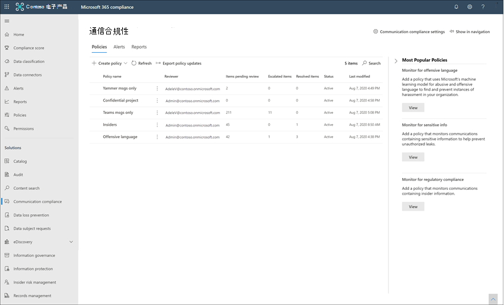
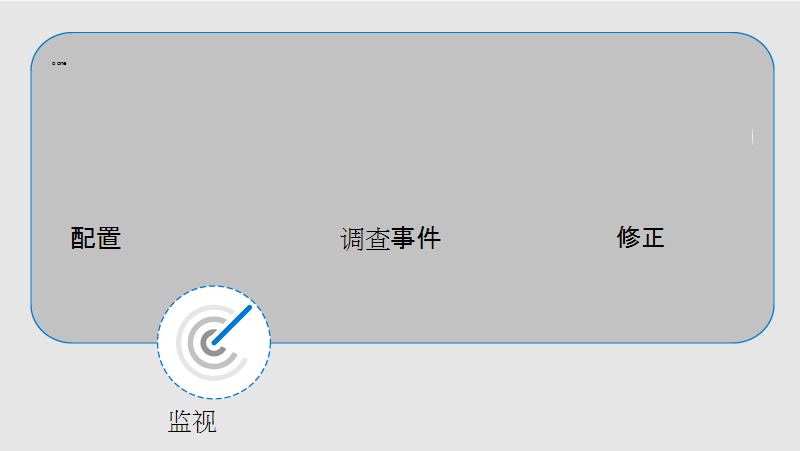

# 了解通信合规性Microsoft 365

通信合规性是组织中一种内部Microsoft 365解决方案，可帮助您检测、捕获和操作组织中不适当的邮件，从而将通信风险降至最低。 预定义和自定义的策略让你能够扫描内部和外部通讯，查看与策略的匹配情况，让委派的审阅者能检查它们。 审阅者可以调查组织中扫描的电子邮件、Microsoft Teams、Yammer 或第三方通信，并采取适当的措施确保他们符合组织的邮件标准。

Microsoft 365 中的通信合规性策略可以帮助你克服很多与合规性、内部和外部通信有关的新式挑战：

- 扫描越来越多类型的通信频道
- 消息数据越来越大的体量
- 监管执行和罚款的风险

此外，IT 管理员和合规性管理团队之间可能存在职责分离。 通信合规性支持在策略配置与邮件调查和审阅之间分离。 例如，组织的 IT 组可能负责设置通信合规性角色权限、组和策略，并且研究人员和审阅者可能负责邮件会审、审阅和缓解操作。

有关通信合规性的最新 Ignite 演示文稿，请参阅以下视频：

- [通过通信合规性培养安全和包含文化](https://www.youtube.com/watch?v=oLVzxcaef3w)
- [了解如何降低组织内部的通信风险](https://www.youtube.com/watch?v=vzARb1YaxGo)
- [通过通信合规性满足法规合规性要求](https://www.youtube.com/watch?v=gagOhtCBfgU)
- [更好地使用Microsoft Teams - 了解有关通信合规性中Teams集成功能的最新本机解决方案](https://www.youtube.com/watch?v=m4jukD5Fh-o)

有关通信合规性的快速概述，请参阅 Microsoft Mechanics 频道上的检测工作场所骚扰[Microsoft 365通信合规性](https://youtu.be/z33ji7a7Zho)[响应](https://www.youtube.com/user/OfficeGarageSeries)。

查看 [TD Security 如何使用通信合规性](https://customers.microsoft.com/story/1391545301764211731-td-securities-banking-capital-markets-compliance) 来解决其监管义务并满足其安全性和稳定性需求。

若要了解最新的通信合规性更新，请选择贵组织通信合规性[的](https://compliance.microsoft.com/)新增功能。

## 通信合规性的场景

通信合规性策略可帮助查看组织中在几个重要的合规性领域的邮件：

- **公司策略**

    用户必须在其所有与业务相关的通信中遵守可接受的使用、信息安全标准和其他公司策略。 通信合规性策略可以检测策略匹配项，并帮助您采取纠正措施来帮助缓解这些类型的事件。 例如，您可以扫描组织中用户的通信，以发现潜在的人力资源问题，例如冒犯性或使用不当或冒犯性语言。

- **风险管理**

    组织负责分发整个基础结构和企业网络系统的所有通信。 使用通信合规性策略帮助识别和管理潜在的法律曝光和风险，有助于在风险损害公司运营之前将风险降至最低。 例如，您可以扫描组织中有关机密项目（如即将收购、合并、收益披露、重组或领导团队变更）的未经授权的通信和兴趣冲突的消息。

- **法规遵从性**

    大多数组织必须遵守某种类型的法规合规性标准，这是其正常操作程序的一部分。 这些法规通常要求组织对适合其行业的邮件实施某种类型的监管或监管流程。 金融行业监管局 (FINRA) 条例 3110 是要求组织制定监管程序以扫描用户通信及其所参与业务类型的一个很好的示例。 又例如，可能需要查看组织中经纪自营商的通信，防止潜在的洗钱、内部交易、串通或贿赂活动。 通信合规性策略通过提供扫描并报告公司通信的流程，可帮助组织满足这些要求。 有关对金融组织的支持详细信息，请参阅针对美国银行业和金融市场的关键合规性 [和安全注意事项](../solutions/financial-services-secure-collaboration.md)。

## 主要功能区域

邮件中的Microsoft 365合规性提供了几个重要功能，可帮助解决邮件平台上的合规性问题：

- 可自定义的智能模板
- 灵活的修正工作流
- 可行见解

### 可自定义的智能模板

通信合规性中的智能可自定义模板允许你应用机器学习，以智能检测组织中通信冲突。

- **可自定义的预配置模板**：策略模板可帮助解决最常见的通信风险。 初始策略创建和后续更新现在使用预定义的不当内容、敏感信息、冲突及法规合规性模板来加快初始策略创建和后续更新。
- **新的机器学习** 支持：内置的滥用、威胁、骚扰、亵亵和图像分类器有助于减少扫描邮件 中的错误分类内容，从而在调查和修正过程中节省审阅者的时间。
- **改进的条件生成器**：现在，配置策略条件已简化为策略向导中的单一集成体验，从而减少了对策略应用条件方式的混淆。

### 灵活的修正工作流

利用内置修正工作流，可以快速识别组织中策略匹配的邮件并采取措施。 以下新功能提高了调查和修正活动的效率：

- **灵活的修正工作流**：新的修正工作流可帮助你快速对策略匹配采取行动，包括将邮件上报给其他审阅者以及向具有策略匹配的用户发送电子邮件通知的新选项。
- **对话策略匹配**：对话中的消息按策略匹配进行分组，让你可以更加了解对话与通信策略的关联。 例如，"挂起通知"视图中的对话策略匹配将自动显示与"不当内容"策略Teams匹配的所有邮件。 不会显示对话中与"不当内容"策略不匹配的其他消息。
- **关键字突出显示**：邮件文本视图中将突出显示匹配策略条件的术语，以便帮助审阅者快速定位并修正策略警报。
- **精确和接近重复检测**：除了扫描匹配通信合规性策略的准确字词之外，近重复检测将文本类似的字词和消息分在一起，以帮助加快审阅过程。
- **O)  (CR (预览**) ：扫描、检测和调查嵌入或附加到电子邮件或聊天消息的图像中的打印和手写文本Microsoft Teams文本。
- **新筛选器**：使用多个字段的邮件筛选器更快地调查和修正策略警报，包括发件人、收件人、日期、域等。
- **改进的消息视图**：现在，使用新的邮件源、文本和注释视图，调查和修正操作会更快。 现在可以查看邮件附件，以在采取修正操作时提供完整上下文。
- **用户历史记录**：现在，在修正工作流过程中，所有用户邮件修正活动（如过去的通知和策略匹配升级）的历史视图为审阅者提供了更多上下文。 用户的第一次或重复的策略匹配实例现在已存档且易于查看。
- **模式检测到通知**：许多威胁和威胁操作会随着时间的推移发生，并且涉及用户重新出现相同行为的实例。 警报详细信息中显示的新模式检测到的通知有助于引起用户注意这些警报和这种类型的行为。
- **翻译**：使用修正工作流中的翻译支持快速调查八种语言的邮件详细信息。 其他语言的邮件将自动转换为审阅者的显示语言。
- 附件 **检测**：扫描、检测和调查 (邮件的策略分类) 和OneDrive Microsoft Teams新式附件Microsoft Teams链接内容。 附件内容会自动提取到文本文件中，进行详细审阅和操作。

### 可行见解

新的交互式仪表板，用于警报、策略匹配、操作和趋势分析，可帮助你快速查看组织中待定和已解决警报的状态。

- **主动智能警报**：针对需要立即关注的策略匹配进行报警，包括按问题严重性对待定项目进行排序的新仪表板，以及发送到指定审阅者的新增自动电子邮件通知。
- **交互式仪表板**：新的仪表板可显示策略匹配项、待定和已解决的行动以及按照用户和策略展示的趋势分析。
- **审核支持**：可以轻松地从审核中心导出策略和审阅活动的完整Microsoft 365 合规中心以帮助支持审核审核请求。

## 与 Microsoft 365 服务集成

通信合规性策略跨多个通信渠道扫描和捕获消息，以帮助你快速查看和修正合规性问题：

- **Microsoft Teams：** 在作为独立频道 [源或其他](/MicrosoftTeams/Teams-overview)Microsoft 365 服务的通信合规性中支持公共和专用 Microsoft Teams 频道和单个聊天的聊天通信。 当您选择要在通信合规性策略中监督的用户和组时，您需要手动添加单个用户、通讯组或特定 Microsoft Teams频道。
- **Exchange Online：** 托管在 Exchange Online 组织 [Microsoft 365的所有邮箱](/Exchange/exchange-online)都符合扫描条件。 电子邮件和附件与通信合规性策略条件相匹配，可立即进行监视并提交到合规性报告中。 Exchange Online现在是一个可选的源通道，在通信合规性策略中不再需要它。
- **Yammer**：通信合规性策略支持 [Yammer](/yammer/yammer-landing-page) 中的私人消息和公共社区对话。 Yammer 是一个可选频道，必须处于 [本机模式](/yammer/configure-your-yammer-network/overview-native-mode) 才能进行消息和附件的审查。
- **Skype for Business Online**：通信合规性策略支持扫描 [Skype for Business Online 中的聊天通信和相关附件](/SkypeForBusiness/skype-for-business-online)。
- **第三方源**：可以扫描来自第三 方源的邮件，以检查导入到组织邮箱Microsoft 365的数据。 通信合规性支持与多个热门平台（包括 Instant Bloomberg 和其他平台）的连接。

若要了解有关通信合规性策略中的消息传递通道支持的信息，请参阅检测具有通信合规性 [的通道信号](communication-compliance-channels.md)。

## 工作流

通信合规性有助于解决与遵守内部策略和法规合规性要求相关的常见问题。 借助重点策略模板和灵活的工作流，您可以使用可操作见解快速解决检测到的合规性问题。

识别并解决与通信合规性Microsoft 365以下工作流：

### 配置

在此工作流步骤中，确定合规性要求并配置适用的通信合规性策略。 策略模板是一种很好的方法，不仅可以快速配置新的合规性策略，还能根据需求变化快速修改和更新策略。 例如，在为组织中所有用户配置策略之前，您可能需要快速测试策略，以检测一小组用户的通信中是否包含不适当的内容。

>[!IMPORTANT]
>默认状态下，全局管理员没有对通信合规性功能的访问权限。 若要启用通信合规性功能的权限，请参阅 [使通信合规性在你的组织中可用](communication-compliance-configure.md#step-1-required-enable-permissions-for-communication-compliance)。

你可以从 Microsoft 365 合规中心的以下策略模板中选择：

- **监视不恰当的文本**：使用此模板快速创建一个策略，该策略使用内置分类器自动检测邮件中可能被视为不当、滥用或冒犯性的文本。
- **监视不恰当的** 图像：使用此模板可以快速创建一个策略，该策略使用内置分类器自动检测包含可能被视为在组织中不合适的成人和性图片的内容。
- 监视敏感信息 **：使用此** 模板可以快速创建策略，以扫描包含已定义的敏感信息类型或关键字的通信，以帮助确保重要数据不会与不应具有访问权限的人共享。
- **监视财务监管** 合规性：使用此模板可以快速创建策略，以扫描通信，以引用与监管标准相关的标准金融条款。
- **监视发生冲突的情况**：使用此模板可以快速创建一个策略来监视两个组或两个用户之间的通信，以帮助避免发生冲突。
- **自定义策略**：使用此模板配置特定通信通道、单个检测条件以及组织中要监视和审阅的内容量。

>[!TIP]
>使用 [建议](communication-compliance-configure.md#recommended-actions-preview) 的操作可帮助您确定是否需要敏感信息类型策略或是否需要更新现有的不恰当的内容策略。

### 调查

在此步骤中，你将进一步深入了解检测到的与通信合规性策略相匹配的问题。 此步骤包括以下可用于以下Microsoft 365 合规中心：

- **警报**：当邮件与策略条件匹配时，将自动生成警报。 对于每个警报，你可以看到状态、严重性、检测到的时间，以及是否分配了Advanced eDiscovery及其状态。 新警报显示在通信合规性主页和警报页面上，并按严重性顺序列出。
- **问题管理**：对于每个警报，你可以采取调查操作来帮助修正邮件中发现的问题。
- **文档** 审阅：在调查问题期间，可以使用邮件的几个视图来帮助正确评估检测到的问题。 视图包括对话摘要、仅文本视图、批注视图和沟通对话的详细信息视图。
- **查看用户活动历史记录**：查看策略匹配的用户消息活动和修正操作（如过去的通知和升级）的历史记录。
- **筛选器**：使用筛选器（如发件人、收件人、日期和主题）可快速缩小要审阅的邮件警报范围。

### 修正

下一步是修正已使用下列选项调查的通信合规性问题：

- **解决**：审阅问题后，可以解决警报。 解决警报会将其从挂起的警报队列中删除，并且操作将保留为匹配策略的 *"* 已解析"队列中的条目。 将警报标记为错误分类、向用户发送关于警报的通知或打开警报的新案例后，将自动解决警报。
- **标记消息**:作为问题解决的组成部分，你可以将检测到的邮件标记为合规、不合规或有疑问（因为邮件与组织的策略和标准相关）。 标记可帮助你以微观筛选策略警报呈报或作为其他内部审阅流程的一部分。
- **通知用户**：通常，用户意外或无意违反通信合规性策略。 你可以使用通知功能向用户提供警告通知并解决问题。
- **呈报给另一个审阅者**：有时，问题的初始审阅者需要其他审阅者输入内容来帮助解决事件。 作为解决流程的组成部分，可以轻松将邮件问题呈报给组织其他领域的审阅者。
- **报告为错误分类**：错误地检测为合规性策略匹配的邮件偶尔会进入审阅过程。 你可以将这些类型的警报标记为错误分类，向 Microsoft 提交有关错误分类的反馈以帮助改进全局分类器，并自动解决问题。
- **删除预览Teams (消息**) ：可能从频道或个人及群组聊天Microsoft Teams显示不适当的消息。 删除的不当邮件将替换为因违反策略而删除邮件的通知。
- **上报进行调查**：在最严重的情况下，可能需要与组织的其他审阅者共享通信合规性信息。 内部风险管理与其他 Microsoft 365 合规性功能紧密集成在一起，可帮助你进行端到端解决方案管理。 升级案件进行调查让你可以将数据和管理转移到 Office 365 高级电子数据展示。 高级电子数据展示提供了端到端的工作流程，可用于保存、收集、审查、分析和导出响应组织的内部和外部调查的内容。 它帮助法律团队管理整个法定保留通知工作流。 若要了解有关高级电子数据展示案例的详细信息，请参阅 [Microsoft 365 中的高级电子数据展示概述](overview-ediscovery-20.md)。

### 监视

跟踪和管理通信合规性策略标识的合规性问题涉及整个工作流过程。 随着警报的生成以及调查和修正操作的实施，现有策略可能需要查看和更新，并且可能需要创建新策略。

- **监视并报告**：使用通信合规性仪表板小部件、导出日志和记录在统一审核日志中的事件，持续评估和改进合规性状态。

## 准备好开始了吗？

- 有关规划信息，请参阅 [规划通信合规性](communication-compliance-plan.md)。
- 查看[Contoso 的](communication-compliance-case-study.md)案例研究，了解他们如何快速配置通信合规性策略，以监视 Microsoft Teams、Exchange Online 和 Yammer 内容。
- 若要为组织配置通信合规性Microsoft 365，请参阅为[组织配置通信Microsoft 365。](communication-compliance-configure.md)
