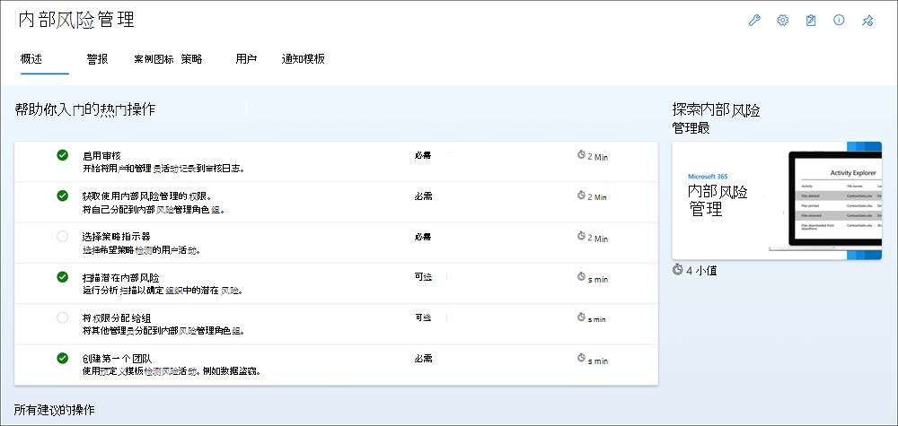

# 试用版 playbook: Microsoft 365 合规中心解决方案

欢迎来到 Microsoft 365 合规解决方案使用版剧本。此 playbook 将有助于发现 Microsoft 365 合规中心和安全产品的强大且全面的功能，从而帮助充分利用 90 天的免费试用版。

尝试每个解决方案将有助于做出明智的决策，从而满足组织的合规性需求。

功能：

- [高级审核](#advanced-audit)
- [通信合规性](#communication-compliance)
- [合规性管理器](#compliance-manager)
- [数据丢失防护](#data-loss-prevention)
- [电子数据展示](#ediscovery)
- [信息保护](#information-protection)
- [内部风险管理](#insider-risk-management)
- [记录管理](#records-management)

可选的加载项:

- [合规性管理器高级评估](#compliance-manager-premium-assessments)
- [Microsoft Priva 隐私风险管理和 Microsoft Priva 主体权利请求](#microsoft-priva-privacy-risk-management-and-microsoft-priva-subject-rights-requests)

## 使用 Microsoft 365 的合规性操作

轻松、快速地开始试用 Microsoft 的合规性解决方案，无需更改组织元数据。 根据优先级，可以从这些解决方案区域中的任意一个开始，以立即看到价值。 以下是客户传达的五大组织问题和推荐开始时使用的解决方案。

:::image type="content" source="../media/compliance-trial/workflow.png" alt-text="使用 Microsoft 365 的合规性操作":::

## 高级审核

**进行调查**

高级审核有助于组织进行取证和合规性调查，方法是增加调查所需的审核日志保留、提供对可帮助确定入侵范围的关键事件的访问权限，以及提供对 Office 365 管理活动 API 的快速访问权限。

### 步骤 1: [将 E5 许可证应用于每个要为其生成 E5 事件的用户](set-up-advanced-audit.md#step-1-set-up-advanced-audit-for-users)

> [!TIP]
> 试用版最佳做法: 第 1 天

“高级审核”功能，如记录重要事件（如 MailItemsAccessed 和 Send）功能，需要为用户分配适当的 E5 许可证。 此外，必须为这些用户启用“高级审核”应用程序/服务计划。

为用户设置高级审核 - 验证已将高级审核应用分配给用户，[为每个用户执行以下步骤](set-up-advanced-audit.md#step-1-set-up-advanced-audit-for-users)。

1. 启用高级审核事件 - [启用要为 [Exchange Online PowerShell](/powershell/exchange/connect-to-exchange-online-powershell) 中的每个用户审核的 SearchQueryInitiatedExchange 和 SearchQueryInitiatedSharePoint](set-up-advanced-audit.md#step-2-enable-advanced-audit-events)。
1. 设置审核保留策略 - [创建其他审核日志保留策略](set-up-advanced-audit.md#step-3-set-up-audit-retention-policies) ，从而满足组织的安全操作、IT 和合规性团队的要求。
1. 搜索高级审核事件 - 在进行取证调查时 [搜索关键的高级审核事件](set-up-advanced-audit.md#step-4-search-for-advanced-audit-events) 和其他活动。

### 步骤 2: [新建审核日志策略，从而指定在组织中为用户执行的活动保留审核日志的时间，并为策略定义优先级](audit-log-retention-policies.md#before-you-create-an-audit-log-retention-policy)

> [!TIP]
> 试用版最佳做法: 在前 30 天内创建

审核日志保留策略是 Microsoft 365 中新增的高级审核功能的一部分。 通过审核日志保留策略，可指定组织中审核日志的保留时间。

1. 在创建审核日志保留策略之前 – 创建策略前 [要了解的关键事项](audit-log-retention-policies.md#before-you-create-an-audit-log-retention-policy)。
1. [创建审核日志保留策略](audit-log-retention-policies.md#create-an-audit-log-retention-policy)
1. [管理 Microsoft 365 合规中心内的审核日志保留策略](audit-log-retention-policies.md#manage-audit-log-retention-policies-in-the-microsoft-365-compliance-center) - “审核保留策略”选项卡(也称为仪表板)上列出了审核日志保留策略。你可以使用仪表板查看、编辑、删除审核保留策略。
1. 在 PowerShell 上创建并管理审核日志保留策略 - 还可以使用安全与合规中心 PowerShell 以 [创建并管理审核日志保留策略](audit-log-retention-policies.md#create-and-manage-audit-log-retention-policies-in-powershell)。 使用 PowerShell 的一个原因是为 UI 中不可用的记录类型或活动创建策略。

## 通信合规性

**识别行为准则策略违规行为并采取行动**

通信合规性有助于检测不适当的消息、调查可能的策略违规行为，并采取修正措施，从而帮助智能识别通信违规行为，以支持合规且正常的工作环境。

### 步骤 1: [为通信合规性启用权限](communication-compliance-configure.md#step-1-required-enable-permissions-for-communication-compliance)

> [!TIP]
> 试用版最佳做法: 第 1 天

[将所有合规性用户分配到通信合规性角色组](communication-compliance-configure.md#step-1-required-enable-permissions-for-communication-compliance)。
### 步骤 2: [启用审核日志](communication-compliance-configure.md#step-2-required-enable-the-audit-log)

> [!TIP]
> 试用版最佳做法: 在前 30 天内设置

要使用此功能，请启用审核，以便组织可以开始记录组织中的用户和管理员活动。启用此功能时，活动将记录到审核日志，并可在报告中查看。若要了解详细信息，请参阅[打开或关闭审核日志搜索](turn-audit-log-search-on-or-off.md)。

### 步骤 3: [创建通信合规性策略](communication-compliance-policies.md)

[使用现有模板创建通信合规性策略](communication-compliance-policies.md): 1- 不适当的内容；2- 敏感信息；3- 法规合规性；4- 利益冲突。

### 步骤 4: [调查并修正警报](communication-compliance-investigate-remediate.md)

[调查并修正](communication-compliance-investigate-remediate.md) 通信合规性警报。

## 合规性管理器

**轻松管理组织合规性**

合规性管理器可以帮助你完成合规性之旅，从清查数据保护风险到管理实现控制的复杂性、及时了解最新法规和认证、以及向审核员报告。

### 步骤 1: [了解合规性管理器](compliance-manager-quickstart.md#first-visit-get-to-know-compliance-manager)

> [!TIP]
> 试用版最佳做法: 第 1 天

合规性管理器概述页面是全面查看合规性管理器的含义及其工作原理的最佳第一站。 可能还希望使用以下链接直接跳转到文档的关键节:

- [了解合规性分数](compliance-manager.md#understanding-your-compliance-score)
- [关键元素概述: 控制、评估、模板和改进操作](compliance-manager.md#key-elements-controls-assessments-templates-improvement-actions)
- [了解合规性管理器仪表板](compliance-manager-setup.md#understand-the-compliance-manager-dashboard)
- [筛选仪表板视图](compliance-manager-setup.md#filtering-your-dashboard-view)
- [了解改进操作](compliance-manager-setup.md#improvement-actions-page)
- [了解评估](compliance-manager.md#assessments)
- [使用 Microsoft 合规性配置管理器快速扫描环境](compliance-manager-mcca.md)

### 步骤 2: [配置合规性管理器以管理合规性活动](compliance-manager-assessments.md)

> [!TIP]
> 试用版最佳做法: 在前 30 天内检查

开始评估并采取改进措施，从而实施控制并提高合规性分数。

1. [选择预生成模板以创建并管理第一次评估](compliance-manager-assessments.md)。
1. [了解如何使用模板生成评估](compliance-manager-templates.md)。
1. [对改进操作执行实施和测试工作，从而完成评估中的控制](compliance-manager-improvement-actions.md)。
1. [更好地了解不同的操作对合规性分数的影响](compliance-score-calculation.md)。

> [!NOTE]
> Microsoft 365 或 Office 365 E1/E3 订阅包含 Microsoft 数据保护基线模板。 Microsoft 365 或 Office 365 E5，E5 合规包含以下内容的模板:
>
> - Microsoft 数据保护基线
> - 欧盟 GDPR  
> - ISO/IEC 27001、
> - NIST 800-53
>
> 合规性管理器包含 300 多个可作为加载项购买的法规或高级模板。 请参阅此处的列表。 使用任何高级模板(包含在订阅中或作为加载项购买)后，你将收到这些模板的通用版本，允许管理对任何产品或服务的合规性

### 步骤 3: [纵向扩展: 使用高级功能满足自定义需求](compliance-manager-templates-create.md)

自定义评估有助于:

- 管理非 Microsoft 365 产品(例如第三方应用和服务、本地应用程序和其他资产)的合规性
- 管理自己的自定义的或特定于业务的合规性控制

1. [添加自己的控制和改进操作，以扩展合规性管理器模板](compliance-manager-templates-extend.md)
1. [创建自己的自定义模板](compliance-manager-templates-create.md)
1. [修改现有模板以添加或删除控制和操作](compliance-manager-templates-modify.md)
1. [设置改进操作的自动测试](compliance-manager-setup.md#set-up-automated-testing)
1. [将改进操作重新分配给其他用户](compliance-manager-setup.md#reassign-improvement-actions-to-another-user)

## 数据丢失防护

**保护敏感数据**

为了遵循业务标准和行业法规，组织需要保护敏感信息，防止由于疏忽而泄露。 设置数据丢失防护 (DLP) 策略以跨 Microsoft 365 识别、监视和自动保护敏感信息。

### 步骤 1: [防护 Teams 位置上的数据丢失](dlp-microsoft-teams.md#dlp-licensing-for-microsoft-teams)

> [!TIP]
> 试用版最佳做法: 第 1 天

如果你的组织具有数据丢失防护(DLP)，则可以定义阻止人员在 Microsoft Teams 频道或聊天会话中共享敏感信息的策略。

1. 了解 [适用于 Microsoft Teams 的 DLP 许可以及 DLP 防护的范围](dlp-microsoft-teams.md#dlp-licensing-for-microsoft-teams)
1. [将 Microsoft Teams 作为位置添加到现有 DLP 策略](dlp-microsoft-teams.md#add-microsoft-teams-as-a-location-to-existing-dlp-policies)
1. [为 Teams 配置默认的 DLP 策略](mip-easy-trials.md) 或 [为 Microsoft Teams 定义新的 DLP 策略](dlp-microsoft-teams.md#define-a-new-dlp-policy-for-microsoft-teams)

### 步骤 2: [防护设备位置上的数据丢失](endpoint-dlp-getting-started.md)

> [!TIP]
> 试用版最佳做法: 在前 30 天内设置

通过 Microsoft 终结点 DLP，你可以监视 Windows 10 设备并检测何时使用和共享敏感项目。

1. 准备终结点 - 确保计划部署终结点 DLP 的 Windows 10 和 macOS 设备 [满足这些要求](endpoint-dlp-getting-started.md)
1. [将设备载入设备管理](endpoint-dlp-getting-started.md)  - 必须启用设备监视并载入终结点，然后才能监视并保护设备上的敏感项。 这两项操作都在 Microsoft 365 合规门户中完成。
   - 方案 1 –[载入尚未载入的设备](endpoint-dlp-getting-started.md)。
   - 方案 2 - [已部署 Microsoft Defender for Endpoint，且](endpoint-dlp-getting-started.md)中有终结点报告。 所有这些终结点都将显示在托管设备列表中。
1. [为设备配置默认的 DLP 策略](mip-easy-trials.md#dlp-for-devices) 或 [为设备定义新的 DLP 策略](endpoint-dlp-learn-about.md)。
1. 在 DLP 警报管理仪表板中 [查看终结点 DLP 警报](dlp-configure-view-alerts-policies.md)。
1. 在活动资源管理器中 [查看终结点 DLP 数据](data-classification-activity-explorer.md)。

### 步骤 3: [展开范围或保护中的策略](dlp-learn-about-dlp.md#dlp-policy-configuration-overview)

可以灵活地配置 DLP 策略。 可以从适用于 Teams 和设备的默认 DLP 策略开始，并展开这些策略以保护其他位置、敏感信息类型或标签。 此外，还可以展开策略操作并自定义警报。

1. 添加位置
1. 添加要保护的敏感信息类型或标签
1. 添加操作
   - Teams:
      - [阻止对敏感文档的外部访问](dlp-microsoft-teams.md#prevent-external-access-to-sensitive-documents)
      - [获取可帮助指导用户的策略提示以及自定义策略提示的说明](dlp-microsoft-teams.md#policy-tips-help-educate-users)
   - 设备: 从仅审核切换到阻止
1. [配置并查看数据丢失防护策略警报 - Microsoft 365合规中心 | Microsoft Docs](dlp-configure-view-alerts-policies.md)

## 电子数据展示

**通过端到端工作流发现更多内容**

利用端到端工作流以保留、收集、分析并导出响应组织 内外部调查的内容。 法律团队还可以通过与案例中涉及的保管人沟通来管理整个法定保留通知过程。

### 步骤 1 (必需): [权限](https://aka.ms/ediscoveryninja)

> [!TIP]
> 试用版最佳做法: 第 1 天

要访问高级电子数据展示或被添加为高级电子数据展示案例的成员，必须为用户分配适当权限。

1. [设置高级电子数据展示 – 分配电子数据展示权限](get-started-with-advanced-ediscovery.md#step-2-assign-ediscovery-permissions)
1. [向/从事例中添加或删除成员](add-or-remove-members-from-a-case-in-advanced-ediscovery.md)

### 步骤 2 (必需): 创建案例

> [!TIP]
> 试用版最佳做法: 在前 30 天内创建

多个组织使用 Microsoft 365 中的高级电子数据展示解决方案以处理关键电子数据展示流程。 这包括响应法规请求、调查和诉讼。

1. 管理高级电子数据展示 –[了解如何配置高级电子数据展示、使用安全与合规中心以管理案例、在高级电子数据展示中管理工作流以及分析高级电子数据展示搜索结果](/learn/modules/manage-advanced-ediscovery)。
1. [使用高级电子数据展示的新案例格式创建电子数据展示案例](advanced-ediscovery-new-case-format.md)
1. [关闭或删除案例](close-or-delete-case.md) - 法律案例或调查完成后，可以关闭或删除。还可以重新打开已关闭的案例。

### 步骤 3 (可选): 设置

要允许组织中的人员开始创建并使用案例，必须配置适用于组织中所有案例的全局设置。 目前，唯一的全局设置是 **律师-当事人特权检测** (未来将提供更多全局设置)。

1. [设置高级电子数据展示 – 全局设置](get-started-with-advanced-ediscovery.md#step-3-configure-global-settings-for-advanced-ediscovery)
1. [配置搜索和分析设置](configure-search-and-analytics-settings-in-advanced-ediscovery.md)
1. [管理高级 eDiscovery 中的作业](managing-jobs-ediscovery20.md)

### 步骤 4 (可选): [合规性边界](set-up-compliance-boundaries.md)

合规性边界会在组织内创建逻辑边界，以控制电子数据展示管理器可以搜索的用户内容位置(例如邮箱、OneDrive 帐户和 SharePoint 网站)。 它们还可以控制可访问电子数据展示案例的人员，这些案例用于管理组织内的法律、人力资源或其他调查。

为电子数据展示调查设置合规性边界:

1. [识别用于定义代理的用户属性](set-up-compliance-boundaries.md#step-1-identify-a-user-attribute-to-define-your-agencies)
1. [为每个代理创建角色组](set-up-compliance-boundaries.md#step-2-create-a-role-group-for-each-agency)
1. [创建搜索权限筛选器以强制执行合规性边界](set-up-compliance-boundaries.md#step-3-create-a-search-permissions-filter-to-enforce-the-compliance-boundary)
1. [为代理内部调查创建电子数据展示案例](set-up-compliance-boundaries.md#step-4-create-an-ediscovery-case-for-intra-agency-investigations)

### 步骤 5 (可选): [了解内容搜索工具](search-for-content.md)

使用 Microsoft 365 合规中心内的内容搜索工具，从而快速查找 Exchange 邮箱中的电子邮件、SharePoint 网站和 OneDrive 位置中的文档以及 Skype for Business 中的即时消息对话。 可以使用内容搜索工具以在协作工具(例如 Microsoft Teams 和 Microsoft 365 组)中搜索电子邮件、文档和即时消息对话。

- [了解高级电子数据展示搜索的详细信息](search-for-content.md#search-for-content)

## 信息保护

**发现、分类并保护敏感信息**

实施 Microsoft 信息保护和敏感度标签，以帮助发现、分类和保护敏感内容，无论其位于或转移到何处。

### 步骤 1: [开始使用信息保护试用版](mip-easy-trials.md)

> [!TIP]
> 试用版最佳做法: 第 1 天

符合条件的客户可以为 Microsoft 信息保护激活默认标签和策略。当在试用版中启用默认配置时，为租户配置所有策略大约需要 2 分钟，最多需要 24 小时才可查看这些默认策略的结果。

选择默认配置(点击 1 下)会自动配置以下内容:

- 敏感度标签和敏感度标签策略
- 客户端自动标记
- 服务端自动标记
- Teams 和设备的数据丢失防护 （DLP） 策略

[激活默认的标签和策略](mip-easy-trials.md#activate-the-default-labels-and-policies)。 如有必要，可以在配置完成后手动编辑。

### 步骤 2: [自动将敏感度标签应用于文档](apply-sensitivity-label-automatically.md)

> [!TIP]
> 试用版最佳做法: 在前 30 天内设置

创建敏感度标签时，你可以自动将该标签分配给内容（如果它符合你指定的条件）。

1. [创建和配置敏感度标签](create-sensitivity-labels.md#create-and-configure-sensitivity-labels)
1. [向所有用户发布敏感度标签策略](create-sensitivity-labels.md#publish-sensitivity-labels-by-creating-a-label-policy)
1. [创建自动标记策略](create-sensitivity-labels.md#publish-sensitivity-labels-by-creating-a-label-policy)
   - 选择希望标签应用于的信息
   - 定义要应用标签的位置
   - 选择要应用的标签
   - [在模拟模式下运行策略](create-sensitivity-labels.md#publish-sensitivity-labels-by-creating-a-label-policy)

### 步骤 3: [查看并启用自动标记策略](apply-sensitivity-label-automatically.md#how-to-configure-auto-labeling-policies-for-sharepoint-onedrive-and-exchange)

现在，在 **信息保护** > **自动标记** 页面上，你会在 **模拟** 节中看到自动标记策略。

选择策略以查看配置和状态的详细信息。 模拟完成后，选择“要查看的项”选项卡以查看哪些电子邮件或文档与指定的规则匹配。

如果你已准备好运行策略而不进行模拟，请选择“**启用策略**”选项。

## 内部风险管理

**检测并修正内部风险**

利用人工智能来帮助你快速识别、会审、修正内部风险。使用来自 Microsoft 365 和 Azure 服务的日志，可以定义监视内部风险信号的策略，然后采取修正操作，例如提升用户教育或启动调查。

### 步骤 1 (必需): [为内部风险管理启用权限](insider-risk-management-configure.md#step-1-required-enable-permissions-for-insider-risk-management)

> [!TIP]
> 试用版最佳做法: 第 1 天

有四个角色组可用于配置管理内部风险管理功能的权限。

[将用户添加到内部风险管理角色组。](insider-risk-management-configure.md#add-users-to-an-insider-risk-management-role-group)

如果无法查看权限，请联系租户管理员以分配正确的角色。

### 步骤 2： [开始使用用户快速入门指南](insider-risk-management-configure.md#recommended-actions-preview)

遵循推荐操作以快速入门并充分利用内部风险管理功能。 推荐操作包含在“概述”页面上，有助于完成配置并部署策略、针对从策略匹配项生成警报的用户操作执行调查操作的步骤。

[从列表中选择建议](insider-risk-management-configure.md#recommended-actions-preview)，以开始配置内部风险管理。

每项推荐操作都会指导完成建议所需的活动，包括任何要求、预期内容以及在组织中配置功能的影响。

### 步骤 3 (必需): [启用 Microsoft 365 审核日志](insider-risk-management-configure.md#step-2-required-enable-the-microsoft-365-audit-log)

默认情况下，为 Microsoft 365 组织启用审核。 一些组织可能出于特定原因禁用了审核。 如果组织禁用了审核，则可能是因为其他管理员已将其禁用。 我们建议确认在完成此步骤时可以重新启用审核。

有关启用审核的逐步操作说明，请参阅 [打开或关闭审核日志搜索](turn-audit-log-search-on-or-off.md)。 打开审核之后，将显示一条消息，内容为正在准备审核日志，你可以在准备完成后几个小时内运行搜索。 此操作只需要执行一次。 有关使用 Microsoft 365 审核日志的详细信息，请参阅 [搜索审核日志](search-the-audit-log-in-security-and-compliance.md)。

### 步骤 4 (必需): [启用并查看内部风险分析见解](insider-risk-management-configure.md#step-3-optional-enable-and-view-insider-risk-analytics-insights)

内部风险管理分析使你能够在不配置任何内部风险策略的情况下评估组织中的潜在内部风险。 分析扫描结果可能最多需要 48 小时，之后见解才可作为报告可用以供评审。 要了解有关分析见解的详细信息，请参阅 [内部风险管理设置: 分析(预览)](insider-risk-management-settings.md) 并查看 [内部风险管理分析视频](https://www.youtube.com/watch?v=5c0P5MCXNXk)，从而设置适当策略以识别风险，进而帮助了解内部风险状况并采取措施。

要启用内部风险分析，你必须是内部风险管理的成员或内部风险管理管理员。 [完成这些步骤以启用内部风险分析](insider-risk-management-configure.md)。

## 记录管理

**自动执行业务关键记录的保留计划**

使用集成的记录管理功能以自动执行组织的法规、法律和业务关键记录的保留计划。 获取从创建到协作、记录声明、保留和处置在内的完整内容生命周期支持。

### 步骤 1: 使用自适应策略范围动态定向保留策略

> [!TIP]
> 试用版最佳做法: 第 1 天

自适应策略范围允许根据某些用户、组或网站的 AD 属性向它们动态定向策略。

可以从列表中选择范围的属性，或使用高级查询生成器自定义属性。

由于组织会随新员工的加入或离开而发生变化，因此使用自适应策略范围的策略会保持最新状态。 此外，它们不受之前策略包含 100/1,000 个位置的限制。

- 创建 [自适应策略范围](retention.md#adaptive-or-static-policy-scopes-for-retention)，并将其与保留策略结合使用

### 步骤 2: 自动标记敏感信息，并能够在处置前进行评审

> [!TIP]
> 试用版最佳做法: 在前 30 天内设置

保留标签可以设置为在检测到敏感信息(例如信用卡号)时自动应用于内容。 这省去了用户手动执行标签活动的需要。

在保持期结束时，将通知指定的用户(“审阅者”)评审内容并批准永久处置操作。 这样，如果需要将一些内容保留更长时间，则可以保留。

可以在“记录管理概述”屏幕上查看标签应用程序活动和处置评审活动。

1. [自动将保留标签应用于包含敏感信息的内容](retention.md#retention-labels)
1. 在保持期结束时创建并应用带有 [处置评审](disposition.md#disposition-reviews) 的保留标签

### 步骤 3: 使用可训练的分类器以自动将内容标记为记录

当内容声明为记录时，会根据允许或阻止的操作对项目施加限制并记录有关项目的其他活动。如果项目在保持期结束时被删除，则你将获得处置证明。

可训练的分类器是根据提供的示例识别各种类型的内容的工具。 从各种内置选项中进行选择，或设置自定义分类器以满足特定需求。

1. 创建保留标签，以 [将内容声明为记录或法规记录](records-management.md#records)
1. [使用可训练的分类器以自动将保留标签应用于内容](apply-retention-labels-automatically.md#auto-apply-labels-to-content-by-using-trainable-classifiers)

### 详细信息: 自动应用保留标签 + 处置评审

**自动应用标签以保留所需内容...**
保留标签在包含以下内容时可以自动应用于内容:

- [特定类型敏感信息](apply-retention-labels-automatically.md#auto-apply-labels-to-content-with-specific-types-of-sensitive-information)
- [指定与所创建的查询匹配的特定关键字或可搜索属性](apply-retention-labels-automatically.md#auto-apply-labels-to-content-with-keywords-or-searchable-properties)
- [可训练分类器的匹配项](apply-retention-labels-automatically.md#auto-apply-labels-to-content-by-using-trainable-classifiers)

**...然后，结束时进行安全处置。**

在保留期结束时触发处置评审时，你选择的审阅者将收到一封电子邮件通知，告知他们需要审阅的内容。

只有在处置最后阶段的审阅者选择永久删除内容后，才可永久删除待处置评审的内容。

## 其他试用版和加载项

### 合规性管理器高级评估

**评估风险并高效响应**

帮助组织评估风险并高效响应治理数据收集和使用的国家、地区和行业要求。

[有关合规性管理器高级评估试用版的详细信息](compliance-easy-trials-compliance-manager-assessments.md)。

[试用版 playbook: Microsoft 合规性管理器高级评估](compliance-easy-trials-compliance-manager-assessment-playbook.md)

### Microsoft Priva 隐私风险管理和 Microsoft Priva 主体权限请求

**识别并预防隐私风险**

主动识别并防范隐私风险，例如数据囤积、数据传输和数据过度共享，并帮助组织大规模自动执行并管理主体请求。

[了解有关 Microsoft Priva 的详细信息](/privacy/solutions/privacymanagement/privacy-management)。

[试用版 playbook：Microsoft Priva](/privacy/solutions/privacymanagement/privacy-management-trial-playbook)

## 其他资源

**包含的内容**: 有关产品层列出的 Microsoft 365 合规中心解决方案和功能的完整列表，请查看 [功能矩阵](https://go.microsoft.com/fwlink/?linkid=2139145)。

**Microsoft 安全技术内容库**: 浏览此库以查找与你的需求相关的交互式指南和其他学习内容。[访问库](/security)。

**Microsoft 安全资源**: 从反恶意软件到零信任，获取所有满足组织安全需求的相关资源。[访问资源](/security/business/resources)。
