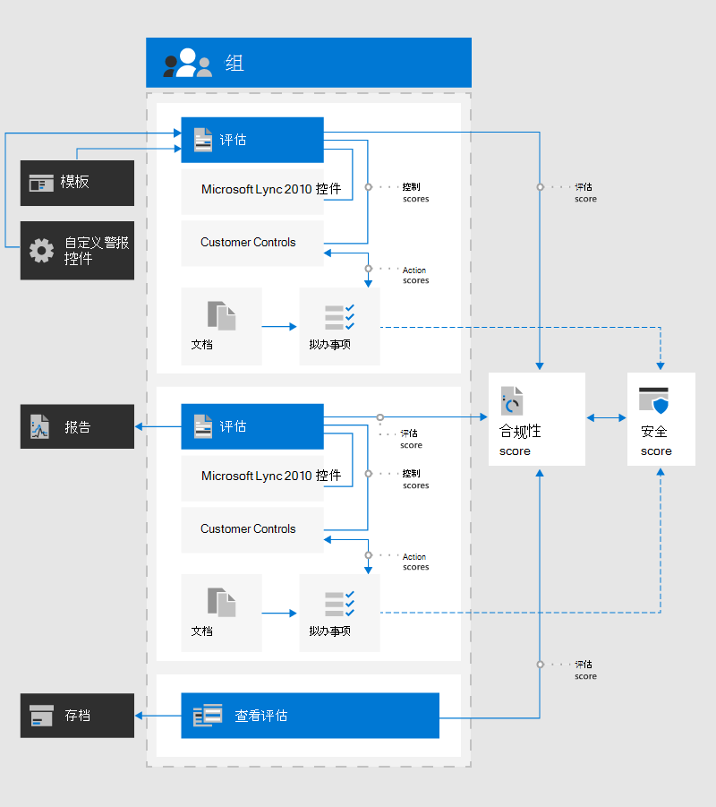

# Microsoft 合规性分数（预览）Microsoft Compliance Score (Preview)

Microsoft 合规性分数有助于简化管理合规性的方式，并通过用户友好的体验降低合规性风险。Microsoft Compliance Score helps to simplify the way you manage compliance and reduce compliance risks through a user-friendly experience. 合规性分数现在适用于[Microsoft 365 合规性中心](microsoft-365-compliance-center.md)中的公共预览版。Compliance Score is now available for public preview in the  [Microsoft 365 compliance center](microsoft-365-compliance-center.md).

**本文内容：** 阅读本文，了解符合性分数以及如何对组织进行设置。**In this article:** Read this article to understand what Compliance Score is and how to set it up for your organization.

**了解更新：** 转到[合规性分数发行说明](compliance-score-release-notes.md)，以查看符合性分数的预览版本的新增和已知问题。**Learn about updates:** Go to the [Compliance Score release notes](compliance-score-release-notes.md) to see what's new and known issues with the preview version of Compliance Score.

## 合规性分数是什么What is Compliance Score

Microsoft 合规性分数是 Microsoft 365 合规性中心中的一项预览功能，可帮助您了解组织的合规性状况。Microsoft Compliance Score is a preview feature in the Microsoft 365 compliance center to help you understand your organization’s compliance posture. 它将计算基于风险的分数，以衡量您在帮助降低数据保护和法规标准方面的风险的完成操作的进度。It calculates a risk-based score measuring your progress in completing actions that help reduce risks around data protection and regulatory standards.

您可以使用合规性分数作为一种工具来跟踪所有风险评估。You can use Compliance Score as a tool to track all of your risk assessments. 它提供了工作流功能，可帮助您通过通用工具高效完成风险评估。It provides workflow capabilities to help you efficiently complete your risk assessments through a common tool.

如果您当前使用[合规性管理器](compliance-manager-overview.md)，您会注意到，合规性分数现在是一个独立的功能，具有更简单、更易于使用用户的设计，可帮助您更轻松地管理合规性。If you currently use [Compliance Manager](compliance-manager-overview.md), you’ll notice that Compliance Score is now a standalone feature with a simpler, more user-friendly design to help you manage compliance more easily. 

主合规性分数页面是自定义仪表板。The main Compliance Score page is your custom dashboard. 它显示了你当前的成绩，可帮助你查看需要注意的事项，并指导你提高成绩的操作。It shows your current score, helps you see what needs attention, and guides you to actions to improve your score. 您的合规性分数仪表板将如下所示：Your Compliance Score dashboard will look like this:

### 简化了合规性管理Simplified compliance management

合规性分数通过提供以下功能来帮助简化合规性管理：Compliance Score helps simplify compliance management by providing:

- **持续评估**：通过 Microsoft 365 环境自动扫描，以检测和监视系统中数据保护控件的有效性**Continuous assessments**: automatically scans through your Microsoft 365 environments to detect and monitor the effectiveness of data protection controls in your system
- **建议的操作**：提供有关如何实现控制以最大化分数的建议和分步指南**Recommended actions**: provides recommendations and step-by-step guidance for how to implement controls to maximize your score
-  **内置的控件映射**：通过提供内置的通用控制框架，帮助您及时了解日益发展的合规性环境**Built-in control mapping**: helps you stay current with the evolving compliance landscape by providing a built-in common control framework

> [!IMPORTANT] 
> 合规性分数不表示对任何特定标准或法规的组织合规性的绝对衡量。Compliance Score does not express an absolute measure of organizational compliance with any particular standard or regulation. 它表示您已采用的控制程度，可降低个人数据和个人隐私的风险。It expresses the extent to which you have adopted controls which can reduce the risks to personal data and individual privacy. 不应将合规性分数和合规性管理器中的建议解释为合规性保证。Recommendations from Compliance Score and Compliance Manager should not be interpreted as a guarantee of compliance. 此服务目前处于预览阶段，并受[在线服务条款](https://go.microsoft.com/fwlink/?linkid=2108910)中的条款和条件的制约。This service is currently in preview and is subject to the terms and conditions in the [Online Services Terms](https://go.microsoft.com/fwlink/?linkid=2108910).

## 与合规性管理器的关系Relationship to Compliance Manager

将合规性分数视为合规性管理器的简化版本。Think of Compliance Score as a simplified version of Compliance Manager. 虽然这两个功能与集成的工具不同时存在，但遵从性分数可使您更轻松地监控整体合规性状况并采取措施来改进。While the two exist as distinct yet integrated tools, Compliance Score makes it easier to monitor your overall compliance posture and take steps to improve it.

合规性分数与合规性管理器共享相同的后端，因此合规性管理器中可能已具有的任何数据将在合规性分数中显示。Compliance Score shares the same backend with Compliance Manager, so any data you may already have in Compliance Manager will show in Compliance Score.

在公共预览版中，某些功能仅保留在合规性管理器中，例如管理评估和创建模板。During public preview, some functionality remains solely in Compliance Manager, such as managing assessments and creating templates. 我们建议你在合规性分数中开始所有合规性管理活动。We recommend beginning all of your compliance management activities in Compliance Score. 当您转到合规性管理器处理的函数时，系统将指导您使用该工具。When you come to functions handled by Compliance Manager, you will be guided to that tool. 出于此原因，本文档中的一些文档将向您提供合规性管理器主题。For that reason, some of this documentation directs you to Compliance Manager topics.

了解有关[合规性分数发行说明](compliance-score-release-notes.md)中合规性分数和合规性管理器之间关系的详细信息。Learn more about the relationship between Compliance Score and Compliance Manager in the [Compliance Score release notes](compliance-score-release-notes.md).

## 了解你的成绩Understanding your score

合规性分数为你提供了基于 Microsoft 365 数据保护基准的初始分数。Compliance Score gives you an initial score based on the Microsoft 365 data protection baseline. 此基准是一组包含常见行业法规和标准的控件。This baseline is a set of controls that includes common industry regulations and standards. 虽然这一分数是评估合规性状况的一个很好的起点，但一旦添加了与贵组织更相关的评估，合规性分数就会变得更加强大。While this score is a good starting point for assessing your compliance posture, Compliance Score becomes more powerful once you add assessments that are more relevant to your organization.

例如，如果您的组织属于金融服务行业，您可能需要添加 FFIEC 评估。For example, if your organization belongs to the financial services industry, you may want to add the FFIEC assessment. 如果您的组织属于医疗保健行业，则可以添加 HIPAA/高科技评估。If your organization belongs to the healthcare industry, you can add the HIPAA/HITECH assessment. 了解如何[在合规性管理器中添加评估](working-with-compliance-manager.md#assessments)。Learn how to [add assessments in Compliance Manager](working-with-compliance-manager.md#assessments).

了解有关[如何计算和持续监控合规性分数](compliance-score-methodology.md)的详细信息。Learn more about [how your compliance score is calculated and continuously monitored](compliance-score-methodology.md).

## 关键组件：控件、评估、模板、组Key components: controls, assessments, templates, groups

合规性分数使用多个组件来帮助您管理合规性活动。Compliance Score uses several components to help you manage your compliance activities. 在使用合规性分数分配、测试和监视合规性活动时，有必要对这些关键组件有一个基本的了解。As you use Compliance Score to assign, test, and monitor compliance activities, it’s helpful to have a basic understanding of these key components. 此图显示了它们之间的关系：This diagram shows the relationships among them:

### 控件Controls

控件定义评估和管理系统配置、组织过程和人员责任的方式，以满足法规、标准或内部策略的特定要求。A control defines how you assess and manage system configuration, organizational process, and people accountability to meet a specific requirement of a regulation, standard, or internal policy.

合规性分数跟踪两种类型的控件：Compliance Score tracks two types of controls:

1. **Microsoft 托管控件**： microsoft 云服务的控件，microsoft 负责实现**Microsoft-managed controls**: controls for Microsoft cloud services, which Microsoft is responsible for implementing
2. **客户管理的控件**：由您的组织管理的、负责实施的控件**Customer-managed controls**: controls managed by your organization, which you are responsible for implementing
 
### 评估Assessments

评估是对为您的组织启动计分过程的模板的评估。An assessment is an evaluation of a template that initiates the scoring process for your organization. 评估组满足标准、法规或法律要求所必需的操作。Assessments group the actions necessary to meet the requirements of a standard, regulation, or law. 例如，您可以进行一项评估，在完成所有操作后，将 Office 365 设置为符合 ISO 27001 要求的行为。For example, you may have an assessment that, when you complete all actions within it, brings your Office 365 settings in line with ISO 27001 requirements.

默认情况下，合规性分数为您的组织提供基于 Microsoft 365 数据保护基准的评估，这是降低数据保护和合规性风险的建议（[了解详细信息](compliance-score-methodology.md#initial-score-based-on-microsoft-365-data-protection-baseline)）。By default, Compliance Score provides your organization with an assessment based on the Microsoft 365 data protection baseline, a recommendation for reducing your data protection and compliance risks ([learn more](compliance-score-methodology.md#initial-score-based-on-microsoft-365-data-protection-baseline)).

评估包括以下几个组件：Assessments include several components:

- **范围内的服务**：适用于评估的一组特定的 Microsoft 服务**In-scope services**: the specific set of Microsoft services applicable to the assessment
- **Microsoft 托管控件**： microsoft 实现和测试的控件**Microsoft-managed controls**: controls that Microsoft implemented and tested
- **客户管理的控件**：您管理的控件**Customer-managed controls**: controls that you manage
- **评估成绩**：完成该评估中的操作所实现的分数百分比**Assessment score**: the percentage of the points achieved by completing actions within that assessment

> [!NOTE]
> 合规性分数显示你的评估以及它们对你的总体成绩的影响。Compliance Score displays your assessments and how they factor into your overall score. 但是，在公开预览过程中，你将转到合规性管理器来管理评估。However, during public preview you will be directed to Compliance Manager to manage your assessments.

查看[合规性管理器中使用评估](working-with-compliance-manager.md#assessments)的详细说明。View detailed instructions for [working with assessments in Compliance Manager](working-with-compliance-manager.md#assessments).

### 模板Templates

合规性分数提供了预配置的评估模板。Compliance Score provides pre-configured templates for assessments. 合规性分数还允许您创建自己的评估模板以满足您的需求。Compliance Score also allows you to create templates for your own assessments to suit your needs. 例如，您可以为业务流程控制创建一个模板，或为不包含在某个预先配置的模板中的区域数据保护或合规性标准的模板。For example, you can create a template for your business process control, or a template for a regional data protection or compliance standard that isn’t covered by one of the pre-configured templates.  通过创建您自己的模板，您可以创建自定义评估，以确保合规性分数不仅跟踪 Microsoft 云评估，还跟踪组织范围内的任何其他风险评估。By creating your own templates, you can create custom assessments to ensure that Compliance Score tracks not only Microsoft cloud assessments, but also any other risk assessments in scope for your organization.

您可以通过复制现有模板或从 Excel 文件中导入控件信息来创建新模板。You can create new templates by copying an existing template, or by importing controls information from an Excel file. 查看[在合规性管理器中创建模板](working-with-compliance-manager.md#templates)的详细说明。View detailed instructions for [creating templates in Compliance Manager](working-with-compliance-manager.md#templates).

预配置的合规性分数模板包括：The pre-configured templates for Compliance Score are:

1. [巴西常规数据保护法律（LGPD）Brazil General Data Protection Law (LGPD)](https://go.microsoft.com/fwlink/?linkid=2115387)
2. [加利福尼亚州消费者隐私法案（CCPA）](https://go.microsoft.com/fwlink/?linkid=2108871) （预览）[California Consumer Privacy Act (CCPA)](https://go.microsoft.com/fwlink/?linkid=2108871) (Preview)
3. [云安全联盟（CSA）云控制矩阵（CCM）3.0。1Cloud Security Alliance (CSA) Cloud Controls Matrix (CCM) 3.0.1](https://go.microsoft.com/fwlink/?linkid=2109076)
4. [欧洲联合 GDPREuropean Union GDPR](https://go.microsoft.com/fwlink/?linkid=2108870)
5. [联邦金融机构检查委员会（FFIEC）信息安全手册Federal Financial Institutions Examination Council (FFIEC) Information Security Booklet](https://go.microsoft.com/fwlink/?linkid=2109077)
6. [FedRAMP 中等FedRAMP Moderate](https://go.microsoft.com/fwlink/?linkid=2108869)
7. [HIPAA](https://go.microsoft.com/fwlink/?linkid=2109078) / 高[科技](https://go.microsoft.com/fwlink/?linkid=2109079)[HIPAA](https://go.microsoft.com/fwlink/?linkid=2109078) / [HITECH](https://go.microsoft.com/fwlink/?linkid=2109079)
8. [IRAP](https://go.microsoft.com/fwlink/?linkid=2113709) / [澳大利亚政府版 ISM](https://go.microsoft.com/fwlink/?linkid=2113024) （预览）[IRAP](https://go.microsoft.com/fwlink/?linkid=2113709) / [Australian Government ISM](https://go.microsoft.com/fwlink/?linkid=2113024) (Preview)
9. [ISO 27001:2013ISO 27001:2013](https://go.microsoft.com/fwlink/?linkid=2109073)
10. [ISO 27018:2014ISO 27018:2014](https://go.microsoft.com/fwlink/?linkid=2109074)
11. [ISO 27701:2019ISO 27701:2019](https://go.microsoft.com/fwlink/?linkid=2113025)
12. [Microsoft 365 数据保护基准Microsoft 365 Data Protection Baseline](compliance-score-methodology.md#initial-score-based-on-microsoft-365-data-protection-baseline)
13. [NIST 800-53 修订版4NIST 800-53 Rev. 4](https://go.microsoft.com/fwlink/?linkid=2109075)
14. [NIST 800-171NIST 800-171](https://go.microsoft.com/fwlink/?linkid=2108867)
15. [NIST Cybersecurity Framework （CSF）NIST Cybersecurity Framework (CSF)](https://go.microsoft.com/fwlink/?linkid=2108868)
16. [SOC 1SOC 1](https://go.microsoft.com/fwlink/?linkid=2115184)
17. [SOC 2SOC 2](https://go.microsoft.com/fwlink/?linkid=2115184)

> [!NOTE]
> 在公共预览过程中，转到合规性管理器以创建和管理模板。During public preview, go to Compliance Manager to create and manage your templates.

### 组Groups

组允许您按符合您的逻辑方式组织评估。Groups allow you to organize assessments in a way that is logical to you. 例如，您可以选择按年、合规性标准、服务、组织内的团队或其他方式对评估进行分组。For example, you may choose to group assessments by year, compliance standard, service, teams within your organization, or some other way.

当同一个组中的两个不同评估共享客户管理的操作时，一个评估中的操作的实施详细信息、测试和状态自动同步到组中任何其他评估中的相同操作。When two different assessments in the same group share customer-managed actions, the completion of implementation details, testing, and status for the action in one assessment automatically synchronizes to the same action in any other assessment in the group. 这将统一分配给整个组的已分配改进操作，并减少重复工作。This unifies the assigned improvement actions across the group and reduces duplicating work.

了解如何[在合规性管理器中创建组](working-with-compliance-manager.md#groups)。Learn how to [create groups in Compliance Manager](working-with-compliance-manager.md#groups). 创建组后，您可以[筛选合规性分数仪表板](compliance-score-setup.md#filtering-your-dashboard-view)，以查看一个或多个组的分数。Once you create groups, you can [filter you Compliance Score dashboard](compliance-score-setup.md#filtering-your-dashboard-view) to view your score by one or more groups.

## 下一步：开始安装Next step: begin setup

了解如何在[合规性分数设置](compliance-score-setup.md)中登录、设置权限以及配置更新和仪表板视图。Learn how to sign in, set up permissions, and configure updates and dashboard views at [Compliance Score setup](compliance-score-setup.md).
