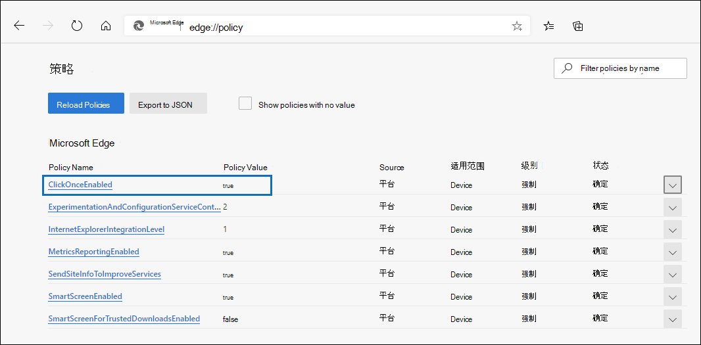
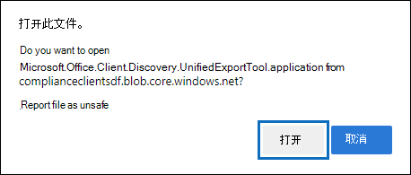

# 使用电子数据展示导出工具Microsoft Edge

由于最近对最新版本的 Microsoft Edge，ClickOnce不再启用支持。 若要继续使用电子数据展示导出工具下载内容搜索或电子数据展示搜索结果，您需要使用[Microsoft Internet Explorer](https://support.microsoft.com/help/17621/internet-explorer-downloads)或在最新版本的 Microsoft Edge 中启用 ClickOnce 支持。

## 在ClickOnce中启用Microsoft Edge

1. 在Microsoft Edge中，转到 **"edge://flags/#edge-click-once"。**

2. 如果下拉列表中现有值设置为 **"默认**"或"已禁用"，请更改为"**已启用"。**

   

3. 向下滚动到浏览器窗口底部，然后单击重启 **以** 重新启动 Edge。

   

**注意：** 组织可以使用组策略禁用ClickOnce支持。 若要检查是否有组织策略支持ClickOnce，请转到 **"edge://policy"。** 以下屏幕截图显示ClickOnce整个组织启用此功能。 如果此策略值设置为 **false，** 你将需要联系你组织的管理员。

## 安装和运行电子数据展示导出工具

1. 单击 **内容搜索** 或电子数据展示案例中导出的飞出页面上的"下载结果"。

   

2. 系统将提示你确认启动该工具，单击"打开 **"。**

   

   如果未安装电子数据展示导出工具，系统将提示你出现安全警告， 

   

3. 单击“**安装**”。 安装后，导出工具将自动启动。

有关详细信息，请参阅下列主题：

- [导出内容搜索结果](export-search-results.md)

- [如何在实验中启用实验Microsoft Edge](https://microsoftedgesupport.microsoft.com/hc/articles/360034075294-How-to-enable-experiment-flags-in-Microsoft-Edge-Insider-channels)
