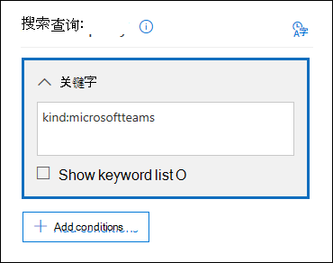
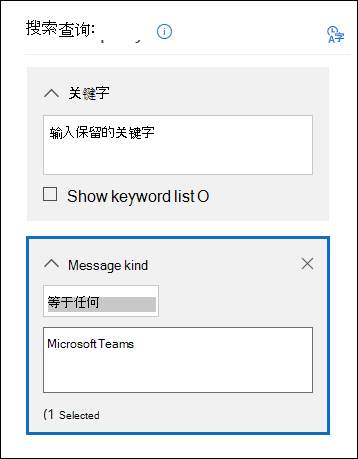
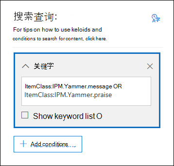
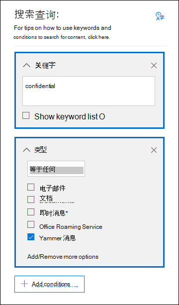

# <a name="feature-reference-for-content-search"></a>内容搜索的功能参考

本文描述了内容搜索的特性和功能。

## <a name="content-search-limits"></a>内容搜索限制

有关适用于内容搜索的限制说明，请参阅 [内容搜索的限制](limits-for-content-search.md)。

## <a name="building-a-search-query"></a>构建搜索查询

有关创建搜索查询、使用布尔搜索运算符和搜索条件以及搜索敏感信息类型及与组织外部用户共享的内容的详细信息，请参阅[内容搜索的关键字查询和搜索条件](keyword-queries-and-search-conditions.md)。

使用关键字列表创建搜索查询时，请注意以下内容。

- 必须选中“**显示关键字列表**”复选框并在单独行中键入每个关键字，才能创建每行中的关键字以 **OR** 运算符连接的搜索查询。 如果将关键字列表粘贴至关键字框或者在键入关键字之后按 **Enter** 键，则它们将不会以 **OR** 运算符连接。 以下是添加关键字列表的错误和正确示例。

    **错误**

    

    **正确**

    

- 还可以在 Excel 文件或纯文本文件中准备关键字或关键字短语列表，然后将你的列表复制粘贴至关键字列表。 若要执行此操作，你必须选中“**显示关键字列表**”复选框。 然后，单击关键字列表中的第一行并粘贴你的列表。 Excel 或文本文件中的每一行均会粘贴至关键字列表中的单独行中。

- 使用关键字列表创建查询后，最好验证搜索查询语法，确保搜索查询适合你的需求。 在详细信息窗格的“**查询**”下显示的搜索查询中，关键字将以文本 **(c:s)** 分隔。 这表示关键字由功能类似于 **OR** 运算符的逻辑运算符连接。 同样，如果搜索查询中包含条件，则关键字和条件将以 **(c:c)** 分隔。 这表示关键字由功能类似于 **AND** 运算符的逻辑运算符连接到条件。 以下是使用关键字列表和条件时创建的搜索查询（显示在详细信息窗格中）示例。

    

- 运行内容搜索时，Microsoft 365 将会自动检查搜索查询中是否存在不受支持的字符以及未大写的布尔运算符。 不受支持的字符往往会被隐藏，并且通常会引发搜索错误或者返回意外结果。 有关检查到的不受支持字符的详细信息，请参阅[检查内容搜索查询中是否存在错误](check-your-content-search-query-for-errors.md)。

- 如果搜索查询中包含非英语字符（例如中文字符）关键字，则可以单击“**查询语言-国家/地区**”“来 。 并为搜索选择语言国家/地区区域性代码值。 默认语言/区域是中性的。 如何判断是否需要更改内容搜索的语言设置？ 如果确定内容位置中包含所搜索的非英语字符，但搜索没有返回结果，则可能是语言设置的原因。

## <a name="partially-indexed-items"></a>部分索引项

- 邮箱中的部分索引项将包括在估计搜索结果中。 SharePoint 和 OneDrive 中的部分索引项不会包括在估计搜索结果中。 有关详细信息，请参阅[电子数据展示中的部分索引项](partially-indexed-items-in-content-search.md)。

## <a name="searching-onedrive-accounts"></a>搜索 OneDrive 帐户

- 若要收集组织中的 OneDrive 网站 URL 列表，请参阅[在组织中创建所有 OneDrive 位置的列表](/onedrive/list-onedrive-urls)。 本文中的脚本将创建包含所有 OneDrive 网站的文本文件。 若要运行此脚本，必须安装并使用 SharePoint Online Management Shell。 请务必将你组织的 MySite 域的 URL 附加到你想要搜索的每个 OneDrive 网站。 这是包含你所有的 OneDrive 的域；例如，`https://contoso-my.sharepoint.com`。 下面是用户的 OneDrive 网站的 URL 示例：`https://contoso-my.sharepoint.com/personal/sarad_contoso_onmicrosoft.com`。

    在某用户的用户主体名称 (UPN) 发生更改的情况下（这种情况很罕见），其 OneDrive 位置的 URL 将发生更改，以包含新的 UPN。 如果发生这种情况，则必须通过添加该用户的新 OneDrive URL 并删除旧 URL 来修改内容搜索。 有关详细信息，请参阅 [UPN 更改如何影响 OneDrive URL](/onedrive/upn-changes)。

## <a name="searching-microsoft-teams-and-microsoft-365-groups"></a>搜索 Microsoft Teams 和 Microsoft 365 组

可以搜索与 Microsoft Teams 或 Microsoft 365 组 关联的邮箱。 Microsoft Teams 基于 Microsoft 365 构建，因此，搜索方法类似。 在这两种情况下，只会搜索组或团队邮箱。 不会搜索组或团队成员的邮箱。 若要搜索它们，必须将它们专门添加到搜索中。

搜索 Microsoft Teams 和 Microsoft 365 组中的内容时，请注意以下内容。

- 若要搜索 Teams 和 Microsoft 365 组中的内容，必须指定与团队或组关联的邮箱和 SharePoint 网站。

- 私人频道的内容将存储在每个用户的邮箱中，而不是团队邮箱中。 要搜索私人频道中的内容，请参阅 [私人频道和共享频道的电子数据展示](/microsoftteams/ediscovery-investigation#ediscovery-of-private-and-shared-channels)。

- 在 Exchange Online 中运行 **Get-UnifiedGroup** cmdlet，以查看团队或 Microsoft 365 组的属性。 这是一种获取与团队或组关联的网站 URL 的好方法。 例如，以下命令显示名为“高层领导团队”的 Microsoft 365 组的选定属性：

  ```text
  Get-UnifiedGroup "Senior Leadership Team" | FL DisplayName,Alias,PrimarySmtpAddress,SharePointSiteUrl
  DisplayName            : Senior Leadership Team
  Alias                  : seniorleadershipteam
  PrimarySmtpAddress     : seniorleadershipteam@contoso.onmicrosoft.com
  SharePointSiteUrl      : https://contoso.sharepoint.com/sites/seniorleadershipteam
  ```

    > [!NOTE]
    > 若要运行 **Get-UnifiedGroup** cmdlet，则你必须在 Exchange Online 中分配有仅查看收件人角色或者是分配有仅查看收件人角色的角色组的成员。

- 搜索用户邮箱时，不会搜索该用户作为成员的任何团队或 Microsoft 365 组。 类似地，在搜索团队或 Microsoft 365 组时，只会搜索指定的组邮箱和组网站。 不会搜索组成员的邮箱和 OneDrive for Business 帐户，除非你明确将其添加到搜索中。

- 若要获取团队或 Microsoft 365 组的成员列表，可以查看 Microsoft 365 管理中心 **主页** 的 \>“<a href="https://go.microsoft.com/fwlink/p/?linkid=2052855" target="_blank">**组**</a>”页面上的属性。或者，可以在 Exchange Online PowerShell 中运行以下命令：

  ```powershell
  Get-UnifiedGroupLinks <group or team name> -LinkType Members | FL DisplayName,PrimarySmtpAddress
  ```

    > [!NOTE]
    > 若要运行 **Get-UnifiedGroupLinks** cmdlet，则你必须在 Exchange Online 中分配有仅查看收件人角色或者是分配有仅查看收件人角色的角色组的成员。

- 属于 Teams 渠道的对话将存储在与团队关联的邮箱中。 同样，团队成员在渠道中共享的文件将存储在团队的 SharePoint 网站上。 因此，必须将团队邮箱和 SharePoint 网站作为内容位置添加到搜索渠道中的对话和文件。

- 或者，属于 Teams 中聊天列表的对话将存储在参与该聊天的用户的 Exchange Online 邮箱中。 用户在聊天对话中共享的文件将存储在共享该文件的用户的 OneDrive for Business 帐户中。 因此，必须将单独的用户邮箱和 OneDrive for Business 帐户作为内容位置添加到聊天列表中的搜索对话和文件中。

    > [!NOTE]
    > 在 Exchange 混合部署中，拥有本地邮箱的用户可以参与属于 Teams 中的聊天列表的对话。 在这种情况下，这些对话中的也可搜索，因为对于拥有本地邮箱的用户来说，它已保存至拥有本地邮箱的用户的基于云的存储区（称为 *本地用户的基于云的邮箱*）。 有关详细信息，请参阅 [搜索本地用户的 Teams 聊天数据](search-cloud-based-mailboxes-for-on-premises-users.md)。

- 每个团队或团队渠道均包含一个用于做笔记和协作的 Wiki。 Wiki 内容将会自动保存至采用 .mht 格式的文件。 此文件存储在团队 SharePoint 网站的 Teams Wiki 数据文档库中。 可以使用内容搜索工具来搜索 Wiki，方法是将团队的 SharePoint 网站指定为要搜索的内容位置。

    > [!NOTE]
    > 搜索团队或渠道 Wiki 的功能（在搜索团队 SharePoint 网站时）已于 2017 年 6 月 22 日发布。 可以对在该日期或之后保存或更新的 Wiki 页面进行搜索。 不可搜索最后保存或更新时间早于该日期的 Wiki 页面。

- Teams 渠道中的会议和呼叫摘要信息也保存在拨入会议或呼叫的用户的邮箱中。 这意味着你可以使用内容搜索来搜索这些摘要记录。 摘要信息包括：

  - 日期、开始时间、结束时间和会议或呼叫时长

  - 每个参与者加入或离开会议或呼叫的日期和时间

  - 发送到语音信箱的呼叫

  - 未接呼叫

  - 表示为两次单独呼叫的呼叫转移

  可能需要最多 8 小时之后才能搜索会议和呼叫摘要记录。

  在搜索结果中，会议摘要在“**类型字段**”将标识为“**会议**”，呼叫摘要将标识为“**呼叫**”。 此外，属于 Teams 渠道和 1xN 聊天的对话在“**类型**”字段将标识为 **IM**。

  

   有关详细信息，请参阅 [Microsoft Teams 针对通话和会议推出电子数据展示](https://techcommunity.microsoft.com/t5/microsoft-teams-blog/microsoft-teams-launches-ediscovery-for-calling-and-meetings/ba-p/210947)。

- Teams 频道中应用、一对一聊天以及一对多人聊天生成的卡片内容存储在邮箱中，并且可以被搜索。 *卡片* 是一个 UI 容器，用于存放内容短片。 卡片可具有多个属性和附件，并且可以包括能够触发卡片操作的按钮。 有关详细信息，请参阅 [卡片](/microsoftteams/platform/task-modules-and-cards/what-are-cards)

  和其他 Teams 内容一样，卡片内容的存储位置由卡片用在何处来确定。 用于 Teams 频道中的卡片内容存储在 Teams 组邮箱中。 一对一和一对多聊天的卡片内容存储在聊天参与者的邮箱中。

  若要搜索卡片内容，可以使用 `kind:microsoftteams` 或 `itemclass:IPM.SkypeTeams.Message` 搜索条件。 查看搜索结果时，由 Teams 频道中的聊天机器人生成的卡片内容具有 **发送者/作者** 电子邮件属性，如 `<appname>@teams.microsoft.com`，其中 `appname` 则是生成卡片内容的应用名称。 如果卡片内容由用户生成，则 **发送者/作者** 的值会标识用户。

  查看内容搜索结果中的卡片内容时，内容显示为电子邮件的附件。 附件名为 `appname.html`，其中 `appname` 是生成卡片内容的应用名称。 以下屏幕截图显示在 Teams 和搜索结果中如何展示（名为Asana 的应用）卡片内容。

  **Teams 中的卡片内容**

  

  **搜索结果中的卡片内容**

  

  > [!NOTE]
  > 若要显示此时搜索结果中卡片内容的图像（如上一个屏幕截图中的复选标记），必须登录 Teams（在用于查看搜索结果的同一浏览器会话中另一选项卡的 https://teams.microsoft.com) 处）。否则将显示图像占位符。

- 可以使用“**类型**”电子邮件属性或“**邮件类型**”搜索条件来搜索 Teams 中的特定内容。

  - 若要将“**类型**”属性用作关键字搜索查询的一部分，请在搜索查询的“**关键字**”框中键入 `kind:microsoftteams`。

    

  - 若要使用搜索条件，请添加“**邮件类型**”条件并使用值 `microsoftteams`。

    

   条件将通过 **AND** 运算符在逻辑上连接至关键字查询。 这意味着项必须与关键字查询和搜索条件匹配才能在搜索结果中返回。 有关详细信息，请参阅[内容搜索的关键字查询和搜索条件](keyword-queries-and-search-conditions.md#guidelines-for-using-conditions)中的“使用条件指南”一节。

## <a name="searching-yammer-groups"></a>搜索 Yammer 组

可以使用 **ItemClass** 电子邮件属性或 **Type** 搜索条件来专门搜索 Yammer 组中的对话项。

  - 若要将 **ItemClass** 属性用作关键字搜索查询的一部分，可以在搜索查询的“关键字”框中键入以下一个（或所有）property:value 对：

     - ItemClass:IPM.Yammer.message
     - ItemClass:IPM.Yammer.poll
     - ItemClass:IPM.Yammer.praise
     - ItemClass:IPM.Yammer.question

    例如，可以使用下面的搜索查询来返回 Yammer 消息和 Yammer 表扬项：

    

  - 也可以使用 **Type** 电子邮件条件，并选择“Yammer 消息”，以返回 Yammer 项。 例如，下面的搜索查询返回所有包含关键字“保密”的 Yammer 对话项。

    

## <a name="searching-inactive-mailboxes"></a>搜索非活动邮箱

可以在内容搜索中搜索非活动邮箱。 若要获取组织中的非活动邮箱列表，请在 Exchange Online PowerShell 中运行命令 `Get-Mailbox -InactiveMailboxOnly`。 或者，你可以转至安全与合规中心中的“**信息管理**”\>“**保留**”，然后单击“**更多**”，即 。 \>**非活动邮箱**。

以下是在搜索非活动邮箱时应记住的一些事项。

- 如果现有内容搜索包括用户邮箱，且该邮箱变成了非活动状态，那么在该邮箱转变为非活动状态后重新运行搜索时，内容搜索将继续搜索该非活动邮箱。

- 有时候，用户可能具有 SMTP 地址相同的活动邮箱和非活动邮箱。 在这种情况下，将仅搜索你选为内容搜索位置的特定邮箱。 换言之，如果将用户邮箱添加到搜索中，则无法假定搜索的是其活动和非活动邮箱。 系统只会搜索已显式添加到搜索中的邮箱。

- 可使用安全与合规中心 PowerShell 来创建内容搜索，以搜索非活动邮箱。 若要执行此操作，必须预先附加一个句点 ( . ) 到非活动邮箱的电子邮件地址。 例如，下面的命令可创建一个搜索电子邮件地址为 pavelb@contoso.onmicrosoft.com 的非活动邮箱的内容搜索：

   ```powershell
   New-ComplianceSearch -Name InactiveMailboxSearch -ExchangeLocation .pavelb@contoso.onmicrosoft.com -AllowNotFoundExchangeLocationsEnabled $true
   ```

- 强烈建议避免活动邮箱和非活动邮箱具有相同的 SMTP 地址。 如果需要重新使用分配给非活动邮箱的 SMTP 地址，我们建议恢复非活动邮箱或将非活动邮箱中的内容还原到活动邮箱中（或活动邮箱的存档中），然后删除非活动邮箱。 有关详细信息，请参阅下列主题之一：

  - [恢复 Office 365 中的非活动邮箱](recover-an-inactive-mailbox.md)

  - [还原 Office 365 中的非活动邮箱](restore-an-inactive-mailbox.md)

  - [删除 Office 365 中的非活动邮箱](delete-an-inactive-mailbox.md)

## <a name="searching-disconnected-or-de-licensed-mailboxes"></a>搜索已断开连接或已取消许可的邮箱

如果从用户帐户或 Azure Active Directory 中删除了 Exchange Online 许可证（或整个 Microsoft 365 许可证），那么用户的邮箱将成为 *断开连接的* 邮箱。 这意味着邮箱不再与用户帐户相关联。 下面是搜索已断开连接的邮箱时将发生的情况：

- 如果已从邮箱中删除许可证，则邮箱将不再可搜索。

- 如果现有内容搜索包含某个删除了许可证的邮箱，则在重新运行该内容搜索时，将不会返回来自该已断开连接的邮箱的搜索结果。

- 如果使用 **New-ComplianceSearch** cmdlet 创建内容搜索，并将某个已断开连接的邮箱指定为要搜索的 Exchange 内容位置，则该内容搜索不会返回任何来自该已断开连接的邮箱的搜索结果。

如果需要保留某个已断开连接的邮箱中的数据以使其可搜索，则必须在删除许可证之前保留该邮箱。 这将保留数据并使已断开连接的邮箱保持可搜索，直至保留被删除。 有关保留的详细信息，请参阅[如何识别为 Exchange Online 邮箱设置的保留类型](identify-a-hold-on-an-exchange-online-mailbox.md)。

## <a name="searching-for-content-in-a-sharepoint-multi-geo-environment"></a>在 SharePoint 多地理位置环境中搜索内容

如果电子数据展示管理器需要在 [ 多地理位置环境](../enterprise/multi-geo-capabilities-in-onedrive-and-sharepoint-online-in-microsoft-365.md)中的不同区域内搜索 SharePoint 和 OneDrive 中的内容，则需要执行以下操作来实现这一点：

1. 为电子数据展示管理器需要搜索的每个卫星地理位置创建单独的用户帐户。 若要在该地理位置搜索网站中的内容，电子数据展示管理器必须登录到为该位置创建的帐户，然后运行内容搜索。

2. 为电子数据展示管理器需要搜索的每个卫星地理位置（和相应用户帐户）创建搜索权限筛选器。 当电子数据展示管理器登录到与该位置相关联的用户帐户时，其中每一个搜索权限筛选器都会将内容搜索的范围限制为特定地理位置。

> [!TIP]
> 使用[高级电子数据展示](overview-ediscovery-20.md)中的搜索工具时，无需使用此策略。 这是因为在高级电子数据展示中搜索 SharePoint 网站和 OneDrive 帐户时，将搜索所有数据中心。 仅当使用内容搜索工具并运行与[电子数据展示事例](./get-started-core-ediscovery.md)相关联的搜索时，才必须使用特定于区域的用户帐户的策略和搜索权限筛选器。

例如，假设电子数据展示管理器需要在北美、欧洲和亚太的卫星位置搜索 SharePoint 和 OneDrive 内容。 第一步是创建三个用户帐户，每个帐户对应一个位置。 下一步是创建三个搜索权限筛选器，分别对应每个位置 *和* 相应的用户帐户。 下面是这种情况下三个搜索权限筛选器的示例。 在上述每个示例中，“**区域**”指定该地理位置的 SharePoint 数据中心位置，而“**Users**”参数指定相应的用户帐户。

**北美**

```powershell
New-ComplianceSecurityFilter -FilterName "SPMultiGeo-NAM" -Users ediscovery-nam@contoso.com -Region NAM -Action ALL
```

**欧洲**

```powershell
New-ComplianceSecurityFilter -FilterName "SPMultiGeo-EUR" -Users ediscovery-eur@contoso.com -Region EUR -Action ALL
```

**亚太地区**

```powershell
New-ComplianceSecurityFilter -FilterName "SPMultiGeo-APC" -Users ediscovery-apc@contoso.com -Region APC -Action ALL
```

使用搜索权限筛选器搜索多地理位置环境中的内容时，请记住以下事项：

- **Region** 参数会将搜索定向至指定的卫星位置。如果电子数据展示管理器仅在搜索权限筛选器中指定的区域之外搜索 SharePoint 和 OneDrive 网站，则不返回任何搜索结果。

- **Region** 参数不控制 Exchange 邮箱的搜索。 搜索邮箱时，将搜索所有数据中心。

要详细了解如何在多地理位置环境中使用搜索权限筛选器，请参阅[设置电子数据展示调查的合规性边界](set-up-compliance-boundaries.md#searching-and-exporting-content-in-multi-geo-environments)中的“在多地理位置环境中搜索和导出内容”部分。
