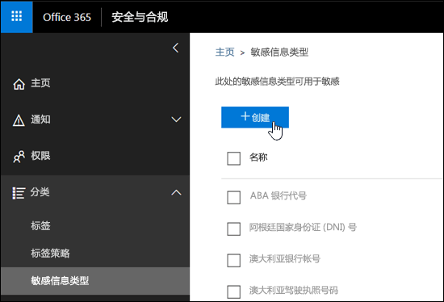
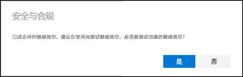
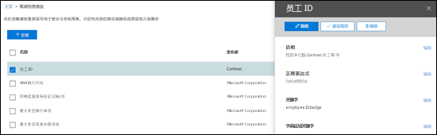
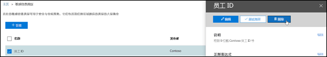
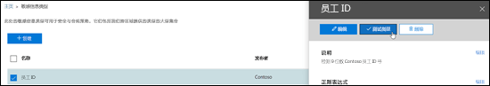

<!-- rename md file to match the display name -->
# 在安全与合规中心内创建自定义敏感信息类型Create a custom sensitive information type in the Security & Compliance Center

阅读本文，以在安全与合规中心 ([https://protection.office.com](https://protection.office.com))内创建自定义敏感信息类型。Read this article to create a custom sensitive information type in the Security & Compliance Center ([https://protection.office.com](https://protection.office.com)). 使用此方法创建的自定义敏感信息类型将添加到名为 `Microsoft.SCCManaged.CustomRulePack` 的规则包中。The custom sensitive information types that you create by using this method are added to the rule package named `Microsoft.SCCManaged.CustomRulePack`.

此外，还可以使用 PowerShell 和精确的数据匹配功能创建自定义敏感信息类型。You can also create custom sensitive information types by using PowerShell and Exact Data Match capabilities. 若要了解有关这些方法的详细信息，请参阅：To learn more about those methods, see:
- [使用安全与合规中心 PowerShell 创建自定义敏感信息类型Create a custom sensitive information type in Security & Compliance Center PowerShell](create-a-custom-sensitive-information-type-in-scc-powershell.md)
- [使用精确数据匹配 (EDM) 为 DLP 创建自定义敏感信息类型Create a custom sensitive information type for DLP with Exact Data Match (EDM)](create-custom-sensitive-information-types-with-exact-data-match-based-classification.md)

> [!NOTE]
> Microsoft 365 信息保护现可为以下语言提供双字节字符集语言支持（预览）：Microsoft 365 Information Protection now  supports in preview double byte character set languages for:
> - 简体中文Chinese (simplified)
> - 繁体中文Chinese (traditional)
> - 韩语Korean
> - 日语Japanese
> 
>此功能预览仅在商业云中提供，并且仅在以下地区推出：This preview is only in the commercial cloud and the rollout is limited to:
> - 日本Japan
> - 韩国Korea
> - 中国大陆China
> - 香港特别行政区Hong Kong
> - 澳门特别行政区Macau
> - 中国台湾Taiwan
>
>此支持适用于敏感信息类型。This support is available for sensitive information types. 有关详细信息，请参阅[双字节字符集的信息保护支持发行说明（预览版）](mip-dbcs-relnotes.md)。See, [Information protection support for double byte character sets release notes (preview)](mip-dbcs-relnotes.md) for more information.

## 准备工作Before you begin

> [!NOTE]
> 应该拥有全局管理员或合规性管理员权限，以便可以通过 UI 创建、测试和部署自定义的敏感信息类型。You should have Global admin or Compliance admin permissions to create, test, and deploy a custom sensitive information type through the UI. 请参阅 Office 365 中的[关于管理员角色](https://docs.microsoft.com/office365/admin/add-users/about-admin-roles?view=o365-worldwide)。See [About admin roles](https://docs.microsoft.com/office365/admin/add-users/about-admin-roles?view=o365-worldwide) in Office 365.

- 组织必须具有包含数据丢失防护 (DLP) 的订阅（如 Office 365 企业版）。Your organization must have a subscription, such as Office 365 Enterprise, that includes Data Loss Prevention (DLP). 请参阅[邮件策略和合规性服务说明](https://docs.microsoft.com/office365/servicedescriptions/exchange-online-protection-service-description/messaging-policy-and-compliance-servicedesc)。See [Messaging Policy and Compliance ServiceDescription](https://docs.microsoft.com/office365/servicedescriptions/exchange-online-protection-service-description/messaging-policy-and-compliance-servicedesc). 

- 自定义敏感信息类型需要熟悉正则表达式 (RegEx)。有关用于处理文本的 Boost.RegEx（以前称为 RegEx++）引擎的详细信息，请参阅 [Boost.Regex 5.1.3](https://www.boost.org/doc/libs/1_68_0/libs/regex/doc/html/)。Custom sensitive information types require familiarity with regular expressions (RegEx). For more information about the Boost.RegEx (formerly known as RegEx++) engine that's used for processing the text, see [Boost.Regex 5.1.3](https://www.boost.org/doc/libs/1_68_0/libs/regex/doc/html/).

  在创建自定义分类或正则表达式模式时，不可从 Microsoft 客户服务和支持获取帮助。Microsoft Customer Service & Support can't assist with creating custom classifications or regular expression patterns. 支持工程师可对功能提供有限的支持，例如提供用于测试目的的示例正则表达式，或者帮助排查未如期触发的现有正则表达式模式的问题，但无法保证所有自定义内容匹配开发都将满足你的要求或义务。Support engineers can provide limited support for the feature, such as, providing sample regular expression patterns for testing purposes, or assisting with troubleshooting an existing regular expression pattern that's not triggering as expected, but can't provide assurances that any custom content-matching development will fulfill your requirements or obligations.

- DLP 使用搜索爬网程序来确定 SharePoint Online 和 OneDrive for Business 网站中的敏感信息并对其分类。DLP uses the search crawler to identify and classify sensitive information in SharePoint Online and OneDrive for Business sites. 要确定现有内容中新的自定义敏感信息类型，必须对该内容重新爬网。To identify your new custom sensitive information type in existing content, the content must be re-crawled. 根据计划对内容进行爬网，但你可手动重新爬网内容来查找网站集、列表或库。Content is crawled based on a schedule, but you can manually re-crawl content for a site collection, list, or library. 有关详细信息，请参阅[Manually request crawling and re-indexing of a site, a library or a list](https://docs.microsoft.com/sharepoint/crawl-site-content)（手动请求对网站、库或列表进行爬网和重新编制索引）。For more information, see [Manually request crawling and re-indexing of a site, a library or a list](https://docs.microsoft.com/sharepoint/crawl-site-content).

## 在安全与合规中心内创建自定义敏感信息类型Create custom sensitive information types in the Security & Compliance Center

在安全与合规中心内，依次转到“分类”\*\*\*\*\>“敏感信息类型”\*\*\*\*，再单击“创建”\*\*\*\*。In the Security & Compliance Center, go to **Classifications** \> **Sensitive info types** and click **Create**.

设置的含义相当显而易见，而且向导中的相关页也对这些设置进行了说明：The settings are fairly self-evident, and are explained on the associate page of the wizard:

- **名称****Name**

- **说明****Description**

- **临近度****Proximity**

- **可信度****Confidence level**

- **主要模式元素**（关键字、正则表达式或字典）**Primary pattern element** (keywords, regular expression, or dictionary)

- 可选**支持性模式元素**（关键字、正则表达式或字典）和相应**最低成本**值。Optional **Supporting pattern elements** (keywords, regular expression, or dictionary) and a corresponding **Minimum cost** value.

应用场景如下：需要创建能够在内容中检测 9 位数员工编号的自定义敏感信息类型，以及关键字“员工”、“ID”和“徽章”。若要创建此自定义敏感信息类型，请按以下步骤操作：Here's a scenario: You want a custom sensitive information type that detects 9-digit employee numbers in content, along with the keywords "employee" "ID" and "badge". To create this custom sensitive information type, do the following steps:

1. 在安全与合规中心内，依次转到“分类”\*\*\*\*\>“敏感信息类型”\*\*\*\*，再单击“创建”\*\*\*\*。In the Security & Compliance Center, go to **Classifications** \> **Sensitive info types** and click **Create**.

    

2. 在随即打开的“选择名称和说明”\*\*\*\* 页中，输入以下值：In the **Choose a name and description** page that opens, enter the following values:

  - **名称**：员工 ID。**Name**: Employee ID.

  - **说明**：检测 9 位数 Contoso 员工 ID 号。**Description**: Detect nine-digit Contoso employee ID numbers.

    

    完成后，单击“下一步”\*\*\*\*。When you're finished, click **Next**.

3. 在随即打开的“匹配要求”\*\*\*\* 页中，单击“添加元素”\*\*\*\*，以配置下列设置：In the **Requirements for matching** page that opens, click **Add an element** configure the following settings:

    - **检测内容包含**：**Detect content containing**:
 
      a. 单击“任意内容”\*\*\*\*，再选择“正则表达式”\*\*\*\*。a. Click **Any of these** and select **Regular expression**.

      b. 在正则表达式框中，输入“`(\s)(\d{9})(\s)`”（两边是空格的 9 位数）。b. In the regular expression box, enter `(\s)(\d{9})(\s)` (nine-digit numbers surrounded by white space).
  
    - **支持性元素**：单击“添加支持性元素”\*\*\*\*，再选择“包含此关键字列表”\*\*\*\*。**Supporting elements**: Click **Add supporting elements** and select **Contains this keyword list**.

    - 在随即显示的“包含此关键字列表”\*\*\*\* 区域中，配置下列设置：In the **Contains this keyword list** area that appears, configure the following settings:

      - **关键字列表**：输入以下值：员工、ID、徽章。**Keyword list**: Enter the following value: employee,ID,badge.

      - **最小计数**：保留默认值 1。**Minimum count**: Leave the default value 1.

    - 保留“可信度”\*\*\*\* 默认值 60。Leave the default **Confidence level** value 60. 

    - 保留“字符临近度”\*\*\*\* 默认值 300。Leave the default **Character proximity** value 300.

    

    完成后，单击“下一步”\*\*\*\*。When you're finished, click **Next**.

4. 在随即打开的“检查并最终确定”\*\*\*\* 页中，检查设置并单击“完成”\*\*\*\*。On the **Review and finalize** page that opens, review the settings and click **Finish**.

    

5. 下一页建议通过单击“是”\*\*\*\* 测试新自定义敏感信息类型。有关详细信息，请参阅[在安全与合规中心内测试自定义敏感信息类型](#test-custom-sensitive-information-types-in-the-security--compliance-center)。若要稍后测试规则，请单击“否”\*\*\*\*。The next page encourages you to test the new custom sensitive information type by clicking **Yes**. For more information, see [Test custom sensitive information types in the Security & Compliance Center](#test-custom-sensitive-information-types-in-the-security--compliance-center). To test the rule later, click **No**.

    

### 如何知道操作成功？How do you know this worked?

若要验证是否已成功新建敏感信息类型，请按以下任一步骤操作：To verify that you've successfully created a new sensitive information type, do any of the following steps:

  - 依次转到“分类”\*\*\*\*\>“敏感信息类型”\*\*\*\*，并验证新自定义敏感信息类型是否已列出。Go to **Classifications** \> **Sensitive info types** and verify the new custom sensitive information type is listed.

  - 测试新自定义敏感信息类型。有关详细信息，请参阅[在安全与合规中心内测试自定义敏感信息类型](#test-custom-sensitive-information-types-in-the-security--compliance-center)。Test the new custom sensitive information type. For more information, see [Test custom sensitive information types in the Security & Compliance Center](#test-custom-sensitive-information-types-in-the-security--compliance-center).

## 在安全与合规中心内修改自定义敏感信息类型Modify custom sensitive information types in the Security & Compliance Center

**注意**：**Notes**:
<!-- check to see if this note contradicts the guidance in "customize a built in sensitive information type customize-a-built-in-sensitive-information-type it sure seems like it does-->
- 只能修改自定义敏感信息类型；不能修改内置敏感信息类型。不过，可使用 PowerShell 导出内置自定义敏感信息类型，然后自定义它们，并将它们作为自定义敏感信息类型导入。有关详细信息，请参阅[自定义内置敏感信息类型](customize-a-built-in-sensitive-information-type.md)。You can only modify custom sensitive information types; you can't modify built-in sensitive information types. But you can use PowerShell to export built-in custom sensitive information types, customize them, and import them as custom sensitive information types. For more information, see [Customize a built-in sensitive information type](customize-a-built-in-sensitive-information-type.md).

- 只能修改在 UI 中创建的自定义敏感信息类型。如果使用 [PowerShell 过程](create-a-custom-sensitive-information-type-in-scc-powershell.md)导入自定义敏感信息类型规则包，将收到一个错误。You can only modify custom sensitive information types that you created in the UI. If you used the [PowerShell procedure](create-a-custom-sensitive-information-type-in-scc-powershell.md) to import a custom sensitive information type rule package, you'll get an error.

在安全与合规中心内，依次转到“分类”\*\*\*\*\>“敏感信息类型”\*\*\*\*，选择要修改的自定义敏感信息类型，然后单击“编辑”\*\*\*\*。In the Security & Compliance Center, go to **Classifications** \> **Sensitive info types**, select the custom sensitive information type that you want to modify, and then click **Edit**.

  

随后看到的选项与在安全与合规中心内创建自定义敏感信息类型时相同。有关详细信息，请参阅[在安全与合规中心内创建自定义敏感信息类型](#create-custom-sensitive-information-types-in-the-security--compliance-center)。The same options are available here as when you created the custom sensitive information type in the Security & Compliance Center. For more information, see [Create custom sensitive information types in the Security & Compliance Center](#create-custom-sensitive-information-types-in-the-security--compliance-center).

### 如何判断是否生效？How do you know this worked?

若要验证是否已成功修改敏感信息类型，请按以下任一步骤操作：To verify that you've successfully modified a sensitive information type, do any of the following steps:

  - 依次转到“分类”\*\*\*\*\>“敏感信息类型”\*\*\*\*，以验证修改后的自定义敏感信息类型的属性。Go to **Classifications** \> **Sensitive info types** to verify the properties of the modified custom sensitive information type. 

  - 测试修改后的自定义敏感信息类型。有关详细信息，请参阅[在安全与合规中心内测试自定义敏感信息类型](#test-custom-sensitive-information-types-in-the-security--compliance-center)。Test the modified custom sensitive information type. For more information, see [Test custom sensitive information types in the Security & Compliance Center](#test-custom-sensitive-information-types-in-the-security--compliance-center).

## 在安全与合规中心内删除自定义敏感信息类型Remove custom sensitive information types in the Security & Compliance Center 

**注意**：**Notes**:

- 只能删除自定义敏感信息类型；不能删除内置敏感信息类型。You can only remove custom sensitive information types; you can't remove built-in sensitive information types.

- 删除自定义敏感信息类型前，请先验证没有 DLP 策略或 Exchange 邮件流规则（亦称为“传输规则”）仍在引用此敏感信息类型。Before your remove a custom sensitive information type, verify that no DLP policies or Exchange mail flow rules (also known as transport rules) still reference the sensitive information type.

1. 在安全与合规中心内，依次转到“分类”\*\*\*\*\>“敏感信息类型”\*\*\*\*，并选择一个或多个要删除的自定义敏感信息类型。In the Security & Compliance Center, go to **Classifications** \> **Sensitive info types** and select one or more custom sensitive information types that you want to remove.

2. 在随即打开的弹出窗口中，单击“删除”\*\*\*\*（或“删除多个敏感信息类型”\*\*\*\*，如果选择了多个类型的话）。In the fly-out that opens, click **Delete** (or **Delete sensitive info types** if you selected more than one).

    

3. 在随即显示的警告消息中，单击“是”\*\*\*\*。In the warning message that appears, click **Yes**.

### 如何判断是否生效？How do you know this worked?

若要验证是否已成功删除自定义敏感信息类型，请依次转到“分类”\*\*\*\*\>“敏感信息类型”\*\*\*\*，以验证自定义敏感信息类型是否已不再列出。To verify that you've successfully removed a custom sensitive information type, go to **Classifications** \> **Sensitive info types** to verify the custom sensitive information type is no longer listed.

## 在安全与合规中心内测试自定义敏感信息类型Test custom sensitive information types in the Security & Compliance Center

1. 在安全与合规中心内，依次转到“分类”\*\*\*\*\>“敏感信息类型”\*\*\*\*。In the Security & Compliance Center, go to **Classifications** \> **Sensitive info types**.

2. 选择要测试的一个或多个自定义敏感信息类型。在随即打开的弹出窗口中，单击“测试类型”\*\*\*\*（或“测试多个敏感信息类型”\*\*\*\*，如果选择了多个类型的话）。Select one or more custom sensitive information types to test. In the fly-out that opens, click **Test type** (or **Test sensitive info types** if you selected more than one).

    

3. 在随即打开的“上传测试文件”\*\*\*\* 页面上，拖放文件或单击“浏览”\*\*\*\* 并选择文件，以上传要测试的文档。On the **Upload file to test** page that opens, upload a document to test by dragging and dropping a file or by clicking **Browse** and selecting a file.

    

4. 单击“测试”\*\*\*\* 按钮，以测试文档的模式匹配情况。Click the **Test** button to test the document for pattern matches in the file.

5. 在“匹配结果”\*\*\*\* 页上，单击“完成”\*\*\*\*。On the **Match results** page, click **Finish**.

    
