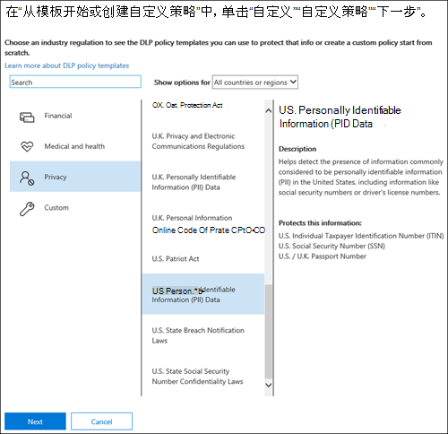
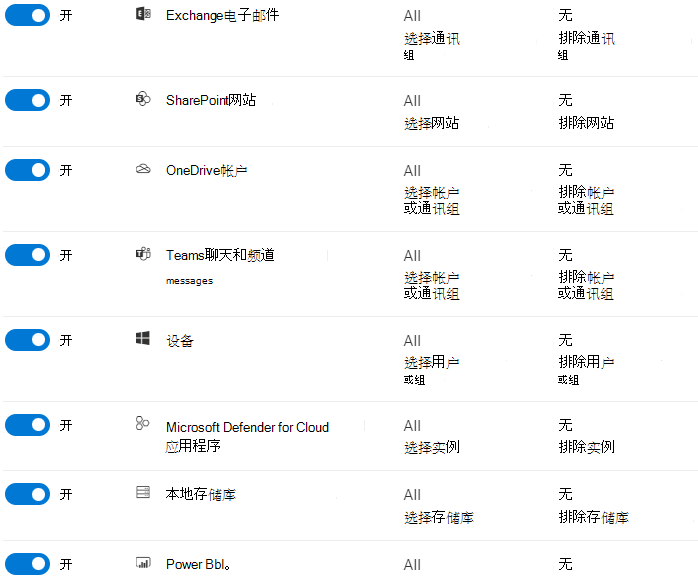
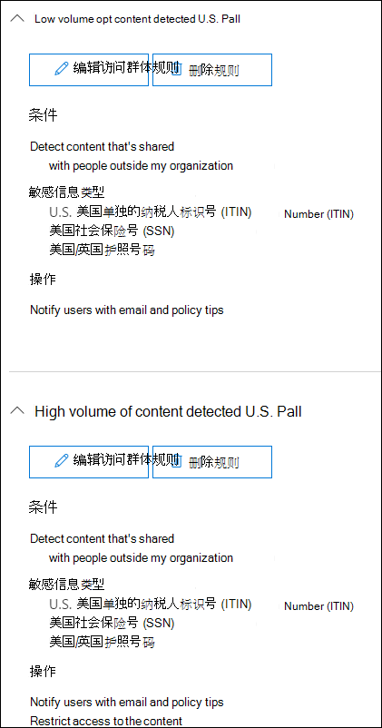
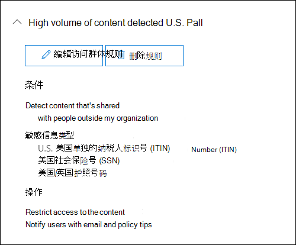
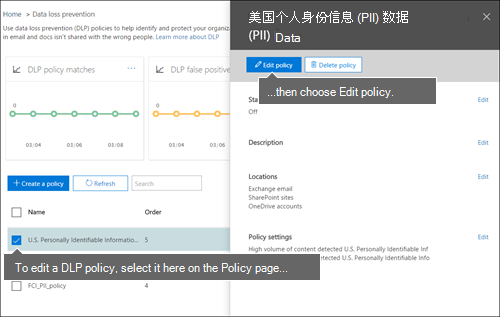

# 通过模板创建 DLP 策略

开始使用 DLP 策略的最简单、最常见的方法是使用Microsoft 365合规中心中包含的模板之一。 可以按自己的方式使用其中一个模板，也可以自定义规则以满足组织的特定合规性要求。

Microsoft 365包含 40 多个现成的模板，可帮助你满足各种常见的法规和业务策略需求。 请参阅;完整列表的策略 [模板](dlp-policy-reference.md#policy-templates) 。 

可以通过修改模板的任何现有规则或添加新规则来微调模板。 例如，您可以将新的敏感信息类型添加到规则中，以及修改规则中的计数以使其更难以触发或更易于触发，使用户通过提供业务理由替代规则中的操作，或更改要向其发送通知和事件报告的用户。 对于许多常见的合规性方案来说，DLP 策略模板都是一个灵活的起点。

您还可以选择不带有任何默认规则的自定义模板，从头开始配置您的 DLP 策略以满足组织的特定合规性要求。

## 权限

创建 DLP 策略的合规性团队成员需要具有对合规中心的访问权限。 默认情况下，租户管理员具有访问权限，可以授予合规性官员和其他人员访问权限。 请按以下步骤操作：
  
1. 在 Microsoft 365 中创建组并向其添加合规部主管。
    
2. 在安全 &amp; 合规中心的“**权限**”页面上创建一个角色组。 

3. 创建角色组时，请使用 **“选择角色”** 部分将以下角色添加到角色组： **DLP 合规性管理**。
    
4. 使用“**选择成员**”部分，将先前创建的 Microsoft 365 组添加到角色组中。

使用 **“仅视图 DLP 合规性管理** ”角色创建具有 DLP 策略和 DLP 报表的仅限查看权限的角色组。

有关详细信息，请访问[向用户授予对 Office 365 合规中心的访问权限](../security/office-365-security/grant-access-to-the-security-and-compliance-center.md)。
  
创建和应用 DLP 策略而不强制实施策略需要这些权限。

### 预览版中的角色和角色组

预览版中有角色和角色组，你可以测试这些角色和角色组以微调访问控制。

下面是预览版中Microsoft 信息保护 （MIP） 角色的列表。 若要了解有关它们的详细信息，请参阅[安全与合规中心](../security/office-365-security/permissions-in-the-security-and-compliance-center.md#roles-in-the-security--compliance-center)中的角色

- 信息保护管理员
- 信息保护分析师
- 信息保护调查员
- 信息保护读者

下面是处于预览状态的 MIP 角色组的列表。 若要了解有关 的详细信息，请参阅[安全与合规中心](../security/office-365-security/permissions-in-the-security-and-compliance-center.md#role-groups-in-the-security--compliance-center)中的角色组

- 信息保护
- 信息保护管理员
- 信息保护分析师
- 信息保护调查员
- 信息保护读者

### 从模板创建 DLP 策略

1. 登录到<a href="https://go.microsoft.com/fwlink/p/?linkid=2077149" target="_blank">Microsoft 365 合规中心</a>。

2. 在合规中心\>左侧导航\>**解决方案** \> **数据丢失防护** \> **策略** \> **+ 创建策略**。

    
          
3. 选择 **保护下一** 步所需的\>敏感信息类型的 DLP 策略模板。

4. 将策略命名为 **“下一**\>步”。
 
<!--In this example, you'll select **Privacy** \> **U.S. Personally Identifiable Information (PII) Data** because it already includes most of the types of sensitive information that you want to protect - you'll add a couple later.

    When you select a template, you can read the description on the right to learn what types of sensitive information the template protects.

    -->

5. 若要选择要保护 DLP 策略的位置，请接受每个位置的默认范围或自定义范围。 请参阅范围选项 [的位置](dlp-policy-reference.md#locations) 。

6. 选择“\> **下一步**”。
 
1. 执行下列操作之一：

   - 选择“**Office 365下** 一\>步 **”中的所有位置**。
   - 选择“让我选择 **下一步****的特定位置**\>”。 对于此示例，请选择此选项。

   若要包括或排除整个位置，例如所有Exchange电子邮件或所有OneDrive帐户，请打开或关闭该位置的 **状态**。

   若要仅包含特定的SharePoint网站或OneDrive for Business帐户，请将 **状态** 切换为打开，然后单击 **“包括**”下的链接以选择特定的网站或帐户。 将策略应用到网站后，该策略中配置的规则将自动应用到该网站的所有子网站。

   

   在此示例中，若要保护存储在所有OneDrive for Business帐户中的敏感信息，请关闭 **Exchange电子邮件** 和 **SharePoint网站** 的 **状态**，并为 **OneDrive帐户** 保留 **状态**。

7. 从“**下一步**”模板\>中选择 **“查看”并自定义默认设置**。

8. DLP 策略模板包含预定义的规则，这些规则具有对特定敏感信息类型进行检测和操作的条件与操作。 可以编辑、删除或关闭任何现有规则，或添加新规则。 完成后，单击 **“下一步**”。

    

9. 如果已选择下列任一位置，请选择在组织内部或组织外部共享此内容时进行检测：
    1. Exchange
    1. SharePoint
    1. OneDrive
    1. Teams聊天和频道消息 

10. 选择“**下一步**”。

11. 如果需要，可以在 **“保护操作** ”页上自定义策略提示通知和通知电子邮件。 **启用内容与策略条件匹配时，向用户显示策略提示并发送电子邮件通知**，然后选择 **“自定义提示和电子邮件**”。
12. 选择" **下一步**"。

<!--    In this example, the U.S. PII Data template includes two predefined rules:

   - **Low volume of content detected U.S. PII** This rule looks for files containing between 1 and 10 occurrences of each of three types of sensitive information (ITIN, SSN, and U.S. passport numbers), where the files are shared with people outside the organization. If found, the rule sends an email notification to the primary site collection administrator, document owner, and person who last modified the document.

   - **High volume of content detected U.S. PII** This rule looks for files containing 10 or more occurrences of each of the same three sensitive information types, where the files are shared with people outside the organization. If found, this action also sends an email notification, plus it restricts access to the file. For content in a OneDrive for Business account, this means that permissions for the document are restricted for everyone except the primary site collection administrator, document owner, and person who last modified the document.

    To meet your organization's specific requirements, you may want to make the rules easier to trigger, so that a single occurrence of sensitive information is enough to block access for external users. After looking at these rules, you understand that you don't need low and high count rules—you need only a single rule that blocks access if any occurrence of sensitive information is found.

    So you expand the rule named **Low volume of content detected U.S. PII** \> **Delete rule**.

    

9. Now, in this example, you need to add two sensitive information types (U.S. bank account numbers and U.S. driver's license numbers), allow people to override a rule, and change the count to any occurrence. You can do all of this by editing one rule, so select **High volume of content detected U.S. PII** \> **Edit rule**.

    

10. To add a sensitive information type, in the **Conditions** section \> **Add or change types**. Then, under **Add or change types** \> choose **Add** \> select **U.S. Bank Account Number** and **U.S. Driver's License Number** \> **Add** \> **Done**.

    

    

11. To change the count (the number of instances of sensitive information required to trigger the rule), under **Instance count** \> choose the **min** value for each type \> enter 1. The minimum count cannot be empty. The maximum count can be empty; an empty **max** value convert to **any**.

    When finished, the min count for all of the sensitive information types should be **1** and the max count should be **any**. In other words, any occurrence of this type of sensitive information will satisfy this condition.

    

12. For the final customization, you don't want your DLP policies to block people from doing their work when they have a valid business justification or encounter a false positive, so you want the user notification to include options to override the blocking action.

    In the **User notifications** section, you can see that email notifications and policy tips are turned on by default for this rule in the template.

    In the **User overrides** section, you can see that overrides for a business justification are turned on, but overrides to report false positives are not. Choose **Override the rule automatically if they report it as a false positive**.

    

13. At the top of the rule editor, change the name of this rule from the default **High volume of content detected U.S. PII** to **Any content detected with U.S. PII** because it's now triggered by any occurrence of its sensitive information types.

14. At the bottom of the rule editor \> **Save**.

15. Review the conditions and actions for this rule \> **Next**.

    On the right, notice the **Status** switch for the rule. If you turn off an entire policy, all rules contained in the policy are also turned off. However, here you can turn off a specific rule without turning off the entire policy. This can be useful when you need to investigate a rule that is generating a large number of false positives.

16. On the next page, read and understand the following, and then choose whether to turn on the rule or test it out first \> **Next**.

     Before you create your DLP policies, you should consider rolling them out gradually to assess their impact and test their effectiveness before you fully enforce them. For example, you don't want a new DLP policy to unintentionally block access to thousands of documents that people require to get their work done.

    If you're creating DLP policies with a large potential impact, we recommend following this sequence:

17. Start in test mode without Policy Tips and then use the DLP reports to assess the impact. You can use DLP reports to view the number, location, type, and severity of policy matches. Based on the results, you can fine tune the rules as needed. In test mode, DLP policies will not impact the productivity of people working in your organization.

18. Move to Test mode with notifications and Policy Tips so that you can begin to teach users about your compliance policies and prepare them for the rules that are going to be applied. At this stage, you can also ask users to report false positives so that you can further refine the rules.

19. Turn on the policies so that the rules are enforced and the content's protected. Continue to monitor the DLP reports and any incident reports or notifications to make sure that the results are what you intend.

    

20. Review your settings for this policy \> choose **Create**.

After you create and turn on a DLP policy, it's deployed to any content sources that it includes, such as SharePoint Online sites or OneDrive for Business accounts, where the policy begins automatically enforcing its rules on that content.

## Example: Identify sensitive information across all OneDrive for Business sites and restrict access for people outside your organization

OneDrive for Business accounts make it easy for people across your organization to collaborate and share documents. But a common concern for compliance officers is that sensitive information stored in OneDrive for Business accounts may be inadvertently shared with people outside your organization. A DLP policy can help mitigate this risk.

In this example, you'll create a DLP policy that identifies U.S. PII data, which includes Individual Taxpayer Identification Numbers (ITIN), Social Security Numbers, and U.S. passport numbers. You'll get started by using a template, and then you'll modify the template to meet your organization's compliance requirements—specifically, you'll:

- Add a couple of types of sensitive information—U.S. bank account numbers and U.S. driver's license numbers—so that the DLP policy protects even more of your sensitive data.

- Make the policy more sensitive, so that a single occurrence of sensitive information is enough to restrict access for external users.

- Allow users to override the actions by providing a business justification or reporting a false positive. This way, your DLP policy won't prevent people in your organization from getting their work done, provided they have a valid business reason for sharing the sensitive information.

## View the status of a DLP policy

At any time, you can view the status of your DLP policies on the **Policy** page in the **Data loss prevention** section of the Security &amp; Compliance Center. Here you can find important information, such as whether a policy was successfully enabled or disabled, or whether the policy is in test mode.

Here are the different statuses and what they mean.

 

****

|Status|Explanation|
|---|---|
|**Turning on...**|The policy is being deployed to the content sources that it includes. The policy is not yet enforced on all sources.|
|**Testing, with notifications**|The policy is in test mode. The actions in a rule are not applied, but policy matches are collected and can be viewed by using the DLP reports. Notifications about policy matches are sent to the specified recipients.|
|**Testing, without notifications**|The policy is in test mode. The actions in a rule are not applied, but policy matches are collected and can be viewed by using the DLP reports. Notifications about policy matches are not sent to the specified recipients.|
|**On**|The policy is active and enforced. The policy was successfully deployed to all its content sources.|
|**Turning off...**|The policy is being removed from the content sources that it includes. The policy may still be active and enforced on some sources. Turning off a policy may take up to 45 minutes.|
|**Off**|The policy is not active and not enforced. The settings for the policy (sources, keywords, duration, etc) are saved.|
|**Deleting...**|The policy is in the process of being deleted. The policy is not active and not enforced. It normally takes an hour for a policy to delete.|
|

## Turn off a DLP policy

You can edit or turn off a DLP policy at any time. Turning off a policy disables all of the rules in the policy.

To edit or turn off a DLP policy, on the **Policy** page \> select the policy \> **Edit policy**.

In addition, you can turn off each rule individually by editing the policy and then toggling off the **Status** of that rule, as described above.

## More information

- [Learn about data loss prevention](dlp-learn-about-dlp.md)
- [Send notifications and show policy tips for DLP policies](use-notifications-and-policy-tips.md)
- [Create a DLP policy to protect documents with FCI or other properties](protect-documents-that-have-fci-or-other-properties.md)
- [What the DLP policy templates include](what-the-dlp-policy-templates-include.md)
- [Sensitive information type entity definitions](sensitive-information-type-entity-definitions.md)
