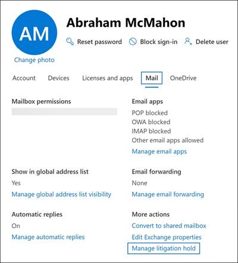

# <a name="create-a-litigation-hold"></a>创建诉讼保留

可以将邮箱置于诉讼保留状态，以保留所有邮箱内容，包括已删除项目和已修改项目的原始版本。 当您将用户邮箱置于诉讼保留时，用户的存档邮箱中的内容 (如果已启用，) 内容也会保留。 创建保留时，您可以指定保留持续时间 (也称为基于时间保留 *)* 以便已删除和修改的项目保留指定的时间段，然后从邮箱中永久删除。 或者，您可以无限期地保留 (称为"无限期 *保留")* 或删除诉讼保留。 如果您指定了保留持续时间，则从收到邮件或创建邮箱项目的日期开始计算。 
  
下面是创建诉讼保留时发生的情况。
  
- 在保留期间，用户永久删除的项目将保留在用户邮箱的"可恢复的项目"文件夹中。

- 用户从"可恢复的项目"文件夹中清除的项目将在保留期间保留。

- "可恢复的项目"文件夹的存储配额从 30 GB 增加到 110 GB。

- 用户的主邮箱和存档邮箱中的项目将保留

## <a name="assign-an-exchange-online-plan-2-license"></a>分配Exchange Online计划 2 许可证

若要将Exchange Online邮箱置于诉讼保留状态，必须为其分配一个Exchange Online 2 许可证。 如果为邮箱分配了Exchange Online计划 1 许可证，您必须为其分配单独的Exchange Online Archiving许可证才能将其置于保留状态。

> [!NOTE]
> 对于Office 365 教育版组织，诉讼保留在 Office 365 A1 订阅中受支持，其中包括一个Exchange Online计划 1 许可证以及补充功能。 有关详细信息，请参阅服务Exchange Online中的"Office 365 教育版[功能"部分](/office365/servicedescriptions/office-365-platform-service-description/office-365-education#exchange-online-features)。

## <a name="place-a-mailbox-on-litigation-hold"></a>将邮箱置于诉讼保留状态

下面是使用邮箱管理程序将邮箱置于诉讼保留Microsoft 365 管理中心。

1. 转到 <https://admin.microsoft.com> 并登录。

2. 在管理中心的导航窗格中，单击"用户  >  <a href="https://go.microsoft.com/fwlink/p/?linkid=834822" target="_blank">**""活动用户"。**</a>

3. 选择要将诉讼保留的用户。

4. 在"属性"飞出页面上，单击 **"邮件**"选项卡，然后在"更多 **操作**"下，单击"**管理诉讼保留"。**

   

5. 在" **管理诉讼保留** "飞出页面上，选中" **启用诉讼保留** "复选框，然后输入以下可选信息：

    1. **保留 (天数) ：** 使用此框可以创建基于时间保留，并指定邮箱项目在置于诉讼保留时保留的时间。 持续时间从接收或创建邮箱项目的日期开始计算。 当特定项目的保留期到期时，将不再保留该项目。 如果保留此框为空，项目将无限期保留或一直保留到删除保留。 使用天指定持续时间。

    2. **Note visible to the user**： Use this box to inform the user their mailbox is on Litigation hold. 如果用户使用的是 2010 或更高版本，则注释将显示在用户邮箱的"帐户信息"Outlook页上。 若要访问此页，用户可以 **单击**"Outlook"。

    3. **包含用户详细信息的网页**：使用此框将用户引导到网站，详细了解诉讼保留。 如果用户使用的是 Outlook 2010 或更高版本，则此 URL 将显示在用户邮箱的"帐户信息"页上。 若要访问此页，用户可以 **单击**"Outlook"。

6. 单击 **"诉讼****保留"飞** 出页面上的"保存更改"以创建保留。 

   系统显示横幅，指出更改最多可能需要 60 分钟才能生效。

### <a name="create-a-litigation-hold-using-powershell"></a>使用 PowerShell 创建诉讼保留

您还可以在 PowerShell 中运行以下命令来创建[诉讼Exchange Online保留](/powershell/exchange/connect-to-exchange-online-powershell)：

```powershell
Set-Mailbox <username> -LitigationHoldEnabled $true
```

上一个命令无限期保留项目，因为未指定保留持续时间。 若要创建基于时间的保留，请运行以下命令：

```powershell
Set-Mailbox <username> -LitigationHoldEnabled $true -LitigationHoldDuration <number of days>
```

您还可以运行以下命令来验证邮箱是否处于诉讼保留状态：

```powershell
Get-Mailbox <username> | FL LitigationHoldEnabled
```

True *值表示* 邮箱置于诉讼保留/

有关详细信息，请参阅 [Set-Mailbox](/powershell/module/exchange/set-mailbox)。

## <a name="how-does-litigation-hold-work"></a>诉讼保留如何工作？

在正常的已删除邮件工作流中，当用户永久删除 (Shift + Delete) 或从已删除邮件文件夹中删除某个邮箱项目时，会将该项目移动到"可恢复的项目"文件夹中的"删除"子文件夹。 当保留期到期时，删除策略（这是使用删除保留操作配置的保留标记）也将项目移动到"删除"子文件夹。 当用户清除"可恢复的项目"文件夹中的某个项目时或者当某个项目的已删除邮件保留期到期时，该项目将被移动到"可恢复的项目"文件夹中的"清除"子文件夹并标记为永久删除。 下一次通过托管文件夹助理 (MFA) 处理邮箱时，将从 Exchange 中清除该邮箱。

当邮箱置于诉讼保留时，"清除"子文件夹内的项目将在诉讼保留指定的保留持续时间内保留。 保留期限自接收或创建项目的原始日期算起，并且定义了保留"清除"子文件中的项目的时长。 "清除"子文件中的某个项目的保留期限到期时，将该项目标记为永久删除，并且下一次通过 MFA 处理邮箱时该项目将从 Exchange 中清除。 如果邮箱中设置了无限期保留，则永远不会将项目从"清除"子文件中清除。

下图显示了"可恢复的项目"文件夹中的子文件夹和保留工作流程。


> [!NOTE]
> 如果邮箱上放置了与电子数据展示案例关联的保留，则清除的项目会从"删除"子文件夹移动到 DiscoveryHolds 子文件夹，并一直保留，直到邮箱从电子数据展示保留中释放。
