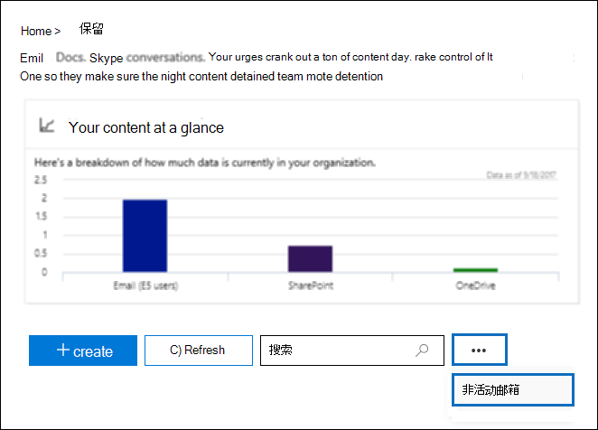

# <a name="create-and-manage-inactive-mailboxes"></a>创建和管理非活动邮箱

Microsoft 365 使您可以保留已删除邮箱的内容。 此功能称为“非活动邮箱”[](inactive-mailboxes-in-office-365.md)。 非活动邮箱允许您在离开您的组织后保留以前的员工的电子邮件。 在删除相应的用户帐户之前，如果将诉讼保留或保留策略（在 Office 365 或 Microsoft 365 的安全与合规中心中创建）应用于邮箱，则邮箱将变为非活动状态。 非活动邮箱的内容会在邮箱处于非活动状态之前放置在邮箱保留期间的保留时间内进行保留。 这使得管理员、合规性监察官和记录管理员可以使用内容搜索来搜索和导出非活动邮箱的内容。 非活动状态的邮箱无法接收电子邮件且不在组织的共享通讯簿或其他列表中显示。
  
> [!IMPORTANT]
> 随着我们继续投资保留邮箱内容的不同方式，我们宣布在 Exchange 管理中心中停用就地保留。 这意味着，应使用诉讼保留和保留策略来创建非活动邮箱。 从2020年6月1日开始，你将无法在 Exchange Online 中创建新的就地保留。 但您仍可以更改非活动邮箱上设置的就地保留的保留持续时间。 但是，从2020年10月1日开始，你将无法更改保留期。 你将只能通过删除就地保留来删除非活动邮箱。 在删除保留之前，就地保留中的现有非活动邮箱仍将保留。 有关停用就地保留的详细信息，请参阅[旧版电子数据展示工具的退休](legacy-ediscovery-retirement.md)。
  
## <a name="before-you-begin"></a>准备工作

- 若要使邮箱处于非活动状态，则必须为其分配 Exchange Online 计划2许可证，以便在删除邮箱之前可以将诉讼保留或保留策略应用于该邮箱。 Exchange Online 计划2许可证是 Office 365 企业版 E3 和 E5 订阅的一部分。 如果为邮箱分配了 Exchange Online 计划1或 Exchange Online 展台许可证（分别是 Office 365 E1 和 F1 订阅的一部分），则必须将其分配给单独的 Exchange Online 存档许可证，以便在删除邮箱之前可以对其应用保留。 有关详细信息，请参阅 [Exchange Online Archiving](https://go.microsoft.com/fwlink/p/?LinkId=286153)。

- 删除了相应的用户帐户后，与已删除的 Exchange Online 邮箱相关联的许可证将可用。 然后，您可以[将这些许可证分配给其他用户](https://docs.microsoft.com/microsoft-365/admin/add-users/add-users)。 

- 如果诉讼保留或保留策略（配置为保留或保留，然后删除内容）未在删除邮箱之前应用于该邮箱，则不会保留或发现邮箱的内容。 但是，删除的邮箱可以在删除后的30天内恢复，但是如果未恢复，则30天后将永久删除该邮箱及其内容。

- 有关诉讼保留的详细信息，请参阅[就地保留和诉讼保留](https://go.microsoft.com/fwlink/p/?LinkId=846124)。 有关保留策略的详细信息，请参阅[Microsoft 365 中的保留策略概述](retention-policies.md)。
  
## <a name="create-an-inactive-mailbox"></a>创建非活动邮箱

将邮箱设为非活动包括两个步骤：1）将邮箱置于诉讼保留状态或对其应用保留策略，并2删除邮箱或相应的用户帐户。 邮箱处于非活动状态后，其内容将一直保留，直到保留策略被删除。
  
### <a name="step-1-place-a-mailbox-on-litigation-hold-or-apply-a-retention-policy"></a>步骤1：将邮箱置于诉讼保留状态或应用保留策略

将邮箱置于诉讼保留或应用保留策略（配置为保留或保留并删除内容）之前，邮箱中的内容将在删除之前保留。 这两种类型的保留都将保留所有邮箱内容，包括已删除项目和已修改项目的原始版本。 已删除和修改的项目在指定时间段内保留在非活动邮箱中，或者直到您通过删除应用于非活动邮箱的保留策略或保留策略永久删除非活动邮箱。
  
如果已在邮箱中放置了保留策略，或者已将保留策略应用于邮箱，则您只需删除步骤2中所述的相应用户帐户。
  
有关将邮箱置于诉讼保留或应用保留策略的分步过程，请参阅：
  
- [将邮箱置于诉讼保留状态](https://go.microsoft.com/fwlink/?linkid=856286)
    
- [Office 365 中的保留策略概述](retention-policies.md)
    
> [!NOTE]
> 对于诉讼保留和保留策略，您可以创建无限保留或基于时间的保留。 在无限期保留中，非活动邮箱的内容将永远保留，或直到删除保留或保留持续时间更改为止。 删除保留策略（假定邮箱已在30天前删除）后，非活动邮箱将标记为永久删除，邮箱的内容将不再保留或不可发现。 在基于时间的保留策略或保留策略中，您可以指定保留的持续时间。 这个时间段以每个项目为基础，从邮箱项目接收或创建之日算起。 邮箱项目的保留过期，并且该项目移到或位于非活动邮箱的 "可恢复的项目" 文件夹中时，该项目会在已删除项目的保留期过期后从非活动邮箱中永久删除（清除）。 
  
### <a name="step-2-delete-the-mailbox"></a>步骤 2：删除邮箱

将邮箱置于保留状态或对其应用保留策略后，下一步是删除邮箱。 删除邮箱的最佳方式是在 Microsoft 365 管理中心删除相应的用户帐户。 有关删除用户帐户的信息，请参阅[从组织中删除用户](https://docs.microsoft.com/microsoft-365/admin/add-users/delete-a-user)。
  
> [!NOTE]
> 您还可以使用 Exchange Online PowerShell 中的 "**删除-邮箱**" cmdlet 删除邮箱。 有关详细信息，请参阅[Delete or restore user 邮箱 In Exchange Online](https://go.microsoft.com/fwlink/?linkid=856287)。 
  

## <a name="view-a-list-of-inactive-mailboxes"></a>查看非活动邮箱的列表

若要查看组织中非活动邮箱的列表，请执行以下操作：
  
1. 转到 [https://protection.office.com](https://protection.office.com)，然后使用你组织中的管理员帐户的凭据进行登录。 
    
2. 单击 "**信息治理**  >  **保留**"。
    
3. 在 "**保留**" 页上，单击 "**更多**  单击 "**非活动邮箱**"。
    
    
  
    将显示 "**非活动邮箱**" 页。 注释将显示组织中的非活动邮箱总数。 
    
    
  
或者，您可以在 Exchange Online PowerShell 中运行以下命令，以显示非活动邮箱的列表。

```powershell
 Get-Mailbox -InactiveMailboxOnly | FT DisplayName,PrimarySMTPAddress,WhenSoftDeleted
```

您可以单击 "  **导出**" 以查看或下载包含有关组织中非活动邮箱的其他信息的 CSV 文件。 
  
您还可以运行以下命令，将非活动邮箱列表和其他信息导出到 CSV 文件中。 在此示例中，将在当前目录中创建 CSV 文件。

```powershell
Get-Mailbox -InactiveMailboxOnly | Select Displayname,PrimarySMTPAddress,DistinguishedName,ExchangeGuid,WhenSoftDeleted | Export-Csv InactiveMailboxes.csv -NoType
```

> [!NOTE]
> 非活动邮箱可能具有与活动用户邮箱相同的 SMTP 地址。 在这种情况下，可以使用**DistinguishedName**或**ExchangeGuid**属性的值来唯一标识非活动邮箱。 
  
## <a name="search-and-export-the-contents-of-an-inactive-mailbox"></a>搜索并导出非活动邮箱的内容

您可以使用安全性 & 合规性中心中的内容搜索工具访问非活动邮箱的内容。 搜索非活动邮箱时，可以创建关键字搜索查询搜索特定的项目或者返回整个非活动邮箱的内容。 您可以预览搜索结果，也可以将搜索结果导出到 Outlook 数据（PST）文件或单独的电子邮件。 有关搜索邮箱和导出搜索结果的分步过程，请参阅下列主题：
  
- [Office 365 中的内容搜索](content-search.md)
    
- [导出内容搜索结果](export-search-results.md)
    
以下是在搜索非活动邮箱时应记住的一些事项。
  
- 如果内容搜索包含用户邮箱，并且该邮箱变为非活动状态，则当您在搜索处于非活动状态之后重新运行搜索时，内容搜索将继续搜索非活动邮箱。
    
- 在某些情况下，用户可能有一个活动邮箱和一个具有相同 SMTP 地址的非活动邮箱。 在这种情况下，将仅搜索您选择作为内容搜索的位置的特定邮箱。 换句话说，如果将用户的邮箱添加到搜索，则不能假定将搜索其活动邮箱和非活动邮箱;将仅搜索您显式添加到搜索中的邮箱。
    
- 强烈建议避免活动邮箱和非活动邮箱具有相同的 SMTP 地址。 如果需要重用当前分配给非活动邮箱的 SMTP 地址，我们建议您恢复非活动邮箱或将非活动邮箱的内容还原到活动邮箱（或活动邮箱的存档）中，然后删除非活动邮箱。
    
## <a name="change-the-hold-duration-for-an-inactive-mailbox"></a>更改非活动邮箱的保留期

将邮箱设为非活动状态后，可以更改保留的持续时间或应用于非活动邮箱的保留策略。 有关分步过程，请参阅[在 Office 365 中更改非活动邮箱的保留期](change-the-hold-duration-for-an-inactive-mailbox.md)。
  
## <a name="recover-an-inactive-mailbox"></a>恢复非活动邮箱

如果以前的员工返回到您的组织，或者如果雇用新员工来承担 departed 员工的工作职责，则可以恢复非活动邮箱的内容。 恢复非活动邮箱时，邮箱会转换为一个新邮箱，将保留非活动邮箱的的内容和文件夹结构，并将邮箱链接到新的用户帐户。 恢复后，非活动邮箱不再存在。 有关在恢复非活动邮箱时发生的分步过程和详细信息，请参阅[恢复 Office 365 中的非活动邮箱](recover-an-inactive-mailbox.md)。
  
## <a name="restore-the-contents-of-an-inactive-mailbox-to-another-mailbox"></a>将非活动邮箱的内容还原到另一个邮箱

如果另一个员工承担以前员工的工作职责，或者如果其他人需要访问非活动邮箱的内容，则可以将非活动邮箱的内容还原（或合并）到现有邮箱。 还原非活动邮箱时，内容将复制到另一个邮箱。 非活动邮箱将保留并保持非活动状态的邮箱。 仍可以使用电子数据展示搜索非活动邮箱，可以将其内容还原到另一个邮箱，也可以在以后将其恢复或删除。 有关分步过程，请参阅[在 Office 365 中还原非活动邮箱](restore-an-inactive-mailbox.md)。
  
## <a name="delete-an-inactive-mailbox"></a>删除非活动邮箱

如果不再需要保留非活动邮箱的内容，可以通过删除保留或删除应用于非活动邮箱的保留策略来永久删除非活动邮箱。 如果距离邮箱删除日期已过去 30 多天，则此邮箱会在您删除保留设置后标记为永久删除，并且无法恢复。 如果邮箱是在最近30天内删除的，您仍可以在删除保留策略或保留策略后恢复邮箱。 有关删除保留策略或保留策略以永久删除非活动邮箱的分步过程，请参阅[删除非活动邮箱](delete-an-inactive-mailbox.md)。
