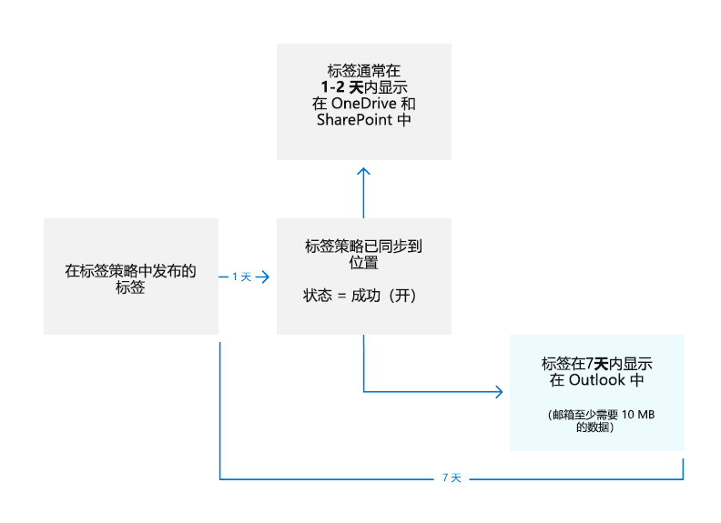
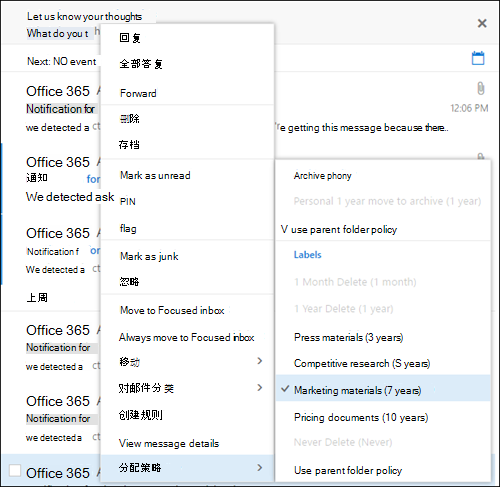
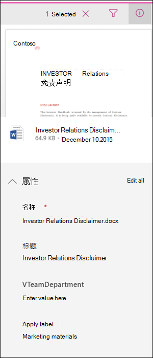

# <a name="publish-retention-labels-and-apply-them-in-apps"></a> 发布保留标签并将其应用到应用 

>*[Microsoft 365 安全性与合规性许可指南](/office365/servicedescriptions/microsoft-365-service-descriptions/microsoft-365-tenantlevel-services-licensing-guidance/microsoft-365-security-compliance-licensing-guidance)。*

> [!NOTE]
> 此方案受所有保留标签配置（包括 [规章记录](records-management.md#records)）的支持。

使用以下信息来帮助发布[保留标签](retention.md)，然后将其应用于文档和电子邮件中。

保留标签有助于在项（文档或电子邮件）级别保留所需内容，并删除不需要内容。 它们还用于将项声明为记录，作为 Microsoft 365 数据的[记录管理](records-management.md)解决方案的一部分。

使保留标签对组织中的人员可用以便对内容进行分类的过程分为两个步骤： 

1. 创建保留标签。

2. 使用保留标签策略发布保留标签。
  


请按照以下说明来执行两个管理步骤。

## <a name="before-you-begin"></a>准备工作

组织的全局管理员拥有创建和编辑保留标签及其策略的完全权限。 如果不以全局管理员登录，则请参阅 [记录管理](get-started-with-records-management.md#permissions) 或 [信息管理](get-started-with-information-governance.md#permissions-for-retention-policies-and-retention-labels) 的权限信息，具体取决于你使用的解决方案。

确保已[创建要应用于项目的保留标签](file-plan-manager.md#create-retention-labels)。

## <a name="how-to-publish-retention-labels"></a>如何发布保留标签

在创建保留标签策略之前，请先确定其将为 **自适应** 还是 **静态** 策略。 有关详细信息，请参阅 [保留](retention.md#adaptive-or-static-policy-scopes-for-retention)的自适应或静态策略范围。 如果决定使用自适应策略，则必须在创建保留标签策略之前创建一个或多个自适应作用域，然后在创建保留标签策略期间进行选择。 有关说明，请参阅 [自适应作用域的配置信息](retention-settings.md#configuration-information-for-adaptive-scopes)。

1. 在 <a href="https://go.microsoft.com/fwlink/p/?linkid=2077149" target="_blank">Microsoft 365 合规中心</a>中，转到以下位置之一：
    
    - 如果你正在使用记录管理：
        - “**解决方案**” > “**记录管理**”> >“**标签策略**”选项卡 >“**发布标签**”
    
    - 如果使用的是信息治理，则导航到：
        - “**解决方案**” > “**信息治理**” > “**标签策略**”选项卡 >“**发布标签**”
    
    没有立即在导航窗格中看到解决方案？首先选择 **显示所有**。 

2. 按照提示创建保留标签策略。 请注意为策略选择名称，因为在保存策略后无法更改此名称。

3. 使用链接选择要发布的保留标签，然后选择 **"下一步"**。

4. 对于 **选择要创建页的保留策略的类型**，请选择 **自适应** 或 **静态**，具体取决于在开始说明之前从 [所做的选择](#before-you-begin)。 如果尚未创建自适应作用域，则可以选择 **自适应**，但由于没有自适应作用域可供选择，因此将无法使用此选项完成向导。

5. 具体取决于所选范围：
    
    - 如果选择 **自适应**: 在 **选择自适应策略作用域和位置** 页面上，选择 **添加作用域**，然后选择一个或多个已创建的自适应作用域。 然后，选择一个或多个位置。 可以选择的位置取决于添加的[范围类型](retention-settings.md#configuration-information-for-adaptive-scopes)。 例如，如果仅添加了 **用户** 的作用域类型，则可以选择 **Exchange 电子邮件** ，但不能 **sharePoint 网站**。 
    
    - 如果选择 **静态**: 在 **选择位置** 页面上，打开或关闭任意位置。 对于每个位置，可以将其保留为默认值，以 [将策略应用于整个位置](retention-settings.md#a-policy-that-applies-to-entire-locations)，或 [指定包含和排除](retention-settings.md#a-policy-with-specific-inclusions-or-exclusions)
    
    有关位置选择的信息，请参阅 [位置](retention-settings.md#locations)。

若要编辑现有的保留标签策略（策略类型是“**发布**”），请选择它，然后选择“**编辑**”选项，以启动“**编辑保留策略**”配置。

## <a name="when-retention-labels-become-available-to-apply"></a>当保留标签可应用时

如果你将保留标签发布到 SharePoint 或 OneDrive，这些标签通常会在 1 天内出现，以供最终用户选择。不过，最长可能需要 7 天才能显示。 

如果你将保留标签发布到 Exchange，这些保留标签最长可能需要 7 天才能向最终用户显示，并且邮箱至少必须包含 10MB 数据。



如果 7 天后未显示标签，请从合规中心的“**标签策略**”页面中检查标签策略的“**状态**”。 如果看到状态中包含 **（错误）**，并且在位置的详细信息中看到一条消息，指出部署策略所需的时间比预期长或请求尝试重新部署策略，请尝试运行 [Set-AppRetentionCompliancePolicy](/powershell/module/exchange/set-appretentioncompliancepolicy) 或 [Set-RetentionCompliancePolicy](/powershell/module/exchange/set-retentioncompliancepolicy) PowerShell 命令，以重新尝试策略分发：

1. [连接到安全与合规中心 PowerShell](/powershell/exchange/connect-to-scc-powershell)。

2. 运行下列命令之一：
    
    - 对于策略位置 **Teams 专用频道消息**、**Yammer 用户消息** 和 **Yammer 社区消息**：
    
        ```PowerShell
        Set-AppRetentionCompliancePolicy -Identity <policy name> -RetryDistribution
        ```
    
    - 对于所有其他策略位置，例如 **Exchange 电子邮件**、**SharePoint 网站**、**Teams 频道消息** 等：
    
        ```PowerShell
        Set-RetentionCompliancePolicy -Identity <policy name> -RetryDistribution
        ```

### <a name="how-to-check-on-the-status-of-retention-labels-published-to-exchange"></a>如何检查发布到 Exchange 的保留标签的状态

在 Exchange Online 中，保留标签通过每 7 天运行一次的进程向最终用户提供。通过 Powershell，可看到此进程上次运行的时间，并进而确定其再次运行的时间。
  
1. [连接到 Exchange Online PowerShell](/powershell/exchange/connect-to-exchange-online-powershell)。
    
2. 运行下面这些命令。
    
   ```powershell
   $logProps = Export-MailboxDiagnosticLogs <user> -ExtendedProperties
   ```

   ```powershell
   $xmlprops = [xml]($logProps.MailboxLog)
   ```

   ```powershell
   $xmlprops.Properties.MailboxTable.Property | ? {$_.Name -like "ELC*"}

In the results, the `ELCLastSuccessTimeStamp` (UTC) property shows when the system last processed your mailbox. If it has not happened since the time you created the policy, the labels are not going to appear. To force processing, run  `Start-ManagedFolderAssistant -Identity <user>`.
    
If labels aren't appearing in Outlook on the web and you think they should be, make sure to clear the cache in your browser (CTRL+F5).
    

## How to apply published retention labels

Use the following sections to learn how published retention labels can be applied in apps:

- [Manually apply retention labels](#manually-apply-retention-labels)

- [Applying a default retention label to all content in a SharePoint library, folder, or document set](#applying-a-default-retention-label-to-all-content-in-a-sharepoint-library-folder-or-document-set)

- [Automatically applying a retention label to email by using rules](#automatically-applying-a-retention-label-to-email-by-using-rules)

In addition, when you use [SharePoint Syntex](../contentunderstanding/index.md) and publish retention labels to SharePoint locations, you can [apply a retention label to a document understanding model](../contentunderstanding/apply-a-retention-label-to-a-model.md) so that identified documents are automatically labeled.

After content is labeled, see the following information to understand when the applied label can be removed or changed: [Only one retention label at a time](retention.md#only-one-retention-label-at-a-time).

### Manually apply retention labels 

End users, as well as administrators, can manually apply retention labels from the following locations:  

- Outlook and Outlook on the web
    
- OneDrive
    
- SharePoint
    
- Microsoft 365 groups (both the group site and group mailbox in Outlook on the web)
    
Use the following sections to understand how to apply retention labels. 

#### Applying retention labels in Outlook

To label an item in the Outlook desktop client, select the item. On the **Home** tab on the ribbon, click **Assign Policy**, and then choose the retention label. 
  

  
You can also right-click an item, click **Assign Policy** in the context menu, and then choose the retention label. When you select multiple items, you can use this method to assign the same retention label to multiple items at once.

After the retention label is applied, you can view that retention label and what action it takes at the top of the item. If an email has a retention label applied that has an associated retention period, you can see at a glance when the email expires.

##### Applying a default retention label to an Outlook folder

You can apply retention labels to Outlook folders as a default label that can be inherited by messages in that folder. Right-click the folder, select **Properties**, the **Policy** tab, and select the retention label you want to use as that folder's default retention label.

When you use a standard retention label as your default label for an Outlook folder:
  
- All unlabeled items in the folder have this retention label applied.

- The inheritance flows to any child folders and items inherit the label from their nearest folder.

- Items that are already labeled retain their retention label, unless it was applied by a different default label.

- If you change or remove the default retention label for the folder: Existing retention labels applied to items in that folder are also changed or removed only if those labels were applied by a default label.

- If you move an item with a default retention label from one folder to another folder with a different default retention label: The item gets the new default retention label.

- If you move an item with a default retention label from one folder to another folder with no default retention label: The old default retention label is removed.

When labels are applied that aren't standard retention labels but mark items as [records (or regulatory records)](records-management.md#records), these labels can only be manually changed or removed.

#### Applying retention labels in Outlook on the web

To label an item in Outlook on the web, right-click the item \> **Assign policy** \> choose the retention label. Unlike Outlook desktop, you can't use this method if you multi-select items.
  

  
After the retention label is applied, you can view that retention label and what action it takes at the top of the item. If an email is classified and has an associated retention period, you can know at a glance when the email will expire.
  

  
As with the desktop version of Outlook on the web, you can also apply retention labels to folders. Right-click the folder, select **Assign policy**, and change **Use parent folder policy** to the retention label you want to use as that folder's default retention label.

#### Applying retention labels in OneDrive and SharePoint

To label a document (including OneNote files) in OneDrive or SharePoint, select the item \> in the upper-right corner, choose **Open the details pane** \> **Apply retention label** \> choose the retention label. 
  
You can also apply a retention label to a folder or document set, and you can set a [default retention label for a document library](#applying-a-default-retention-label-to-all-content-in-a-sharepoint-library-folder-or-document-set).
  

  
After a retention label is applied to an item, you can view it in the details pane when that item's selected.
  


For SharePoint, but not OneDrive, you can create a view of the library that contains the **Labels** column or **Item is a Record** column. This view lets you see at a glance the retention labels assigned to all items and which items are records. Note, however, that you can't filter the view by the **Item is a Record** column. For instructions how to add columns, see [Show or hide columns in a list or library](https://support.microsoft.com/en-us/office/show-or-hide-columns-in-a-list-or-library-b820db0d-9e3e-4ff9-8b8b-0b2dbefa87e2).


#### Applying retention labels using Microsoft 365 groups

When you publish retention labels to the **Microsoft 365 Groups** location, the retention labels appear in the SharePoint teams site but aren't supported by any email client for group mailboxes. The experience of applying a retention label in the site is identical to that for documents in SharePoint.

### Applying a default retention label to all content in a SharePoint library, folder, or document set

This method requires retention labels to be published to a retention label policy.

In addition to letting people apply a retention label to individual documents, you can also apply a default retention label to a SharePoint library, folder, or document set. In this scenario, documents in that location can inherit your selected default retention label. Although the same label is applied, each document will be retained and deleted separately, according to the start of the retention period setting in the label. 
  
For a document library, the default label configuration is done on the **Library settings** page for a document library. When you choose the default retention label, you can also choose to apply it to existing items in the library.
  
For example, if you have a retention label for marketing materials, and you know a specific document library contains only that type of content, you can make the **Marketing Materials** retention label the default label for all documents in that library.
  


#### Label behavior when you use a default label for SharePoint

For standard retention labels that you apply as a default retention label to a library, folder, or document set:

- All new, unlabeled items in the container will have this retention label applied.

- For folders, the inheritance flows to any child folders and items inherit the label from their nearest folder.

- If you selected the option to apply the default label to existing items: Items that are already labeled retain their retention label, unless it was applied by a different default label.
    
- If you change the default retention label for the container: Existing retention labels applied to items in that container are changed only if you selected the option to apply the default label to existing items and those labels were applied by a default label.

- If you remove the default retention label for the container: Items retain their labels.
    
- If you move an item with a default retention label applied from one container to another container: The item keeps its existing default retention label, even if the new location has a different default retention label. Only if you then change the default label for this new location can the moved item inherit the default label from its current location.

When labels are applied that aren't standard retention labels but mark items as [records (or regulatory records)](records-management.md#records), these labels can only be manually changed or removed.

### Automatically applying a retention label to email by using rules

In Outlook, you can create rules to apply a retention label.
  
For example, you can create a rule that applies a specific retention label to all messages sent to or from a specific distribution group.
  
To create a rule, right-click an item \> **Rules** \> **Create Rule** \> **Advanced Options** \> **Rules Wizard** \> **apply retention policy**.
  


Although the UI refers to retention policies, it's your retention labels that display here and can be selected, not your retention policies.

## Updating retention labels and their policies

If you [edit a retention label](file-plan-manager.md#edit-retention-labels) or a retention label policy, and the retention label or policy is already applied to content, your updated settings will automatically be applied to this content in addition to content that's newly identified.

Some settings can't be changed after the label or policy is created and saved, which include:
- Names for retention labels and their policies, the scope type (adaptive or static), and the retention settings except the retention period. However, you can't change the retention period when the retention period is based on when items were labeled.
- The option to mark items as a record.

### Deleting retention labels

You can delete retention labels that aren't currently included in any retention label policies, that aren't configured for event-based retention, or mark items as regulatory records.

For retention labels that you can delete, if they have been applied to items, the deletion fails and you see a link to content explorer to identify the labeled items.

However, it can take up to two days for content explorer to show the items that are labeled. In this scenario, the retention label might be deleted without showing you the link to content explorer.

## Locking the policy to prevent changes

If you need to ensure that no one can turn off the policy, delete the policy, or make it less restrictive, see [Use Preservation Lock to restrict changes to retention policies and retention label policies](retention-preservation-lock.md).

## Next steps

To help you track the labels applied from your published retention labeling policies:

- [Monitoring retention labels](retention.md#monitoring-retention-labels)
- [Using Content Search to find all content with a specific retention label](retention.md#using-content-search-to-find-all-content-with-a-specific-retention-label)
- [Auditing retention actions](retention.md#auditing-retention-actions)

Event-based retention is another supported scenario for retention labels. For more information, see [Start retention when an event occurs](event-driven-retention.md).