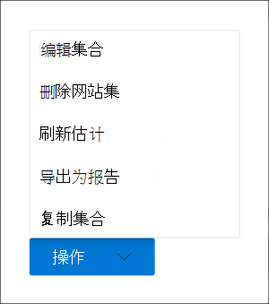

# 在集合中创建草稿Advanced eDiscovery

在确定了该案例的保管人和任何非保管人数据源后，就可以识别并找到一组相关的文档了。 为此，可以使用"集合"工具在数据源中搜索相关内容。 通过创建一个集合来搜索指定数据源中符合搜索条件的内容，可以完成此操作。 您可以选择创建草稿集合，这是找到的项目的估计值，也可以创建一个自动将项目添加到审阅集的集合。 创建草稿集合时，您可以查看有关与搜索查询匹配的估计结果的信息，例如找到的项目总数和大小、找到它们的不同数据源，以及有关搜索查询的统计信息。 还可以预览集合返回的项目示例。 使用这些统计信息，可以更改搜索查询并重新运行草稿集合来缩小结果范围。 一旦对集合结果感到满意，就可以将集合提交到审阅集。 提交草稿集合时，集合返回的项目将添加到审阅集，用于审阅、分析和导出。

## 创建草稿集合之前

- 创建草稿集合之前，向案例添加保管人和非托管数据源。 这是必需的，以便您可以在创建草稿集合时选择数据源。 有关详细信息，请参阅：

  - [向事例添加保管人](add-custodians-to-case.md)

  - [向事例添加非保管人数据源](non-custodial-data-sources.md)

- 您可以搜索其他数据源 (尚未在草稿集合中作为当前位置或非) 位置添加到案例的数据源，以查找可能与案例相关的内容。 这些数据源可能包括邮箱、SharePoint网站和Teams。 如果这种情况适用于您的情况，请编译这些数据源的列表，以便您可以将它们添加到集合中。

## 创建草稿集合

1. In the Microsoft 365 合规中心， open the Advanced eDiscovery case， and then select the **Collections** tab.

2. 在"**集合"** 页上，选择 **"新建集合""**  >  **标准集合"。**

3. 键入一个 (集合) 和 (可选) 的名称和说明。 创建集合后，不能更改名称，但可以修改说明。

4. 在 **"百年数据源** "页上，执行下列操作之一来标识要从中收集内容的第一级数据源：

   - 单击 **"选择保管** 人"以搜索已添加到案例的特定保管人。 如果使用此选项，将显示案例保管人列表。 选择一个或多个保管人。 选择并添加保管人后，还可以选择要搜索每个保管人的特定数据源。 这些显示的数据源是在将保管人添加到案例时指定的。

   - 单击" **全选"** 切换以搜索已添加到案例的所有保管人。 选择此选项时，将搜索所有保管人的所有数据源。

5. 在 **"非安全数据源** "页上，执行下列操作之一来标识要从中收集内容的非安全数据源：

   - 单击 **"选择非安全** 数据源"以选择已添加到案例的特定非安全数据源。 如果使用此选项，将显示数据源列表。 选择一个或多个这些数据源。

   - 单击" **全** 选"开关以选择已添加到案例的所有非会议数据源。

6. 在 **"其他数据源"** 页上，可以选择其他邮箱和网站作为集合的一部分进行搜索。 在这种情况下，不会将这些类型的数据源添加为主要或非安全数据位置。 搜索其他数据源时，还有两个选项：

   - 若要搜索特定服务 (Exchange 邮箱、SharePoint 和 OneDrive 网站或 Exchange 公用文件夹) 的所有内容位置，请单击"状态"列中相应的"全选"切换。   此选项将搜索所选服务中所有内容位置。

   - 若要搜索服务的特定内容位置，请单击"状态"列中相应的"全选"切换，然后单击 Exchange 邮箱的用户、组或团队 **(** 或) 或为 (SharePoint 和OneDrive 网站选择网站) 以搜索特定内容位置。

7. 在 **"条件** "页上，您可以创建搜索查询，该查询用于从之前向导页中标识的数据源中收集项目。 您可以搜索关键字、property：value 对或使用关键字列表。 还可以添加各种搜索条件来缩小集合的范围。 有关详细信息，请参阅生成 [集合的搜索查询](building-search-queries.md)。

8. 在"**另存为草稿或添加到审阅集"** 页上，选择"**将集合另存为草稿"。**

   > [!NOTE]
   > 通过此页面上的另一个选项，你可以收集项目并直接将其添加到审阅集。 此选项将跳过该过程，并自动将集合添加到审阅集，而不是创建一个草稿集合，您可以查看统计信息并预览集合结果的示例。 如果选择第二个选项将集合添加到审阅集，则还需要配置其他设置，例如收集 Microsoft Teams 和 Yammer 中的整个聊天对话线程，以及收集云附件 (也称为新式) 。  有关这些设置详细信息，请参阅 [将草稿集合提交到审阅集](commit-draft-collection.md)。

9. 在 **"查看集合"** 页上，你可以查看和更新在之前页面上配置的集合设置。

   - **摘要** 选项卡：查看和修改集合的名称和说明、集合搜索条件、其他数据位置以及集合类型。

   - **"** 源"选项卡：查看和修改集合的定期和非托管数据源。

10. 单击 **"提交** "创建草稿集合。 将显示一个页面，确认已创建集合。

## 创建草稿集合后会发生什么情况

创建草稿集合后，该集合在"集合"页上列出（如果为这种情况）并且状态显示该集合正在进行。 在这种情况下， **还会创建名为"准备搜索** 预览和估计值"的作业， **并显示在** "作业"页上。

在草稿收集过程中，Advanced eDiscovery集合中指定的搜索条件及数据源执行搜索估计。 Advanced eDiscovery准备可以预览的项目的采样。 集合完成后，将更新"集合"页上的以下 **列** 和相应值：

- **Status**：指示集合的状态和类型。 Estimated **值** 表示草稿集合已完成。 此相同值还指示集合是草稿集合，并且尚未添加到审阅集。 "状态 **"列中的**  Committed 值指示集合已添加到审阅集。

- **估计** 状态：指示估计的搜索结果的状态，以及搜索估计值和统计信息是否可供审阅。 值 **Successful** 表示草稿集合的结果可供审阅。 首次提交草稿集合后，将显示"正在进行 **"** 值以指示该集合仍在运行

- **预览** 状态：指示可以预览的示例项的状态。 值 **Successful** 表示项目已做好预览准备。 首次提交草稿集合后，将显示"正在进行 **"** 值以指示该集合仍在运行。

## 完成草稿集合后接下来的步骤

成功完成草稿集合后，您可以执行各种任务。 若要执行其中大多数任务，只需转到"集合"选项卡，然后单击草稿集合的名称即可显示飞出页。

以下是可以从集合飞出页中执行一些操作的列表：

- 选择 **"摘要"** 选项卡以查看有关集合和集合返回的估计搜索结果的摘要信息。 这包括项目总数和估计搜索结果的大小、包含搜索结果的邮箱和网站数，以及用于设置集合范围 (搜索) 条件。

- 选择 **"数据源** "选项卡以查看集合中搜索的保管人) 非托管数据源列表。 搜索的其他任何内容位置都 **列在"摘要** "选项卡上的"位置 **"** 下。

- 选择" **搜索统计信息** "选项卡以查看有关集合的统计信息。 这包括每个服务 (（例如，Exchange 邮箱或 SharePoint 网站) ）中发现的项目总数和大小，以及显示有关集合所使用的搜索查询的不同组件返回的项目数的统计信息的条件报告。 有关详细信息，请参阅集合 [统计信息和报告](collection-statistics-reports.md)。

- 单击 **位于** (页面底部的"查看示例") 预览集合返回的项目示例。

- 通过单击"操作""编辑" (将草稿集合提交到审阅  >  ) 。 这意味着，您可以使用当前设置 (集合) 集合返回的项目添加到审阅集。 如前所述，还可以配置其他设置 (，例如对话线程和基于云的) 将集合添加到审阅集时。 有关详细信息和分步说明，请参阅 [将草稿集合提交到审阅集](commit-draft-collection.md)。

## 管理草稿集合

可以使用草稿集合的弹出页上的"操作"菜单中的选项来执行各种管理任务。

以下是管理选项的说明。

- **编辑集合**：更改草稿集合的设置。 进行更改后，可以重新运行集合并更新搜索估计和统计信息。 如前所述，使用此选项将草稿集合提交到审阅集。  

- **删除集合**：删除草稿集合。 请注意，在将草稿集合提交到审阅集后，无法将其删除。

- **刷新估计**：根据草稿 (指定的) 重新运行查询查询，以更新搜索估计和统计信息。

- **导出为报告**：将有关草稿集合的信息导出到可下载到本地计算机的 CSV 文件。 导出报告包含以下信息：

  - 包含与草稿集合中的搜索查询匹配的项的每个内容位置的标识。 这些位置通常是邮箱或网站。
  
  - 每个内容位置中的项目总数。
  
  - 总大小 (个字节) 每个内容位置中的项目数。

  - 服务 (，Exchange SharePoint) 位置所在的位置。

- **复制集合**：通过复制现有集合中的设置创建新的草稿集合。 对于新集合，您必须使用不同的名称。 还可以选择在提交新集合之前修改设置。 提交搜索查询后，将运行搜索查询并生成新的估计值和统计信息。 是快速创建其他草稿集合，然后根据需要修改所选设置，同时仍保留原始集合中信息的良好方法。 这还使你可以轻松地比较两个类似集合的结果。

> [!NOTE]
> 将草稿集合提交到审阅集后，只能复制该集合并导出报告。
