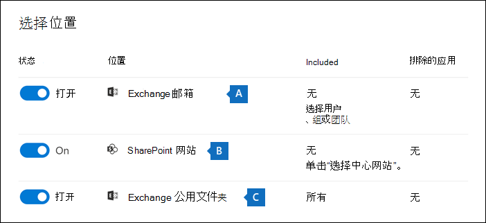

# <a name="create-an-ediscovery-hold"></a>创建电子数据展示保留

可以使用核心电子数据展示案例创建保留，以保留可能与案例相关的内容。 可以保留Exchange邮箱，并OneDrive for Business你在本案中调查的人的帐户。 还可以保留与Microsoft Teams、Office 365组和Yammer组关联的邮箱和网站。 将内容位置保留时，内容将保留，直到从保留中删除内容位置，或直到删除保留为止。

创建电子数据展示保留后，可能需要长达 24 小时才能使保留生效。

创建保留时，可以使用以下选项来限制在指定内容位置中保留的内容：
  
- 创建无限保留，在其中保留指定位置中的所有内容。 或者，可以创建基于查询的保留，其中仅保留与搜索查询匹配的指定位置中的内容。

- 指定日期范围以仅保留在该日期范围内发送、接收或创建的内容。 或者，无论何时发送、接收或创建所有内容，都可以在指定位置保存所有内容。
  
## <a name="how-to-create-an-ediscovery-hold"></a>如何创建电子数据展示保留

若要创建与核心电子数据展示案例关联的电子数据展示保留，请执行以下操作：
  
1. 转到<a href="https://go.microsoft.com/fwlink/p/?linkid=2077149" target="_blank">Microsoft 365 合规中心</a>并使用已分配了相应电子数据展示权限的用户帐户的凭据登录。

2. 在左侧导航窗格中，单击 **“全部显示**”，然后单击电子 **数据展示>核心**。

3. 在 **“核心电子数据展示** ”页上，单击要在其中创建保留的案例的名称。

4. 在事例 **的主** 页上，单击“ **保留”** 选项卡。
  
5. 在 **“保留”** 页上，单击 **“创建**”。

6. 在 **“名称”的“保留** 向导”页上，给保留一个名称并添加可选说明，然后单击 **“下一步**”。 保留名称在你的组织中必须保持唯一。

7. 在 **“选择位置** 向导”页上，选择要保留的内容位置。 可以将邮箱、站点和公用文件夹置于保留状态。

    
  
   1. **Exchange 邮箱**：将切换设置为“**打开**”，然后单击“**选择用户、组或团队**”，以指定要置于保留状态的邮箱。 使用搜索框查找用户邮箱和通讯组（将组成员的邮箱置于保留状态）以置于保留状态。 还可以保留 Microsoft 团队、Office 365组和Yammer组的关联邮箱。 有关在邮箱处于保留状态时保留的应用程序数据的详细信息，请参阅 [存储在电子数据展示邮箱中的内容](what-is-stored-in-exo-mailbox.md)。

   2. **SharePoint 站点**：将切换设置为“**打开**”，然后单击“**选择站点** ”，以指定要置于保留状态的 SharePoint 站点和 OneDrive 帐户。 键入你想要置于保留状态的每个站点的 URL。 还可以为 Microsoft 团队、Office 365组或Yammer组添加SharePoint站点的 URL。
  
   3. **Exchange 公用文件夹**：将切换设置为“**打开**”，从而把 Exchange Online 组织中的所有公用文件夹置于保留状态。 无法选择要置于保留状态的特定公用文件夹。 如果不想把公用文件夹置于保留状态，请让切换开关保持关闭。

   > [!IMPORTANT]
   > 将Exchange邮箱或SharePoint网站添加到保留时，必须将至少一个内容位置显式添加到保留。 换句话说，如果为邮箱或网站设置切换到 **“打开** ”，则必须选择要添加到保留的特定邮箱或网站。 否则，将创建电子数据展示保留，但不会将邮箱或网站添加到保留中，并且统计信息将显示没有任何内容位置或项目处于保留状态。

8. 完成向保留添加位置后，单击 **“下一步**”。

9. 若要使用关键字或条件创建基于查询的保留，请完成以下步骤。 若要保留指定内容位置中的所有内容，请单击 **“下一步**”。

    
  
    1. 在 **关键字** 下的框中，键入查询以仅保留与查询条件匹配的内容。 可以指定关键字、电子邮件属性或网站属性，例如文件名。 可以使用采用布尔运算符的更复杂查询，例如 **AND**、 **OR** 或 **NOT**。

    2. 单击 **“添加条件** ”以添加一个或多个条件以缩小对保留的查询范围。 每个条件都会向创建并运行的 KQL 搜索查询添加子句，并在创建保留时运行该子句。 例如，可以指定日期范围，以便保留在日期范围内创建的电子邮件或网站文档。 条件在逻辑上由 **AND** 运算符连接到关键字查询（在 **关键字** 框中指定）和其他条件。 这意味着项必须同时满足关键字查询和要保留的条件。

    有关创建搜索查询和使用条件的详细信息，请参阅 [电子数据展示的关键字查询和搜索条件](keyword-queries-and-search-conditions.md)。

10. 配置基于查询的保留后，单击 **“下一步**”。

11. 查看设置 (并在必要时编辑它们) ，然后单击“ **提交**”。

> [!NOTE]
> 创建基于查询的保留时，来自所选位置的所有内容最初都处于保留状态。 随后，每 7 到 14 天从保留中清除与指定查询不匹配的任何内容。 但是，如果将任何类型的五个以上的保留项应用于内容位置，或者任何项存在索引问题，基于查询的保留将无法清除内容。

## <a name="query-based-holds-placed-on-sites"></a>基于查询的保留放置在站点上

将基于查询的电子数据展示保留在位于SharePoint站点的文档上时，请记住以下事项：

- 基于查询的保留最初会在删除后将网站中的所有文档保留一小段时间。 这意味着，删除文档时，即使它与基于查询的保留条件不匹配，也会将其移动到保留库。 但是，处理保留库的计时器作业将删除与基于查询的保留不匹配的已删除文档。 计时器作业会定期运行，并将保留库中的所有文档与基于查询的电子数据展示保存 (和其他类型的保留和保留策略进行比较) 。 计时器作业删除与基于查询的保留不匹配的文档，并保留执行此操作的文档。

- 不应使用基于查询的保留来执行有针对性的保存，例如保留特定文件夹或站点中的文档或使用其他基于位置的保留条件。 这样做可能会产生意外的结果。 建议使用基于非位置的保留条件（例如关键字、日期范围或其他文档属性）来保留网站文档。

## <a name="ediscovery-hold-statistics"></a>电子数据展示保留统计信息

创建电子数据展示保留后，有关新保留的信息将显示在所选保留的浮出控件页上。 此信息包括被搁置的邮箱和网站数，以及有关被搁置内容的统计信息，例如被搁置物品的总数和大小，以及上次计算保留统计信息的时间。 这些保留统计信息可帮助你确定要保留的与案例相关的内容量。
  

  
请记住有关电子数据展示保存统计信息的以下事项：
  
- 被搁置的项总数指示被搁置的所有内容源中的项数。 如果已创建基于查询的保留，则此统计信息指示与查询匹配的项数。

- 保留的项目数还包括在内容位置中找到的未表达式项。 如果创建基于查询的保留，则内容位置中的所有未表达项都处于保留状态。 这包括与基于查询的保留项和可能超出日期范围条件的未表达项的搜索条件不匹配的未表达项。 这与运行搜索时的情况不同，在搜索结果中不包括与搜索查询不匹配或被日期范围条件排除的未表达式项。 有关未编制索引项的详细信息，请参阅 [部分索引项](partially-indexed-items-in-content-search.md)。

- 可以通过单击 **“更新统计** 信息”来获取最新的保留统计信息，以重新运行一个搜索估计值，该估算值计算当前处于保留状态的项数。

- 由于邮箱或网站处于保留状态的用户通常发送或接收新电子邮件并在SharePoint和OneDrive中创建新文档，因此被搁置的项数会随时间推移而增加，这是正常的。

- 如果将Exchange邮箱、SharePoint站点或OneDrive帐户移动到多地理位置环境中的不同区域，则该站点的统计信息不会包含在保留统计信息中。 但是，这些位置中的内容仍将保留。 此外，如果邮箱或网站移动到其他区域，则不会自动更新保留中显示的 SMTP 地址或 URL。 必须编辑保留并更新 URL 或 SMTP 地址，以便内容位置再次包含在保留统计信息中

## <a name="search-locations-on-ediscovery-hold"></a>电子数据展示保留上的搜索位置

在核心电子数据展示案例中 [搜索内容](search-for-content-in-core-ediscovery.md) 时，可以快速将搜索配置为仅搜索已置于与案例关联的保留中的内容位置。

选择“ **保留位置** ”选项，搜索已保留的所有内容位置。 如果案例包含多个电子数据展示保留，则在选择此选项时，将搜索所有保留的内容位置。 此外，如果内容位置放置在基于查询的保留上，则在运行搜索时只会搜索与保留查询匹配的项目。 换言之，仅返回与保留条件和搜索条件匹配的内容和搜索结果。 例如，如果用户被置于基于查询的案例保留中，保留在特定日期之前发送或创建的项，则只会搜索这些项。 这可以通过通过 **AND** 运算符连接事例保留查询和搜索查询来实现。

下面是搜索电子数据展示保留位置时要注意的一些其他事项：

- 如果内容位置是同一情况下多个保留的一部分，则在使用所有事例内容选项搜索该内容位置时， **OR** 运算符会组合保留查询。 同样，如果内容位置是两个不同的保留的一部分，其中一个是基于查询的，另一个是无限保留 (其中所有内容都保留) ，那么所有内容都是搜索，因为无限保留。

- 如果将搜索配置为保留搜索位置，然后通过添加或删除位置或更改保留查询) 更改 (情况下更改电子数据展示保留，则搜索配置将随这些更改一起更新。 但是，在保留更改后，必须重新运行搜索，以更新搜索结果。

- 如果多个电子数据展示保留放置在电子数据展示案例中的单个位置，并且选择保留搜索位置，则该搜索查询的最大关键字数为 500。 这是因为搜索使用 **OR** 运算符合并了所有基于查询的保留。 如果组合保留查询和搜索查询中有 500 多个关键字，则会搜索邮箱中的所有内容，而不仅仅是与基于查询的案例匹配的内容。

- 如果电子数据展示保留的状态 **为“打开 (挂起)**”，则仍可在打开保留时搜索保留位置。

## <a name="preserve-content-in-microsoft-teams"></a>在Microsoft Teams中保留内容

属于Microsoft Teams通道的对话存储在与 Microsoft 团队关联的邮箱中。 同样，团队成员在渠道中共享的文件将存储在团队的 SharePoint 网站上。 因此，必须将团队邮箱和SharePoint网站置于电子数据展示保留中，以在频道中保留对话和文件。

或者，作为聊天列表的一部分的对话（Teams (称为 *1：1 聊天* 或 *1：N 组聊天*) ）存储在参与聊天的用户的邮箱中。 用户在聊天对话中共享的文件存储在共享文件的用户的OneDrive帐户中。 因此，必须将单个用户邮箱和OneDrive帐户添加到电子数据展示保留中，以保留聊天列表中的对话和文件。 除了保留团队邮箱和网站之外，最好保留 Microsoft 团队成员的邮箱。

> [!NOTE]
> 如果你的组织具有Exchange混合部署 (或组织将本地Exchange组织与Office 365) 同步并启用了Microsoft Teams，则本地用户可以使用Teams聊天应用程序，并参与 1：1 聊天和 1：N 组聊天。 这些对话存储在与本地用户关联的基于云的存储中。 如果本地用户放置在电子数据展示保留中，则将保留基于云的存储中的Teams聊天内容。 有关详细信息，请参阅 [搜索本地用户的 Teams 聊天数据](search-cloud-based-mailboxes-for-on-premises-users.md)。

有关保留Teams内容的详细信息，[请参阅将Microsoft Teams用户或团队置于法定保留状态](/MicrosoftTeams/legal-hold)。

### <a name="preserve-card-content"></a>保留卡片内容

同样，由Teams频道、1：1 聊天和 1：N 群聊中的应用生成的卡片内容存储在邮箱中，当邮箱放置在电子数据展示保留中时保留。 *卡片* 是一个 UI 容器，用于存放内容短片。 卡片可以具有多个属性和附件，并且可以包含触发卡片操作的按钮。 有关详细信息，请参阅 [卡片](/microsoftteams/platform/task-modules-and-cards/what-are-cards)。 和其他 Teams 内容一样，卡片内容的存储位置由卡片用在何处来确定。 用于 Teams 频道中的卡片内容存储在 Teams 组邮箱中。 一对一和一对多聊天的卡片内容存储在聊天参与者的邮箱中。

### <a name="preserve-meeting-and-call-information"></a>保留会议和通话信息

Teams频道中的会议和呼叫摘要信息也存储在拨入会议或呼叫的用户的邮箱中。 在用户邮箱上放置电子数据展示保留时，也会保留此内容。

### <a name="preserve-content-in-private-channels"></a>在专用频道中保留内容

从 2020 年 2 月开始，我们还启用了在专用频道中保留内容的功能。 由于专用频道聊天存储在聊天参与者的邮箱中，因此在电子数据展示保留上放置用户邮箱将保留专用频道聊天。 此外，如果用户邮箱在 2020 年 2 月之前被置于电子数据展示保留中，则保留现在将自动应用于存储在该邮箱中的专用频道邮件。 还支持保留在专用通道中共享的文件。

### <a name="preserve-wiki-content"></a>保留 wiki 内容

每个团队或团队频道还包含一个 Wiki，用于记笔记和协作。 Wiki 内容将会自动保存至采用 .mht 格式的文件。 此文件存储在团队 SharePoint 网站的 Teams Wiki 数据文档库中。 可以通过将团队的SharePoint网站添加到电子数据展示保留中来保留 Wiki 内容。

> [!NOTE]
> 在 2017 年 6 月 22 日发布) 将团队的SharePoint网站置于保留状态时，为团队或团队频道保留 Wiki 内容的功能 (。 如果团队网站处于保留状态，则 Wiki 内容将从该日期开始保留。 但是，如果团队网站处于保留状态，并且 Wiki 内容在 2017 年 6 月 22 日之前被删除，则不会保留 Wiki 内容。

### <a name="office-365-groups"></a>Office 365 组

Teams是基于Office 365组构建的。 因此，将Office 365组置于电子数据展示保留上类似于将Teams内容置于保留状态。

将Teams和Office 365组放在电子数据展示保留上时，请记住以下事项：

- 如前所述，若要将位于Teams和Office 365组中的内容保留，必须指定与组或团队关联的邮箱和SharePoint网站。

- 在 [Exchange Online PowerShell](/powershell/exchange/connect-to-exchange-online-powershell) 中运行 **Get-UnifiedGroup** cmdlet，查看Teams和Office 365组的属性。 这是获取与团队或Office 365组关联的网站的 URL 的好方法。 例如，以下命令显示名为高层领导团队的 Office 365 组的选定属性：

    ```text
    Get-UnifiedGroup "Senior Leadership Team" | FL DisplayName,Alias,PrimarySmtpAddress,SharePointSiteUrl

    DisplayName            : Senior Leadership Team
    Alias                  : seniorleadershipteam
    PrimarySmtpAddress     : seniorleadershipteam@contoso.onmicrosoft.com
    SharePointSiteUrl      : https://contoso.sharepoint.com/sites/seniorleadershipteam
    ```

    > [!NOTE]
    > 若要运行 **Get-UnifiedGroup** cmdlet，则你必须在 Exchange Online 中分配有仅查看收件人角色或者是分配有仅查看收件人角色的角色组的成员。 
  
- 搜索用户的邮箱时，不会搜索用户所属的任何团队或Office 365组。 同样，当你将团队或Office 365组置于电子数据展示保留处时，只有组邮箱和组网站处于保留状态。 除非将邮箱和OneDrive for Business网站显式添加到电子数据展示保留，否则不会保留组成员的邮箱和OneDrive for Business网站。 因此，如果出于法律原因必须保留团队或Office 365组，请考虑在同一保留中添加团队或组成员的邮箱和OneDrive帐户。

- 若要获取团队或Office 365组的成员列表，可以在Microsoft 365 管理中心中的 <a href="https://go.microsoft.com/fwlink/p/?linkid=2052855" target="_blank">**“组**</a>”页上查看属性。 或者，可以在 Exchange Online PowerShell 中运行以下命令：

    ```powershell
    Get-UnifiedGroupLinks <group or team name> -LinkType Members | FL DisplayName,PrimarySmtpAddress
    ```

    > [!NOTE]
    > 若要运行 **Get-UnifiedGroupLinks** cmdlet，则你必须在 Exchange Online 中分配有仅查看收件人角色或者是分配有仅查看收件人角色的角色组的成员。

## <a name="preserve-content-in-onedrive-accounts"></a>保留OneDrive帐户中的内容

若要收集组织中OneDrive for Business网站的 URL 列表，以便可以将其添加到与电子数据展示案例关联的保留或搜索中，请参阅[创建组织中所有OneDrive位置的列表](/onedrive/list-onedrive-urls)。 本文中的脚本创建一个文本文件，其中包含组织中所有OneDrive网站的列表。 若要运行此脚本，必须安装并使用 SharePoint Online Management Shell。 请务必将你组织的 MySite 域的 URL 附加到你想要搜索的每个 OneDrive 网站。 这是包含你所有的 OneDrive 的域；例如，`https://contoso-my.sharepoint.com`。 下面是用户的 OneDrive 网站的 URL 示例：`https://contoso-my.sharepoint.com/personal/sarad_contoso_onmicrosoft.com`。

> [!IMPORTANT]
> 用户OneDrive帐户的 URL 包括其用户主体名称 (UPN)  (，例如 `https://alpinehouse-my.sharepoint.com/personal/sarad_alpinehouse_onmicrosoft_com`) 。 在极少数情况下，一个人的 UPN 已更改，其OneDrive URL 也会更改为合并新的 UPN。 如果用户的OneDrive帐户是电子数据展示保留的一部分，旧帐户及其 UPN 已更改，则需要更新保留，并且必须更新保留并添加用户的新OneDrive URL 并删除旧的 URL。 有关详细信息，请参阅 [UPN 更改如何影响 OneDrive URL](/onedrive/upn-changes)。

## <a name="removing-content-locations-from-an-ediscovery-hold"></a>从电子数据展示保留中删除内容位置

从电子数据展示保留中删除邮箱、SharePoint网站或OneDrive帐户后，将应用 *延迟保留*。 这意味着实际删除保留将延迟 30 天，以防止从内容位置)  (永久删除数据。 这使管理员有机会搜索或恢复删除电子数据展示保留后将清除的内容。 邮箱和网站的延迟保留工作原理的详细信息有所不同。

- **邮箱：** 下次托管文件夹助手处理邮箱并检测到电子数据展示保留已删除时，邮箱上将保留延迟。 具体而言，当托管文件夹助手将以下邮箱属性之一设置为 **True** 时，延迟保留将应用于邮箱：

   - **DelayHoldApplied：** 此属性适用于用户使用存储在用户邮箱中的Outlook和Outlook 网页版) 生成的电子邮件相关内容 (。

   - **DelayReleaseHoldApplied：** 此属性适用于存储在用户邮箱中的非Outlook应用（如 Microsoft Teams、Microsoft Forms 和 Microsoft Yammer) ）生成的基于云的内容 (。 Microsoft 应用生成的云数据通常存储在用户邮箱中的隐藏文件夹中。

   当在邮箱 (将以前的任一属性设置为 **True**) 时延迟保留时，邮箱仍被视为处于无限制的保留期，就像邮箱处于诉讼保留状态一样。 30 天后，延迟保留会过期，Microsoft 365会自动尝试删除延迟保留 (，将 DelayHoldApplied 或 DelayReleaseHoldApplied 属性设置为 **False**) ，以便删除保留。 将其中任一属性设置为 **False** 后，下次由托管文件夹助手处理邮箱时，将清除标记为要删除的相应项。

   有关详细信息，请参阅[管理延迟保留的邮箱](identify-a-hold-on-an-exchange-online-mailbox.md#managing-mailboxes-on-delay-hold)。

- **SharePoint和OneDrive网站：** 从电子数据展示保留中删除网站后，保留在保留库中的任何SharePoint或OneDrive内容不会在 30 天的延迟保留期内删除。 这类似于从保留策略释放网站时发生的情况。 此外，在 30 天的延迟保留期内，无法在保留库中手动删除此内容。 

   有关详细信息，请参阅 [发布保留策略](retention.md#releasing-a-policy-for-retention)。

关闭核心电子数据展示案例时，延迟保留也应用于保留的内容位置，因为关闭案例时会关闭保留。 有关结案的详细信息，请参阅 [“关闭”、“重新打开”和“删除核心电子数据展示”案例](close-reopen-delete-core-ediscovery-cases.md)。

## <a name="ediscovery-hold-limits"></a>电子数据展示保留限制

下表列出了电子数据展示案例和事例保留的限制。

  | 限制说明 | 限制 |
  |:-----|:-----|
  |组织的最大案例数。  <br/> |无限制  <br/> |
  |组织的最大电子数据展示保留策略数。 此限制包括核心电子数据展示和Advanced eDiscovery个案例中保存策略的总和。  <br/> |10,000  <br/> |
  |单个电子数据展示保留中的最大邮箱数。 此限制包括用户邮箱总数，以及与Microsoft 365 组、Microsoft Teams和Yammer组关联的邮箱。  <br/> |1,000  <br/> |
  |单个电子数据展示保留中的最大站点数。 此限制包括OneDrive for Business网站、SharePoint站点以及与Microsoft 365 组、Microsoft Teams 和Yammer组关联的站点总数。  <br/> |100  <br/> |
  |电子数据展示主页上显示的最大事例数，以及事例中“保留”、“搜索”和“导出”选项卡上显示的最大项数。  |1，<sup>0001</sup>|

   > [!NOTE]
   > <sup>1</sup> 若要查看超过 1，000 个案例、保留、搜索或导出的列表，可以使用相应的安全&合规性 PowerShell cmdlet：
   >
   > - [Get-ComplianceCase](/powershell/module/exchange/get-compliancecase)
   > - [Get-CaseHoldPolicy](/powershell/module/exchange/get-caseholdpolicy)
   > - [Get-ComplianceSearch](/powershell/module/exchange/get-compliancesearch)
   > - [Get-ComplianceSearchAction](/powershell/module/exchange/get-compliancesearchaction)
